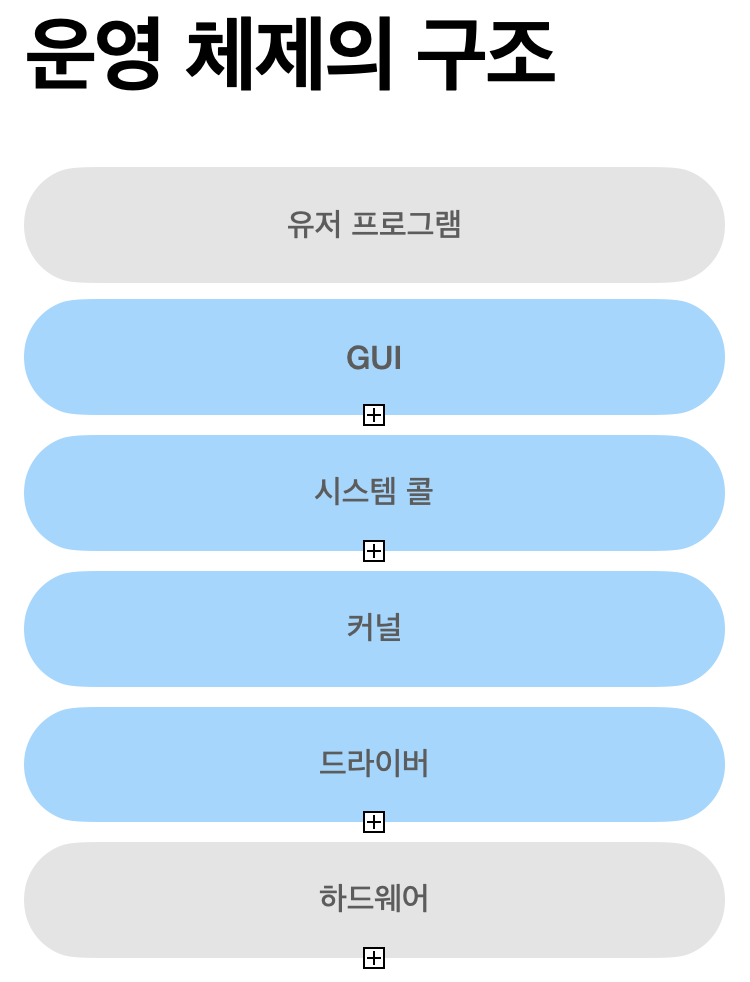

# prepare_frontend_interview

## Computer Science

<b>프론트엔드 기술 면접을 위한 핸드북 만들기</b>

기본적으로 제가 이전에 공부했던 내용을 정리하지만,

더 쉽고 이해가 되는 방향의 양질의 자료가 있을 경우 해당 자료를 대신 넣기도 합니다

## 목차

- [`네트워크 🔥`](#네트워크)

  - 네트워크에서 패킷이란 무엇을 의미하나요? 🔥
  - 네트워크에서 처리량은 무엇을 의미하나요? 🔥
  - 지연시간이란 무엇인가요? 🔥
  - 처리량은 어떤 상황에 영향을 받나요?
  - 네트워크 병목현상은 무엇인가요? 🔥🔥🔥
  - TCP/IP 가 무엇인가요 ? 각 계층에 대해서 설명할 수 있나요? 🔥🔥🔥
  - 전송 계층의 대표적인 방식은 무엇이 있고 어떤 차이가 있나요? (키워드: TCP, UDP) 🔥🔥🔥
  - 계층 간 데이터 송수신 과정에 대해 설명할 수 있나요? (키워드: 캡슐화, 비캡슐화) 🔥
  - 네트워크에서 PDU에 대해 알고 있나요? 🔥
  - 로드밸런서란 무엇인가요? 🔥🔥
  - ARP란 무엇인가요? 🔥
  - MAC 주소란 무엇인가요? 🔥
  - NAT란 무엇인가요? 🔥

- [HTTP 🔥](#HTTP)

  - HTTP란 뭔가요? 🔥🔥
  - HTTP 프로토콜의 가장 큰 특징은 뭔가요? 🔥🔥🔥
  - URL은 뭔가요? 🔥🔥
  - HTTP/1.0 과 HTTP/1.1의 차이는 뭔가요? 🔥
  - HTTP/1.1 과 HTTP/2.0의 차이는 뭔가요? 🔥🔥
  - HTTPS는 HTTP랑 뭐가 다른가요? 🔥🔥🔥🔥
  - 심화) 공개키 (비대칭키) 방식이 뭔가요? 🔥🔥

- [`운영체제 🔥`](#운영체제)

  - 운영체제란 무엇인가요? 🔥🔥
  - 운영체제는 어떤 역할을 하나요? 🔥🔥
  - 운영체제는 어떤 구조로 이루어져 있나요? 🔥
  - 컴퓨터는 어떤 요소로 이루어져 있나요? 🔥
  - CPU는 어떤 요소로 이루어져 있나요? 🔥
  - CPU는 어떻게 동작하나요? 🔥
  - 메모리란 무엇인가요? 🔥🔥
  - 메모리는 어떤 계층 구조로 이루어져 있나요? 🔥🔥
  - 메모리는 어떤 방식으로 데이터를 관리하나요? 🔥

- [프로세스와 스레드 🔥](#프로세스와-스레드)

  - 프로세스가 뭔가요? 🔥🔥🔥
  - 스레드가 뭔가요? 🔥🔥🔥
  - 프로세스와 스레드는 어떤 차이가 있나요? 🔥🔥🔥🔥
  - 프로세스의 컴파일 과정에 대해 설명해줄 수 있나요? 🔥
  - 프로세스는 어떤 상태 값을 가지고 있나요? 🔥
  - 프로세스는 어떤 구조로 이루어져 있나요? (스택, 힙, 데이터 영역, 코드 영역) 🔥🔥
  - PCB는 무엇인가요? 어떤 용도로 사용되나요? (메타 데이터) 🔥

- [싱글 스레드와 멀티 스레드 🔥](#싱글-스레드와-멀티-스레드)

  - 싱글 스레드 장점 🔥🔥
  - 싱글 스레드 단점 🔥🔥
  - 멀티 스레드 장점 🔥🔥
  - 멀티 스레드 단점 🔥🔥

- [공유 자원 임계 영역 교착 상태 🔥](#공유-자원-임계-영역-교착-상태)

  - 공유 자원 🔥🔥
  - 임계 영역 🔥🔥
  - 뮤텍스 🔥🔥
  - 세마포어 🔥🔥
  - 교착 상태 🔥🔥

- [쿠키 세션 🔥](#쿠키-세션)

  - 쿠키, 세션을 왜 쓰나요? 🔥🔥🔥
  - 쿠키가 뭔가요? 🔥🔥🔥
  - 세션이 뭔가요? 🔥🔥🔥
  - 쿠키와 세션의 차이는 어떤 점이 있을까요? 🔥🔥🔥🔥
  - JWT을 아나요? 🔥🔥🔥
  - JWT를 웹 스토리지에 저장해야 한다면 어디다 저장하시겠나요? 이유는요? 🔥🔥

- [CORS 🔥](#CORS)

  - CORS가 뭔가요? 🔥🔥🔥🔥
  - CORS를 겪고 직접 해결해 본 경험이 있으면 말해주세요 🔥🔥🔥

- [개발 방법론 🔥](#개발-방법론)

  - 소프트웨어 개발 주기(SDLC)에 대해 아나요? 🔥
  - 폭포수 방법론이란 뭔가요? 🔥
  - 애자일 방법론이란 뭔가요? 🔥🔥

- [Cache 🔥](#Cache)

- 캐시란 무엇인가요? 🔥🔥🔥

- [CDN 🔥](#CDN)

  - CDN이란 뭔가요? 🔥🔥🔥
  - CDN의 동작 방식을 설명해주세요 🔥🔥
  - CDN의 주요 장점은 무엇인가요? 🔥
  - CDN 캐시 무효화(Cache Invalidation)란? 🔥

- [테스트 🔥](#테스트)

  - 테스트란 무엇인가요? 🔥
  - 테스트의 예는 어떤 것들이 있나요? 🔥
  - 테스트는 왜 해야 하나요? 🔥🔥
  - 유닛 테스트란 무엇인가요? 🔥🔥
  - 통합 테스트란 무엇인가요? 🔥🔥
  - E2E 테스트란 무엇인가요? 🔥🔥
  - 테스트 피라미드에 대해 아나요? 🔥

- [웹팩 🔥](#웹팩)

  - 웹팩이란? 🔥🔥🔥
  - 모듈이란? 🔥🔥
  - 모듈 번들링이란? 🔥🔥🔥
  - 웹팩이 등장한 이유 웹팩 사용 시에 이점 🔥🔥
  - 바벨이란? 🔥🔥🔥
  - 웹팩의 주요 속성 4가지 🔥🔥

- [타입과 인터페이스 🔥](#타입과-인터페이스)

  - 이 글을 보시는 분들께
  - 타입스크립트를 왜 쓰나요? (본인이 느낀점) 🔥🔥
  - 타입과 인터페이스의 차이를 아나요? 🔥🔥🔥
  - 타입의 유틸리티 타입 중 알고 있는 것들에 대해 가볍게 설명해주세요 🔥🔥
  - 제네릭이란? 🔥🔥🔥

## 네트워크

📌 **관련 주제**: [HTTP](#HTTP), [운영체제](#운영체제), [프로세스와 스레드](#프로세스와-스레드)

네트워크란 **노드와 링크가 서로 연결되어 있으며 리소스를 공유하는 집합**을 의미합니다. 여기서 노드란 서버, 라우터, 스위치 등 네트워크 장치를 의미하고 링크는 유선 또는 무선을 의미합니다.

### `네트워크에서 패킷이란 무엇을 의미하나요?`

**패킷**이란 **네트워크에서 데이터의 전송 단위**를 말합니다. **패킷은 헤더(Header), 데이터(Payload), 트레일러(Trailer)의 3가지 구조**로 구성되며, **헤더에는 목적지/출발지 주소와 프로토콜 정보**가, **데이터에는 실제 전송 콘텐츠**가, **트레일러에는 오류 검사 정보**가 포함됩니다. 네트워크 장비는 패킷의 헤더를 확인하여 라우팅과 필터링을 수행하고, 트레일러로 전송 무결성을 검증합니다.

<details>
<summary>패킷 구조 상세 설명 보기</summary>

<br/>

패킷은 헤더, 데이터, 트레일러 구조로 구성됩니다:

1. **헤더(Header):**
   - 목적지 주소 - 패킷이 전송되어야 할 대상의 네트워크 주소
   - 출발지 주소 - 패킷을 전송한 장치의 네트워크 주소
   - 프로토콜 정보 - 패킷에 담긴 데이터가 어떤 프로토콜(TCP, UDP 등)을 사용했는지 나타냄
   - 길이 - 패킷의 크기
   - 기타 정보 - 패킷 순서, 분할 여부 등

2. **데이터(Payload):**
   - 실제 전송하고자 하는 데이터 콘텐츠

3. **트레일러(Trailer):**
   - 오류 검사 정보 - 패킷이 온전히 전송되었는지 검사하는 체크섬 등

네트워크 장비들은 이 패킷 구조를 이용해 데이터를 효율적으로 전송하고 처리합니다. 패킷의 헤더 정보를 확인하여 데이터의 목적지와 프로토콜을 파악하고, 패킷을 중간에서 라우팅하거나 필터링할 수 있습니다. 또한 트레일러의 오류 검사 정보를 통해 패킷 전송의 무결성을 확인할 수 있습니다.

</details>

### `네트워크에서 처리량은 무엇을 의미하나요?`

처리량(throughput)이란 링크를 통해 전달되는 단위 시간당 데이터양을 말합니다.

단위로는 bps(bits per second)를 씁니다. 초당 전송 또는 수신되는 비트 수를 의미합니다.

### `처리량은 어떤 상황에 영향을 받나요?`

처리량은 다음과 같은 상황에 영향을 받습니다.

- 사용자들이 많이 접속할 때마다 커지는 트래픽
- 네트워크 장치 간의 대역폭
- 네트워크 중간에 발생하는 에러
- 장치의 하드웨어 스펙

### `지연시간이란 무엇인가요?`

지연시간(latency)이란 **요청이 처리되는 시간을 말하며 어떤 메시지가 두 장치 사이를 왕복하는데 걸린 시간**을 의미합니다. 지연 시간은 다음과 같은 상황에 영향을 받습니다.

- 매체 타입(무선, 유선)
- 패킷 크기
- 라우터의 패킷 처리 시간

### `네트워크 병목현상은 무엇인가요?`

병목 현상이란 전체 시스템의 성능이나 용량이 하나의 구성 요소로 인해 제한을 받는 현상을 말합니다.

서비스에서 이벤트를 열었을 때 트래픽이 많이 생기고 그 트래픽을 잘 관리하지 못하면 병목 현상이 생겨 사용자는 웹 사이트로 들어가지 못하는 상황이 발생할 수 있습니다.

### `TCP/IP 가 무엇인가요 ? 각 계층에 대해서 설명할 수 있나요?`

**TCP/IP는 인터넷에서 컴퓨터들이 서로 정보를 주고받는 데 쓰이는 프로토콜의 집합**으로, **애플리케이션 계층, 전송 계층, 인터넷 계층, 링크 계층의 4계층**으로 구성됩니다. 각 계층은 독립적으로 설계되어 **특정 계층이 변경되어도 다른 계층에 영향을 주지 않습니다**. 애플리케이션 계층(HTTP, FTP, DNS 등)은 사용자에게 서비스를 제공하고, 전송 계층(TCP, UDP)은 데이터 전송과 신뢰성을 담당하며, 인터넷 계층(IP)은 패킷 라우팅을, 링크 계층은 물리적 데이터 전송을 담당합니다.

<details>
<summary>TCP/IP 4계층 상세 설명 및 3-way handshake 보기</summary>

<br/>


TCP/IP (Transmission Control Protocol / Internet Protocol)

- **이 계층들은 특정 계층이 변경되었을 때 다른 계층이 영향을 받지 않도록 설계되었습니다.**

### **애플리케이션 계층**

애플리케이션 계층은 FTP, HTTP, SSH, SMTP, DNS 등 응용 프로그램이 사용되는 프로토콜 계층이며 웹 서비스, 이메일 등 서비스를 실질적으로 사람들에게 제공하는 층입니다.

FTP

장치와 장치 간의 파일을 전송하는 데 사용되는 표준 통신 프로토콜

SSH

보안되지 않은 네트워크에서 네트워크 서비스를 안전하게 운영하기 위한 암호호화 네트워크 프로토콜

HTTP

World Wide Web을 위한 데이터 통신의 기초이자 웹 사이트를 이용하는 데 쓰는 프로토콜

SMTP

전자 메일 전송을 위한 인터넷 표준 통신 프로토콜

DNS

도메인 이름과 IP 주소를 매핑해주는 서버, 예를 들어 [www.naver.com](http://www.naver.com)에 DNS 쿼리가 오면 [Root DNS] → [.com DNS] → [.naver DNS] → [.www DNS] 과정을 거쳐 완벽한 주소를 찾아 IP 주소를 매핑한다. 이를 통해 IP 주소가 바뀌어도 사용자들에게 똑같은 도메인 주소를 서비스할 수 있다.

### **전송 계층**

전송 계층은 **송신자와 수신자를 연결하는 통신 서비스를 제공하며 연결 지향 데이터 스트림 지원, 신뢰성, 흐름 제어를 제공할 수 있으며 애플리케이션과 인터네 계층 사이의 데이터가 전달될 때 중계 역할**을 합니다. 대표적으로 TCP와 UDP가 있습니다.

TCP는 패킷 사이의 순서를 보장하고 연결지향 프로토콜을 사용해서 연결을 하여 신뢰성을 구축해서 수신 여부를 확인하며 ‘가상회선 패킷 교환 방식’을 사용합니다.

**가상회선 패킷 교환 방식**은 각 패킷에는 가상회선 식별자가 포함되며 모든 패킷을 전송하면 가상회선이 해제되고 패킷들은 전송된 ‘순서대로’ 도착하는 방식을 말합니다.

UDP는 순서를 보장하지 않고 수신 여부를 확인하지 않으며 단순히 데이터만 주는 ‘데이터그램 패킷 교환 방식’을 사용합니다.

**데이터그램 패킷 교환 방식**은 패킷이 독립적으로 이동하며 최적의 경로를 선택하여 가는데, 하나의 메시지에서 분할된 여러 패킷은 서로 다른 경로로 전송될 수 있으며 도착한 ‘순서가 다를 수’ 있는 방식을 뜻합니다.

---

TCP의 경우 순서를 보장하기 위해 연결 성립 과정과 연결 해제 과정을 거칩니다.

**TCP 연결 성립 과정**

TCP는 신뢰성을 확보하기 위해 3-웨이 핸드셰이크(3-way handshake)라는 작업을 진행합니다.


> SYN: SYNchronization의 약자, 연결 요청 플래그
> ACK: ACKnowledgement의 약자, 응답 플래그
> Initial Sequence Numbers의 약어, 초기 네트워크 연결을 할 때 할당된 32비트 고유 시퀀스 번호

SYN 단계 [SYN-SENT > SYN-RECEIVED]
클라이언트는 서버에 클라이언트 ISN을 담아 SYN을 보냅니다. ISN은 새로운 TCP 연결의 첫 번째 패킷에 할당된 임의의 시퀀스 번호를 말하며 이는 장치마다 다를 수 있습니다.

SYN + ACK 단계 [SYN-RECEIVED > ESTABLISHED]
서버는 클라이언트의 SYN을 수신하고 서버의 ISN을 보내며 승인 번호로 클라이언트의 ISN + 1을 보냅니다.

ACK 단계 [ESTABLISHED > ESTABLISHED]

클라이언트는 서버의 ISN + 1 한 값인 승인번호를 담아 ACK를 서버에 보냅니다.

</details>

### 전송 계층의 대표적인 방식은 무엇이 있고 어떤 차이가 있나요?

전송 계층의 대표적인 방식은 **TCP와 UDP**입니다. **TCP는 연결 지향적이고 신뢰성 있는 데이터 전송을 보장**하며 3-way handshake로 연결을 설정하고, 순서 보장과 흐름 제어를 제공합니다. 반면 **UDP는 비연결 지향적이고 빠른 전송 속도**를 제공하지만 신뢰성을 보장하지 않습니다. **TCP는 신뢰성이 중요한 웹, 이메일 등에 사용**되고, **UDP는 속도가 중요한 실시간 스트리밍, 게임, VoIP 등에 사용**됩니다.

<details>
<summary>TCP vs UDP 상세 비교 보기</summary>

<br/>

1. **연결 지향성 vs 비연결 지향성:**
   - TCP: 연결 지향적 프로토콜입니다. 데이터 전송을 시작하기 전에 송신자와 수신자 사이에 연결을 설정해야 합니다. 이 연결은 "3-way handshake"라고 불리는 과정으로 설정됩니다. 연결이 설정된 후에야 데이터가 전송되기 시작합니다.
   - UDP: 비연결 지향적 프로토콜입니다. 데이터 전송을 시작하기 전에 연결을 설정할 필요가 없습니다. 송신자는 수신자의 주소를 알고 있으면 언제든지 데이터를 보낼 수 있습니다.

2. **신뢰성:**
   - TCP: 신뢰성 있는 데이터 전송을 보장합니다. 데이터 패킷이 손실되거나 손상되면 재전송을 요청합니다. 순서가 잘못된 패킷은 올바른 순서로 재조립됩니다.
   - UDP: 신뢰성 있는 전송을 보장하지 않습니다. 패킷이 손실되거나 순서가 뒤바뀌더라도 재전송을 요청하지 않습니다. 따라서 일부 데이터가 손실될 수 있습니다.

3. **데이터 흐름 제어 및 혼잡 제어:**
   - TCP: 데이터 흐름을 제어하여 송신자가 수신자가 처리할 수 있는 속도에 맞춰 데이터를 보냅니다. 또한 네트워크 혼잡 상황을 감지하고 조절합니다.
   - UDP: 데이터 흐름 제어나 혼잡 제어를 하지 않습니다. 송신자는 네트워크 상태에 관계없이 데이터를 전송합니다.

4. **속도:**
   - TCP: 연결 설정, 데이터 흐름 제어, 혼잡 제어 등의 과정으로 인해 비교적 느릴 수 있습니다.
   - UDP: 이러한 과정이 없기 때문에 TCP보다 빠릅니다. 실시간 응용 프로그램(예: VoIP, 게임, 스트리밍)에서 자주 사용됩니다.

5. **패킷 구조:**
   - TCP: 비교적 복잡한 헤더 구조를 가지고 있습니다. 헤더에는 순서 번호, 확인 응답 번호, 플래그, 윈도우 크기 등이 포함되어 있습니다.
   - UDP: 단순한 헤더 구조를 가지고 있습니다. 헤더에는 송신 포트, 수신 포트, 길이, 체크섬 등이 포함되어 있습니다.

**요약:** TCP는 신뢰성과 순서를 중요시하는 데이터 전송에 적합하고, UDP는 속도와 효율성이 중요한 응용 프로그램에 적합합니다.

</details>

### 인터넷 계층

인터넷 계층은 **장치로부터 받은 네트워크 패킷을 IP 주소로 지정된 목적지로 전송하기 위해 사용되는 계층**입니다. IP, ARP, ICMP 등이 있으며 패킷을 수신해야 할 상대의 주소를 지정하여 데이터를 전달합니다. 상대방이 제대로 받았는지에 대해 보장하지 않는 비연결형적인 특징을 가지고 있습니다.

### 링크 계층

링크 계층은 **전선, 광섬유, 무선 등으로 실질적으로 데이터를 전달하며 장치 간에 신호를 주고받는 ‘규칙’을 정하는 계층**입니다. 참고로 네트워크 접근 계층이라고도 합니다. 이를 물리 계층과 데이터 링크 계층으로 나누기도 하는데 물리 계층은 무선 LAN과 유선 LAN을 통해 0과 1로 이루어진 데이터를 보내는 계층을 말하며, 데이터 링크 계층은 ‘이더넷 프레임’을 통해 에러 확인, 흐름 제어, 접근 제어를 담당하는 계층을 말합니다.

유선 LAN(IEEE802.3)

유선 LAN을 이루는 이더넷은 IEEE802.3이라는 프로토콜을 따르며 **전이중화 통신**을 씁니다.

### 전이중화 통신

전이중화 통신(full duplex) 통신은 양쪽 장치가 동시에 송수신할 수 있는 방식을 말합니다. 이는 송신로와 수신로로 나눠서 데이터를 주고받으며 현대의 고속 이더넷은 이 방식을 기반으로 통신하고 있습니다.

무선 LAN(IEEE802.11)

무선 LAN 장치는 수신과 송신에 같은 채널을 사용하기 때문에 **반이중화 통신**을 사용합니다.

반이중화 통신(half duplex)은 양쪽 장치는 서로 통신할 수 있지만, 동시에는 통신할 수 없으며 한 번에 한 방향만 통신할 수 있는 방식을 말합니다. 일반적으로 장치가 신호를 수신하기 시작하면 응답하기 전에 전송이 완료될 때까지 기다려야 합니다. 또한, 둘 이상의 장치가 동시에 전송하면 충돌이 발생하여 메시지가 손실되거나 왜곡될 수 있기 때문에 충돌 방지 시스템이 필요합니다.

### `계층 간 데이터 송수신 과정에 대해 설명할 수 있나요? (키워드: 캡슐화, 비캡슐화)`

컴퓨터를 통해 다른 컴퓨터로 데이터를 요청한다면 어떠한 일이 일어날까요? HTTP를 통해 웹 서버에 있는 데이터를 요청한다면 어떻게 될까요?


애플리케이션 계층에서 전송 계층으로 필자가 보내는 요청(request) 값들이 캡슐화 과정을 거쳐 전달되고, 다시 링크 계층을 통해 해당 서버와 통신을 하고, 해당 서버의 링크 계층으로부터 애플리케이션까지 비캡슐화 과정을 거쳐 데이터가 전송됩니다.

### 캡슐화 과정

캡슐화 과정은 상위 계층의 헤더와 데이터를 하위 계층의 데이터 부분에 포함시키고 해당 계층의 헤더를 삽입하는 과정을 말합니다. 애플리케이션 계층의 데이터가 전송 계층으로 전달되면서 ‘세그먼트’ 또는 ‘데이터그램’화 되며 TCP 헤더가 붙여지게 됩니다. 그리고 이후 인터넷 계층으로 가면서 IP 헤더가 붙여지게 되며 ‘패킷’화가 되고, 이후 링크 계층으로 전달되면서 프레임 헤더와 프레임 트레일러가 붙어 ‘프레임’화가 됩니다.

### 비캡슐화 과정

비캡슐화 과정은 하위 계층에서 상위 계층으로 가며 각 계층의 헤더 부분을 제거하는 과정을 말합니다. 이렇게 캡슐화된 데이터를 받게 되면 링크 계층에서부터 타고 올라오면서 프레임화된 데이터는 다시 패킷화를 거쳐 세그먼트, 데이터그램화를 거쳐 메시지화가 되는 비캡슐화 과정이 일어납니다. 그 이후 최종적으로 사용자에게 에플리케이션의 PDU인 메시지로 전달됩니다.

### `네트워크에서 PDU에 대해 알고 있나요?`

**네트워크의 어떠한 계층에서 계층으로 데이터가 전달될 때 한 덩어리의 단위를 PDU(Protocol Data Unit)**라고 합니다. PDU는 제어 관련 정보들이 포함된 ‘헤더’, 데이터를 의미하는 ‘페이로드’로 구성되어 있으며 계층마다 부르는 명칭이 다릅니다.

|       계층        |                   명칭                    |
| :---------------: | :---------------------------------------: |
| 애플리케이션 계층 |                  메시지                   |
|     전송 계층     |      세그먼트(TCP), 데이터그램(UDP)       |
|    인터넷 계층    |                   패킷                    |
|     링크 계층     | 프레임(데이터 링크 계층), 비트(물리 계층) |

PDU 중 아래 계층인 비트로 송수신하는 것이 모든 PDU 중 가장 빠르고 효율성이 높습니다. 하지만 **애플리케이션 계층에서는 문자열을 기반으로 송수신하는데, 그 이유는 헤더에 authorization 값 등 다른 값들을 넣는 확장이 쉽기 때문**입니다.

### `로드밸런서란 무엇인가요?`

**로드 밸런서는 서버의 부하를 분산하는 기기입니다. 클라이언트로부터 오는 요청들을 뒤쪽의 여러 서버로 나누는 역할을 하며 시스템이 처리할 수 있는 트래픽 증가를 목표**로 합니다.

URL, 서버, 캐시, 쿠키들을 기반으로 트래픽을 분산합니다. 또한, 바이러스, 불필요한 외부 데이터 등을 거러내는 필터링 기능 또한 가지고 있으며 응용 프로그램 수준의 트래픽 모니터링도 가능합니다.

만약 장애가 발생한 서버가 있다면 이를 트래픽 분산 대상에서 제외해야 하는데, 이는 정기적으로 헬스 체크를 이용하여 감시하면서 이루어집니다.

로드밸런서는 대표적인 기능으로 서버 이중화를 들 수 있습니다. 에러가 발생하여 서버 1대가 종료되더라도 서비스는 안정적으로 운용되어야 하기 때문에 로드밸런서는 2대 이상의 서버를 기반으로 가상 IP를 제공하고 이를 기반으로 안정적인 서비스를 제공합니다.

### 헬스 체크

헬스 체크는 전송 주기와 재전송 횟수 등을 설정한 이후 반복적으로 서버에 요청을 보내는 것을 말합니다.

예를 들어 TCP 요청을 보냈는데 3-웨이 핸드셰이크가 정상적으로 일어나지 않았다면 정상이 아닌 것 입니다.

### `ARP란 무엇인가요?`

컴퓨터와 컴퓨터 간의 통신은 흔히들 IP 주소 기반으로 통신한다고 알고 있지만 정확히 이야기하자면 IP 주소에서 ARP를 통해 MAC 주소를 찾아 MAC 주소를 기반으로 통신합니다.

**ARP란 IP 주소로부터 MAC 주소를 구하는 IP와 MAC 주소의 다리 역할을 하는 프로토콜**입니다. ARP를 통해 가상 주소인 IP 주소를 실제 주소인 MAC 주소로 변환합니다. 이와 반대로 RARP를 통해 실제 주소인 MAC 주소를 가상 주소인 IP 주소로 변환하기도 합니다.

1. IP 주소 -> MAC 주소 변환:
   - 호스트는 통신하려는 대상의 IP 주소를 알고 있지만, 실제 데이터 링크 계층에서는 MAC 주소가 필요합니다.
   - ARP를 이용해 IP 주소에 대응되는 MAC 주소를 찾아내는 과정을 거칩니다.
2. ARP 캐시:
   - 호스트는 IP 주소와 MAC 주소의 대응 정보를 ARP 캐시에 저장합니다.
   - 이후 동일한 IP 주소의 MAC 주소 요청 시, 캐시에서 직접 가져와 사용할 수 있습니다.
3. ARP 요청/응답 과정:
   - 호스트가 통신하려는 대상의 MAC 주소를 모를 경우, ARP 요청 **브로드캐스트**를 보냅니다.
   - 요청을 받은 대상 호스트는 ARP 응답 메시지로 자신의 MAC 주소를 전송합니다.
4. 프로토콜 구조:
   - ARP 헤더에는 하드웨어 타입, 프로토콜 타입, MAC 주소 길이, IP 주소 길이 등의 정보가 포함됩니다.
   - 요청/응답 유형, 송신자/대상 하드웨어/프로토콜 주소 등이 포함됩니다.

### 브로드캐스트

송신 호스트가 전송한 데이터가 네트워크에 연결된 모든 호스트에 전송되는 방식

### 유니캐스트

고유 주소로 식별된 하나의 네트워크 목적지에 1:1 데이터로 전송하는 방식

### `MAC 주소란 무엇인가요?`

**MAC(Media Access Control)** 주소는 **네트워크 장비의 데이터 링크 계층 주소**로, 다음과 같은 특징을 가집니다.

1. 고유 식별자:
   - MAC 주소는 네트워크 장비에 고유하게 할당된 48비트 식별자입니다.
   - 제조사별로 MAC 주소의 전반부를 관리하여 고유성을 보장합니다.
2. 네트워크 계층과의 관계:
   - **IP 주소가 네트워크 계층의 논리적 주소라면, MAC 주소는 데이터 링크 계층의 물리적 주소입니다.**
   - 이더넷, Wi-Fi 등 하드웨어 연결에 직접 사용됩니다.
3. 사용 용도:
   - 동일 네트워크 내에서 장비 간 직접 통신 시 MAC 주소를 이용합니다.
   - ARP 프로토콜을 통해 IP 주소와 MAC 주소를 매핑합니다.
4. 표현 방식:
   - MAC 주소는 XX:XX:XX:XX:XX:XX 형식으로 표현됩니다.
   - 각 XX는 16진수 값(0-F)을 나타냅니다.
5. 관리 및 변경:
   - 제조사가 출고 시 설정한 MAC 주소는 변경할 수 없습니다.
   - 일부 가상 환경에서는 소프트웨어적으로 MAC 주소를 변경할 수 있습니다.

MAC 주소는 네트워크 장비의 고유 식별자로, 데이터 링크 계층 통신에 필수적인 요소입니다.

### `NAT란 무엇인가요?`

NAT(Network Address Translation)는 IP 주소를 변환하는 기술로, 다음과 같은 주요 기능을 합니다:

1. 사설 IP 주소 사용
   - NAT를 사용하면 내부 네트워크에서는 사설 IP 주소를 사용할 수 있습니다.
   - 사설 IP 주소는 공인 IP 주소와 구분되어 외부 네트워크에서 직접 접근할 수 없습니다.
2. IP 주소 변환
   - NAT 장비는 내부 사설 IP 주소를 공인 IP 주소로 변환합니다.
   - 내부 호스트가 외부로 통신할 때 사설 IP 주소를 공인 IP 주소로 변환합니다.
3. 포트 매핑
   - NAT는 내부 호스트의 포트 번호를 변환하여 외부로 전송합니다.
   - 이를 통해 다수의 내부 호스트가 하나의 공인 IP 주소를 공유할 수 있습니다.
4. 보안 기능
   - NAT는 내부 네트워크와 외부 네트워크 사이의 직접 연결을 차단합니다.
   - 이를 통해 내부 호스트를 외부 공격으로부터 보호할 수 있습니다.

**NAT는 IP 주소 부족 문제를 해결하고 보안을 강화하는데 효과적이어서 현재 가장 널리 사용되는 IP 주소 변환 기술입니다.**

<br/>

## HTTP

📌 **관련 주제**: [네트워크](#네트워크), [CORS](#CORS), [쿠키 세션](#쿠키-세션)

[Link 🔥](https://joshua1988.github.io/web-development/http-part1/)

### `HTTP란 뭔가요?`

HTTP는 HyperText Transfer Protocol의 약자로 데이터를 주고받기 위해 정의한 통신 프로토콜입니다

웹을 기준으로 브라우저와 서버 간에 데이터를 주고받기 위항 방식으로 HTTP 프로토콜을 사용하고 있습니다.

<br/>

### `HTTP 프로토콜의 가장 큰 특징은 뭔가요?`

HTTP 프로토콜은 상태가 없는 (stateless) 프로토콜입니다.

여기서 상태가 없다는 말은 데이터를 주고 받기 위한 각각의 데이터 요청이 서로 독립적으로 관리가 된다는 말입니다.

이전에 보냈던 데이터 요청과 다음에 보낼 데이터 요청이 서로 관련이 없다는 의미입니다.

이러한 특징 덕분에 서버는 세션과 같은 별도의 추가 정보를 관리하지 않아도 되고, 다수의 요청 처리 및 서버의 부하를 줄일 수 있는 성능 상의 이점이 생깁니다.

HTTP 프로토콜은 일반적으로 TCP/IP 통신 위에서 동작하며 기본 포트는 80번입니다

<br/>

### `URL은 뭔가요?`

URL(Uniform Resource Locators)은 서버에 자원(resource)를 요청하기 위해 입력하는 영문 주소입니다.

숫자로 되어있는 IP주소보다는 훨씬 기억하기 쉽다는 장점이 있습니다.

브라우저에서는 이렇게 url로 되어있는 HTTP 요청을 DNS(Domain Name System)를 통해 host에 해당하는 실제 IP 주소로 변환하여 서버에 요청(Request)을 보냅니다

URL의 구조는 다음과 같습니다


<br/>

### `HTTP/1.0 과 HTTP/1.1의 차이는 뭔가요?`

HTTP/1.0에서 발전한 것이 HTTP/1.1 입니다.

요청 마다 매번 TCP 연결을 하는 것이 아니라 한 번 TCP 초기화를 한 이후에 keep-alive 옵션으로 여러 개의 파일을 송수신할 수 있게 바뀌었습니다.

HTTP/1.0에서도 keep-alive 옵션이 있었지만 표준화가 되어 있지 않았고 HTTP/1.1부터 표준화가 되어 기본 옵션으로 설정되었습니다.

<br/>

### `HTTP/1.1 과 HTTP/2.0의 차이는 뭔가요?`

HTTP/1.1은 기본적으로 커넥션 당 하나의 요청과 응답만 처리한다.

즉, 여러 개의 요청을 한 번에 전송할 수 없고 응답 또한 마찬가지다.

따라서 HTML 문서 내에 포함된 여러 개의 리소스 요청, 즉 CSS 파일을 로드하는 link 태그, 이미지 파일을 로드하는 img 태그, 자바스크립트를 로드하는 script 태그 등에 의한 리소스 요청이 개별적으로 전송되고 응답 또한 개별적으로 전송된다.

이처럼 HTTP/1.1은 리소스의 동시 전송이 불가능한 구조이므로 요청할 리소스의 개수에 비례하여 응답 시간도 증가하는 단점이 있다.


HTTP/2는 커넥션당 여러 개의 요청과 응답, 즉 다중 요청/응답이 가능하다.

여러 리소스의 동시 전송이 가능하므로 HTTP/1.1에 비해 페이지 로드 속도가 약 50% 정도 빠르다고 알려져 있다.


<br/>

### `HTTP/2.0의 주요 특징은 뭐가 있나요?`

**HTTP/1.1의 헤더에는 쿠키 등 많은 메타데이터가 들어 있고 압축이 되지 않아 무거운 문제가 있었습니다.**

HTTP/2는 SPDY 프로토콜에서 파생된 HTTP/1.x 보다 지연 시간을 줄이고 응답 시간을 더 빠르게 할 수 있으며 다음과 같은 처리를 지원하는 프로토콜입니다.

- 멀티플렉싱
- 헤더 압축
- 서버 푸시
- 요청의 우선순위 처리 지원

**멀티플렉싱**

멀티플렉싱이란 여러 개의 스트림을 사용하여 송수신한다는 것입니다. 이를 통해 특정 스트림의 패킷이 손실되었다고 하더라도 해당 스트림에만 영향을 미치고 나머지 스트림은 원활하게 동작할 수 있습니다.

**헤더 압축**

HTTP/1.1에서는 헤더에 많은 메타데이터가 포함되어 있어 무거운 문제가 있었습니다. HTTP/2에서는 헤더 압축을 통해 헤더의 크기를 줄이고 더 빠른 속도를 제공합니다.

**서버 푸시**

서버 푸시는 클라이언트의 요청에 대해 서버가 요청하지 않은 리소스를 보내주는 기능입니다. HTTP/2.0은 클라이언트 요청 없이 서버가 바로 리소스를 푸시할 수 있습니다.

html에는 css나 js 파일이 포함되기 마련인데 html을 읽으면서 그 안에 들어 있던 css 파일을 서버에서 푸시하여 클라이언트에 먼저 줄 수 있습니다.

<br/>

### `HTTPS는 HTTP랑 뭐가 다른가요?`

[Link 🔥](https://mangkyu.tistory.com/98)
[Youtube Link 🔥](https://www.youtube.com/watch?v=H6lpFRpyl14)

HTTPS/2는 HTTPS 위에서 동작합니다.

HTTPS는 애플리케이션 계층과 전송 계층 사이에 신뢰 계층인 SSL/TLS 계층을 넣은 신뢰할 수 있는 HTTP 요청을 말합니다. 이를 통해 ‘통신을 암호화’ 합니다.

**SSL/TLS**

SSL(Socket Secure Layer)은 SSL 1.0부터 시작해서 SSL 2.0, SSL 3.0, TLS 1.0, TLS 1.3 까지 버전이 올라가며 마지막으로 TLS로 명칭이 변경되었으나, 보통 이를 합쳐 SSL/TLS로 많이 부릅니다.

SSL/TLS은 전송 계층에서 보안을 제공하는 프로토콜입니다. 클라이언트와 서버가 통신할 때 SSL/TLS를 통해 제3자가 메시지를 도청하거나 변조하지 못하도록 합니다.

HTTPS는 HTTP에 데이터 암호화가 추가된 프로토콜입니다.

HTTPS는 HTTP(80번)와 다르게 443번 포트를 사용하며, 네트워크 상에서 중간에 제3자가 정보를 볼 수 없도록 **공개키 암호화를 지원하고 있습니다.**

HTTPS를 사용할 경우 내가 브라우저를 통해 입력하는 정보를 (ex: form data) 다른 누군가가 훔쳐보지 못하게 만드는 기능입니다.

HTTP 형식으로 입력한 정보를 보낼 경우, 입력한 형태 그대로 보내지게 된다

```
id: my_naver_id
pw: my_naver_pw
```

따라서 누군가가 악의적으로 이 요청을 캐치해서 내 정보를 들여다 본다면, 그대로 아이디와 비밀번호가 노출될 수 있다.

하지만 HTTPS를 사용할 경우, 이 통신 요청(request)을 보낼 때 응답(response)을 해주는 서버만 알아볼 수 있도록 정보를 암호화해서 보내게 된다

```
실제로 이렇다는 것은 아니고 이해를 돕기위해 작성하였습니다 😁

id: ^!@$!A_!@E!@#(_a*&@)
pw: !@#%_+#$%_!#@!$
```

또한 HTTPS는 기관으로부터 검증된 사이트만 주소에 HTTPS 사용이 허가되기 때문에, 내가 접속한 사이트가 상대적으로 안전한 주소를 가졌음을 증명하는 것이기도 하다

<br/>

### `심화) 공개키 (비대칭키) 방식이 뭔가요?`

HTTPS는 공개키/개인키 암호화 방식을 이용해 데이터를 암호화하고 있다. 공개키와 개인키는 서로를 위한 1쌍의 키이다.

- 공개키: 모두에게 공개된, 또는 공개가 가능한 키
- 개인키: 나만 가지고 알고 있어야 하는 키

공개키와 개인키로 암호화하면 다음과 같은 효과를 얻을 수 있다.

- 공개키 암호화: 공개키로 암호화를 하면 개인키로만 복호화할 수 있다. -> 개인키는 나만 가지고 있으므로, 나만 볼 수 있다.
- 개인키 암호화: 개인키로 암호화하면 공개키로만 복호화할 수 있다. -> 공개키는 모두에게 공개되어 있으므로, 내가 인증한 정보임을 알려 신뢰성을 보장할 수 있다.

HTTPS를 사용하기 위해서는 인증된 기관 CA(Certificate Authority)에 공개키를 전송하여 인증서를 발급받아야 한다.

## 운영체제

📌 **관련 주제**: [네트워크](#네트워크), [프로세스와 스레드](#프로세스와-스레드), [싱글 스레드와 멀티 스레드](#싱글-스레드와-멀티-스레드)

### `운영체제란 무엇인가요?`

운영체제는 사용자가 컴퓨터를 쉽게 다룰 수 있게 해주는 인터페이스입니다. 한정된 메모리나 시스템 자원을 효율적으로 분배해줍니다.

### `운영체제는 어떤 역할을 하나요?`

컴퓨터는 하드웨어와 소프트웨어(유저 프로그램)를 관리하는 일꾼인 운영체제와 CPU, 메모리 등으로 이루어져 있습니다. 운영체제의 역할과 구조는 다음과 같습니다.

### 운영체제의 역할

1. CPU 스케줄링과 프로세스 관리
   1. CPU 소유권을 어떤 프로세스에 할당할지
   2. 프로세스의 생성과 삭제
   3. 자원 할당 및 반환을 관리
2. 메모리 관리
   1. 한정된 메모리를 어떤 프로세스에 얼만큼 할당해야 하는지 관리
3. 디스크 파일 관리
   1. 디스크 파일을 어떠한 방법으로 보관할지 관리
   2. 여기서 디스크는 HDD (Hard Disk Drive), SSD(Solid State Drive)를 의미합니다
4. I/O 디바이스 관리
   1. I/O 디바이스들인 마우스, 키보드와 컴퓨터 간에 데이터를 주고받는 것을 관리

### `운영체제는 어떤 구조로 이루어져 있나요?`



운영체제의 구조는 다음과 같습니다.

1. GUI (Graphic User Interface)
   1. 사용자가 명령어를 입력하지 않고도 시스템을 사용할 수 있도록 도와줍니다
   2. 애플리케이션 실행, 파일 탐색, 시스템 설정 등의 작업을 직관적으로 수행할 수 있게 합니다
2. 시스템 콜
   1. 운영체제가 커널에 접근하기 위한 인터페이스
   2. 유저 모드가 시스템 콜을 통해 커널 모드로 변환
   3. 파일 시스템 콜: open(), read(), write(), close(), ...
3. 커널
   1. 운영체제의 핵심 부분으로 시스템 전체를 관리하고 제어하는 역할을 한다
   2. **하드웨어와 직접 통신하며, 메모리에 상주하는 핵심 구성 요소로서 운영체제의 생명줄과 같은 역할을 한다**
   3. 시스템 콜 인터페이스를 제공
   4. 보안, 메모리, 프로세스, 파일 시스템, I/O 디바이스 관리 등 운영체제의 중추적인 역할을 한다
4. 드라이버
   1. 하드웨어 장치의 제어와 관리를 담당합니다
   2. 장치의 특정 기능을 운영체제에 통합하여 사용자가 쉽게 사용할 수 있도록 합니다

**상호작용 예시**

1. 사용자가 GUI에서 파일 탐색기를 실행합니다.
2. GUI는 시스템 콜을 통해 파일 시스템에 접근하여 디렉토리 내용을 요청합니다.
3. 시스템 콜을 받은 커널은 파일 시스템을 관리하는 모듈을 호출합니다.
4. 커널은 하드 드라이브의 드라이버를 통해 실제 디스크에 접근하여 요청된 데이터를 읽어옵니다.
5. 읽어온 데이터는 커널을 통해 다시 GUI로 전달되어 사용자가 화면에서 파일 목록을 볼 수 있습니다.

### `컴퓨터는 어떤 요소로 이루어져 있나요?`

컴퓨터는 다음과 같은 구성으로 이루어져 있습니다.

1. CPU
2. DMA 컨트롤러 (Direct Memory Access)
3. 메모리 (일반적으로 RAM, Random Access Memeory)
4. 타이머
5. 디바이스 컨트롤러

### CPU

### `CPU는 어떤 요소로 이루어져 있나요?`

CPU(Central Processing Unit)는 다음과 같은 구조로 구성되어 있는 컴퓨터 장치입니다. 인터럽트에 의해 단순히 메모리에 존재하는 명령어를 해석해서 실행하는 일꾼입니다. **관리자인 운영체제의 커널이 프로그램을 메모리에 올려 프로세스로 만들면 일꾼인 CPU가 이를 처리합니다.**

1. 산술논리연산장치(ALU, Arithmetic Logic Unit)

   산술논리연산장치는 덧셈, 뺄섬과 같은 두 숫자의 산술 연산과 배타적 논리합, 논리곱 같은 논리 연산을 계산하는 디지털 회로입니다.

2. 제어장치

   제어장치 CU(Control Unit)는 프로세스 조작을 지시하는 CPU의 한 부품입니다. 입출력장치 간 통신을 제어하고 명령어들을 읽고 해석하며 데이터 처리를 위한 순서를 결정합니다.

3. 레지스터

   레지스터는 CPU 안에 있는 매우 빠른 임시기억장치를 가리킵니다. CPU와 직접 연결되어 있으므로 연산 속도가 메모리보다 수십 배에서 수백 배까지 빠릅니다. CPU는 자체적으로 데이터를 저장할 방법이 없기 때문에 레지스터를 거쳐 데이터를 전달합니다.

### DMA 컨트롤러

DMA (Direct Memory Access) 컨트롤러는 I/O 디바이스가 메모리에 직접 접근할 수 있도록 하는 하드웨어 장치입니다. CPU에만 너무 많은 인터럽트 요청이 들어오기 때문에 CPU 부하를 막아주며 CPU의 일을 부담하는 보조 일꾼이라고 보면 됩니다. 하나의 작업을 CPU와 DMA 컨트롤러가 동시에 하는 것을 방지합니다.

### 메모리

메모리는 전자회로에서 데이터나 상태, 명령어 등을 기록하는 장치를 말합니다. 보통은 RAM(Random Access Memory)을 일컬어 메모리라고도 합니다. CPU는 계산을 담당하고, 메모리는 기억을 담당합니다.

### 타이머

타이머는 몇 초 안에는 작업이 끝나야 한다는 것을 정하고 특정 프로그램에 시간 제한을 다는 역할을 합니다. 시간이 많이 걸리는 프로그램이 작동할 때 제한을 걸기 위해 존재합니다.

### 디바이스 컨트롤러

디바이스 컨트롤러는 컴퓨터와 연결되어 있는 **I/O 디바이스들의 작은 CPU**를 말합니다.

### `CPU는 어떻게 동작하나요?`

CPU에서 제어장치, 레지스터, 산술논리연산장치를 통해 연산하는 예는 다음과 같습니다.

1. 제어장치가 메모리에 계산할 값을 로드합니다. 또한, 레지스터에도 로드합니다.
2. 제어장치가 레지스터에 있는 값을 계산하라고 산술논리연산장치에 명령합니다.
3. 제어장치가 계산된 값을 다시 ‘레지스터에서 메모리로’ 계산한 값을 저장합니다.

### 인터럽트

인터럽트는 어떤 신호가 들어왔을 때 CPU를 잠깐 정지시키는 것을 말합니다. 인터럽트 간에는 우선순위가 있고 우선순위에 따라 실행되며 인터럽트는 하드웨어 인터럽트, 소프트웨어 인터럽트 두 가지로 나뉩니다.

### 하드웨어 인터럽트

하드웨어 인터럽트는 키보드를 연결한다거나 마우스를 연결하는 일 등의 IO 디바이스에서 발생하는 인터럽트를 말합니다.

### 소프트웨어 인터럽트

소프트웨어 인터럽트는 트랩(trap)이라고도 합니다. 프로세스 오류 등으로 프로세스가 시스템을 호출할 때 발동합니다.

### `메모리란 무엇인가요 ?`

메모리는 전자회로에서 데이터나 상태, 명령어 등을 기록하는 장치를 말합니다. 보통은 RAM(Random Access Memory)을 일컬어 메모리라고도 합니다. CPU는 계산을 담당하고, 메모리는 기억을 담당합니다.

### `메모리는 어떤 계층 구조로 이루어져 있나요?`


1. 레지스터
   - CPU 안에 있는 작은 메모리
   - 휘발성
   - 속도 가장 빠름
   - 기억 용량이 가장 적음
2. 캐시
   - L1, L2 캐시를 지칭
   - 휘발성
   - 속도 빠름
   - 기억 용량이 적음
3. 주기억장치
   - RAM을 가리킴
   - 휘발성
   - 속도 보통
   - 기억 용량 보통
4. 보조기억장치
   - HDD, SSD
   - 비휘발성
   - 속도 낮음
   - 기억 용량 많음

### `메모리는 어떤 방식으로 데이터를 관리하나요?`

운영체제의 대표적인 할 일 중 하나가 메모리 관리입니다. 컴퓨터 내의 한정된 메모리를 극한으로 활용해야 합니다.

### 가상 메모리

가상 메모리(virtual memory)는 메모리 관리 기법의 하나로, 컴퓨터가 실제로 이용 가능한 메모리 자원을 추상화하여 이를 사용하는 사용자들에게 매우 큰 메모리로 보이게 만드는 것을 말합니다.

이때 가상적으로 주어진 주소를 가상 주소(logical address)라고 하며, 실제 메모리상에 있는 주소를 실제 주소(physical address)라고 합니다. 가상 주소는 메모리관리장치(MMU, Memory Management Unit)에 의해 실제 주소로 변환되며, 이 덕분에 사용자는 실제 주소를 의식할 필요 없이 프로그램을 구축할 수 있습니다.

가상 메모리는 가상 주소와 실제 주소가 매핑되어 있고 프로세스의 주소 정보가 들어있는 ‘페이지 테이블’로 관리됩니다.

### 스와핑

만약 가상 메모리에는 존재하지만 실제 메모리인 RAM에는 현재 없는 데이터나 코드에 접근할 경우 페이지 폴트가 발생합니다. 이때 메모리에서 당장 사용하지 않는 영역을 하드 디스크로 옮기고 하드디스크의 일부분을 마치 메모리처럼 불러와 쓰는 것을 스와핑이라고 합니다.

### 페이지 폴트

페이지 폴트(page fault)란 프로세스의 **주소 공간에는 존재하지만 지금 이 컴퓨터의 RAM에는 없는 데이터에 접근했을 경우**에 발생합니다.

### 페이지 폴트와 그로 인한 스와핑

1. CPU는 물리 메모리를 확인하여 해당 페이지가 없으면 트랩(소프트웨어의 인터럽트)를 발생하여 운영체제에 알립니다
2. 운영체제는 CPU의 동작을 잠시 멈춥니다
3. 운영체제는 페이지 테이블을 확인하여 가상 메모리에 페이지가 존재하는지 확인하고, 없으면 프로세스를 중단하고 현재 물리 메모리에 비어 있는 프레임이 있는지 찾습니다. 물리 메모리에도 없다면 스와핑이 발동됩니다
4. 비어 있는 프레임에 해당 페이지를 로드하고, 페이지 테이블을 최신화합니다
5. 중단되었던 CPU를 다시 시작합니다

> 페이지(page): 가상 메모리를 사용하는 최소 크기 단위

> 프레임(frame): 실제 메모리를 사용하는 최소 크기 단위

### 스레싱

스레싱(thrashing)은 메모리의 페이지 폴트율이 높은 것을 의미하며, 이는 컴퓨터의 심각한 성능 저하를 초래합니다.

### 메모리 할당

메모리에 프로그램을 할당할 때는 시작 메모리 위치, 메모리의 할당 크기를 기반으로 할당하는데, 연속 할당과 불연속 할당으로 나뉩니다.

### 연속 할당

연속 할당은 메모리에 ‘연속적으로’ 공간을 할당하는 것을 말합니다.

### 불연속 할당

메모리를 연속적을 할당하지 않는 불연속 할당은 현대 운영체제가 쓰는 방법으로 여러가지 불연속 할당 기법이 존재합니다.

## 프로세스와 스레드

📌 **관련 주제**: [운영체제](#운영체제), [싱글 스레드와 멀티 스레드](#싱글-스레드와-멀티-스레드), [공유 자원 임계 영역 교착 상태](#공유-자원-임계-영역-교착-상태)

### `프로세스가 뭔가요?`

**프로세스는 운영체제로부터 자원을 할당받은 작업의 단위이다**

### `스레드가 뭔가요?`

**스레드는 프로세스가 할당받은 자원을 이용하는 실행 흐름의 단위이다**

<details>
<summary> <b>프로그램 > 프로세스 > 스레드</b> 📌</summary>

<br/>

출처: [Link 🔥](https://velog.io/@raejoonee/%ED%94%84%EB%A1%9C%EC%84%B8%EC%8A%A4%EC%99%80-%EC%8A%A4%EB%A0%88%EB%93%9C%EC%9D%98-%EC%B0%A8%EC%9D%B4)

### 프로그램 > 프로세스 🔥

먼저 프로세스와 스레드에 대해 본격적으로 설명하기 전에 프로그램에 대해서 설명하고 가야 한다.

프로그램이란, **파일이 저장 장치에 저장되어 있지만 메모리에는 올라가지 않은 정적인 상태** 를 말한다.

**컴파일러가 컴파일 과정을 거쳐 컴퓨터가 이해할 수 있는 기계어로 번역되어 실행될 수 있는 파일**을 의미합니다.

1. **메모리에 올라가 있지 않은** : 아직 운영체제가 프로그램에게 독립적인 메모리 공간을 할당해주지 않았다는 뜻이다.
   모든 프로그램은 운영체제가 실행되기 위한 메모리 공간을 할당해 줘야 실행될 수 있다.

2. **정적인 상태** : 정적이라는 단어 그대로, 아직 실행되지 않고 가만히 있다는 뜻이다.

프로그램이라는 단어는 아직 실행되지 않은 파일 그 자체를 가리키는 말이다. **그냥 코드 덩어리다.**

프로그램에게 의미를 부여하기 위해 프로그램을 실행해 보자.

프로그램을 실행하는 순간 해당 파일은 컴퓨터 메모리에 올라가게 되고, 이 상태를 동적인 상태라고 하며 이 상태의 프로그램을 **프로세스** 라고 한다.

따라서 위키피디아에서는 프로세스에 대해 정의를 내릴 때 그냥 **실행되고 있는 컴퓨터 프로그램** 이라고 정의를 내리고 있으며, 스케줄링 단계에서의 **"작업"** 과 같은 단어라고 봐도 무방하다고 하고 있다.

#### 한 줄 요약: 프로그램은 코드 덩어리 파일, 그 프로그램을 실행한 게 프로세스

### 프로세스 > 스레드 🔥

과거에는 프로그램을 실행할 때 실행 시작부터 실행 끝까지 프로세스 하나만을 사용해서 진행했다고 한다. 하지만 시간이 흐를수록 프로그램이 복잡해지고 프로세스 하나만을 사용해서 프로그램을 실행하기는 벅차게 되었다. 실제로 이제는 프로그램 하나가 단순히 한 가지 작업만을 하는 경우는 없다. 그러면 이제 어떻게 해야할까?

쉽게 떠오르는 방법은, **"한 프로그램을 처리하기 위한 프로세스를 여러 개 만들면 되지 않을까?"** 생각이 들지만 이는 불가능한 일이었다. 왜냐하면 운영체제는 안전성을 위해서 프로세스마다 자신에게 할당된 메모리 내의 정보에만 접근할 수 있도록 제약을 두고 있고, 이를 벗어나는 정보에 접근하려면 오류가 발생하기 때문이다.

아무튼 프로세스와는 다른 더 작은 실행 단위 개념이 필요하게 되었고, 이 개념이 바로 **스레드** 다.

스레드는 프로세스와 다르게 스레드 간 메모리를 공유하며 작동한다.

스레드끼리 프로세스의 자원을 공유하면서 프로세스 실행 흐름의 일부가 되는 것이다.

아까 프로그램이 코드 덩어리라고 했는데, 스레드도 코드에 비유하자면 스레드는 코드 내에 선언된 함수들이 되고 따라서 function Add(){} 또한 일종의 스레드라고 볼 수 있게 되는 것이다.


### 프로세스와 스레드의 작동 방식에 대한 더 자세한 설명

운영체제는 프로세스가 메모리에 올라갈 때, 프로세스마다 각각 독립된 메모리 영역을, Code/Data/Stack/Heap의 형식으로 할당해 준다.

각각의 독립된 메모리 영역을 할당해 주기 때문에 프로세스는 다른 프로세스의 변수나 자료에 접근할 수 없다.


이와 다르게 스레드는 같은 프로세스 내의 메모리를 서로 공유할 수 있다.

프로세스가 할당받은 메모리 영역 내에서 Stack 형식으로 할당된 메모리 영역을 따로 할당받고, 나머지 Code/Data/Head 형식으로 할당된 메모리 영역을 공유한다.

따라서 각각의 스레드는 별도의 스택을 가지고있지만 힙 메모리는 서로 읽고 쓸 수 있게 된다.


</details>

### `프로세스와 스레드는 어떤 차이가 있나요?`

그냥 면접관이 프로세스와 스레드의 차이가 궁금해서 물어볼까?

아니다. 기본적인 이유는 본문 맨 위에서 언급했듯 지원자가 프로그램, 프로세스, 스레드에 대한 기본 개념에 대해 잘 이해하고 있는지 확인하기 위함이다.

<br/>

프로세스와 스레드는 개념의 범위부터 다르다. 스레드는 프로세스 안에 포함되어 있기 때문이다.

프로세스는 프로그램을 실행하는 순간 해당 파일이 컴퓨터 메모리에 올라가게 되고, 이 동적인 상태의 프로그램을 프로세스라고 한다.

스레드는 프로세스를 구성하는 더 작은 실행 단위의 개념이다.

**프로세스는 메모리에 올라갈 때 운영체제로부터 독자적인 시스템 자원을 할당 받는 반면, 스레드는 프로세스 내부에서 다른 메모리 영역을 같은 프로세스 내 다른 스레드와 공유한다.**

**스택 영역을 제외한 힙, 데이터 영역, 코드 영역을 공유합니다**

### `심화) 스레드는 왜 스택 영역을 제외한 힙, 데이터 영역, 코드 영역만 공유하나요?`

스레드가 스택 영역을 제외하고 메모리를 공유하는 이유는 효율성과 자원 활용을 높이기 위해서입니다. 이를 통해 다음과 같은 이점이 있습니다.

- 메모리 공간 절약: 각 스레드가 독립적인 데이터 영역을 가지지 않고 하나의 프로세스 내에서 메모리를 공유함으로써 메모리 낭비를 줄일 수 있습니다.
- 데이터 공유 용이성: 스레드들이 동일한 메모리 공간을 공유하므로 데이터를 쉽게 교환하고 공유할 수 있습니다. 이를 통해 작업 간 통신이 간편해집니다.
- 효율적인 자원 활용: 여러 스레드가 하나의 프로세스 내에서 실행되므로 시스템 자원(메모리, 파일 등)을 효율적으로 활용할 수 있습니다.
- 응답성 향상: 작업을 여러 스레드로 나누어 병렬로 실행함으로써 전체 작업 시간을 단축할 수 있습니다. 이를 통해 응용 프로그램의 응답성이 향상됩니다.

반면 스택 영역은 스레드 별로 독립적으로 할당되는데, 이는 각 스레드의 지역 변수와 함수 호출 스택을 보관하기 위해서입니다. 스택 영역이 공유되면 스레드 간 스택 프레임이 섞이게 되어 문제가 발생할 수 있습니다.
따라서 데이터 공유와 효율적인 자원 활용을 위해 스레드는 스택을 제외한 메모리 영역을 공유하는 구조를 가지게 됩니다.

### `프로세스의 컴파일 과정에 대해 설명해줄 수 있나요?`

> 해당 컴파일 과정은 C 언어를 기준으로 설명합니다.


프로그램이 메모리에 올라가면 프로세스가 되는 인스턴스화가 일어나고 운영체제의 CPU 스케쥴러에 따라 CPU가 프로세스를 실행합니다.

예를 들어 프로그램은 구글 크롬 프로그램(chrome.exe)과 같은 실행 파일이며, 이를 두 번 클릭하면 구글 크롬 ‘프로세스’가 시작되는 것입니다.

**프로그램은 컴파일러가 컴파일 과정을 거쳐 컴퓨터가 이해할 수 있는 기계어로 번역되어 실행할 수 있는 파일이 되는 것을 의미합니다.**

### 전처리

소스 **코드의 주석을 제거하고** **#include 등 헤더 파일을 병합하여 매크로를 치환**합니다.

### 컴파일러

오류 처리, 코드 최적화 작업을 하며 어셈블리어로 변환합니다.

### 어셈블리어

저수준 프로그래밍 언어로, 기계어 코드와 1대1로 대응되는 기계와 가까운 언어입니다. 어셈블리어는 주로 운영체제 커널, 드라이버, 임베디드 시스템 등 빠른 실행 속도와 하드웨어 직접 제어가 필요한 곳에서 사용됩니다.

### 어셈블러

어셈블러는 저수준 프로그래밍 언어인 어셈블리어로 작성된 소스 코드를 기계어 코드로 변환해주는 프로그램입니다. 어셈블러는 어셈블리어 프로그램을 해석하고 해당 CPU가 실행할 수 있는 기계어 명령어 형태로 변환합니다.
어셈블러를 통해 어셈블리어가 목적 코드(object code)로 변환됩니다. 이때 확장자는 운영체제마다 다른데 리눅스에서는 `.o`입니다.

### 목적 코드

프로그래밍 언어로 작성된 소스 코드를 기계어 형태로 변환한 결과물입니다. 아직 단독으로 실행되지 않고, 링커에 의해 실행 가능한 프로그램으로 변환됩니다. 링킹 과정에서 라이브러리 코드나 다른 목적 파일들이 결합됩니다.

### 링커

프로그램 내에 있는 라이브러리 함수 또는 다른 파일들과 목적 코드를 결합하여 실행 파일을 만듭니다. 실행 파일의 확장자는 .exe 또는 .out이라는 확장자를 갖습니다.

<br/>

### `프로세스는 어떤 상태 값을 가지고 있나요?`

프로세스의 상태는 여러 가지 상태 값을 갖습니다.

### 생성 상태

생성 상태(create)는 프로세스가 생성된 상태를 의미합니다. PCB(Proces Content Block)가 할당됩니다.

### 대기 상태

대기 상태(ready)는 메모리 공간이 충분하면 메모리를 할당받고 아니면 아닌 상태로 대기하고 있으며 CPU 스케줄러로부터 CPU 소유권이 넘어오기를 기다리는 상태입니다.

### 대기 중단 상태

대기 중단 상태(ready suspended)는 메모리 부족으로 일시 중단된 상태입니다.

### 실행 상태

실행 상태(running)는 CPU 소유권과 메모리를 할당받고 인스트럭션을 수행 중인 상태를 의미합니다.

### 중단 상태

중단 상태(blocked)는 어떤 이벤트가 발생한 후 기다리며 프로세스가 차단된 상태입니다. I/O 디바이스에 의한 인터럽트로 이런 현상이 많이 발생하기도 합니다.

### 일시 중단 상태

일시 중단 상태(blocked suspended)는 대기 중단과 유사합니다. 중단된 상태에서 프로세스가 실행되려고 했지만 **메모리 부족으로 일시 중단된 상태**입니다.

### 종료 상태

종료 상태(terminated)는 메모리와 CPU 소유권을 모두 놓고 가는 상태를 말합니다. 종료는 자연스럽게 종료되는 것도 있지만 부모 프로세스가 자식 프로세스를 강제시키는 비자발적 종료(abort)로 종료되는 것도 있습니다. 자식 프로세스에 할당된 자원의 한계치를 넘어서거나 부모 프로세스가 종료되거나 사용자가 proces.kill 등 여러 명령어로 프로세스를 종료할 때 발생합니다.

### `프로세스는 어떤 구조로 이루어져 있나요? (스택, 힙, 데이터 영역, 코드 영역)`

운영체제는 프로세스에 적절한 메모리를 할당하는데 다음 구조를 기반으로 할당합니다.


### 스택

스택에는 지역변수, 매개변수, 함수가 저장되고 **컴파일 시에 크기가 결정되며 ‘동적’인 특징을 갖습니다**. 스택 영역은 함수가 함수를 재귀적으로 호출하면서 동적으로 크기가 늘어날 수 있는데, 이때 힙과 스택의 메모리 영역이 겹치면 안 되기 때문에 힙과 스택 사이의 공간을 비워 놓습니다.

### 힙

힙은 동적 할당할 때 사용되며 **런타임 시 크기가 결정됩니다.** 메모리 주소 값에 의해서만 참조되고 사용되는 영역입니다. 힙은 ‘동적’인 특징을 가집니다.

힙의 주요 역할은 다음과 같습니다.

1. 동적 메모리 할당: 프로그램 실행 중에 동적으로 메모리를 할당 및 해제할 수 있습니다. 예를 들어 malloc(), calloc(), new() 등의 함수를 사용하여 메모리를 동적으로 할당하면 힙 영역에서 메모리가 할당됩니다.
2. 가변 크기 데이터 저장: 프로그램 실행 시 필요한 메모리 크기를 정확히 알 수 없는 가변 크기의 데이터를 저장할 때 힙을 활용합니다. 정적으로 메모리를 할당하기 어려운 자료구조(연결 리스트, 트리 등)를 구현할 때 힙을 사용합니다.
3. 메모리 관리: 힙 영역은 운영 체제의 메모리 관리자에 의해 관리됩니다. 메모리 할당 및 해제 요청에 따라 메모리 공간을 동적으로 할당하고 해제합니다.
4. 메모리 자동 정리 기능 부재: 프로그래머가 직접 할당한 메모리를 명시적으로 해제해야 합니다. 만약 해제하지 않으면 메모리 누수(memory leak)가 발생할 수 있습니다.

### 데이터 영역

데이터 영역은 전역변수, 정적변수가 저장되고, 정적인 특징을 갖는 프로그램이 종료되면 사라지는 변수가 들어있는 영역입니다.

데이터 영역은 BSS 영역과 Data 영역으로 나뉩니다

- BSS 영역: 초기화되지 않은 변수가 0으로 초기화되어 저장
- Data 영역: 0이 아닌 다른 값으로 할당된 변수들이 저장

### 코드 영역

코드 영역은 프로그램에 내장되어 있는 소스 코드(실행할 프로그램 코드)가 들어가는 영역입니다. 이 영역은 수정 불가능한 기계어로 저장되어 있으며 정적인 특징을 가집니다.

> **_프로세스의 메모리 공간에서 각 구조가 넘치게 되면 어떻게 될까요?_**

> 프로세스의 메모리 공간에서 스택과 힙이 겹치게 되면 매우 심각한 문제가 발생할 수 있습니다. 스택과 힙은 각각 다른 용도로 사용되는 메모리 영역이기 때문입니다.

> 1. 스택 오버플로우
>    스택 영역이 힙 영역을 침범하게 되면 스택에 할당된 메모리를 초과하여 데이터가 다른 메모리 영역을 침범하게 됩니다. 이로 인해 프로그램 실행이 중단되거나 예기치 않은 동작이 발생할 수 있습니다.
> 2. 힙 오버플로우
>    반대로 힙 영역이 스택 영역을 침범하면 동적으로 할당된 메모리가 스택 영역을 침범하게 됩니다. 이 경우에도 스택에 저장된 중요한 정보가 손상될 수 있습니다.
>
> 힙 오버 플로우가 일어나는 방법 알아보기 3. 메모리 손상
> 스택과 힙이 겹치면 한 영역의 데이터가 다른 영역을 덮어쓰게 되어 프로그램에 사용되는 데이터가 손상될 수 있습니다.
>
> 이러한 문제를 예방하기 위해 운영체제와 프로그래밍 언어는 스택과 힙의 메모리 영역을 엄격하게 분리하여 관리합니다. 프로그래머 역시 스택과 힙의 메모리 사용을 주의 깊게 관리해야 합니다.

### `PCB는 무엇인가요? 어떤 용도로 사용되나요? (메타 데이터)`

PCB(Process Control Block)는 **운영체제에서 프로세스에 대한 메타데이터를 저장한 ‘데이터’를 말합니다**. 프로세스 제어 블록이라고도 합니다. 프로세스가 생성되면 운영체제는 해당 PCB를 생성합니다.

프로그램이 실행되면 프로세스가 생성되고 프로세스 주소 값들에 앞서 설명한 스택, 힙 등의 구조를 기반으로 메모리가 할당됩니다. 그리고 이 프로세스의 메타데이터들이 PCB에 저장되어 관리됩니다. 이는 프로세스의 중요한 정보를 포함하고 있기 때문에 일반 사용자가 접근하지 못하도록 커널 스택의 가장 앞부분에서 관리됩니다.

### PCB의 구조

PCB는 프로세스 스케쥴링 상태, 프로세스 ID 등의 다음과 같은 정보로 이루어져 있습니다.

1. 프로세스 식별자(Process ID): 프로세스를 유일하게 식별할 수 있는 ID
2. 프로세스 상태: 프로세스의 현재 상태(실행 중, 준비, 대기 등)
3. 프로그램 카운터: 다음에 실행할 명령어의 주소
4. CPU 레지스터: CPU 레지스터의 값
5. CPU 스케줄링 정보: 프로세스의 우선순위, 스케줄링 매개변수 등
6. 메모리 관리 정보: 코드, 데이터, 스택의 기준 레지스터와 한계 레지스터 등
7. 계정 정보: 프로세스를 실행시킨 사용자의 계정 정보
8. I/O 상태 정보: 프로세스에 할당된 I/O 장치들의 상태

### 컨텍스트 스위칭

Context Switch는 **운영체제에서 CPU를 한 프로세스에서 다른 프로세스로 넘겨주는 작업을 말합니다.** CPU는 한 번에 하나의 프로세스만 실행할 수 있기 때문에, 여러 프로세스가 실행되려면 CPU를 적절히 넘겨가며 실행해야 합니다.

Context Switch가 발생하는 주요 원인은 다음과 같습니다.

1. 프로세스 스케줄링에 의한 전환
   - 타임 슬라이스 만료, 높은 우선순위 프로세스 도착 등
2. 인터럽트 발생
   - I/O, 트랩 등의 인터럽트 발생 시
3. 사용자/커널 모드 전환
   - 사용자 프로세스가 커널 시스템 콜을 호출할 때

Context Switch 과정은 다음과 같습니다.

1. CPU에서 실행 중인 프로세스의 하드웨어 컨텍스트(레지스터값, 메모리 매핑 등)를 PCB에 저장
2. 새로 실행할 프로세스의 PCB 정보를 CPU에 복원
3. 새 프로세스 실행

Context Switch 비용이 너무 크면 시스템 전체 성능이 저하될 수 있습니다. 따라서 운영체제는 Context Switch 횟수를 최소화하고, 빠르게 처리하는 것이 중요합니다. 이를 위해 프로세스 스케줄링 정책, 메모리 관리 기법 등을 효율적으로 설계해야 합니다.

## 싱글 스레드와 멀티 스레드

📌 **관련 주제**: [프로세스와 스레드](#프로세스와-스레드), [운영체제](#운영체제), [공유 자원 임계 영역 교착 상태](#공유-자원-임계-영역-교착-상태)

[출처: velog, 은진님의 글 '싱글스레드, 멀티스레드의 의미'](https://velog.io/@eunjin/OS-%EC%8B%B1%EA%B8%80%EC%8A%A4%EB%A0%88%EB%93%9C-%EB%A9%80%ED%8B%B0%EC%8A%A4%EB%A0%88%EB%93%9C%EC%9D%98-%EC%9D%98%EB%AF%B8)


### 싱글 스레드

하나의 프로세스에서 하나의 스레드 실행

하나의 레지스터와 스택으로 표현.

### 싱글 스레드의 장점

자원 접근에 대한 동기화를 신경쓰지 않아도 된다.

여러개의 스레드가 공유된 자원을 사용할 경우, 각 스레드가 원하는 결과를 얻게 하려면 공용 자원에 대한 접근이 통제되어야 하며, 이 작업은 프로그래머에게 많은
노력을 요구하고 많은 비용을 발생시킨다. 단일 스레드 모델에서는 이러한 작업이 필요하지 않다.

작업전환 작업을 요구하지 않는다.

작업전환은 여러 개의 프로세스가 하나의 프로세서를 공유할 때 발생하는 작업으로 많은 비용을 필요로 한다.

### 싱글 스레드의 단점

여러 개의 CPU를 활용하지 못한다.

프로세서를 최대한 활용하게 하려면 cluster 모듈을 사용하거나, 외부에서 여러 개의 프로그램 인스턴스를 실행시키는 방법을 사용해야 한다.

두 개의 작업을 하나의 스레드로 처리하는 경우와 두 개의 스레드로 처리하는 경우를 가정했을 때, 후자의 경우는 짧은 시간 동안 2개의 스레드가 번갈아가면서 작업을 수행한다. 그래서 동시에 두 작업이 처리되는 것과 같이 느끼게 된다.

하지만 오히려 두 개의 스레드로 작업한 시간이 싱글스레드로 작업한 시간보다 더 걸릴 수도 있는데, 그 이유는 스레드 간의 작업전환(context switching)에 시간이 걸리기 때문이다.

따라서 단순히 CPU만을 사용하는 계산작업이라면, 오히려 멀티스레드보다 싱글스레드로 프로그래밍하는 것이 더 효율적이다.

### 멀티 스레드

프로그램을 다수의 실행 단위로 나누어 실행.

프로세스 내에서 자원을 공유하여 자원 생성과 관리의 중복을 최소화

서버가 많은 요청을 효율적으로 수행할 수 있는 환경을 제공

각각의 스레드가 고유의 레지스터와 스택으로 표현됨.

### 멀티 스레드의 장점

새로운 프로세스를 생성하는 것보다 기존 프로세스에서 스레드를 생성하는 것이 빠르다.

프로세스의 자원과 상태를 공유하여 효율적으로 운영이 가능하다.

프로세스의 작업전환보다 스레드의 작업전환이 더 빠르다.

### 멀티 스레드의 단점

하나의 스레드만 실행중일 때는 실행시간이 오히려 지연될 수 있다.

멀티 스레딩을 위해 운영체제의 지원이 필요하다.

스레드 스케쥴링을 신경써야 한다.

## 공유 자원 임계 영역 교착 상태

📌 **관련 주제**: [프로세스와 스레드](#프로세스와-스레드), [싱글 스레드와 멀티 스레드](#싱글-스레드와-멀티-스레드), [교착 상태](#교착-상태)

### 공유 자원

공유 자원(shared resource)은 시스템 안에서 각 프로세스, 스레드가 함께 접근할 수 있는 모니터, 프린터, 메모리, 파일, 데이터 등의 자원이나 변수 등을 의미합니다. 이 공유 자원을 두 개 이상의 프로세스가 동시에 읽거나 쓰는 상황을 경쟁 상태(race condition)이라고 합니다. 동시에 접근을 시도할 때 접근의 타이밍이나 순서 등이 결괏값에 영향을 줄 수 있는 상태인 것이죠

### 임계 영역

임계 영역(critical section)은 둘 이상의 프로세스, 스레드가 공유 자원에 접근할 때 순서 등의 이유로 결과가 달라지는 코드 영역을 말합니다. 임계 영역을 해결하기 위한 방법은 크게 뮤텍스, 세마포어, 모니터 세 가지가 있으며, 이 방법 모두 **상호 배제, 한정 대기, 융통성**이란 조건을 만족합니다. 이 방법에 토대가 되는 메커니즘은 잠금(lock)입니다.

예를 들어 임계 영역을 화장실이라고 가정하면 화장실에 A라는 사람이 들어간 다음 문을 잠급니다. 그리고 다음 사람이 이를 기다리다 A가 나오면 화장실을 쓰는 방법입니다.

> **상호 배제**
> 한 프로세스가 임계 영역에 들어갔을 때 다른 프로세스는 들어갈 수 없다.

**한정 대기**
특정 프로세스가 영원힘 임계 영역에 들어가지 못하면 안 된다.

**융통성**
한 프로세스가 다른 프로세스의 일을 방해해서는 안 된다.

### 뮤텍스

뮤텍스(mutext)는 프로세스나 스레드가 공유 자원 lock()을 통해 잠금 설정하고 사용한 후에는 unlock()을 통해 잠금 해제하는 객체입니다. 잠금이 설정되면 다른 프로세스나 스레드는 잠긴 코드 영역에 접근할 수 없고 해제는 그와 반대입니다. 또한 뮤텍스는 잠금 또는 잠금 해제라는 상태만을 가집니다.

### 세마포어

세마포어(semaphore)는 운영체제에서 프로세스 간의 동기화를 위해 사용되는 중요한 메커니즘 중 하나입니다. 세마포어는 공유 자원에 대한 접근을 제어하는 데 사용됩니다.

세마포어는 정수 값을 가지며, 이 값은 사용 가능한 자원의 개수를 나타냅니다. 프로세스가 자원을 사용하려면 먼저 세마포어 값을 감소시켜야 합니다. 이때 세마포어 값이 0보다 작아지면 프로세스는 자원을 사용할 수 없으며 대기해야 합니다. 프로세스가 자원 사용을 마치면 세마포어 값을 증가시켜 다른 프로세스가 해당 자원을 사용할 수 있게 합니다.

세마포어에는 두 가지 주요 연산이 있습니다:

1. wait(P) 또는 down: 프로세스가 자원을 요청할 때 사용됩니다. 세마포어 값이 0보다 크면 값을 감소시키고 자원 사용을 허용합니다. 그렇지 않으면 프로세스는 대기 상태가 됩니다.
2. signal(V) 또는 up: 프로세스가 자원 사용을 마치고 다른 프로세스가 해당 자원을 사용할 수 있게 할 때 사용됩니다. 세마포어 값을 증가시킵니다.

세마포어는 상호 배제(mutual exclusion), 프로세스 동기화, 제한된 버퍼 문제 등 다양한 상황에서 활용될 수 있습니다. 프로세스 간의 동기화를 보장하여 공유 자원에 대한 안전한 접근을 가능하게 합니다.

## 교착 상태

📌 **관련 주제**: [공유 자원 임계 영역 교착 상태](#공유-자원-임계-영역-교착-상태), [프로세스와 스레드](#프로세스와-스레드), [싱글 스레드와 멀티 스레드](#싱글-스레드와-멀티-스레드)

교착 상태(deadlock)는 두 개 이상의 프로세스가 서로 다른 자원을 기다리며 무한정 지연되는 상황을 말합니다. 이는 시스템 자원을 낭비하고 전체 성능을 저하시키는 심각한 문제입니다. 교착 상태가 발생하기 위한 4가지 필수 조건은 다음과 같습니다:

1. **상호 배제(Mutual Exclusion)**: 최소한 하나의 자원은 한 번에 하나의 프로세스만 사용할 수 있습니다.
2. **점유 대기(Hold and Wait)**: 프로세스가 최소한 하나의 자원을 보유한 상태에서 다른 자원을 기다리고 있습니다.
3. **비선점(No Preemption)**: 프로세스가 보유한 자원은 다른 프로세스에 의해 강제로 빼앗길 수 없습니다.
4. **순환 대기(Circular Wait)**: 두 개 이상의 프로세스 사이에 순환적인 자원 대기 의존 관계가 형성됩니다.

이러한 조건이 모두 만족되면 교착 상태가 발생합니다. 교착 상태를 해결하기 위한 방법은 다음과 같습니다:

1. **예방(Prevention)**: 4가지 조건 중 하나라도 만족되지 않도록 하여 교착 상태가 발생하지 않게 합니다. 자원 할당 그래프, 은행원 알고리즘 등을 사용할 수 있습니다.
2. **회피(Avoidance)**: 자원 할당 상태를 모니터링하고, 교착 상태로 갈 가능성이 있으면 자원 할당을 지연시켜 교착 상태를 피합니다. 은행원 알고리즘이 대표적입니다.
3. **탐지 및 복구(Detection and Recovery)**: 교착 상태를 허용하되, 주기적으로 프로세스의 자원 할당 상태를 검사하여 교착 상태를 탐지합니다. 탐지 시 교착 상태에 있는 프로세스를 종료하거나 자원을 선점하여 해결합니다.
4. **무시(Ignoring)**: 교착 상태가 아주 드물게 발생한다면 별다른 조치를 취하지 않습니다. 단, 시스템 성능에 큰 영향이 없어야 합니다.

일반적으로 예방이나 회피 방식이 가장 바람직하지만, 구현이 어려운 경우 탐지 및 복구 기법을 사용합니다. 교착 상태 문제를 완벽히 해결하기는 어렵지만, 이러한 방법을 통해 교착 상태로 인한 시스템 성능 저하를 최소화할 수 있습니다.

## 쿠키 세션

📌 **관련 주제**: [HTTP](#HTTP), [CORS](#CORS), [CDN](#CDN)

[Link 🔥](https://github.com/junh0328/TIL/tree/master/Chore#%EC%BF%A0%ED%82%A4%EC%99%80-%EC%84%B8%EC%85%98)

### `쿠키, 세션을 왜 쓰나요?`

HTTP는 항상 연결되어있는 것이 아닌 필요할 때마다 요청을 보내고 응답을 받는 비연결성이라는 특징을 가지고 있다.

이는 클라이언트가 응답을 받으면 서버는 접속을 끊는다는 것인데, 연결이 끝나면 상태 정보가 유지되지 않는 특성이 있다.

```
로그인을 한 뒤, 다른 도메인으로 이동했다 기존 사이트로 돌아오면 로그인 정보가 유지되지 않는다는 것
```

이렇게 유지되지 않는 로그인 정보를 유지하기 위한 방법이 쿠키와 세션이다.

<br/>

### `쿠키가 뭔가요?`

HTTP의 일종으로 사용자가 어떠한 웹 사이트를 방문할 경우, 그 사이트가 사용하고 있는 서버에서 사용자의 컴퓨터에 저장하는 작은 기록 정보 파일이다.

HTTP에서 클라이언트의 상태 정보를 클라이언트의 PC에 저장하였다가 필요시 정보를 참조하거나 재사용할 수 있다.

<br/>

#### `쿠키의 특징`

- 이름, 값, 만료일(저장 기간 설정), 경로 정보로 구성되어 있다.
- 클라이언트에 총 300개의 쿠키를 저장할 수 있다.
- 하나의 도메인 당 20개의 쿠키를 가질 수 있다
- 하나의 쿠키는 4KB(=4096byte)까지 저장 가능하다.

<br/>

#### `쿠키의 동작 순서`


1. 클라이언트가 페이지를 요청한다 (사용자가 웹사이트 접근) 웹 서버는 쿠키를 생성한다
2. 생성한 쿠키에 정보를 담아 HTTP 화면을 돌려줄 때, 같이 클라이언트에게 돌려준다
3. 넘겨 받은 쿠키는 클라이언트가 가지고 있다가(로컬 PC에 저장) 다시 서버에 요청할 때 요청과 함께 쿠키를 전송한다
4. 동일 사이트 재방문시 클라이언트의 PC에 해당 쿠키가 있는 경우, 요청 페이지와 함께 쿠키를 전송한다

<br/>

#### `사용 예시`

1. 방문했던 사이트에 다시 방문 하였을 때 아이디와 비밀번호 자동 입력
2. 팝업창을 통해 "오늘 이 창을 다시 보지 않기" 체크

<br/>

#### `쿠키의 약점`

1. 쿠키의 특징으로는 클라이언트(브라우저)단에 저장된다는 것이다
2. 즉 보안에 약할 수 있다
3. 쿠키를 훔쳐서 계정 접근 권한 등을 탈취하여 유저의 정보를 악용할 수 있다

```
document.cookie 를 통해 쿠키 스토리지에 저장된 사용자 권한이 있는 쿠키에 접근
```

<br/>

### `세션이 뭔가요?`

HTTP 세션이란 **클라이언트가 웹서버에 연결된 순간부터 웹 브라우저를 닫아 서버와의 HTTP 통신을 끝낼 때 까지의 기간** 이다.

하지만 보통 세션이라고 말할 때에는 **서버에 세션에 대한 정보(세션 상태, 클라이언트 상태, 세션 데이터 등)를 저장해 놓고 세션 쿠키( 고유한 세션 ID 값 )를 클라이언트에게 주어 서버가 클라이언트를 식별할 수 있도록 하는 방식자체를 의미하는 경우** 가 많다.

<br/>

#### `세션의 특징`

- 따로 용량의 제한이 없다 (서버의 능력에 따라 다를 수 있다)
- 서버에 세션 객체를 생성하며 각 클라이언트 마다 고유한 세션 ID 값을 부여한다
- 쿠키를 사용하여 세션 ID 값을 클라이언트에 보낸다
- 웹 브라우저가 종료되면 세션 쿠키는 삭제된다

<br/>

#### `세션의 동작 방식`


1. 클라이언트 페이지가 요청한다
2. 서버가 클라이언트마다 개별의 세션 ID를 부여한다
3. 클라이언트는 요청할 때마다 세션 ID를 서버에 전달한다
4. 서버는 받은 세션 ID로 클라이언트 정보를 가져와 활용한다

<br/>

### `쿠키와 세션의 차이는 어떤 점이 있을까요?`

1. 저장 위치

   쿠키: 클라이언트에 파일로 저장되어 있다

   세션: 서버에 저장되어 있다

2. 보안

   쿠키: 클라이언트의 브라우저 로컬에 저장되기 때문에 변질되거나 HTTP request 요청 시에 이를 갈취당할 수 있어서 보안에 취약하다

   세션: 쿠키를 이용해서 세션id만 저장하고 그것으로 구분해서 서버에서 처리하기 때문에 비교적으로 안전하다

3. 라이프 사이클

   쿠키: 만료시간은 있지만 파일로 저장되기 때문에 브라우저를 종료해도 계속해서 정보가 남아있다. 만료기간에 따라 상대적으로 넉넉하게 쿠키를 삭제할 때까지 유지된다

   세션: 만료기간을 정할 수는 있지만 브라우저가 종료되면 그에 상관없이 삭제된다

4. 속도

   쿠키: 쿠키에 정보가 있기 때문에 서버에 요청시 속도가 빠르다

   세션: 정보가 서버에 있기 때문에 처리가 요구되어 비교적으로 느리다

### `JWT을 아나요?`

**JWT(Json Web Token)는 JSON 객체를 사용하여 두 개체 간 정보를 안전하게 전송하는 토큰 기반 인증 방식입니다.** 헤더(Header), 페이로드(Payload), 서명(Signature) 3부분이 점(.)으로 구분되어 구성되며(`xxxxx.yyyyy.zzzzz`), 디지털 서명으로 무결성을 보장합니다. 주로 **인증 및 정보 교환**에 사용되며, 클라이언트는 HTTP 헤더(`Authorization: Bearer token`)에 JWT를 포함하여 서버에 요청을 보냅니다.

<details>
<summary> <b>JWT 상세 설명 📌</b></summary>

<br/>

### JWT의 구조

JWT는 점(.)으로 구분된 세 부분으로 구성됩니다:

1. **헤더(Header)**
2. **페이로드(Payload)**
3. **서명(Signature)**

#### 1. 헤더(Header)

헤더는 토큰의 유형(JWT)과 해싱 알고리즘(예: HMAC SHA256 또는 RSA)을 지정합니다.

```json
{
  "alg": "HS256",
  "typ": "JWT"
}
```

이 JSON은 Base64Url로 인코딩됩니다.

#### 2. 페이로드(Payload)

페이로드는 클레임(Claims)이라 불리는 정보를 포함합니다. 클레임은 토큰에 대한 데이터 조각으로, 세 가지 유형이 있습니다:

- **등록된 클레임(Registered Claims)**: 사전에 정의된 클레임 집합 (예: `iss` (발행자), `exp` (만료 시간), `sub` (주제), `aud` (대상자)).
- **공개 클레임(Public Claims)**: 충돌 방지를 위해 IANA JSON Web Token Registry 또는 URI로 정의된 클레임.
- **비공개 클레임(Private Claims)**: 두 개체 간에 동의된 클레임으로, 예를 들어 사용자 ID나 권한 정보.

```json
{
  "sub": "1234567890",
  "name": "John Doe",
  "admin": true
}
```

이 페이로드도 Base64Url로 인코딩됩니다.

#### 3. 서명(Signature)

서명은 인코딩된 헤더와 페이로드, 그리고 비밀 키 또는 공개/비공개 키 쌍을 사용하여 생성됩니다. 서명은 JWT의 무결성과 신뢰성을 보장합니다.

```plaintext
HMACSHA256(
  base64UrlEncode(header) + "." +
  base64UrlEncode(payload),
  secret
)
```

세 부분이 결합된 최종 JWT는 다음과 같습니다:

```plaintext
xxxxx.yyyyy.zzzzz
```

### JWT의 사용

#### 1. 인증(Authentication)

JWT는 주로 인증에 사용됩니다. 사용자가 로그인하면, 서버는 JWT를 생성하여 클라이언트에게 반환합니다. 클라이언트는 이후 요청 시 이 토큰을 HTTP 헤더에 포함시켜 서버에 보냅니다. 서버는 토큰을 검증하여 요청을 처리합니다.

```plaintext
Authorization: Bearer xxxxx.yyyyy.zzzzz
```

#### 2. 정보 교환

JWT는 두 개체 간의 정보를 안전하게 교환하는 데도 사용됩니다. JWT의 디지털 서명은 발신자가 주장하는 대로 데이터가 변조되지 않았음을 보장합니다.

### JWT의 장점

- **컴팩트함**: URL, POST 파라미터 또는 HTTP 헤더에 쉽게 포함될 수 있습니다.
- **자체 포함(self-contained)**: 필요한 모든 정보를 포함할 수 있어 데이터베이스 조회를 줄일 수 있습니다.
- **안전성**: 디지털 서명으로 인해 무결성이 보장됩니다.

### JWT의 단점

- **만료 이전의 무효화 어려움**: JWT는 서버에 저장되지 않기 때문에 한 번 발급된 토큰은 만료되기 전까지는 무효화하기 어렵습니다. 이를 해결하기 위해서는 블랙리스트를 사용하거나 짧은 만료 시간을 설정하고 자주 갱신해야 합니다.
- **페이로드 크기**: 너무 많은 데이터를 포함할 경우 토큰 크기가 커질 수 있습니다.

JWT는 그 특성상 다양한 시나리오에서 유용하게 사용될 수 있지만, 적절한 사용과 보안 고려 사항을 항상 염두에 두어야 합니다.

</details>

### `JWT를 웹 스토리지에 저장해야 한다면 어디다 저장하시겠나요? 이유는요?`

**보안을 최우선으로 한다면 쿠키(Cookies)에 저장하는 것이 가장 안전합니다.** `HttpOnly` 플래그로 XSS 공격을 방지하고, `Secure` 플래그로 HTTPS 전송을 보장할 수 있습니다. 로컬 스토리지는 지속성이 좋지만 XSS 공격에 취약하고, 세션 스토리지는 탭 종료 시 삭제되어 보안이 향상되지만 사용자 경험이 제한될 수 있습니다. 애플리케이션의 보안 요구사항에 따라 선택하되, 일반적으로 **쿠키 + HttpOnly + Secure 조합**을 권장합니다.

<details>
<summary> <b>저장 방식별 상세 비교 📌</b></summary>

<br/>

### 1. 로컬 스토리지 (Local Storage)

**장점:**

- 지속성: 브라우저를 닫아도 데이터가 유지됩니다.
- 용량: 비교적 큰 용량(최대 5MB)을 저장할 수 있습니다.

**단점:**

- 보안: XSS(크로스 사이트 스크립팅) 공격에 취약합니다. 악성 스크립트가 로컬 스토리지에 접근할 수 있습니다.

**사용 예:**

- 사용자가 자주 로그아웃하지 않는 애플리케이션.
- 장기적으로 사용자가 로그인 상태를 유지해야 하는 경우.

```javascript
localStorage.setItem('token', jwtToken);
```

### 2. 세션 스토리지 (Session Storage)

**장점:**

- 보안: 로컬 스토리지보다 약간 더 안전합니다. 세션이 종료되면(탭이나 브라우저를 닫으면) 데이터가 삭제됩니다.
- 용량: 로컬 스토리지와 동일하게 최대 5MB를 저장할 수 있습니다.

**단점:**

- 지속성: 브라우저나 탭을 닫으면 데이터가 사라집니다.

**사용 예:**

- 사용자가 자주 로그아웃하는 애플리케이션.
- 로그인 상태를 탭별로 관리해야 하는 경우.

```javascript
sessionStorage.setItem('token', jwtToken);
```

### 3. 쿠키 (Cookies)

**장점:**

- 보안: `HttpOnly` 플래그를 설정하면 자바스크립트에서 접근할 수 없으므로 XSS 공격에 대한 보안이 향상됩니다. `Secure` 플래그를 사용하면 HTTPS 연결을 통해서만 전송됩니다.
- 서버에 자동 전송: 클라이언트-서버 간 요청 시 자동으로 쿠키가 전송되므로 인증 헤더를 수동으로 설정할 필요가 없습니다.

**단점:**

- 용량: 비교적 작은 용량(4KB)을 저장할 수 있습니다.
- 보안: CSRF(크로스 사이트 요청 위조) 공격에 취약할 수 있습니다. 이를 방지하기 위해서는 CSRF 토큰을 함께 사용해야 합니다.

**사용 예:**

- 보안이 중요한 애플리케이션.
- XSS 공격을 방지하고자 할 때.

```javascript
document.cookie = 'token=' + jwtToken + '; HttpOnly; Secure';
```

### 결론

어디에 저장할지 결정하는 것은 애플리케이션의 보안 요구 사항과 사용 사례에 따라 다릅니다:

- **보안을 중시할 때:** 쿠키를 사용하고 `HttpOnly` 및 `Secure` 플래그를 설정하여 XSS 공격을 방지하고, CSRF 공격에 대비해 CSRF 토큰을 사용합니다.
- **편의성을 중시할 때:** 로컬 스토리지를 사용하여 사용자가 브라우저를 닫아도 로그인 상태를 유지하게 합니다. 그러나 XSS 공격에 대한 대비책을 마련해야 합니다.
- **세션 기반 인증:** 세션 스토리지를 사용하여 탭이나 브라우저가 닫히면 인증 상태를 해제합니다.

최선의 선택은 애플리케이션의 특정 요구 사항과 보안 상황을 면밀히 평가한 후에 이루어져야 합니다. 보안을 중시하는 경우, 쿠키에 저장하고 적절한 보안 플래그를 설정하는 것이 가장 안전한 방법입니다.

</details>

## CORS

📌 **관련 주제**: [HTTP](#HTTP), [쿠키 세션](#쿠키-세션), [네트워크](#네트워크)

[Link 🔥](https://velog.io/@young_pallete/CORS)

### `CORS가 뭔가요?`

CORS는 Cross Origin Resource Sharing의 약자로, 교차 출처 공유라는 의미입니다.

Origin은 ① scheme, ② host, ③ port 로 이루어진 도메인을 의미합니다. (IE의 경우 port를 비교하지 않음)

```
https://www.naver.com/

① scheme : https
② host: www.naver.com
③ port: null (공개되지 않음)
```

<br/>

현재 `① 자신이 속한 출처(Origin)`를 기준으로 `② 다른 출처(Origin)`에 API를 요청하게 되면 브라우저에서 이 요청으로 넘어오는 경과가 안전한지 판단하게 되는데,

응답을 보내는 출처가 `① 자신이 속한 출처`가 아닌, `② 다른 출처`여도 서로 예상되는 출처라면 요청에 대해 허용해주는 응답 헤더를 보내, 브라우저가 응답 결과를 보여줍니다.

이를 CORS(Cross Origin Resource Sharing)이라 합니다.

<br/>

#### 왜 브라우저가 CORS 요청을 처리하나요?

모든 서버들이 다 CORS를 인지하지는 않기 때문이다.

결과적으로 브라우저는 거부했다고 하더라도, 서버는 처리해버리는 결과가 생길 수 있기 때문에

서버가 안전하게 요청을 주고받을 수 있도록 브라우저에서 해당 요청(CORS)을 처리한다

<br/>

#### 실제 요청에서는 어떻게 처리하나요?

CORS는 다른 Origin에 대한 요청을 허용하는 정책입니다.

같은 Origin에서 http 통신을 하는 경우 알아서 cookie가 request header에 들어가지만, 교차 출처로 요청하는 상황에서는 그렇지 않습니다.

Origin이 다른 http 통신에서는 request header에 쿠키가 자동으로 들어가지 않기 때문에 서버에게 또는 클라이언트에게 내가 어떤 요청을 보내는지 알려줄 필요가 있습니다.

```
프론트 > WithCredentials: true

서버 > Access-Control-Allow-Credentials: true
```

<br/>

### `CORS를 겪고 직접 해결해 본 경험이 있으면 말해주세요`

1. 서버 개발자와 빠르게 소통한다

만약 프론트에서 CORS관련 설정이 다 끝난 이후에 HTTP 요청을 보냈을 때 CORS 오류가 뜰 경우 해당 오류를 캡쳐해서 같이 확인해보는 방법

먼저 프론트에서 응답 헤더에 제대로 된 정보를 넣어는 지 확신을 가지는 것이 중요하다 (credentials 관련 설정을 했는지?)

2. 개발 환경에 프록시 설정을 해둔다

만약 개발 환경에 있어서 세팅을 잘 해놓은 상태이고 서버의 세팅이 완벽함에도 문제가 생긴다면, 개발 환경에서의 프록시 설정도 대안이 될 수 있습니다.

해당 프록시 설정은 환경에 따라 (CRA면 CRA) 방법이 다르므로 확인해보고 넣으시면 됩니다!

## 개발 방법론

📌 **관련 주제**: [테스트](#테스트), [웹팩](#웹팩)

### `소프트웨어 개발 주기(SDLC)에 대해 아나요?`

소프트웨어 개발 주기(SDLC, Software Development Life Cycle)는 소프트웨어를 계획, 개발, 테스트 및 배포하는 과정을 설명하는 체계적인 프로세스입니다. 일반적으로 다음과 같은 주요 단계를 포함합니다:

1. 요구사항 분석

- 고객이나 사용자의 요구사항을 수집하고 분석하는 단계입니다. 소프트웨어가 무엇을 해야 하는지 정의합니다.

2. 설계

- 요구사항을 바탕으로 소프트웨어의 구조와 기능을 설계합니다. 아키텍처, 인터페이스, 데이터베이스 등을 계획합니다.

3. 구현 (코딩)

- 설계를 바탕으로 실제 코드를 작성하는 단계입니다. 프로그래머들이 소프트웨어를 개발합니다.

4. 테스트

- 개발된 소프트웨어가 요구사항을 충족하는지, 버그는 없는지 확인합니다. 다양한 테스트 방법을 사용합니다.

5. 배포

- 테스트를 통과한 소프트웨어를 사용자에게 제공합니다. 설치, 환경 설정 등이 포함될 수 있습니다.

6. 유지보수

- 배포 후 발생하는 문제를 해결하고, 새로운 기능을 추가하거나 성능을 개선합니다.

### `폭포수 방법론이란 뭔가요?`

폭포수 모델(waterfall model)은 순차적인 소프트웨어 개발 프로세스로, 개발 흐름이 마치 폭포수처럼 지속적으로 아래로 향하는 것처럼 보이는 데서 이름이 붙여졌습니다. 이 폭포수 모델의 흐름은

- 소프트웨어 요구사항 분석
- 소프트웨어 설계
- 소프트웨어 구현
- 소프트웨어 시험
- 소프트웨어 통합
- 소프트웨어 유지보수

단계에 이릅니다.


[출처: 위키백과 폭포수 모델](https://upload.wikimedia.org/wikipedia/commons/thumb/e/e2/Waterfall_model.svg/525px-Waterfall_model.svg.png)

폭포수 모델을 따르기 위해서는, 완전히 순차적으로 한 단계, 한 단계를 진행해 나가야 한다. 예를 들어, 가장 먼저 요구사항 기술을 진행하여 이를 확정하여야 하며, 그런 이후에 설계를 진행할 수 있다.

소프트웨어가 설계된 후, 그 설계도가 구현자(개발자)에게 따라서 구현해야할 계획으로 전달된다. 따라서 설계가 완전히 완료된 후에 설계에 대한 구현이 코더에 의해 진행될 수 있는 것이다. 이 구현의 마지막 단계에 이르면, 가각의 생성된 컴포넌트를 결합하여, 새로운 기능을 실현시키고 그때까지 발생한 버그를 해결하게 된다.

폭포수 모델은 전 단계가 수행되어 완료되기 전에는 다음 단계를 진행할 수 없도록 제한하는 것이 특징이다.

### `애자일 방법론이란 뭔가요?`

[Link 🔥](https://www.redhat.com/ko/devops/what-is-agile-methodology)

`애자일`은 신속한 반복 작업을 통해 실제 작동 가능한 소프트웨어를 개발하여 지속적으로 제공하기 위한 소프트웨어 개발 방식입니다.

작동하는 소프트웨어의 작은 구성 요소를 신속하게 제공하여 고객의 만족도를 개선하는 것이 애자일 방법론의 핵심입니다.

다음과 같은 부분에 가치를 둡니다.

- **개인과 개인 간의 상호작용**이 프로세스 및 툴보다 우선
- **작동하는 소프트웨어**가 포괄적인 문서보다 우선
- **고객과의 협업**이 계약 협상보다 우선
- **변화에 대응**하는 것이 계획을 따르는 것보다 우선

## Cache

📌 **관련 주제**: [CDN](#CDN), [네트워크](#네트워크), [운영체제](#운영체제)

[Link 10분 테코톡 -파피의 Caching 캐싱](https://www.youtube.com/watch?v=JBFT4KyEvoY&t=314s)

### `캐시란 무엇인가요?`

캐시(cache)는 **데이터를 미리 복사해 놓은 임시 저장소이자 빠른 장치와 느린 장치에서 속도 차이에 따른 병목 현상을 줄이기 위한 메모리**를 말합니다. 실제로 메모리와 CPU 사이의 속도 차이가 너무 크기 때문에 그 중간에 레지스터 계층을 둬서 속도 차이를 해결합니다. 이렇게 속도 차이를 해결하기 위해 계층과 계층 사이에 있는 계층을 캐싱 계층이라고 합니다.

[메모리는 어떤 계층 구조로 이루어져 있나요? - 캐시](#메모리는-어떤-계층-구조로-이루어져-있나요)

```
Caching == Cache + ing
```

### Cache

Cache는 프랑스어로 `숨기다` 라는 뜻을 가지는 단어인 cacher 에서 파생된 단어로, 물건을 일시적으로 저장, 보관하기 위해 사용하는 곳

### 기술적 Cache

자주 필요한 데이터나 값의 복사본을 일시적으로 저장, 보관하기 위해 사용하는 곳

### Caching

Cache를 사용하는 것

### Flow

- CPU는 데이터 처리를 위해 메모리와 끊임없이 데이터를 주고받는 구조
- 메모리가 CPU의 데이터 처리 속도를 쫓아가지 못함
- CPU가 메모리를 기다려야 하는 `병목현상` 발생

이 `병목현상` 을 완화하기 위해 CPU와 메인 메모리 사이에 크기는 작지만 속도가 빠른 **캐시 메모리**를 두고,

캐시 메모리에 향후 재사용할 가능성이 클 것으로 예상되는 데이터의 복사본을 저장해 둔 후 CPU가 요청하는 데이터를 바로바로 전달할 수 있도록 합니다

캐시 메모리의 용량을 크게 쓰거나, 아예 메인 메모리로 사용하면 되지 않냐고 물을 수 있는데, 캐시 메모리는 가격이 비싸다

메인 메모리는 DRAM, 캐시 메모리는 SRAM의 구조를 가지는데, SRAM이 셀당 트랜지스터의 개수도 많고 물리적으로 차지하는 면적 또한 훨씬 크다

[출처 - 테코톡 파피의 캐싱](https://www.youtube.com/watch?v=JBFT4KyEvoY&t=314s)

메모리의 계층 구조

- 상층 구조로 갈수록 빠르고, 비싸고, 작은 용량을 가집니다
- 또한 CPU와 가까이 위치하고 있습니다
- 캐시 메모리 들이 메인 메모리(RAM)보다 빠르지만, 비싸며, 면적 차지 또한 큰 것을 알 수 있습니다

이러한 메모리 계층 구조의 목적은 캐싱을 이용하여 빠르고 작은 메모리와 크고 느린 메모리의 조합을 이용하여 크고 빠른 메모리처럼 행동하도록 만들기 위함입니다.

재사용할 가능성이 클 것으로 예상되는 데이터의 복사본을 저장함으로써 캐싱을 할 수 있다고 했는데, 재사용할 가능성이 클 지는 어떻게 알 수 있을까? - 데이터 지역성의 원리를 이용합니다

### 데이터 지역성의 원리

- 데이터 접근이 시간적 혹은 공간적으로 가깝게 일어나는 것을 의미함
- 한 번 참조된 변수는 잠시 후에 또 참조될 가능성이 높다
- 어떤 데이터에 접근할 때, 그 데이터 근처에 있는 다른 데이터도 참조될 가능성이 높다

### 결론

캐싱: 캐시에 데이터나 계산된 결과 값의 복사본을 저장해 둠으로써 전체적인 처리 속도를 향상시킨다.

- 데이터에 직접적으로 접근하는 데 걸리는 시간이 오래 걸릴 때
- 필요한 값을 얻기 위해 계산하는 과정을 생략하고 싶을 때
- 반복적으로 동일한 결과를 돌려주는 경우(이미지나 썸네일 등)

캐싱은 복사본을 이용하는 것이다.

복사본과 원본이 달라지는 경우가 생길 수 있으니 일관성 유지에 유의하자

## CDN

📌 **관련 주제**: [Cache](#Cache), [네트워크](#네트워크), [HTTP](#HTTP)

### `CDN이란 뭔가요?`

**CDN(Content Delivery Network, 콘텐츠 전송 네트워크)은 지리적으로 분산된 여러 서버에 콘텐츠를 캐싱하여 사용자와 가까운 곳에서 빠르게 전송하는 시스템입니다.** 원본 서버의 부하를 줄이고 지연 시간(latency)을 최소화하여 웹 페이지, 이미지, 비디오 등의 콘텐츠를 빠르게 제공합니다. 전 세계에 분산된 PoP(Points of Presence) 서버를 통해 사용자는 물리적으로 가까운 서버에서 콘텐츠를 받아 **로딩 속도가 향상되고 네트워크 혼잡을 방지**할 수 있습니다.

<details>
<summary> <b>CDN 상세 설명 📌</b></summary>

<br/>

### CDN의 배경

**인터넷으로 그래픽과 비디오 등 용량이 큰 웹 콘텐츠를 전송하면 트래픽이 폭주할 때처럼 네트워크 혼잡 문제가 발생할 수 있습니다**. **CDN 서비스는 이러한 문제를 해결하기 위해 개발되었습니다**. 중앙 서버에서 개별 사용자에게 콘텐츠를 전송하려면 시간이 너무 오래 걸렸습니다. 이제 CDN은 텍스트, 그래픽, 스크립트, 미디어 파일부터 소프트웨어 다운로드, 문서, 포털, 이커머스, 라이브 스트리밍 미디어, 온디맨드 비디오 스트리밍 미디어, 소셜미디어 사이트에 이르기까지 모든 것을 처리합니다.

### CDN의 목적

**CDN의 미션은 지연 시간을 줄이는 것입니다**. **지연 시간은 웹 페이지 또는 비디오 스트리밍 콘텐츠가 디바이스에 완전히 로딩되기 전에 발생하는 불편한 지연을 의미합니다.** 지연 시간은 밀리초 단위로 측정됩니다. 하지만 사용자가 체감하는 시간은 매우 길며, 시간 초과 또는 로딩 오류가 발생할 수 있습니다. 콘텐츠가 사용자에게 도달하기 위해 이동해야 하는 물리적 거리를 줄여 지연 시간을 줄이는 콘텐츠 전송 네트워크도 있습니다. 따라서 CDN이 보다 광범위하고 넓게 분산되어 있으면 사용자와 최대한 가까운 곳에 콘텐츠를 배치함으로써 웹 콘텐츠를 보다 빠르고 안정적으로 전송할 수 있습니다.

### 엣지(Edge) 서버

어떤 사람들은 CDN을 '엣지'라고 부릅니다. 엣지는 물리적 환경과 디지털 세계가 네트워크 경계에서 만나 상호작용하는 곳입니다. 전 세계에 광범위하게 분산된 수천 개의 PoP(**Points of Presence, 전 세계 여러 곳**)가 엣지 서버 역할을 합니다.

### 실제 사례

- CDN 을 사용하는 대표적인 기업: **[넷플릭스](https://www.bloter.net/newsView/blt202111060001), [슬랙](https://www.youtube.com/watch?v=oVaTiRl9-v0)**
- CDN 서비스를 제공하는 대표적인 기업: [**Amazon CloudFront**](https://aws.amazon.com/ko/cloudfront/), Cloudflare, Akamai

</details>

### `CDN의 동작 방식을 설명해주세요`

1. **사용자가 웹사이트에 접속**: 사용자가 특정 콘텐츠(이미지, 동영상 등)를 요청합니다.
2. **가장 가까운 CDN 서버 선택**: DNS는 사용자와 가장 가까운 지리적 위치의 CDN 엣지 서버로 요청을 라우팅합니다.
3. **캐시 확인**: 엣지 서버는 요청된 콘텐츠가 캐시에 있는지 확인합니다.
4. **캐시 히트/미스**:
   - **캐시 히트**: 콘텐츠가 이미 캐시에 있으면 즉시 사용자에게 전송합니다.
   - **캐시 미스**: 콘텐츠가 없으면 원본 서버(Origin Server)에서 가져와 캐시에 저장한 후 사용자에게 전송합니다.
5. **후속 요청 처리**: 동일한 콘텐츠에 대한 다음 요청은 캐시에서 빠르게 제공됩니다.

### `CDN의 주요 장점은 무엇인가요?`

1. **로딩 속도 향상**: 사용자와 가까운 서버에서 콘텐츠를 제공하여 지연 시간 감소
2. **서버 부하 감소**: 원본 서버의 트래픽을 분산하여 부하 완화
3. **가용성 및 안정성**: 여러 서버에 콘텐츠를 분산하여 단일 장애점(SPOF) 방지
4. **대역폭 비용 절감**: 캐싱을 통해 원본 서버로의 요청 수를 줄여 데이터 전송 비용 감소
5. **보안 강화**: DDoS 공격 방어, SSL/TLS 암호화 지원

### `CDN 캐시 무효화(Cache Invalidation)란?`

**캐시 무효화는 CDN에 저장된 오래된 콘텐츠를 삭제하거나 갱신하여 최신 버전을 제공하는 프로세스입니다.** 웹사이트의 이미지나 스크립트를 업데이트했을 때, CDN에 캐시된 이전 버전을 제거해야 사용자가 최신 콘텐츠를 받을 수 있습니다.

**캐시 무효화 방법:**
1. **Purge(삭제)**: 특정 콘텐츠를 즉시 삭제하여 다음 요청 시 원본 서버에서 가져오도록 함
2. **TTL(Time To Live) 설정**: 캐시 만료 시간을 설정하여 일정 시간 후 자동으로 갱신
3. **버전 관리(Versioning)**: 파일명에 버전 번호나 해시를 추가 (예: `style.v2.css`, `app.abc123.js`)하여 새 파일로 인식하게 함

## 테스트

📌 **관련 주제**: [개발 방법론](#개발-방법론), [웹팩](#웹팩), [타입과 인터페이스](#타입과-인터페이스)

### `테스트란 무엇인가요?`

어플리케이션이 요구사항에 맞게 동작하는지를 검증하는 행위입니다

### `테스트의 예는 어떤 것들이 있나요?`

- DB에 데이터를 입력하는 API를 개발 > API 호출 > DB값 검증
- 디자인 시안에 맞게 HTML/CSS를 작성 > 브라우저에서 실제 렌더링된 결과를 확인
- 새로운 기능을 추가하기 위해 기존 모듈을 리팩토링 > 영향을 받는 다른 모듈의 실행 결과를 확인
- 버그를 수정하기 위해 기존 함수를 수정 > 버그가 수정 확인 & 영향을 받는 다른 모듈의 실행 결과를 확인
- 개발 환경에서 테스트된 어플리케이션을 리얼 환경에 배포 > 배포 과정에서 발생한 문제가 없는지 확인

### `테스트는 왜 해야 하나요?`

개발자는 작성한 프로그램의 퀄리티에 대한 책임이 있습니다.

자동화된 테스트를 작성해두지 않으면, 어플리케이션이 복잡해질 수록 테스트 비용이 증가합니다.

개발 기간이나 인력 등이 한정되어 있기 때문에, 테스트를 소홀히 하게 되는 경우가 있는데 이럴 경우 QA 와의 커뮤니케이션 비용이 늘어나, 업무의 효율이 떨어질 수 있습니다.

### `유닛 테스트란 무엇인가요?`

**단위(Unit) 테스트**

- 모듈(함수/클래스) 단위의 테스트
- 작성 비용이 적게 들고 실행 속도가 빠름
- 실패했을 때 문제가 생긴 부분을 비교적 정확하게 파악할 수 있음
- **주요 도구**: Jest, Mocha, Jasmine, Vitest
- **예시**: 특정 함수에 입력값을 넣었을 때 예상된 출력값이 나오는지 검증

```javascript
// 유닛 테스트 예시 (Jest)
function add(a, b) {
  return a + b;
}

test('두 수를 더한 결과를 반환해야 한다', () => {
  expect(add(2, 3)).toBe(5);
});
```

### `통합 테스트란 무엇인가요?`

**통합(Integration) 테스트**

- 주로 단위 테스트보다 큰 범위의 테스트를 의미
- 개별 모듈(함수/클래스)들이 연결되어 제대로 상호작용하는지를 테스트
- 단위 테스트에 비해 실패 시 문제가 생긴 부분을 정확히 파악하기가 어려움
- **주요 도구**: React Testing Library, Vue Test Utils, API 테스트는 Supertest 등
- **예시**: 컴포넌트와 상태 관리 라이브러리의 통합, 여러 API 호출의 연계 동작 검증

```javascript
// 통합 테스트 예시 (React Testing Library)
import { render, screen, fireEvent } from '@testing-library/react';
import LoginForm from './LoginForm';

test('로그인 폼 제출 시 사용자 정보가 전달되어야 한다', async () => {
  render(<LoginForm />);

  fireEvent.change(screen.getByLabelText('이메일'), {
    target: { value: 'test@example.com' },
  });
  fireEvent.change(screen.getByLabelText('비밀번호'), {
    target: { value: 'password123' },
  });
  fireEvent.click(screen.getByRole('button', { name: '로그인' }));

  expect(await screen.findByText('로그인 성공')).toBeInTheDocument();
});
```

### `E2E 테스트란 무엇인가요?`

**E2E(End to End) 테스트**

- 실제 사용자가 사용하는 것과 같은 조건에서 전체 시스템을 테스트
- 단위/통합 테스트에 비해 작성이 어렵고 실행 속도가 비교적 느림
- API 서버, DB 등의 외부 서비스들을 모두 사용하여 통합된 시스템을 테스트
- **주요 도구**: Cypress, Playwright, Selenium, Puppeteer
- **예시**: 사용자가 회원가입부터 로그인, 상품 구매까지의 전체 플로우를 브라우저에서 자동으로 실행하여 검증

```javascript
// E2E 테스트 예시 (Cypress)
describe('쇼핑몰 구매 플로우', () => {
  it('사용자가 상품을 장바구니에 담고 결제할 수 있어야 한다', () => {
    cy.visit('/products');
    cy.get('[data-testid="product-item"]').first().click();
    cy.get('[data-testid="add-to-cart"]').click();
    cy.get('[data-testid="cart-icon"]').click();
    cy.get('[data-testid="checkout-button"]').click();
    cy.get('[data-testid="payment-form"]').should('be.visible');
  });
});
```

### `테스트 피라미드에 대해 아나요?`

**테스트 피라미드**는 효율적인 테스트 전략을 시각화한 개념입니다.

- **하단(유닛 테스트)**: 가장 많은 비중 (70%) - 빠르고 저렴하며 유지보수가 쉬움
- **중간(통합 테스트)**: 중간 비중 (20%) - 모듈 간 상호작용 검증
- **상단(E2E 테스트)**: 가장 적은 비중 (10%) - 느리고 비싸지만 실제 사용자 경험 검증

이 비율을 유지하면 **빠른 피드백, 낮은 유지보수 비용, 높은 신뢰도**를 동시에 확보할 수 있습니다.

## 웹팩

📌 **관련 주제**: [개발 방법론](#개발-방법론), [타입과 인터페이스](#타입과-인터페이스), [테스트](#테스트)

[Link 🔥](https://github.com/junh0328/CAPATIN_WEBPACK)

### `웹팩이란?`

웹팩이란 최신 프런트엔드 프레임워크에서 가장 많이 사용되는 모듈 번들러(Module Bundler)입니다.

모듈 번들러란 웹 애플리케이션을 구성하는 자원(HTML, CSS, Javascript, Images 등)을 모두 각각의 모듈로 보고 이를 조합해서 병합된 하나의 결과물을 만드는 도구를 의미합니다.


### `모듈이란?`

모듈이란 프로그래밍 관점에서 **특정 기능을 갖는 작은 코드 단위**를 의미합니다. 자바스크립트로 치면 아래와 같은 코드가 모듈입니다.

```js
// 📁 math.js

function sum(a, b) {
  return a + b;
}

function substract(a, b) {
  return a - b;
}

const PI = 3.14;

export { sum, substract, PI };
```

이 math.js 파일은 아래와 같이 3가지 기능을 갖고 있는 모듈입니다.

- 두 숫자의 합을 구하는 sum() 함수
- 두 숫자의 차를 구하는 substract() 함수
- 원주율 값을 갖는 PI 상수

이처럼 성격이 비슷한 기능들을 하나의 의미있는 파일로 관리하면 모듈이 됩니다.

웹팩에서 지칭하는 모듈이라는 개념은 위와 같이 자바스크립트 모듈에만 국한되지 않고 웹 애플리케이션을 구성하는 모든 자원을 의미합니다.

웹 애플리케이션을 제작하려면 HTML, CSS, Javascript, Images, Font 등 많은 파일들이 필요하죠. 이 파일 하나하나가 모두 모듈입니다.

### `모듈 번들링이란?`

아래 그림과 같이 웹 애플리케이션을 구성하는 몇십, 몇백개의 자원들을 하나의 파일로 병합 및 압축 해주는 동작을 모듈 번들링이라고 합니다.

파일들의 연관된 관계를 파악하여 파일들을 하나의 파일로 압축시켜주는 과정을 번들링 과정이라 합니다.


### `웹팩이 등장한 이유 웹팩 사용 시에 이점`

1. 파일 단위의 자바스크립트 모듈 관리의 필요성
2. 웹 개발 작업 자동화 도구
3. 웹 애플리케이션의 빠른 로딩 속도와 높은 성능

<details>
<summary>자세히 보기</summary>

<br/>

#### `파일 단위의 자바스크립트 모듈 관리의 필요성`

입문자 관점에서 고안된 자바스크립트는 아래와 같이 편리한 유효 범위를 갖고 있습니다.

```js
var window = 10;
console.log(window); // 10

function logText() {
  console.log(window); // 10
}
```

자바스크립트의 변수 유효 범위는 기본적으로 전역 범위를 갖습니다. 최대한 넓은 변수 범위를 갖기 때문에 어디에서도 접근하기가 편리하죠.

그런데 이러한 장점이 실제로 웹 애플리케이션을 개발할 때는 아래와 같은 문제점으로 변합니다.

```html
<!-- index.html -->
<html>
  <head>
    <!-- ... -->
  </head>
  <body>
    <!-- ... -->
    <script src="./app.js"></script>
    <script src="./main.js"></script>
    <script>
      getNum(); // ??
    </script>
  </body>
</html>
```

각각 다른 파일(app, main)에서 의도치 않게 같은 함수를 정의하고 호출했을 때, index.html에서는 어떤 함수를 불러오게 될까요?

```js
// app.js
var num = 10;
function getNum() {
  console.log(num);
}
```

```js
// main.js
var num = 20;
function getNum() {
  console.log(num);
}
```

결과는 가장 나중에 불러오게 되는 script 파일인 main.js에 선언된 값 20입니다.

app.js에서 선언한 num 변수는 main.js에서 다시 선언하고 20을 할당했기 때문이죠.

이러한 문제점은 실제로 복잡한 애플리케이션을 개발할 때 발생합니다.

변수의 이름을 모두 기억하지 않은 이상 변수를 중복 선언하거나 의도치 않은 값을 할당할 수 있죠.

이처럼 파일 단위로 변수를 관리하고 싶은 욕구, 자바스크립트 모듈화에 대한 욕구를 예전까진 AMD, Common.js와 같은 라이브러리로 풀어왔습니다.

#### `웹 개발 작업 자동화 도구`

이전부터 프런트엔드 개발 업무를 할 때 가장 많이 반복하는 작업은 텍스트 편집기에서 코드를 수정하고 저장한 뒤 브라우저에서 새로 고침을 누르는 것이었습니다. 그래야 화면에 변경된 내용을 볼 수 있었죠.

이외에도 웹 서비스를 개발하고 웹 서버에 배포할 때 아래와 같은 작업들을 해야 했습니다.

- HTML, CSS, JS 압축
- 이미지 압축
- CSS 전처리기 변환

이러한 일들을 자동화 해주는 도구들이 필요했습니다. 그래서 Grunt와 Gulp 같은 도구들이 등장했습니다.

#### `웹 애플리케이션의 빠른 로딩 속도와 높은 성능`

일반적으로 특정 웹 사이트를 접근할 때 5초 이내로 웹 사이트가 표시되지 않으면 대부분의 사용자들은 해당 사이트를 벗어나거나 집중력을 잃게 됩니다.

그래서 웹 사이트의 로딩 속도를 높이기 위해 많은 노력들이 있었습니다. 그 중 대표적인 노력이 브라우저에서 서버로 요청하는 파일 숫자를 줄이는 것입니다.

이를 위해 앞에서 살펴본 웹 태스크 매니저를 이용해 파일들을 압축하고 병합하는 작업들을 진행했습니다.

뿐만 아니라 초기 페이지 로딩 속도를 높이기 위해 나중에 필요한 자원들은 나중에 요청하는 레이지 로딩(Lazy Loading)이 등장했죠.

웹팩은 기본적으로 필요한 자원은 미리 로딩하는게 아니라 그 때 그 때 요청하자는 철학을 갖고 있습니다.

웹팩을 통해 모듈을 번들링하면, 해당 파일 들을 하나로 묶기 때문에 적은 HTTP 요청으로도 번들링 된 파일을 불러올 수 있습니다.

이러한 이유 때문에 우리는 웹팩을 사용합니다.

</details>

### `바벨이란?`

바벨은 자바스크립트에서 지원하는 최신 문법 (ES6, ES7, ES8, ES9, ...) 들을 최대한 많은 브라우저 환경에서 호환이 가능하도록 변환해주는(트랜스파일링해주는) 언어입니다.

#### `트랜스파일(transpile)`


#### `바벨 변환`

바벨을 사용하면 거대한 변화가 생기기 시작한 기점인 ES6 (ECMAScript 2015) 이후의 문법을 브라우저에서 범용적으로 사용되는 문법 단계로 변환해줄 수 있습니다.

```js
// Babel Input: ES2015 arrow function
[1, 2, 3].map((n) => n + 1);

// Babel Output: ES5 equivalent
[1, 2, 3].map(function (n) {
  return n + 1;
});
```

### `웹팩의 주요 속성 4가지`

1. entry
2. output
3. loader
4. plugin

#### `entry`

entry 속성은 웹팩에서 웹 자원을 변환하기 위해 필요한 최초 진입점이자 자바스크립트 파일 경로입니다.

`빌드를 할 대상 파일의 위치` 라고 볼 수 있습니다

```js
// webpack.config.js
module.exports = {
  entry: './src/index.js',
};
```

<details>
<br/>

entry 속성에 지정된 파일에는 웹 애플리케이션의 전반적인 구조와 내용이 담겨져 있어야 합니다.

웹팩이 해당 파일을 가지고 웹 애플리케이션에서 사용되는 모듈들의 연관 관계를 이해하고 분석하기 때문에 애플리케이션을 동작시킬 수 있는 내용들이 담겨져 있어야 합니다.

```js
// index.js
import LoginView from './LoginView.js';
import HomeView from './HomeView.js';
import PostView from './PostView.js';

function initApp() {
  LoginView.init();
  HomeView.init();
  PostView.init();
}

initApp();
```

싱글 페이지 애플리케이션으로 작성된 index.js를 예로 들어보겠습니다. 3개의 컴포넌트를 index.js에 불러와서 실행을 하고있는 구조입니다.

사용자의 로그인 화면, 로그인 후 진입하는 메인 화면, 그리고 게시글을 작성하는 화면 등 웹 서비스에 필요한 화면들이 모두 index.js 파일에서 불려져 사용되고 있기 때문에 웹팩을 실행하면 해당 파일들의 내용까지 해석하여 파일을 빌드해줄 것입니다.


#### options

하지만 entry의 경우 엔트리 포인트가 1개가 될 수도 있지만 아래와 같이 여러 개가 될 수도 있습니다.

```
entry: {
  login: './src/LoginView.js',
  main: './src/MainView.js'
}
```

위와 같이 엔트리 포인트를 분리하는 경우는 싱글 페이지 애플리케이션이 아닌 특정 페이지로 진입했을 때 서버에서 해당 정보를 내려주는 형태의 멀티 페이지 애플리케이션에 적합합니다.

</details>

#### `output`

**output** 속성은 웹팩을 돌리고 난 결과물의 파일 경로를 의미합니다.

```js
// webpack.config.js
module.exports = {
  output: {
    filename: 'bundle.js',
  },
};
```

앞에서 배운 entry 속성과는 다르게 객체 형태로 옵션들을 추가해야 합니다.

최소한 filename은 지정해줘야 하며 일반적으로 아래와 같이 path 속성을 함께 정의합니다.

```js
// webpack.config.js
var path = require('path');

module.exports = {
  output: {
    filename: 'bundle.js',
    path: path.resolve(__dirname, './dist'),
  },
};
```

- filename 속성은 웹팩으로 빌드(번들링)한 파일의 이름을 의미합니다.
- path 속성은 해당 파일의 경로를 의미합니다.
- path 속성에서 사용된 path.resolve() 코드는 인자로 넘어온 경로들을 조합하여 유효한 파일 경로를 만들어주는 Node.js API입니다.

**따라서 dist 라는 폴더 안에 있는 bundle.js라는 파일 이름으로 엔트리에 들어온 파일을 빌드(번들링)하여 결과물로 가져올 것입니다.**

<details>
<br/>

#### options

앞에서 살펴본 filename 속성에 여러 가지 옵션을 넣을 수 있습니다.

1. 결과 파일 이름에 entry 속성을 포함하는 옵션

```js
module.exports = {
  output: {
    filename: '[name].bundle.js',
  },
};
```

2. 결과 파일 이름에 웹팩 내부적으로 사용하는 모듈 ID를 포함하는 옵션

```js
module.exports = {
  output: {
    filename: '[id].bundle.js',
  },
};
```

3. [그 밖의 옵션](https://joshua1988.github.io/webpack-guide/concepts/output.html#output-%ED%8C%8C%EC%9D%BC-%EC%9D%B4%EB%A6%84-%EC%98%B5%EC%85%98)

</details>

#### `loader`

로더(Loader)는 웹팩이 웹 애플리케이션을 해석할 때 자바스크립트 파일이 아닌 웹 자원(HTML, CSS, Images, 폰트 등)들을 빌드 시에, 자바스크립트의 output(산출물) 파일에 포함될 수 있도록 도와주는 속성입니다.

```js
// webpack.config.js
module.exports = {
  module: {
    rules: [],
  },
};
```

엔트리나 아웃풋 속성과는 다르게 module라는 이름을 사용합니다.

#### `🔥 로더가 없는 경우`

로더는 앞서 말한대로 js 이외 형식의 파일들을 빌드할 때 추가하는 속성이라고 볼 수 있다.

만약 js 파일 내에 css 파일이 import 된 상황에서 loader가 없다면 어떻게 될까?

빌드가 제대로 되는 지 확인해보자

```js
📁 index.js

import "./base.css";
```

빌드를 한다면 다음과 같은 에러를 볼 수 있을 것이다.


빌드 시에, 엔트리로 설정한 index.js 파일 내에 웹팩이 알아볼 수 없는 파일 형식자인 css가 포함되어서 이를 해석할 수 없다는 에러를 발생시켰다.

위와 같이 원래 목적인 js를 변환하는 것이 아니라면 loader를 통해 같이 빌드할 수 있는 여건을 만들어 줘야 한다

<details>
<summary>에시 코드 보기</summary>

<br/>

```js
📁 webpack.config.js

var path = require("path");

module.exports = {
  mode: "none", // production, development, none >> 배포 시에는 production으로 설정해야 한다
  entry: "./index.js",
  output: {
    filename: "bundle.js",
    path: path.resolve(__dirname, "dist"),
  },
  module: {
    rules: [
      {
        // 'test'는 확장자를 의미한다
        test: /\.css$/,
        // 'use'는 해당 파일들을 어떤 방향으로 로딩하는지 설정해주는 것이다

        // css-loader는 웹팩 안에 css 파일을 같이 번들링할 수 있도록 만드는 용도이다
        // style-loader는 해당 css를 html 파일 내에 인라인 코드로 실제 스타일에 적용하는 용도로 사용된다

        // 🔥 순서(오른쪽 to 왼쪽으로 적용) 또한 영향이 있으니, 먼저 적용되야 하는 로더를 오른쪽에 작성해야 한다
        use: ["style-loader", "css-loader"],
      },
      // 만든 바벨 로더 예시
      // {
      //   test: /\.js$/, test > 확장자
      //   use: ["babel-loader"], use > 사용할 라이브러리
      // },
    ],
  },
};
```

</details>

#### `plugin`

우리가 설정한 output인 bundle.js에 css 파일을 같이 번들링하는 것이 아닌 별도의 css 파일로 만들어주기 위해서는 플러그인을 사용할 필요가 있다


해당 적용이 완료된 후에 빌드를 하면 다음과 같이 번들링 시에 css 파일이 별도로 분리된 것을 볼 수 있다


플러그인(plugin)은 웹팩의 기본적인 동작에 추가적인 기능을 제공하는 속성입니다.

로더랑 비교하면 로더는 파일을 해석하고 변환하는 과정에 관여하는 반면, 플러그인은 해당 결과물의 형태를 바꾸는 역할을 한다고 보면 됩니다.

플러그인은 아래와 같이 선언합니다.

```js
// webpack.config.js
module.exports = {
  plugins: [],
};
```

플러그인의 배열에는 생성자 함수로 생성한 객체 인스턴스만 추가될 수 있습니다.

```js
// webpack.config.js
var webpack = require('webpack');
var HtmlWebpackPlugin = require('html-webpack-plugin');

module.exports = {
  plugins: [new HtmlWebpackPlugin(), new webpack.ProgressPlugin()],
};
```

- [Loader 보기 🔥](https://webpack.js.org/loaders/)
- [Plugin 보기 🔥](https://webpack.js.org/plugins/)

## 타입과 인터페이스

📌 **관련 주제**: [웹팩](#웹팩), [테스트](#테스트), [개발 방법론](#개발-방법론)

### 이 글을 보시는 분들께

어떤 면접을 보더라도 웹 프론트엔드를 공부하면서 타입스크립트 문법을 적용 중에 있다면 아래 3개의 질문은 필수로 질문을 해주시는 것 같습니다.

모든 분들의 가려운 부분을 정확히 긁어드릴 수는 없지만, 반드시 공부하시고 본인만의 답을 찾아 외우시면 도움이 될 것 같습니다.

### 타입스크립트를 왜 쓰나요? (본인이 느낀점) 🔥🔥🔥

타입스크립트를 사용하는 가장 큰 이유는 정적 타이핑을 지원한다는 것이다.

자바스크립트의 특징인 동적 타이핑은 자바스크립트 엔진에 의해 자동으로 해석되기 때문에 의도에 따라 받고 전달하는 데이터의 타입이 불분명해질 수 있다.

타입을 지정하고 먼저 타입을 선언함으로써, 프로그래밍 단계, HTTP 통신을 통한 데이터를 주고받는 과정에서 생기는 데이터를 안전하게 주고 받을 수 있다.

또한 타입을 미리 선언해주기 때문에 타입에 관련된 프로토타입 메서드를 손쉽게 찾아 쓸 수 있다는 장점 또한 존재한다.

<details>
<summary>이미지를 보며 차이점 알아보기</summary>

**타입이 없을 때**


**타입이 있을 때**


</details>

### 타입과 인터페이스의 차이를 아나요?

[링크(참고문헌)](https://yceffort.kr/2021/03/typescript-interface-vs-type)

타입과 인터페이스는 모두 객체의 타입의 이름을 지정하는 방법들 중 하나이다

```ts
// interface
interface PeopleInterface {
  name: string;
  age: number;
}

const me1: PeopleInterface = {
  name: 'yc',
  age: 34,
};

// type
type PeopleType = {
  name: string;
  age: number;
};

const me2: PeopleType = {
  name: 'yc',
  age: 31,
};
```

하지만 일정 부분에 있어서 타입과 인터페이스는 차이점이 존재한다

1. 확장하는 방법

인터페이스는 `extends` 키워드를 사용하여 확장이 가능하고, 타입은 `&` 연산자를 통해 확장이 가능하다

```ts
// interface
interface PeopleInterface {
  name: string;
  age: number;
}

interface StudentInterface extends PeopleInterface {
  school: string;
}

// type
type PeopleType = {
  name: string;
  age: number;
};

type StudentType = PeopleType & {
  school: string;
};
```

2. 선언적 확장

인터페이스는 동일한 이름을 통해 재정의함으로써 선언적 확장이 가능하지만, 타입은 불가능하다

```ts
// interface
interface Window {
  title: string;
}

interface Window {
  ts: TypeScriptAPI;
}

// 같은 interface 명으로 Window를 다시 만든다면, 자동으로 확장이 된다.

const src = 'const a = "Hello World"';
window.ts.transpileModule(src, {});

// type
type Window = {
  title: string;
};

type Window = {
  ts: TypeScriptAPI;
};

// Error: Duplicate identifier 'Window'.
// 타입은 안된다.
```

여러 타입 혹은 인터페이스를 병합할 때 (`&` or `extends`), 인터페이스는 속성간의 충돌을 해결하기 위해 단순한 객체 타입을 만든다.

인터페이스는 오로지 객체의 타입을 만들기 위한 것이기 때문이다.

타입은 재귀적으로 순회하면서 속성을 병합하는데, 이 경우에 일부 `never`가 나오면서 제대로 머지되지 않을 수 있다. 인터페이스와는 다르게 타입에는 원시 타입이 올 수도 있으므로, 충돌이 나서 병합이 안되는 경우가 발생한다.

객체에만 쓰는 용도라면 interface를 사용하는 것이 좋을 것이다.

3. 변환시 제거

타입과 인터페이스의 또 다른 차이점은 생성된 자바스크립트 코드에서 인터페이스가 제거되는 반면 타입은 제거되지 않는다는 것이다. 타입스크립트를 빌드할 경우, 해당 코드를 자바스크립트로 번들링하게 되는데, 이때 인터페이스의 경우 자바스크립트로 넘어가며 제거되지만, 타입의 경우 그대로 남아 있는다.

**즉, TypeScript 코드에서 인터페이스를 사용하는 경우 브라우저나 서버에서 실제로 실행되는 JavaScript 코드에는 인터페이스가 존재하지 않습니다.**

인터페이스와 타입은 객체의 모양을 정의하는 데 모두 사용되지만,

- 인터페이스는 더 유연하고, 확장 과정에서 확장되거나 제거될 수 있는 반면
- 타입은 덜 유연하고, 확장될 수 없으며 생성된 자바스크립트 코드에 남아 있습니다

`핵심 키워드 🔥🔥🔥`

인터페이스는 자신의 이름을 중복 선언하여 `extends` 키워드를 사용하지 않더라도 확장이 가능하지만,

타입의 경우 중복 선언을 통해 확장할 수 없다. (& 연산자를 사용하여 확장해야 한다)

### 타입의 유틸리티 타입 중 알고 있는 것들에 대해 가볍게 설명해주세요

### 1. `Pick`

`Pick` 유틸리티 타입은 주어진 타입에서 특정 속성만 선택하여 새로운 타입을 만듭니다.

```typescript
type User = {
  id: number;
  name: string;
  email: string;
};

type UserPreview = Pick<User, 'id' | 'name'>;

const user: UserPreview = {
  id: 1,
  name: 'Alice',
  // email: "alice@example.com" // 오류: 'email'은 'UserPreview' 타입에 존재하지 않습니다.
};
```

**실무 사용 사례:**
- 목록 화면에서 전체 사용자 정보 중 일부만 표시할 때
- API 응답에서 필요한 필드만 추출하여 컴포넌트에 전달할 때
- 대형 객체에서 특정 필드만 필요한 함수 매개변수를 정의할 때

### 2. `Omit`

`Omit` 유틸리티 타입은 주어진 타입에서 특정 속성을 생략하여 새로운 타입을 만듭니다.

```typescript
type User = {
  id: number;
  name: string;
  email: string;
};

type UserWithoutEmail = Omit<User, 'email'>;

const user: UserWithoutEmail = {
  id: 1,
  name: 'Alice',
  // email: "alice@example.com" // 오류: 'email'은 'UserWithoutEmail' 타입에 존재하지 않습니다.
};
```

**실무 사용 사례:**
- 기존 타입을 확장하되 특정 속성을 제외하고 싶을 때
- 회원가입 폼(비밀번호 필요)과 프로필 수정 폼(비밀번호 불필요)을 구분할 때
- React 컴포넌트 props에서 특정 HTML 속성을 제외하고 싶을 때 (`Omit<React.HTMLProps<HTMLDivElement>, 'ref'>`)

### 3. `Partial`

`Partial` 유틸리티 타입은 주어진 타입의 모든 속성을 선택 사항(optional)으로 만듭니다.

```typescript
type User = {
  id: number;
  name: string;
  email: string;
};

type PartialUser = Partial<User>;

const user: PartialUser = {
  name: 'Alice',
  // 모든 속성이 선택 사항이므로 'id'와 'email'은 없어도 됨
};
```

**실무 사용 사례:**
- 업데이트 API 요청 시 일부 필드만 수정하고 싶을 때 (`updateUser(id: number, data: Partial<User>)`)
- 폼 상태 관리에서 초기값을 부분적으로 설정할 때
- 객체를 점진적으로 구성하는 빌더 패턴을 구현할 때

### 4. `Required`

`Required` 유틸리티 타입은 주어진 타입의 모든 선택 사항 속성을 필수(required)로 만듭니다.

```typescript
type User = {
  id: number;
  name?: string;
  email?: string;
};

type RequiredUser = Required<User>;

const user: RequiredUser = {
  id: 1,
  name: 'Alice',
  email: 'alice@example.com',
  // 모든 속성이 필수로 변경됨
};
```

**실무 사용 사례:**
- 선택적 필드가 많은 설정 객체에서 특정 함수는 모든 값이 필수일 때
- API 응답은 선택적 필드가 있지만, 내부 비즈니스 로직에서는 모든 필드가 필요할 때
- 타입 가드를 통과한 후 모든 필드가 존재함을 보장할 때

### 5. `Readonly`

`Readonly` 유틸리티 타입은 주어진 타입의 모든 속성을 읽기 전용(readonly)으로 만듭니다.

```typescript
type User = {
  id: number;
  name: string;
  email: string;
};

type ReadonlyUser = Readonly<User>;

const user: ReadonlyUser = {
  id: 1,
  name: 'Alice',
  email: 'alice@example.com',
};

// user.id = 2; // 오류: 'id'는 읽기 전용 속성입니다.
```

**실무 사용 사례:**
- Redux 상태 객체처럼 불변성을 보장해야 하는 데이터 구조
- 함수 매개변수로 받은 객체를 수정하지 않도록 방지할 때
- 설정 객체나 상수 값을 실수로 변경하지 않도록 보호할 때

### 6. `Record`

`Record` 유틸리티 타입은 특정 키와 값의 타입을 갖는 객체 타입을 만듭니다.

```typescript
type Role = 'admin' | 'user' | 'guest';
type Permissions = 'read' | 'write' | 'execute';

type RolePermissions = Record<Role, Permissions[]>;

const rolePermissions: RolePermissions = {
  admin: ['read', 'write', 'execute'],
  user: ['read', 'write'],
  guest: ['read'],
};
```

**실무 사용 사례:**
- 에러 메시지 매핑 (`Record<ErrorCode, string>`)
- 다국어 번역 객체 (`Record<Language, TranslationObject>`)
- ID를 키로 하는 데이터 정규화 (`Record<string, User>`)
- 상태 머신의 상태별 핸들러 (`Record<State, () => void>`)

### 7. `Exclude`

`Exclude` 유틸리티 타입은 주어진 타입에서 특정 타입을 제외하여 새로운 타입을 만듭니다.

```typescript
type AllTypes = string | number | boolean;
type ExcludeStringAndNumber = Exclude<AllTypes, string | number>;

const value: ExcludeStringAndNumber = true; // boolean 타입만 남음
```

**실무 사용 사례:**
- 유니온 타입에서 특정 케이스를 제외할 때 (`type NonNullable<T> = Exclude<T, null | undefined>`)
- 이벤트 타입에서 특정 이벤트를 필터링할 때
- 문자열 리터럴 유니온에서 특정 값 제외 (`Exclude<'read' | 'write' | 'delete', 'delete'>`)

### 8. `Extract`

`Extract` 유틸리티 타입은 주어진 타입에서 특정 타입만 추출하여 새로운 타입을 만듭니다.

```typescript
type AllTypes = string | number | boolean;
type ExtractStringAndNumber = Extract<AllTypes, string | number>;

const value1: ExtractStringAndNumber = 'hello'; // string 타입
const value2: ExtractStringAndNumber = 42; // number 타입
```

**실무 사용 사례:**
- 유니온 타입에서 특정 조건을 만족하는 타입만 추출할 때
- 함수 오버로드에서 특정 시그니처만 선택할 때
- 문자열 리터럴 유니온에서 특정 패턴만 추출 (`Extract<ButtonType, 'primary' | 'secondary'>`)

이와 같이, TypeScript의 유틸리티 타입은 타입 조작과 재사용성을 높이는 데 매우 유용합니다. 다양한 유틸리티 타입을 활용하면 더욱 강력하고 유연한 타입 시스템을 구축할 수 있습니다.

### 프로젝트 진행 시에 어떤 상황에서 타입을 쓰고 어떤 상황에서 인터페이스를 썼나요?

TypeScript에서 `type`과 `interface`가 둘 다 존재하는 이유는 각기 다른 상황에 적합한 다양한 기능과 유연성을 제공하기 위해서입니다. 두 가지를 모두 포함함으로써 TypeScript는 개발자에게 더 많은 선택권과 도구를 제공합니다.

**주요 차이점 요약**

- 상속 및 확장:

  - 인터페이스는 다른 인터페이스를 확장할 수 있습니다.
  - 타입 별칭은 인터섹션을 사용하여 다른 타입과 결합할 수 있습니다.

- 클래스와의 사용:

  - 인터페이스는 클래스의 형태를 강제할 수 있습니다.
  - 타입 별칭은 클래스를 정의할 수 없으나, 클래스의 타입을 정의할 수 있습니다.

- 유연성:
  - 타입 별칭은 더 유연하며, 유니언, 인터섹션, 조건부 타입 등을 표현할 수 있습니다.
  - 인터페이스는 주로 객체 타입을 정의하는 데 사용됩니다.

### 언제 인터페이스와 타입을 사용할지

- 인터페이스를 사용하는 경우:

  - 객체의 구조를 정의하고, 이를 구현하는 클래스가 필요한 경우.
  - 여러 객체 타입을 확장하거나 결합해야 하는 경우.
  - 외부 라이브러리와의 타입 정의를 작성하는 경우 (많은 라이브러리가 인터페이스를 사용함).

- 타입 별칭을 사용하는 경우:
  - 유니언 타입, 인터섹션 타입, 조건부 타입 등의 복잡한 타입을 정의해야 하는 경우.
  - 함수 시그니처, 튜플 등 객체가 아닌 타입을 정의해야 하는 경우.
  - 매핑된 타입을 사용하여 타입을 변환하거나 조작해야 하는 경우.

### 결론

`type`과 `interface`는 서로 보완적인 도구로, 각기 다른 장점을 제공합니다. 상황에 따라 적절한 도구를 선택함으로써 더욱 유연하고 강력한 타입 시스템을 구축할 수 있습니다. TypeScript는 두 가지를 모두 지원함으로써 다양한 요구사항을 만족시키고, 개발자가 필요에 따라 가장 적합한 도구를 사용할 수 있도록 합니다.

### 제네릭이란? 🔥🔥🔥

**제네릭은 클래스, 함수, 인터페이스 등을 다양한 타입으로 재사용가능하게 해주는 문법**입니다

```ts
function getSize(arr: number[] | string[] | boolean[]): number {
  return arr.length;
}

const arr = [1, 2, 3];

getSize(arr); // 3

const arr2 = ['a', 'b', 'c'];

getSize(arr2); // 3

const arr3 = [true, false, true];
getSize(arr3); // 3
```

위와 같이 한가지 함수에서 다양한 타입의 데이터를 받아줘야한다고 가정할 때 올바른 타입을 지정하기 위해서는 타입을 확장시켜줘야 합니다.

이런 상황에서 제네릭을 사용하여 함수의 매개변수에 대한 타입 `<T>`를 명시해줌으로써 다양한 타입에 대응하는 함수를 만들어줄 수 있습니다.

```ts
function getSize<T>(arr: T[]): number {
  return arr.length;
}

const arr = [1, 2, 3];

getSize<number>(arr); // 3

const arr2 = ['a', 'b', 'c'];

getSize<string>(arr2); // 3
```

`한 줄 요약`

제네릭은 클래스, 함수, 인터페이스 등에서 한 가지 함수가 다양한 타입의 데이터를 받아줘야할 때 올바른 타입을 지정하기 위해 사용하는 재사용 가능한 확장 문법입니다.
