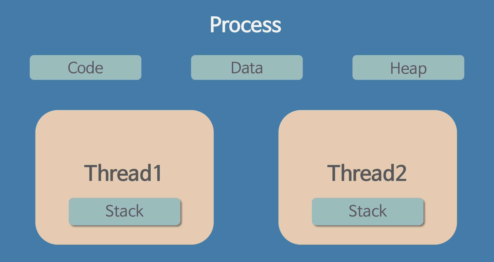
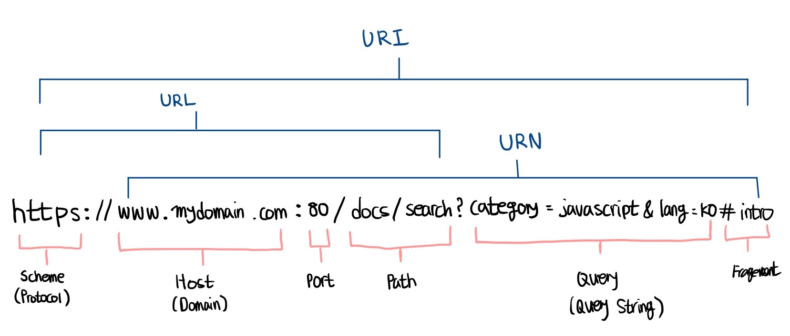
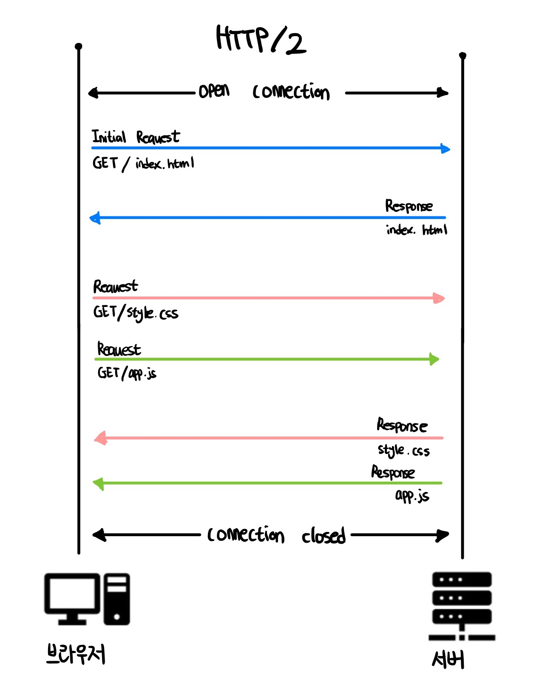
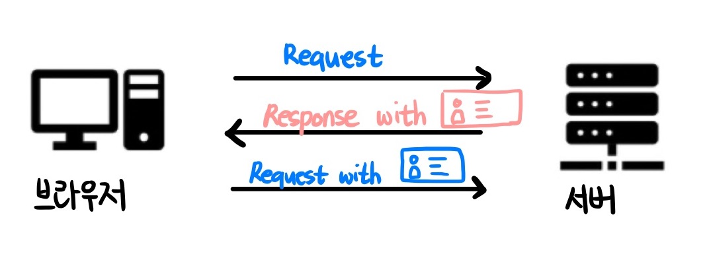
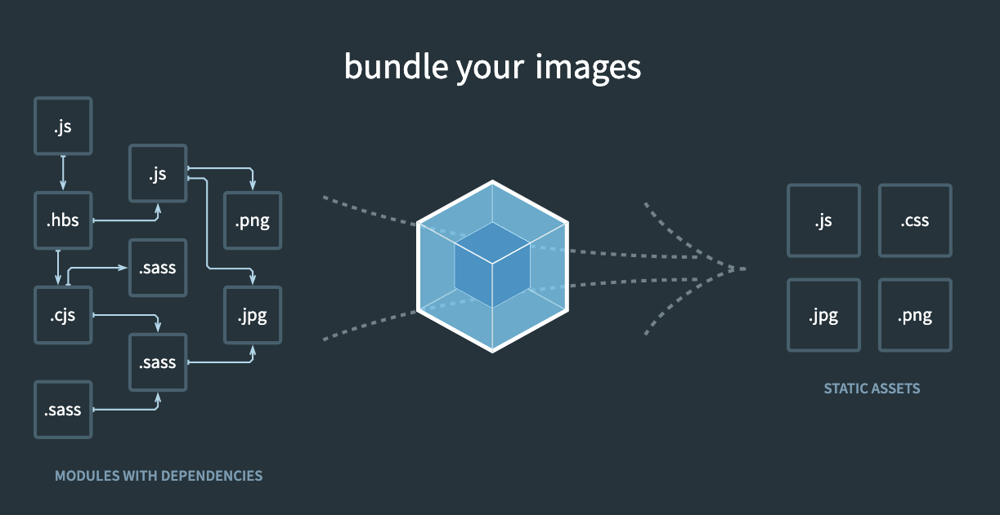
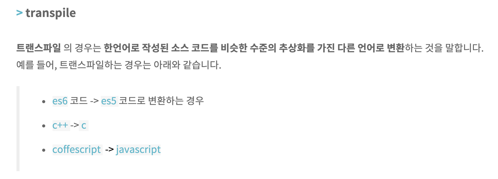
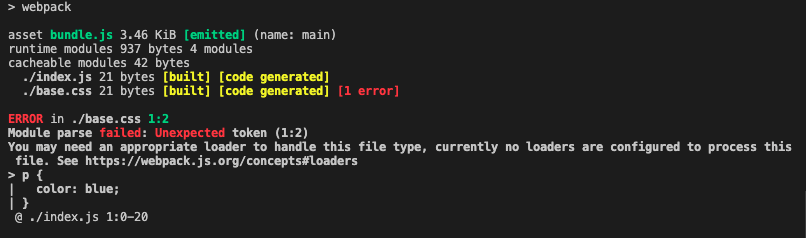
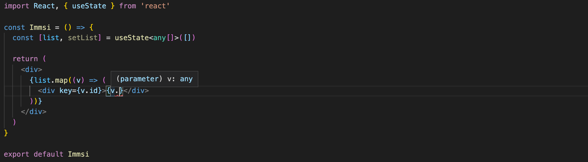

# prepare_frontend_interview

## Computer Science

<b>프론트엔드 기술 면접을 위한 핸드북 만들기</b>

기본적으로 제가 이전에 공부했던 내용을 정리하지만,

더 쉽고 이해가 되는 방향의 양질의 자료가 있을 경우 해당 자료를 대신 넣기도 합니다

제가 모르는 부분인데 정리가 필요한 부분은 주로 [Interview_Question_for_Beginner 🔥](#https://github.com/JaeYeopHan/Interview_Question_for_Beginner) 를 참고합니다!

정말 두고두고 보기 좋은 자료가 많으며 기업에 대한 [역 질문 리스트 📌](https://github.com/JaeYeopHan/Interview_Question_for_Beginner/tree/master/Reverse_Interview) 또한 존재합니다

## 목차

- [프로세스와 스레드 🔥](#프로세스와-스레드)

  - 프로세스가 뭔가요?
  - 스레드가 뭔가요?
  - 프로세스와 스레드는 어떤 차이가 있나요?

- [싱글 스레드와 멀티 스레드 🔥](#싱글-스레드와-멀티-스레드)

  - 싱글 스레드 장점
  - 싱글 스레드 단점
  - 멀티 스레드 장점
  - 멀티 스레드 단점

- [HTTP 🔥](#HTTP)

  - HTTP란 뭔가요?
  - HTTP 프로토콜의 가장 큰 특징은 뭔가요?
  - URL은 뭔가요?
  - HTTP/1.1 과 HTTP/2.0의 차이는 뭔가요?
  - HTTPS는 HTTP랑 뭐가 다른가요?
  - 심화) 공개키 (비대칭키) 방식이 뭔가요?

- [쿠키 세션 🔥](#쿠키-세션)

  - 쿠키, 세션을 왜 쓰나요?
  - 쿠키가 뭔가요?
  - 세션이 뭔가요?
  - 쿠키와 세션의 차이는 어떤 점이 있을까요?

- [CORS 🔥](#CORS)

  - CORS가 뭔가요?
  - CORS를 겪고 직접 해결해 본 경험이 있으면 말해주세요

- [SaaS 🔥](#SaaS)

  - SaaS가 뭔가요?
  - 기타 비즈니스 유형​은 뭐가 있나요?

- [개발 방법론 🔥](#개발-방법론)

  - 폭포수 방법론이란 뭔가요?
  - 애자일 방법론이란 뭔가요?

- [Cache 🔥](#Cache)

- 캐시란 무엇인가요?

- [CI CD 🔥](#CI-CD)

  - CI CD란 뭔가요?

- [CDN 🔥](#CDN)

  - CDN이란 뭔가요?

- [테스트 🔥](#테스트)

  - 테스트란 무엇인가요?
  - 테스트의 예는 어떤 것들이 있나요?
  - 테스트는 왜 해야 하나요?
  - 유닛 테스트란 무엇인가요?
  - 통합 테스트란 무엇인가요?
  - E2E 테스트란 무엇인가요?

- [business logic 🔥](#business-logic)

  - business logic 이란 무엇인가요?

- [Snippet 🔥](#Snippet)

  - snippet 이란 무엇인가요?

- [웹팩 🔥](#웹팩)

  - 웹팩이란?
  - 모듈이란?
  - 모듈 번들링이란?
  - 웹팩이 등장한 이유 웹팩 사용 시에 이점
  - 바벨이란?
  - 웹팩의 주요 속성 4가지

- [타입과 인터페이스 🔥](#타입과-인터페이스)

  - 이 글을 보시는 분들께
  - 타입스크립트를 왜 쓰나요? (본인이 느낀점)
  - 타입과 인터페이스의 차이를 아나요? 🔥🔥🔥
  - 제네릭이란? 🔥🔥🔥

## 프로세스와 스레드

### `프로세스가 뭔가요?`

**프로세스는 운영체제로부터 자원을 할당받은 작업의 단위이다**

### `스레드가 뭔가요?`

**스레드는 프로세스가 할당받은 자원을 이용하는 실행 흐름의 단위이다**

<details>
<summary> <b>프로그램 > 프로세스 > 스레드</b> 📌</summary>

<br/>

출처: [Link 🔥](https://velog.io/@raejoonee/%ED%94%84%EB%A1%9C%EC%84%B8%EC%8A%A4%EC%99%80-%EC%8A%A4%EB%A0%88%EB%93%9C%EC%9D%98-%EC%B0%A8%EC%9D%B4)

### 프로그램 > 프로세스 🔥

먼저 프로세스와 스레드에 대해 본격적으로 설명하기 전에 프로그램에 대해서 설명하고 가야 한다.

프로그램이란, **파일이 저장 장치에 저장되어 있지만 메모리에는 올라가지 않은 정적인 상태** 를 말한다.

1. **메모리에 올라가 있지 않은** : 아직 운영체제가 프로그램에게 독립적인 메모리 공간을 할당해주지 않았다는 뜻이다.
   모든 프로그램은 운영체제가 실행되기 위한 메모리 공간을 할당해 줘야 실행될 수 있다.

2. **정적인 상태** : 정적이라는 단어 그대로, 아직 실행되지 않고 가만히 있다는 뜻이다.

프로그램이라는 단어는 아직 실행되지 않은 파일 그 자체를 가리키는 말이다. **그냥 코드 덩어리다.**

프로그램에게 의미를 부여하기 위해 프로그램을 실행해 보자.

프로그램을 실행하는 순간 해당 파일은 컴퓨터 메모리에 올라가게 되고, 이 상태를 동적인 상태라고 하며 이 상태의 프로그램을 **프로세스** 라고 한다.

따라서 위키피디아에서는 프로세스에 대해 정의를 내릴 때 그냥 **실행되고 있는 컴퓨터 프로그램** 이라고 정의를 내리고 있으며, 스케줄링 단계에서의 **"작업"** 과 같은 단어라고 봐도 무방하다고 하고 있다.

#### 한 줄 요약: 프로그램은 코드 덩어리 파일, 그 프로그램을 실행한 게 프로세스

### 프로세스 > 스레드 🔥

과거에는 프로그램을 실행할 때 실행 시작부터 실행 끝까지 프로세스 하나만을 사용해서 진행했다고 한다. 하지만 시간이 흐를수록 프로그램이 복잡해지고 프로세스 하나만을 사용해서 프로그램을 실행하기는 벅차게 되었다. 실제로 이제는 프로그램 하나가 단순히 한 가지 작업만을 하는 경우는 없다. 그러면 이제 어떻게 해야할까?

쉽게 떠오르는 방법은, **"한 프로그램을 처리하기 위한 프로세스를 여러 개 만들면 되지 않을까?"** 생각이 들지만 이는 불가능한 일이었다. 왜냐하면 운영체제는 안전성을 위해서 프로세스마다 자신에게 할당된 메모리 내의 정보에만 접근할 수 있도록 제약을 두고 있고, 이를 벗어나는 정보에 접근하려면 오류가 발생하기 때문이다.

아무튼 프로세스와는 다른 더 작은 실행 단위 개념이 필요하게 되었고, 이 개념이 바로 **스레드** 다.

스레드는 프로세스와 다르게 스레드 간 메모리를 공유하며 작동한다.

스레드끼리 프로세스의 자원을 공유하면서 프로세스 실행 흐름의 일부가 되는 것이다.

아까 프로그램이 코드 덩어리라고 했는데, 스레드도 코드에 비유하자면 스레드는 코드 내에 선언된 함수들이 되고 따라서 function Add(){} 또한 일종의 스레드라고 볼 수 있게 되는 것이다.


### 프로세스와 스레드의 작동 방식에 대한 더 자세한 설명

운영체제는 프로세스가 메모리에 올라갈 때, 프로세스마다 각각 독립된 메모리 영역을, Code/Data/Stack/Heap의 형식으로 할당해 준다.

각각의 독립된 메모리 영역을 할당해 주기 때문에 프로세스는 다른 프로세스의 변수나 자료에 접근할 수 없다.


이와 다르게 스레드는 같은 프로세스 내의 메모리를 서로 공유할 수 있다.

프로세스가 할당받은 메모리 영역 내에서 Stack 형식으로 할당된 메모리 영역을 따로 할당받고, 나머지 Code/Data/Head 형식으로 할당된 메모리 영역을 공유한다.

따라서 각각의 스레드는 별도의 스택을 가지고있지만 힙 메모리는 서로 읽고 쓸 수 있게 된다.



</details>

### `프로세스와 스레드는 어떤 차이가 있나요?`

그냥 면접관이 프로세스와 스레드의 차이가 궁금해서 물어볼까?

아니다. 기본적인 이유는 본문 맨 위에서 언급했듯 지원자가 프로그램, 프로세스, 스레드에 대한 기본 개념에 대해 잘 이해하고 있는지 확인하기 위함이다.

<br/>

프로세스와 스레드는 개념의 범위부터 다르다. 스레드는 프로세스 안에 포함되어 있기 때문이다.

프로세스는 프로그램을 실행하는 순간 해당 파일이 컴퓨터 메모리에 올라가게 되고, 이 동적인 상태의 프로그램을 프로세스라고 한다.

스레드는 프로세스를 구성하는 더 작은 실행 단위의 개념이다.

**프로세스는 메모리에 올라갈 때 운영체제로부터 독자적인 시스템 자원을 할당 받는 반면, 스레드는 프로세스 내부에서 다른 메모리 영역을 같은 프로세스 내 다른 스레드와 공유한다.**

## 싱글 스레드와 멀티 스레드

[출처: velog, 은진님의 글 '싱글스레드, 멀티스레드의 의미'](https://velog.io/@eunjin/OS-%EC%8B%B1%EA%B8%80%EC%8A%A4%EB%A0%88%EB%93%9C-%EB%A9%80%ED%8B%B0%EC%8A%A4%EB%A0%88%EB%93%9C%EC%9D%98-%EC%9D%98%EB%AF%B8)


### 싱글 스레드

하나의 프로세스에서 하나의 스레드 실행

하나의 레지스터와 스택으로 표현.

### 싱글 스레드의 장점

자원 접근에 대한 동기화를 신경쓰지 않아도 된다.

여러개의 스레드가 공유된 자원을 사용할 경우, 각 스레드가 원하는 결과를 얻게 하려면 공용 자원에 대한 접근이 통제되어야 하며, 이 작업은 프로그래머에게 많은
노력을 요구하고 많은 비용을 발생시킨다. 단일 스레드 모델에서는 이러한 작업이 필요하지 않다.

작업전환 작업을 요구하지 않는다.

작업전환은 여러 개의 프로세스가 하나의 프로세서를 공유할 때 발생하는 작업으로 많은 비용을 필요로 한다.

### 싱글 스레드의 단점

여러 개의 CPU를 활용하지 못한다.

프로세서를 최대한 활용하게 하려면 cluster 모듈을 사용하거나, 외부에서 여러 개의 프로그램 인스턴스를 실행시키는 방법을 사용해야 한다.

두 개의 작업을 하나의 스레드로 처리하는 경우와, 두 개의 스레드로 처리하는 경우를 가정했을 때, 후자의 경우는 짧은 시간 동안 2개의 스레드가 번갈아가면서 작업을 수행한다. 그래서 동시에 두 작업이 처리되는 것과 같이 느끼게 된다.

하지만 오히여 두 개의 스레드로 작업한 시간이 싱글스레드로 작업한 시간보다 더 걸릴 수도 있는데, 그 이유는 스레드 간의 작업전환(context switching)에 시간이 걸리기 때문이다.

따라서 단순히 CPU만을 사용하는 계산작업이라면, 오히려 멀티스레드보다 싱글스레드로 프로그래밍하는 것이 더 효율적이다.

### 멀티 스레드

프로그램을 다수의 실행 단위로 나누어 실행.

프로세스 내에서 자원을 공유하여 자원 생성과 관리의 중복을 최소화

서버가 많은 요청을 효율적으로 수행할 수 있는 환경을 제공

각각의 스레드가 고유의 레지스터와 스택으로 표현됨.

### 멀티 스레드의 장점

새로운 프로세스를 생성하는 것보다 기존 프로세스에서 스레드를 생성하는 것이 빠르다.

프로세스의 자원과 상태를 공유하여 효율적으로 운영이 가능하다.

프로세스의 작업전환보다 스레드의 작업전환이 더 빠르다.

### 멀티 스레드의 단점

하나의 스레드만 실행중일 때는 실행시간이 오히려 지연될 수 있다.

멀티 스레딩을 위해 운영체제의 지원이 필요하다.

스레드 스케쥴링을 신경써야 한다.

## HTTP

[Link 🔥](https://joshua1988.github.io/web-development/http-part1/)

### `HTTP란 뭔가요?`

HTTP는 HyperText Transfer Protocol의 약자로 데이터를 주고받기 위해 정의한 통신 프로토콜입니다

웹을 기준으로 브라우저와 서버 간에 데이터를 주고받기 위항 방식으로 HTTP 프로토콜을 사용하고 있습니다.

<br/>

### `HTTP 프로토콜의 가장 큰 특징은 뭔가요?`

HTTP 프로토콜은 상태가 없는 (stateless) 프로토콜입니다.

여기서 상태가 없다는 말은 데이터를 주고 받기 위한 각각의 데이터 요청이 서로 독립적으로 관리가 된다는 말입니다.

이전에 보냈던 데이터 요청과 다음에 보낼 데이터 요청이 서로 관련이 없다는 의미입니다.

이러한 특징 덕분에 서버는 세션과 같은 별도의 추가 정보를 관리하지 않아도 되고, 다수의 요청 처리 및 서버의 부하를 줄일 수 있는 성능 상의 이점이 생깁니다.

HTTP 프로토콜은 일반적으로 TCP/IP 통신 위에서 동작하며 기본 포트는 80번입니다

<br/>

### `URL은 뭔가요?`

URL(Uniform Resource Locators)은 서버에 자원(resource)를 요청하기 위해 입력하는 영문 주소입니다.

숫자로 되어있는 IP주소보다는 훨씬 기억하기 쉽다는 장점이 있습니다.

브라우저에서는 이렇게 url로 되어있는 HTTP 요청을 DNS(Domain Name System)를 통해 host에 해당하는 실제 IP 주소로 변환하여 서버에 요청(Request)을 보냅니다

URL의 구조는 다음과 같습니다



<br/>

### `HTTP/1.1 과 HTTP/2.0의 차이는 뭔가요?`

HTTP/1.1은 기본적으로 커넥션 당 하나의 요청과 응답만 처리한다.

즉, 여러 개의 요청을 한 번에 전송할 수 없고 응답 또한 마찬가지다.

따라서 HTML 문서 내에 포함된 여러 개의 리소스 요청, 즉 CSS 파일을 로드하는 link 태그, 이미지 파일을 로드하는 img 태그, 자바스크립트를 로드하는 script 태그 등에 의한 리소스 요청이 개별적으로 전송되고 응답 또한 개별적으로 전송된다.

이처럼 HTTP/1.1은 리소스의 동시 전송이 불가능한 구조이므로 요청할 리소스의 개수에 비례하여 응답 시간도 증가하는 단점이 있다.


HTTP/2는 커넥션당 여러 개의 요청과 응답, 즉 다중 요청/응답이 가능하다.

여러 리소스의 동시 전송이 가능하므로 HTTP/1.1에 비해 페이지 로드 속도가 약 50% 정도 빠르다고 알려져 있다.



<br/>

### `HTTPS는 HTTP랑 뭐가 다른가요?`

[Link 🔥](https://mangkyu.tistory.com/98)
[Youtube Link 🔥](https://www.youtube.com/watch?v=H6lpFRpyl14)

HTTPS는 HTTP에 데이터 암호화가 추가된 프로토콜이다.

HTTPS는 HTTP(80번)와 다르게 443번 포트를 사용하며, 네트워크 상에서 중간에 제3자가 정보를 볼 수 없도록 **공개키 암호화를 지원하고 있다.**

HTTPS를 사용할 경우 내가 브라우저를 통해 입력하는 정보를 (ex: form data) 다른 누군가가 훔쳐보지 못하게 만드는 기능입니다.

HTTP 형식으로 입력한 정보를 보낼 경우, 입력한 형태 그대로 보내지게 된다

```
id: my_naver_id
pw: my_naver_pw
```

따라서 누군가가 악의적으로 이 요청을 캐치해서 내 정보를 들여다 본다면, 그대로 아이디와 비밀번호가 노출될 수 있다.

하지만 HTTPS를 사용할 경우, 이 통신 요청(request)을 보낼 때 응답(response)을 해주는 서버만 알아볼 수 있도록 정보를 암호화해서 보내게 된다

```
실제로 이렇다는 것은 아니고 이해를 돕기위해 작성하였습니다 😁

id: ^!@$!A_!@E!@#(_a*&@)
pw: !@#%_+#$%_!#@!$
```

또한 HTTPS는 기관으로부터 검증된 사이트만 주소에 HTTPS 사용이 허가되기 때문에, 내가 접속한 사이트가 상대적으로 안전한 주소를 가졌음을 증명하는 것이기도 하다

<br/>

### `심화) 공개키 (비대칭키) 방식이 뭔가요?`

HTTPS는 공개키/개인키 암호화 방식을 이용해 데이터를 암호화하고 있다. 공개키와 개인키는 서로를 위한 1쌍의 키이다.

- 공개키: 모두에게 공개된, 또는 공개가 가능한 키
- 개인키: 나만 가지고 알고 있어야 하는 키

공개키와 개인키로 암호화하면 다음과 같은 효과를 얻을 수 있다.

- 공개키 암호화: 공개키로 암호화를 하면 개인키로만 복호화할 수 있다. -> 개인키는 나만 가지고 있으므로, 나만 볼 수 있다.
- 개인키 암호화: 개인키로 암호화하면 공개키로만 복호화할 수 있다. -> 공개키는 모두에게 공개되어 있으므로, 내가 인증한 정보임을 알려 신뢰성을 보장할 수 있다.

HTTPS를 사용하기 위해서는 인증된 기관 CA(Certificate Authority)에 공개키를 전송하여 인증서를 발급받아야 한다.

## 쿠키 세션

[Link 🔥](https://github.com/junh0328/TIL/tree/master/Chore#%EC%BF%A0%ED%82%A4%EC%99%80-%EC%84%B8%EC%85%98)

### `쿠키, 세션을 왜 쓰나요?`

HTTP는 항상 연결되어있는 것이 아닌 필요할 때마다 요청을 보내고 응답을 반는 비연결성이라는 특징을 가지고 있다.

이는 클라이언트가 응답을 받으면 서버는 접속을 끊는다는 것인데, 연결이 끝나면 상태 정보가 유지되지 않는 특성이 있다.

```
로그인을 한 뒤, 다른 도메인으로 이동했다 기존 사이트로 돌아오면 로그인 정보가 유지되지 않는다는 것
```

이렇게 유지되지 않는 로그인 정보를 유지하기 위한 방법이 쿠키와 세션이다.

<br/>

### `쿠키가 뭔가요?`

HTTP의 일종으로 사용자가 어떠한 웹 사이트를 방문할 경우, 그 사이트가 사용하고 있는 서버에서 사용자의 컴퓨터에 저장하는 작은 기록 정보 파일이다.

HTTP에서 클라이언트의 상태 정보를 클라이언트의 PC에 저장하였다가 필요시 정보를 참조하거나 재사용할 수 있다.

<br/>

#### `쿠키의 특징`

- 이름, 값, 만료일(저장 기간 설정), 경로 정보로 구성되어 있다.
- 클라이언트에 총 300개의 쿠키를 저장할 수 있다.
- 하나의 도메인 당 20개의 쿠키를 가질 수 있다
- 하나의 쿠키는 4KB(=4096byte)까지 저장 가능하다.

<br/>

#### `쿠키의 동작 순서4`


1. 클라이언트가 페이지를 요청한다 (사용자가 웹사이트 접근) 웹 서버는 쿠키를 생성한다
2. 생성한 쿠키에 정보를 담아 HTTP 화면을 돌려줄 때, 같이 클라이언트에게 돌려준다
3. 넘겨 받은 쿠키는 클라이언트가 가지고 있다가(로컬 PC에 저장) 다시 서버에 요청할 때 요청과 함께 쿠키를 전송한다
4. 동일 사이트 재방문시 클라이언트의 PC에 해당 쿠키가 있는 경우, 요청 페이지와 함께 쿠키를 전송한다

<br/>

#### `사용 예시`

1. 방문했던 사이트에 다시 방문 하였을 때 아이디와 비밀번호 자동 입력
2. 팝업창을 통해 "오늘 이 창을 다시 보지 않기" 체크

<br/>

#### `쿠키의 약점`

1. 쿠키의 특징으로는 클라이언트(브라우저)단에 저장된다는 것이다
2. 즉 보안에 약할 수 있다
3. 쿠키를 훔쳐서 계정 접근 권한 등을 탈취하여 유저의 정보를 악용할 수 있다

```
document.cookie 를 통해 쿠키 스토리지에 저장된 사용자 권한이 있는 쿠키에 접근
```

<br/>

### `세션이 뭔가요?`

HTTP 세션이란 **클라이이언트가 웹서버에 연결된 순간부터 웹 브라우저를 닫아 서버와의 HTTP 통신을 끝낼 때 까지의 기간** 이다.

하지만 보통 세션이라고 말할 때에는 **서버에 세션에 대한 정보(세션 상태, 클라이언트 상태, 세션 데이터 등)를 저장해 놓고 세션 쿠키( 고유한 세션 ID 값 )를 클라이언트에게 주어 서버가 클라이언트를 식별할 수 있도록 하는 방식자체를 의미하는 경우** 가 많다.

<br/>

#### `세션의 특징`

- 따로 용량의 제한이 없다 (서버의 능력에 따라 다를 수 있다)
- 서버에 세션 객체를 생성하며 각 클라이언트 마다 고유한 세션 ID 값을 부여한다
- 쿠키를 사용하여 세션 ID 값을 클라이언트에 보낸다
- 웹 브라우저가 종료되면 세션 쿠키는 삭제된다

<br/>

#### `세션의 동작 방식`



1. 클라이언트 페이지가 요청한다
2. 서버가 클라이언트마다 개별의 세션 ID를 부여한다
3. 클라이언트는 요청할 때마다 세션 ID를 서버에 전달한다
4. 서버는 받은 세션 ID로 클라이언트 정보를 가져와 활용한다

<br/>

### `쿠키와 세션의 차이는 어떤 점이 있을까요?`

1. 저장 위치

   쿠키: 클라이언트에 파일로 저장되어 있다

   세션: 서버에 저장되어 있다

2. 보안

   쿠키: 클라이언트의 브라우저 로컬에 저장되기 때문에 변질되거나 HTTP request 요청 시에 이를 갈취당할 수 있어서 보안에 취약하다

   세션: 쿠키를 이용해서 세션id만 저장하고 그것으로 구분해서 서버에서 처리하기 때문에 비교적으로 안전하다

3. 라이프 사이클

   쿠키: 만료시간은 있지만 파일로 저장되기 때문에 브라우저를 종료해도 계속해서 정보가 남아있다. 만료기간에 따라 상대적으로 넉넉하게 쿠키를 삭제할 때까지 유지된다

   세션: 만료기간을 정할 수는 있지만 브라우저가 종료되면 그에 상관없이 삭제된다

4. 속도

   쿠키: 쿠키에 정보가 있기 때문에 서버에 요청시 속도가 빠르다

   세션: 정보가 서버에 있기 때문에 처리가 요구되어 비교적으로 느리다

## CORS

[Link 🔥](https://velog.io/@young_pallete/CORS)

### `CORS가 뭔가요?`

CORS는 Cross Origin Resource Sharing의 약자로, 교차 출처 공유라는 의미입니다.

Origin은 ① scheme, ② host, ③ port 로 이루어진 도메인을 의미합니다. (IE의 경우 port를 비교하지 않음)

```
https://www.naver.com/

① scheme : https
② host: www.naver.com
③ port: null (공개되지 않음)
```

<br/>

현재 `① 자신이 속한 출처(Origin)`를 기준으로 `② 다른 출처(Origin)`에 API를 요청하게 되면 브라우저에서 이 요청으로 넘어오는 경과가 안전한지 판단하게 되는데,

응답을 보내는 출처가 `① 자신이 속한 출처`가 아닌, `② 다른 출처`여도 서로 예상되는 출처라면 요청에 대해 허용해주는 응답 헤더를 보내, 브라우저가 응답 결과를 보여줍니다.

이를 CORS(Cross Origin Resource Sharing)이라 합니다.

<br/>

#### 왜 브라우저가 CORS 요청을 처리하나요?

모든 서버들이 다 CORS를 인지하지는 않기 때문이다.

결과적으로 브라우저는 거부했다고 하더라도, 서버는 처리해버리는 결과가 생길 수 있기 때문에

서버가 안전하게 요청을 주고받을 수 있도록 브라우저에서 해당 요청(CORS)을 처리한다

<br/>

#### 실제 요청에서는 어떻게 처리하나요?

CORS는 다른 Origin에 대한 요청을 허용하는 정책입니다.

같은 Origin에서 http 통신을 하는 경우 알아서 cookie가 request header에 들어가지만, 교차 출처로 요청하는 상황에서는 그렇지 않습니다.

Origin이 다른 http 통신에서는 request header에 쿠키가 자동으로 들어가지 않기 때문에 서버에게 또는 클라이언트에게 내가 어떤 요청을 보내는 지 알려줄 필요가 있습니다.

```
프론트 > WithCredentials: true

서버 > Access-Control-Allow-Credentials: true
```

<br/>

### `CORS를 겪고 직접 해결해 본 경험이 있으면 말해주세요`

1. 서버 개발자와 빠르게 소통한다

만약 프론트에서 CORS관련 설정이 다 끝난 이후에 HTTP 요청을 보냈을 때 CORS 오류가 뜰 경우 해당 오류를 캡쳐해서 같이 확인해보는 방법

먼저 프론트에서 응답 헤더에 제대로 된 정보를 넣어는 지 확신을 가지는 것이 중요하다 (credentials 관련 설정을 했는지?)

2. 개발 환경에 프록시 설정을 해둔다

만약 개발 환경에 있어서 세팅을 잘 해놓은 상태이고 서버의 세팅이 완벽함에도 문제가 생긴다면, 개발 환경에서의 프록시 설정도 대안이 될 수 있습니다.

해당 프록시 설정은 환경에 따라 (CRA면 CRA) 방법이 다르므로 확인해보고 넣으시면 됩니다!

## SaaS

[Link 🔥](https://www.redhat.com/ko/topics/cloud-computing/what-is-saas)

### `SaaS가 뭔가요?`

서비스로서의 소프트웨어(Software-as-a-Service, SaaS)는 클라우드 애플리케이션과 기본 IT 인프라 및 플랫폼을 사용자에게 제공하는 클라우드 컴퓨팅 형태입니다.

`SaaS`는 클라우드 서비스 제공업체`(ex: AWS, Azure, IBM Cloud, ...)`에 의해 클라우드 환경이 관리됩니다.

SW, 데이터를 PC에 별도 설치없이 웹에서 직접 사용할 수 있다는 장점이 있습니다.

SaaS의 예로는 `Google Docs, Microsoft Office 365`와 같은 소비자 대상 서비스와 `인사 관리 소프트웨어, 콘텐츠 관리 시스템, 고객 관계 관리 툴, IDE(통합 개발 환경)를 제공하는 엔터프라이즈 서비스`가 있습니다.

### `기타 비즈니스 유형​은 뭐가 있나요?`

#### 1. PaaS(Platform as a Service)

- 앱 개발 지원 도구 제공​합니다. 사용자가 실제 애플리케이션및 데이터를 처리하므로 개발자와 프로그래머에게 이상적인 솔루션일 수 있습니다

- 플랫폼 기반(Cloud 업체가 제공하는 S/W 사용)으로 앱을 개발하기 때문에 ​특정 플랫폼에 종속 가능성이 있음 → 타업체의 PaaS에서 호환 어려움

#### 2. IaaS(Infrastructure as a Service)​

- 서비스 제공업체가 고객을 대신해 클라우드를 통해 인프라(실제 서버, 네트워크, 가상화, 스토리지)를 관리합니다

- 컴퓨팅 인프라(운영체제, 서버, 스토리지 등) 제공(Amazon의 AWS 등) ​

- 물리적으로 만들어지지 않은 가상 환경이므로 시스템 해체 용이​

## 개발 방법론

### `폭포수 방법론이란 뭔가요?`

폭포수 모델(waterfall model)은 순차적인 소프트웨어 개발 프로세스로, 개발 흐름이 마치 폭포수처럼 지속적으로 아래로 향하는 것처럼 보이는 데서 이름이 붙여졌습니다. 이 폭포수 모델의 흐름은

- 소프트웨어 요구사항 분석
- 소프트웨어 설계
- 소프트웨어 구현
- 소프트웨어 시험
- 소프트웨어 통합
- 소프트웨어 유지보수

단계에 이릅니다.


[출처: 위키백과 폭포수 모델](https://upload.wikimedia.org/wikipedia/commons/thumb/e/e2/Waterfall_model.svg/525px-Waterfall_model.svg.png)

폭포수 모델을 따르기 위해서는, 완전히 순차적으로 한 단계, 한 단계를 진행해 나가야 한다. 예를 들어, 가장 먼저 요구사항 기술을 진행하여 이를 확정하여야 하며, 그런 이후에 설계를 진행할 수 있다.

소프트웨어가 설계된 후, 그 설계도가 구현자(개발자)에게 따라서 구현해야할 계획으로 전달된다. 따라서 설계가 완전히 완료된 후에 설계에 대한 구현이 코더에 의해 진행될 수 있는 것이다. 이 구현의 마지막 단계에 이르면, 가각의 생성된 컴포넌트를 결합하여, 새로운 기능을 실현시키고 그때까지 발생한 버그를 해결하게 된다.

폭포수 모델은 전 단계가 수행되어 완료되기 전에는 다음 단계를 진행할 수 없도록 제한하는 것이 특징이다.

### `애자일 방법론이란 뭔가요?`

[Link 🔥](https://www.redhat.com/ko/devops/what-is-agile-methodology)

`애자일`은 신속한 반복 작업을 통해 실제 작동 가능한 소프트웨어를 개발하여 지속적으로 제공하기 위한 소프트웨어 개발 방식입니다.

작동하는 소프트웨어의 작은 구성 요소를 신속하게 제공하여 고객의 만족도를 개선하는 것이 애자일 방법론의 핵심입니다.

다음과 같은 부분에 가치를 둡니다.

- **개인과 개인 간의 상호작용**이 프로세스 및 툴보다 우선
- **작동하는 소프트웨어**가 포괄적인 문서보다 우선
- **고객과의 협업**이 계약 협상보다 우선
- **변화에 대응**하는 것이 계획을 따르는 것보다 우선

## Cache

[Link 10분 테코톡 -파피의 Caching 캐싱](https://www.youtube.com/watch?v=JBFT4KyEvoY&t=314s)

### `캐시란 무엇인가요?`

```
Caching == Cache + ing
```

### Cache

Cache는 프랑스어로 `숨기다` 라는 뜻을 가지는 단어인 cacher 에서 파생된 단어로, 물건을 일시적으로 저장, 보관하기 위해 사용하는 곳

### 기술적 Cache

자주 필요한 데이터나 값의 복사본을 일시적으로 저장, 보관하기 위해 사용하는 곳

### Caching

Cache를 사용하는 것

### Flow

- CPU는 데이터 처리를 위해 메모리와 끊임없이 데이터를 주고받는 구조
- 메모리가 CPU의 데이터 처리 속도를 쫓아가지 못함
- CPU가 메모리를 기다려야 하는 `병목현상` 발생

이 `병목현상` 을 완화하기 위해 CPU와 메인 메모리 사이에 크기는 작지만 속도가 빠른 **캐시 메모리**를 두고,

캐시 메모리에 향후 재사용할 가능성이 클 것으로 예상되는 데이터의 복사본을 저장해 둔 후 CPU가 요청하는 데이터를 바로바로 전달할 수 있도록 합니다

캐시 메모리의 용량을 크게 쓰거나, 아예 메인 메모리로 사용하면 되지 않냐고 물을 수 있는데, 캐시 메모리는 가격이 비싸다

메인 메모리는 DRAM, 캐시 메모리는 SRAM의 구조를 가지는데, SRAM이 셀당 트랜지스터의 개수도 많고 물리적으로 차지하는 면적 또한 훨씬 크다


[출처 - 테코톡 파피의 캐싱](https://www.youtube.com/watch?v=JBFT4KyEvoY&t=314s)

메모리의 계층 구조

- 상층 구조로 갈수록 빠르고, 비싸고, 작은 용량을 가집니다
- 또한 CPU와 가까이 위치하고 있습니다
- 캐시 메모리 들이 메인 메모리(RAM)보다 빠르지만, 비싸며, 면적 차지 또한 큰 것을 알 수 있습니다

이러한 메모리 계층 구조의 목적은 캐싱을 이용하여 빠르고 작은 메모리와 크고 느린 메모리의 조합을 이용하여 크고 빠른 메모리처럼 행동하도록 만들기 위함입니다.

재사용할 가능성이 클 것으로 예상되는 데이터의 복사본을 저장함으로써 캐싱을 할 수 있다고 했는데, 재사용할 가능성이 클 지는 어떻게 알 수 있을까? - 데이터 지역성의 원리를 이용합니다

### 데이터 지역성의 원리

- 데이터 접근이 시간적 혹은 공간적으로 가깝게 일어나는 것을 의미함
- 한 번 참조된 변수는 잠시 후에 또 참조될 가능성이 높다
- 어떤 데이터에 접근할 때, 그 데이터 근처에 있는 다른 데이터도 참조될 가능성이 높다

### 결론

캐싱: 캐시에 데이터나 계산된 결과 값의 복사본을 저장해 둠으로써 전체적인 처리 속도를 향상시킨다.

- 데이터에 직접적으로 접근하는 데 걸리는 시간이 오래 걸릴 때
- 필요한 값을 얻기 위해 계산하는 과정을 생략하고 싶을 때
- 반복적으로 동일한 결과를 돌려주는 경우(이미지나 썸네일 등)

캐싱은 복사본을 이용하는 것이다.

복사본과 원본이 달라지는 경우가 생길 수 있으니 일관성 유지에 유의하자

## CI CD

[Link 🔥](https://www.redhat.com/ko/topics/devops/what-is-ci-cd)

### `CI CD란 뭔가요?`


[출처: 레드헷 CI/CD](https://www.redhat.com/ko/topics/devops/what-is-ci-cd)

CI/CD는 애플리케이션 개발 단계를 자동화하여 애플리케이션을 보다 짧은 주기로 고객에게 제공하는 방법입니다.

CI/CD의 기본 개념은 지속적인 통합, 지속적인 서비스 제공, 지속적인 배포입니다.

CI/CD는 새로운 코드 통합으로 인해 개발 및 운영팀에 발생하는 문제(일명 "인테그레이션 헬(integration hell)")을 해결하기 위한 솔루션입니다.

`CI`는 개발자를 위한 자동화 프로레스인 지속적인 통합 `Continuous Integration`을 의미합니다.

CI를 성공적으로 구현할 경우 애플리케이션에 대한 새로운 코드 변경 사항이 정기적으로 빌드 및 테스트되어 공유 리포지토리에 통합되므로 여러 명의 개발자가 동시에 애플리케이션 개발과 관련된 코드 작업을 할 경우 서로 충돌할 수 있는 문제를 해결할 수 있습니다.

`CD`는 지속적인 서비스 제공 `Continuous Delivery` 및 지속적인 배포 `Continuous Deployment`를 의미합니다.

`지속적인 제공`이란 개발자들이 애플리케이션에 적용한 변경 사항이 버그 테스트를 거쳐 리포지토리(예: GitHub 또는 컨테이너 레지스트리)에 자동으로 업로드되는 것을 뜻합니다.

`지속적인 배포`란 개발자의 변경 사항을 리포지토리에서 고객이 사용 가능한 프로덕션 환경까지 자동으로 릴리스하는 것을 의미합니다

## CDN

### `CDN이란 뭔가요?`

CDN(콘텐츠 전송 네트워크)은 **지리적으로 분산된 여러 개의 서버**입니다 **웹 콘텐츠를 사용자와 가까운 곳에서 전송함으로써 전송 속도를 높입니다**. 전 세계 데이터센터는 파일 복사본을 임시로 저장하는 프로세스인 캐싱을 사용합니다. 따라서 **사용자는 가까운 서버를 통해 웹 활성화 디바이스 또는 브라우저에서 인터넷 콘텐츠에 빠르게 접속할 수 있습니다**. CDN은 웹 페이지, 이미지, 비디오 등의 콘텐츠를 사용자의 물리적 위치와 가까운 프록시 서버에 캐싱합니다. 이렇게 하면 콘텐츠가 로딩될 때까지 기다릴 필요 없이 영화 감상, 소프트웨어 다운로드, 은행 잔고 확인, 소셜 미디어 포스팅, 구매 등의 작업을 할 수 있습니다.

**인터넷으로 그래픽과 비디오 등 용량이 큰 웹 콘텐츠를 전송하면 트래픽이 폭주할 때처럼 네트워크 혼잡 문제가 발생할 수 있습니다**. **CDN 서비스는 이러한 문제를 해결하기 위해 개발되었습니다**. 중앙 서버에서 개별 사용자에게 콘텐츠를 전송하려면 시간이 너무 오래 걸렸습니다. 이제 CDN은 텍스트, 그래픽, 스크립트, 미디어 파일부터 소프트웨어 다운로드, 문서, 포털, 이커머스, 라이브 스트리밍 미디어, 온디맨드 비디오 스트리밍 미디어, 소셜미디어 사이트에 이르기까지 모든 것을 처리합니다.

**CDN의 미션은 지연 시간을 줄이는 것입니다**. **지연 시간은 웹 페이지 또는 비디오 스트리밍 콘텐츠가 디바이스에 완전히 로딩되기 전에 발생하는 불편한 지연을 의미합니다.** 지연 시간은 밀리초 단위로 측정도비니다. 하지만 사용자가 체감하는 시간은 매우 길며, 시간 초과 또는 로딩 오류가 발생할 수 있습니다. 콘텐츠가 사용자에게 도달하기 위해 이동해야 하는 물리적 거리를 줄여 지연 시간을 줄이는 콘텐츠 전송 네트워크도 있습니다. 따라서 CDN이 보다 광범위하고 넓게 분산되어 있으면 사용자와 최대한 가까운 곳에 콘텐츠를 배치함으로써 웹 콘텐츠를 보다 빠르고 안정적으로 전송할 수 있습니다.

어떤 사람들은 CDN을 ‘엣지'라고 부릅니다. 엣지는 물리적 환경과 디지털 세계가 네트워크 경계에서 만나 상호작용하는 곳입니다. 전 세계에 광범위하게 분산된 수천 개의 PoP(**Points of Presence, 전 세계 여러 곳**)

CDN 을 사용하는 대표적인 기업 - **[넷플릭스](https://www.bloter.net/newsView/blt202111060001), [슬랙](https://www.youtube.com/watch?v=oVaTiRl9-v0)**

CDN 서비스를 제공하는 대표적인 기업 - [**Amazon CloudFront**](https://aws.amazon.com/ko/cloudfront/)

## 테스트

### `테스트란 무엇인가요?`

어플리케이이 요구사항에 맞게 동작하는지를 검증하는 행위입니다

### `테스트의 예는 어떤 것들이 있나요?`

- DB에 데이터를 입력하는 API를 개발 > API 호출 > DB값 검증
- 디자인 시안에 맞게 HTML/CSS를 작성 > 브라우저에서 실제 렌더링된 결과를 확인
- 새로운 기능을 추가하기 위해 기존 모듈을 리팩토링 > 영향을 받는 다른 모듈의 실행 결과를 확인
- 버그를 수정하기 위해 기존 함수를 수정 > 버그가 수정 확인 & 영향을 받는 다른 모듈의 실행 결과를 확인
- 개발 환경에서 테스트된 어플리케이션을 리얼 환경에 배포 > 배포 과정에서 발생한 문제가 없는지 확인

### `테스트는 왜 해야 하나요?`

개발자는 작성한 프로그램의 퀄리티에 대한 책임이 있습니다.

자동화된 테스트를 작성해두지 않으면, 어플리케이션이 복잡해질 수록 테스트 비용이 증가합니다.

개발 기간이나 인력 등이 한정되어 있기 때문에, 테스트를 소홀히 하게 되는 경우가 있는데 이럴 경우 QA 와의 커뮤니케이션 비용이 늘어나, 업무의 효율이 떨어질 수 있습니다.

### `유닛 테스트란 무엇인가요?`

**단위(Unit) 테스트**

- 모듈(함수/클래스) 단위의 테스트
- 작성 비용이 적게 들고 실행 속도가 빠름
- 실패했을 때 문제가 생긴 부분을 비교적 정확하게 파악할 수 있음

### `통합 테스트란 무엇인가요?`

**통합(Integration) 테스트**

- 주로 단위 테스트보다 큰 범위의 테스트를 의미
- 개별 모듈(함수/클래스)들이 연결되어 제대로 상호작용하는지를 테스트
- 단위 테스트에 비해 실패 시 문제가 생긴 부분을 정확히 파악하기가 어려움

### `E2E 테스트란 무엇인가요?`

**E2E(End to End) 테스트**

- 실제 사용자가 사용하는 것과 같은 조건에서 전체 시스템을 테스트
- 단위/통합 테스트에 비해 작성이 어렵고 실행 속도가 비교적 느림
- API 서버, DB 등의 외부 서비스들을 모두 사용하여 통합된 시스템을 테스트

## business logic

### `business logic 이란 무엇인가요?`

위키: 비즈니스 로직(Business logic)은 컴퓨터 프로그램에서 실세계의 규칙에 따라 데이터를 생성·표시·저장·변경하는 부분을 일컫는다. 이 용어는 특히 데이터베이스, 표시장치 등 프로그램의 다른 부분과 대조되는 개념으로 쓰인다.

[출처/ Su Bak님의 글 Business Logic이란?](https://medium.com/@su_bak/term-business-logic%EC%9D%B4%EB%9E%80-6d53c4782d73)

비즈니스 로직(도메인 로직/ 애플리케이션 로직)이란 프로그램의 핵심 로직을 뜻합니다.

어떻게 데이터가 생성되고 저장되고 수정되는지를 정의한 것이 비즈니스 로직이라고 할 수 있습니다.

<b>만약 쇼핑몰 프로그램을 사용한다고 했을 때 물품 목록을 보고 마음에 드는 물품들을 장바구니에 담을 것입니다.

이 때 장바구니에 물품을 추가할 때마다 결제예정 금액이 추가된 물품의 금액에 맞게 변경되는 것을 보신 적이 있으실 겁니다.

이렇게 장바구니에 있는 결제예정 금액이 물품이 추가됨에 따라 수정되는 로직이 바로 비즈니스 로직입니다.</b>

## Snippet

### `Snippet 이란 무엇인가요?`

스니펫(Snippet)은 재사용 가능한 소스 코드, 기계어, 텍스트의 작은 부분을 일컫는 프로그래밍 용어이다. 사용자가 루틴 편집 조작 중 반복 타이핑을 회피할 수 있게 도와준다. - 위키백과

스니펫은 작은 조각을 뜻한다. 요즘 활용되는 왠만한 코드편집기, IDE 등은 code snippet 단위로 '템플릿'을 만들어 써먹을 수 있게 되어있다. 지정한 접두어를 입력하면 템플릿이 입력되는 식이다.

VS Code 의 확장 프로그램 활용 - **Reactjs code snippets / Tabnine AI**


## 웹팩

[Link 🔥](https://github.com/junh0328/CAPATIN_WEBPACK)

### `웹팩이란?`

웹팩이란 최신 프런트엔드 프레임워크에서 가장 많이 사용되는 모듈 번들러(Module Bundler)입니다.

모듈 번들러란 웹 애플리케이션을 구성하는 자원(HTML, CSS, Javscript, Images 등)을 모두 각각의 모듈로 보고 이를 조합해서 병합된 하나의 결과물을 만드는 도구를 의미합니다.


### `모듈이란?`

모듈이란 프로그래밍 관점에서 **특정 기능을 갖는 작은 코드 단위**를 의미합니다. 자바스크립트로 치면 아래와 같은 코드가 모듈입니다.

```js
// 📁 math.js

function sum(a, b) {
  return a + b;
}

function substract(a, b) {
  return a - b;
}

const PI = 3.14;

export { sum, substract, PI };
```

이 math.js 파일은 아래와 같이 3가지 기능을 갖고 있는 모듈입니다.

- 두 숫자의 합을 구하는 sum() 함수
- 두 숫자의 차를 구하는 substract() 함수
- 원주율 값을 갖는 PI 상수

이처럼 성격이 비슷한 기능들을 하나의 의미있는 파일로 관리하면 모듈이 됩니다.

웹팩에서 지칭하는 모듈이라는 개념은 위와 같이 자바스크립트 모듈에만 국한되지 않고 웹 애플리케이션을 구성하는 모든 자원을 의미합니다.

웹 애플리케이션을 제작하려면 HTML, CSS, Javascript, Images, Font 등 많은 파일들이 필요하죠. 이 파일 하나하나가 모두 모듈입니다.

### `모듈 번들링이란?`

아래 그림과 같이 웹 애플리케이션을 구성하는 몇십, 몇백개의 자원들을 하나의 파일로 병합 및 압축 해주는 동작을 모듈 번들링이라고 합니다.

파일들의 연관된 관계를 파악하여 파일들을 하나의 파일로 압축시켜주는 과정을 번들링 과정이라 합니다.



### `웹팩이 등장한 이유 웹팩 사용 시에 이점`

1. 파일 단위의 자바스크립트 모듈 관리의 필요성
2. 웹 개발 작업 자동화 도구
3. 웹 애플리케이션의 빠른 로딩 속도와 높은 성능

<details>
<summary>자세히 보기</summary>

<br/>

#### `파일 단위의 자바스크립트 모듈 관리의 필요성`

입문자 관점에서 고안된 자바스크립트는 아래와 같이 편리한 유효 범위를 갖고 있습니다.

```js
var window = 10;
console.log(window); // 10

function logText() {
  console.log(window); // 10
}
```

자바스크립트의 변수 유효 범위는 기본적으로 전역 범위를 갖습니다. 최대한 넓은 변수 범위를 갖기 때문에 어디에서도 접근하기가 편리하죠.

그런데 이러한 장점이 실제로 웹 애플리케이션을 개발할 때는 아래와 같은 문제점으로 변합니다.

```html
<!-- index.html -->
<html>
  <head>
    <!-- ... -->
  </head>
  <body>
    <!-- ... -->
    <script src="./app.js"></script>
    <script src="./main.js"></script>
    <script>
      getNum(); // ??
    </script>
  </body>
</html>
```

각각 다른 파일(app, main)에서 의도치 않게 같은 함수를 정의하고 호출했을 때, index.html에서는 어떤 함수를 불러오게 될까요?

```js
// app.js
var num = 10;
function getNum() {
  console.log(num);
}
```

```js
// main.js
var num = 20;
function getNum() {
  console.log(num);
}
```

결과는 가장 나중에 불러오게 되는 script 파일인 main.js에 선언된 값 20입니다.

app.js에서 선언한 num 변수는 main.js에서 다시 선언하고 20을 할당했기 때문이죠.

이러한 문제점은 실제로 복잡한 애플리케이션을 개발할 때 발생합니다.

변수의 이름을 모두 기억하지 않은 이상 변수를 중복 선언하거나 의도치 않은 값을 할당할 수 있죠.

이처럼 파일 단위로 변수를 관리하고 싶은 욕구, 자바스크립트 모듈화에 대한 욕구를 예전까진 AMD, Common.js와 같은 라이브러리로 풀어왔습니다.

#### `웹 개발 작업 자동화 도구`

이전부터 프런트엔드 개발 업무를 할 때 가장 많이 반복하는 작업은 텍스트 편집기에서 코드를 수정하고 저장한 뒤 브라우저에서 새로 고침을 누르는 것이었습니다. 그래야 화면에 변경된 내용을 볼 수 있었죠.

이외에도 웹 서비스를 개발하고 웹 서버에 배포할 때 아래와 같은 작업들을 해야 했습니다.

- HTML, CSS, JS 압축
- 이미지 압축
- CSS 전처리기 변환

이러한 일들을 자동화 해주는 도구들이 필요했습니다. 그래서 Grunt와 Gulp 같은 도구들이 등장했습니다.

#### `웹 애플리케이션의 빠른 로딩 속도와 높은 성능`

일반적으로 특정 웹 사이트를 접근할 때 5초 이내로 웹 사이트가 표시되지 않으면 대부분의 사용자들은 해당 사이트를 벗어나거나 집중력을 잃게 됩니다.

그래서 웹 사이트의 로딩 속도를 높이기 위해 많은 노력들이 있었습니다. 그 중 대표적인 노력이 브라우저에서 서버로 요청하는 파일 숫자를 줄이는 것입니다.

이를 위해 앞에서 살펴본 웹 태스크 매니저를 이용해 파일들을 압축하고 병합하는 작업들을 진행했습니다.

뿐만 아니라 초기 페이지 로딩 속도를 높이기 위해 나중에 필요한 자원들은 나중에 요청하는 레이지 로딩(Lazy Loading)이 등장했죠.

웹팩은 기본적으로 필요한 자원은 미리 로딩하는게 아니라 그 때 그 때 요청하자는 철학을 갖고 있습니다.

웹팩을 통해 모듈을 번들링하면, 해당 파일 들을 하나로 묶기 때문에 적은 HTTP 요청으로도 번들링 된 파일을 불러올 수 있습니다.

이러한 이유 때문에 우리는 웹팩을 사용합니다.

</details>

### `바벨이란?`

바벨은 자바스크립트에서 지원하는 최신 문법 (ES6, ES7, ES8, ES9, ...) 들을 최대한 많은 브라우저 환경에서 호환이 가능하도록 변환해주는(트랜스파일링해주는) 언어입니다.

#### `트랜스파일(transpile)`



#### `바벨 변환`

바벨을 사용하면 거대한 변화가 생기기 시작한 기점인 ES6 (ECMAScript 2015) 이후의 문법을 브라우저에서 범용적으로 사용되는 문법 단계로 변환해줄 수 있습니다.

```js
// Babel Input: ES2015 arrow function
[1, 2, 3].map((n) => n + 1);

// Babel Output: ES5 equivalent
[1, 2, 3].map(function (n) {
  return n + 1;
});
```

### `웹팩의 주요 속성 4가지`

1. entry
2. output
3. loader
4. plugin

#### `entry`

entry 속성은 웹팩에서 웹 자원을 변환하기 위해 필요한 최초 진입점이자 자바스크립트 파일 경로입니다.

`빌드를 할 대상 파일의 위치` 라고 볼 수 있습니다

```js
// webpack.config.js
module.exports = {
  entry: "./src/index.js",
};
```

<details>
<br/>

entry 속성에 지정된 파일에는 웹 애플리케이션의 전반적인 구조와 내용이 담겨져 있어야 합니다.

웹팩이 해당 파일을 가지고 웹 애플리케이션에서 사용되는 모듈들의 연관 관계를 이해하고 분석하기 때문에 애플리케이션을 동작시킬 수 있는 내용들이 담겨져 있어야 합니다.

```js
// index.js
import LoginView from "./LoginView.js";
import HomeView from "./HomeView.js";
import PostView from "./PostView.js";

function initApp() {
  LoginView.init();
  HomeView.init();
  PostView.init();
}

initApp();
```

싱글 페이지 애플리케이션으로 작성된 index.js를 예로 들어보겠습니다. 3개의 컴포넌트를 index.js에 불러와서 실행을 하고있는 구조입니다.

사용자의 로그인 화면, 로그인 후 진입하는 메인 화면, 그리고 게시글을 작성하는 화면 등 웹 서비스에 필요한 화면들이 모두 index.js 파일에서 불려져 사용되고 있기 때문에 웹팩을 실행하면 해당 파일들의 내용까지 해석하여 파일을 빌드해줄 것입니다.


#### options

하지만 entry의 경우 엔트리 포인트가 1개가 될 수도 있지만 아래와 같이 여러 개가 될 수도 있습니다.

```
entry: {
  login: './src/LoginView.js',
  main: './src/MainView.js'
}
```

위와 같이 엔트리 포인트를 분리하는 경우는 싱글 페이지 애플리케이션이 아닌 특정 페이지로 진입했을 때 서버에서 해당 정보를 내려주는 형태의 멀티 페이지 애플리케이션에 적합합니다.

</details>

#### `output`

**output** 속성은 웹팩을 돌리고 난 결과물의 파일 경로를 의미합니다.

```js
// webpack.config.js
module.exports = {
  output: {
    filename: "bundle.js",
  },
};
```

앞에서 배운 entry 속성과는 다르게 객체 형태로 옵션들을 추가해야 합니다.

최소한 filename은 지정해줘야 하며 일반적으로 아래와 같이 path 속성을 함께 정의합니다.

```js
// webpack.config.js
var path = require("path");

module.exports = {
  output: {
    filename: "bundle.js",
    path: path.resolve(__dirname, "./dist"),
  },
};
```

- filename 속성은 웹팩으로 빌드(번들링)한 파일의 이름을 의미합니다.
- path 속성은 해당 파일의 경로를 의미합니다.
- path 속성에서 사용된 path.resolve() 코드는 인자로 넘어온 경로들을 조합하여 유효한 파일 경로를 만들어주는 Node.js API입니다.

**따라서 dist 라는 폴더 안에 있는 bundle.js라는 파일 이름으로 엔트리에 들어온 파일을 빌드(번들링)하여 결과물로 가져올 것입니다.**

<details>
<br/>

#### options

앞에서 살펴본 filename 속성에 여러 가지 옵션을 넣을 수 있습니다.

1. 결과 파일 이름에 entry 속성을 포함하는 옵션

```js
module.exports = {
  output: {
    filename: "[name].bundle.js",
  },
};
```

2. 결과 파일 이름에 웹팩 내부적으로 사용하는 모듈 ID를 포함하는 옵션

```js
module.exports = {
  output: {
    filename: "[id].bundle.js",
  },
};
```

3. [그 밖의 옵션](https://joshua1988.github.io/webpack-guide/concepts/output.html#output-%ED%8C%8C%EC%9D%BC-%EC%9D%B4%EB%A6%84-%EC%98%B5%EC%85%98)

</details>

#### `loader`

로더(Loader)는 웹팩이 웹 애플리케이션을 해석할 때 자바스크립트 파일이 아닌 웹 자원(HTML, CSS, Images, 폰트 등)들을 빌드 시에, 자바스크립트의 output(산출물) 파일에 포함될 수 있도록 도와주는 속성입니다.

```js
// webpack.config.js
module.exports = {
  module: {
    rules: [],
  },
};
```

엔트리나 아웃풋 속성과는 다르게 module라는 이름을 사용합니다.

#### `🔥 로더가 없는 경우`

로더는 앞서 말한대로 js 이외 형식의 파일들을 빌드할 때 추가하는 속성이라고 볼 수 있다.

만약 js 파일 내에 css 파일이 import 된 상황에서 loader가 없다면 어떻게 될까?

빌드가 제대로 되는 지 확인해보자

```js
📁 index.js

import "./base.css";
```

빌드를 한다면 다음과 같은 에러를 볼 수 있을 것이다.



빌드 시에, 엔트리로 설정한 index.js 파일 내에 웹팩이 알아볼 수 없는 파일 형식자인 css가 포함되어서 이를 해석할 수 없다는 에러를 발생시켰다.

위와 같이 원래 목적인 js를 변환하는 것이 아니라면 loader를 통해 같이 빌드할 수 있는 여건을 만들어 줘야 한다

<details>
<summary>에시 코드 보기</summary>

<br/>

```js
📁 webpack.config.js

var path = require("path");

module.exports = {
  mode: "none", // production, development, none >> 배포 시에는 production으로 설정해야 한다
  entry: "./index.js",
  output: {
    filename: "bundle.js",
    path: path.resolve(__dirname, "dist"),
  },
  module: {
    rules: [
      {
        // 'test'는 확장자를 의미한다
        test: /\.css$/,
        // 'use'는 해당 파일들을 어떤 방향으로 로딩하는지 설정해주는 것이다

        // css-loader는 웹팩 안에 css 파일을 같이 번들링할 수 있도록 만드는 용도이다
        // style-loader는 해당 css를 html 파일 내에 인라인 코드로 실제 스타일에 적용하는 용도로 사용된다

        // 🔥 순서(오른쪽 to 왼쪽으로 적용) 또한 영향이 있으니, 먼저 적용되야 하는 로더를 오른쪽에 작성해야 한다
        use: ["style-loader", "css-loader"],
      },
      // 만든 바벨 로더 예시
      // {
      //   test: /\.js$/, test > 확장자
      //   use: ["babel-loader"], use > 사용할 라이브러리
      // },
    ],
  },
};
```

</details>

#### `plugin`

우리가 설정한 output인 bundle.js에 css 파일을 같이 번들링하는 것이 아닌 별도의 css 파일로 만들어주기 위해서는 플러그인을 사용할 필요가 있다


해당 적용이 완료된 후에 빌드를 하면 다음과 같이 번들링 시에 css 파일이 별도로 분리된 것을 볼 수 있다


플러그인(plugin)은 웹팩의 기본적인 동작에 추가적인 기능을 제공하는 속성입니다.

로더랑 비교하면 로더는 파일을 해석하고 변환하는 과정에 관여하는 반면, 플러그인은 해당 결과물의 형태를 바꾸는 역할을 한다고 보면 됩니다.

플러그인은 아래와 같이 선언합니다.

```js
// webpack.config.js
module.exports = {
  plugins: [],
};
```

플러그인의 배열에는 생성자 함수로 생성한 객체 인스턴스만 추가될 수 있습니다.

```js
// webpack.config.js
var webpack = require("webpack");
var HtmlWebpackPlugin = require("html-webpack-plugin");

module.exports = {
  plugins: [new HtmlWebpackPlugin(), new webpack.ProgressPlugin()],
};
```

- [Loader 보기 🔥](https://webpack.js.org/loaders/)
- [Plugin 보기 🔥](https://webpack.js.org/plugins/)

## 타입과 인터페이스

### 이 글을 보시는 분들께

어떤 면접을 보더라도 웹 프론트엔드를 공부하면서 타입스크립트 문법을 적용 중에 있다면 아래 3개의 질문은 필수로 질문을 해주시는 것 같습니다.

모든 분들의 가려운 부분을 정확히 긁어드릴 수는 없지만, 반드시 공부하시고 본인만의 답을 찾아 외우시면 도움이 될 것 같습니다.

### 타입스크립트를 왜 쓰나요? (본인이 느낀점) 🔥🔥🔥

타입스크립트를 사용하는 가장 큰 이유는 정적 타이핑을 지원한다는 것이다.

자바스크립트의 특징인 동적 타이핑은 자바스크립트 엔진에 의해 자동으로 해석되기 때문에 의도에 따라 받고 전달하는 데이터의 타입이 불분명해질 수 있다.

타입을 지정하고 먼저 타입을 선언함으로써, 프로그래밍 단계, HTTP 통신을 통한 데이터를 주고받는 과정에서 생기는 데이터를 안전하게 주고 받을 수 있다.

또한 타입을 미리 선언해주기 때문에 타입에 관련된 프로토타입 메서드를 손쉽게 찾아 쓸 수 있다는 장점 또한 존재한다.

<details>
<summary>이미지를 보며 차이점 알아보기</summary>

**타입이 없을 때**



**타입이 있을 때**


</details>

### 타입과 인터페이스의 차이를 아나요?

[링크(참고문헌)](https://yceffort.kr/2021/03/typescript-interface-vs-type)

타입과 인터페이스는 모두 객체의 타입의 이름을 지정하는 방법들 중 하나이다

```ts
// interface
interface PeopleInterface {
  name: string;
  age: number;
}

const me1: PeopleInterface = {
  name: "yc",
  age: 34,
};

// type
type PeopleType = {
  name: string;
  age: number;
};

const me2: PeopleType = {
  name: "yc",
  age: 31,
};
```

하지만 일정 부분에 있어서 타입과 인터페이스는 차이점이 존재한다

1. 확장하는 방법

인터페이스는 `extends` 키워드를 사용하여 확장이 가능하고, 타입은 `&` 연산자를 통해 확장이 가능하다

```ts
// interface
interface PeopleInterface {
  name: string;
  age: number;
}

interface StudentInterface extends PeopleInterface {
  school: string;
}

// type
type PeopleType = {
  name: string;
  age: number;
};

type StudentType = PeopleType & {
  school: string;
};
```

2. 선언적 확장

인터페이스는 동일한 이름을 통해 재정의함으로써 선언적 확장이 가능하지만, 타입은 불가능하다

```ts
// interface
interface Window {
  title: string;
}

interface Window {
  ts: TypeScriptAPI;
}

// 같은 interface 명으로 Window를 다시 만든다면, 자동으로 확장이 된다.

const src = 'const a = "Hello World"';
window.ts.transpileModule(src, {});

// type
type Window = {
  title: string;
};

type Window = {
  ts: TypeScriptAPI;
};

// Error: Duplicate identifier 'Window'.
// 타입은 안된다.
```

여러 타입 혹은 인터페이스를 병합할 때 (`&` or `extends`), 인터페이스는 속성간의 충돌을 해결하기 위해 단순한 객체 타입을 만든다.

인터페이스는 오로지 객체의 타입을 만들기 위한 것이기 때문이다.

타입은 재귀적으로 순회하면서 속성을 병합하는데, 이 경우에 일부 `never`가 나오면서 제대로 머지되지 않을 수 있다. 인터페이스와는 다르게 타입에는 원시 타입이 올 수도 있으므로, 충돌이 나서 병합이 안되는 경우가 발생한다.

객체에만 쓰는 용도라면 interface를 사용하는 것이 좋을 것이다.

`핵심 키워드 🔥🔥🔥`

인터페이스는 자신의 이름을 중복 선언하여 `extends` 키워드를 사용하지 않더라도 확장이 가능하지만,

타입의 경우 중복 선언을 통해 확장할 수 없다. (& 연산자를 사용하여 확장해야 한다)

### 프로젝트 진행 시에 어떤 상황에서 타입을 쓰고 어떤 상황에서 인터페이스를 썼나요?

### 제네릭이란? 🔥🔥🔥

**제네릭은 클래스, 함수, 인터페이스 등을 다양한 타입으로 재사용가능하게 해주는 문법**입니다

```ts
function getSize(arr: number[] | string[] | boolean[]): number {
  return arr.length;
}

const arr = [1, 2, 3];

getSize(arr); // 3

const arr2 = ["a", "b", "c"];

getSize(arr2); // 3

const arr3 = [true, false, true];
getSize(arr3); // 3
```

위와 같이 한가지 함수에서 다양한 타입의 데이터를 받아줘야한다고 가정할 때 올바른 타입을 지정하기 위해서는 타입을 확장시켜줘야 합니다.

이런 상황에서 제네릭을 사용하여 함수의 매개변수에 대한 타입 `<T>`를 명시해줌으로써 다양한 타입에 대응하는 함수를 만들어줄 수 있습니다.

```ts
function getSize<T>(arr: T[]): number {
  return arr.length;
}

const arr = [1, 2, 3];

getSize<number>(arr); // 3

const arr2 = ["a", "b", "c"];

getSize<string>(arr2); // 3
```

`한 줄 요약`

제네릭은 클래스, 함수, 인터페이스 등에서 한 가지 함수가 다양한 타입의 데이터를 받아줘야할 때 올바른 타입을 지정하기 위해 사용하는 재사용 가능한 확장 문법입니다.
