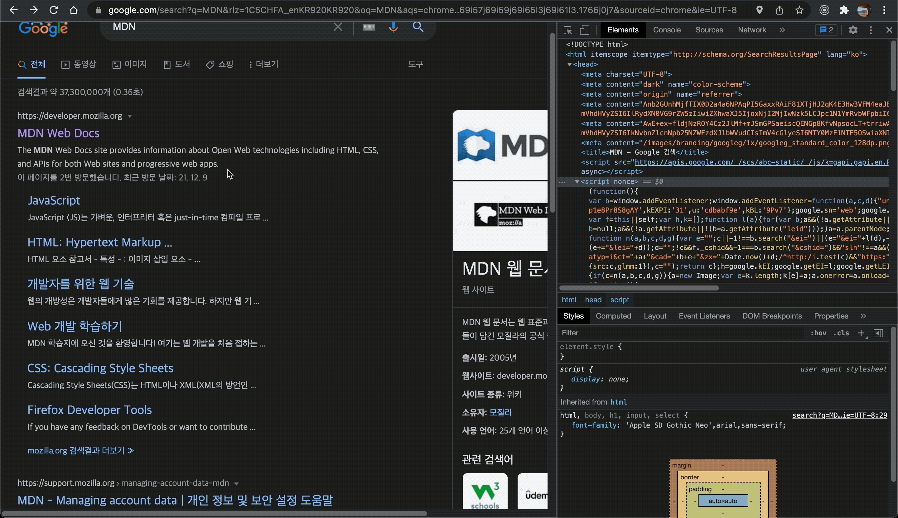

# prepare_frontend_interview

## HTML/ CSS

<b>프론트엔드 기술 면접을 위한 핸드북 만들기</b>

## HTML 목차

- [DOCTYPE 🔥](#DOCTYPE)

  - DOCTYPE에 대하여 설명하시오
  - meta 태그에 대해서 알고 있나요?
  - meta 태그의 요소에 대해서 아는대로 말해보세요

- [웹 표준 및 웹 접근성 🔥](#웹-표준-및-웹-접근성)

  - 웹 표준이란?
  - HTML5에서 추가된 내용이 있나요?
  - 웹 접근성이란?
  - 웹 접근성에 맞는 마크업 예시 몇가지 말해보시오
  - 시멘틱 태그란 무엇인가 왜 사용하는가
  - 텍스트 관련 태그
  - SEO란 무엇인가?
  - Button 태그의 Default type은 무엇인가?
  - Section 태그와 article 태그의 차이점

- [그 외 🔥](#그-외)

  - 이미지 크기가 클 경우 렌더링 속도가 느려질텐데 이를 개선하기 위한 방법
  - UI란 무엇인지 설명하시오
  - 이미지 태그에 src 속성을 사용하는 이유는 무엇인가?
  - 왜 일반적으로 CSS `<link>`를 head 태그 사이에 위치시키고, JS `<script>` 태그를 body 직전에 위치시키는 것이 좋은 방법인지 설명하시오
  - `data-속성` 은 무엇에 좋은지 설명하시오

- [SVG란?🔥](#SVG란)

  - SVG 장점과 단점
  - SVG 내부 도형에 대해 아는게 있나요?

## CSS 목차

- [display 🔥](#display)

  - block 이란?
  - inline 이란?
  - inline-block 이란?
  - none 이란?

- [position 속성에 대하여 🔥](#position-속성에-대하여)

  - static
  - relative
  - fixed
  - absolute

- [float가 어떻게 작동하는가🔥](#float가-어떻게-작동하는가)

- [Flexbox나 Grid 각각의 특징🔥](#Flexbox나-Grid-각각의-특징)

  - flex 를 사용하는 이유가 무엇인가요?
  - Grid를 사용하는 이유가 무엇인가요?

- [이미지 태그를 스타일로 대체하는 법 🔥](#이미지-태그를-스타일로-대체하는-법)

- [반응형 웹의 3요소 🔥](#반응형-웹의-3요소)

- [CSS selector가 어떠한 원리로 동작하나요? 🔥](#CSS-selector가-어떠한-원리로-동작하나요?)

- [반응형웹과 적응형웹에 설명하시오 🔥](#반응형웹과-적응형웹에-설명하시오)

  - 반응형 웹이란?
  - 적응형 웹이란?

- [PX, EM에 대해 설명하시오 🔥](#PX,-EM에-대해-설명하시오)

- [CSS 적용 우선순위 🔥](#CSS-적용-우선순위)

- [CSS-in-JS에 대해서 설명해 주세요 🔥](#CSS-in-JS에-대해서-설명해-주세요)

- [CSS 전처리기를 사용해보셨나요? 🔥](#CSS-전처리기를-사용해보셨나요)

  - 사용해봤다면 장점과 단점

- [padding과 margin의 차이가 무엇인가요? 🔥](#padding과-margin의-차이가-무엇인가요)
  - padding에 대하여
  - margin에 대하여

## 🎈 HTML

## DOCTYPE

### `DOCTYPE에 대하여 설명하시오`

```html
<!-- HTML5 -->
<!DOCTYPE html>
```

HTML이 어떤 버전으로 작성되었는지 미리 선언해,웹브라우저가 내용을 올바로 표시할 수 있도록 해주는 것입니다.

**쉽게 설명하자면 문서형식을 정의해주는 것이다.**

### `meta 태그에 대해서 알고 있나요?`

[Link 🔥](https://developer.mozilla.org/ko/docs/Learn/HTML/Introduction_to_HTML/The_head_metadata_in_HTML)

HTML 문서가 어떤 내용을 담고 있고, 키워드는 무엇이며, 누가 만들었는지에 대한 정보를 담고있는 태그이다.

### `meta 태그의 요소에 대해서 아는대로 말해보세요`

#### charset

```html
<meta charset="utf-8" />
```

`charset`요소는 문서에서 허용하는 문자 집합에 대해서 간단히 표시합니다.

`utf-8`은 전세계적인 character 집합으로 많은 언어의 문자들을 포함합니다.

웹 페이지에서 어떤 문자라도 취급할 수 있다는 것을 의미합니다.

#### name

`name` 요소는 메타 요소가 어떤 정보의 형태를 갖고 있는지 알려줍니다.

`content` 요소는 실제 메타 데이터의 컨텐츠입니다. 머릿말을 요약하는데 유용합니다.

```html
<meta name="author" content="Chris Mills" />

<meta
  name="description"
  content="The MDN Web Docs site provides information about Open Web technologies including HTML, CSS, and APIs for both Web sites and progressive web apps."
/>
```

해당 태그는 실제 MDN 웹 페이지에 등록된 meta 태그의 name 어트리뷰트와 content 어트리뷰트이다.

구글에 'MDN'을 검색했을 때, 검색 엔진이 메타 태그의 `content 어트리뷰트` 안에 있는 내용을 검색 결과와 함께 추가적으로 보여주고 있다.



### `검색 엔진 최적화를 위해 메타 태그의 어떤 것을 활용했는지`

[Link 🔥 tcpschool/html-tags/meta](http://tcpschool.com/html-tags/meta)

#### ① 검색 엔진을 위한 키워드를 정의

```html
<meta name="keyword" content="HTML, meta, tag, element, reference" />
```

#### ② 웹 페이지에 대한 설명(description)을 정의

```html
<meta name="description" content="HTML meta tag page" />
```

#### ③ 문서의 저자(author)를 정의

```html
<meta name="author" content="TCPSchool" />
```

#### ④ 5초 뒤에 다른 페이지로 리다이렉트(redirect)시키기

```html
<meta http-equiv="refresh" content="5;url=http://www.tcpschool.com" />
```

#### ⑤ 모든 장치에서 웹 사이트가 잘 보이도록 뷰포트(viewport)를 설정

```html
<meta name="viewport" content="width=device-width, initial-scale=1.0" />
```

<details>
<summary>전체 코드로 보기</summary>

```html
<head>
  <meta charset="UTF-8" />
  <meta name="keyword" content="HTML, meta, tag, element, reference" />
  <meta name="description" content="HTML meta tag page" />
  <meta name="author" content="TCPSchool" />
  <meta name="viewport" content="width=device-width, initial-scale=1.0" />
  <title>HTML meta tag</title>
</head>
```

</details>
<br/>

## 웹 표준 및 웹 접근성

### `웹 표준이란?`

[출처: 갓대희의 작은공간](https://goddaehee.tistory.com/244)

웹 표준이란 웹 상에서 표준적으로 사용되는 기술을 말합니다.

웹사이트를 어떠한 운영체제에서나 어떠한 브라우저에서 보더라도 동일하게 보여지도록 W3C(World Wide Web Consortium) 기구 표준에 맞추는 것입니다.

다양한 브라우저, 휴대폰 PDA, 장애인 지원용 프로그램에서도 대응이 가능하므로 접근성이 향상 되고, 장애인, 고령자 등을 포함한 사용자층도 확대 가능하다는 장점이 있습니다.

최신 웹 표준 버전은 `HTML5`, `CSS3`이다.

<br/>

### `HTML5에서 추가된 내용이 있나요?`

- `canvas` 기능 추가

  - `<canvas>`태그는 자바스크립트를 통해 다양한 그림을 그릴 수 있는 공간을 제공해준다
  - 해상도 독립적으로 SVG 그래픽을 활용하고 있어서 그래프를 그리거나 게임 그래픽이나 다른 기타 이미지를 실시간으로 그려서 사용할 수 있는 기능을 제공해준다
  - WebGL과 같은 3d 기술의 구현이 웹 브라우저를 통해서도 가능해졌다

- 모든 디바이스에서 웹페이지 호환이 가능해졌다
- 시멘틱 웹 기술을 지원하기 시작했다

### `웹 접근성이란?`

웹 접근성은 **모든 사람 (비장애인, 장애인, 노인 등 )이 차별 없이 웹 사이트를 자유롭게 이용할 수 있게 하는 권리**를 말합니다. 쉽게 말해서 특정 대상에 한정되어 있지 않고 모든 사용자가 웹사이트를 이용함에 있어 불편함이 없어야 한다는 것입니다.

<br/>

### `웹 접근성에 맞는 마크업 예시 몇가지 말해보시오`

1. 이미지는 사진이라 음성으로 들려줄 순 없지만 이미지에 텍스트로 된 설명을 달아주면 가능합니다. 
   이미지에 **alt, IR기법을 사용하여 대체텍스트를 제공**

2. 동영상은 대본이나 자막을 제공하고 자동재생 금지

3. title을 사용해 a 태그에 대한 정보를 적절히 제공해야 함

4. input태그에는 적절한 label이 제공되어야 함

5. table에는 caption, summary, thead, tbody, th 등을 사용

6. 컨텐츠는 위에서 아래로 읽을 수 있는 선형구조이어야 함 (ex) 명확한 헤딩구조(h1~h6)

   <br/>

### `시멘틱 태그란 무엇인가 왜 사용하는가`

의미요소(Semantic Element)는 HTML로 만든 문서에 추가적으로 의미를 부여해줍니다.

무의미한 요소(Non-Semantic Element)로 문서를 작성할 경우, HTML문서를 접하는 사람이 어떤 데이터를 봐야할지, 어떤 데이터를 제공하는지 파악하기가 어렵습니다.

`시멘틱 태그를 사용함으로써 서로 관계가 있는 정보를 파악하고 콘텐츠가 어떤 맥락 안에 있는지 알기 쉽게 해줍니다.`

그리고 시멘틱 태그를 잘 지킨다면 이는 `검색엔진을 통해 검색이 잘 될 수 있도록 도와줍니다.`


[출처: w3schools](https://www.w3schools.com/html/html5_semantic_elements.asp)

|   tag   | summary                      |
| :-----: | :--------------------------- |
| header  | 헤더                         |
|   nav   | 내비게이션 반                |
|  aside  | 사이드에 위치하는 공간       |
| section | 여러 중심 내용을 감싸는 공간 |
| article | 글자가 많이 들어가는 부분    |
| footer  | 푸터                         |

<br/>

### `텍스트 관련 태그`

[링크: 웹표준: HTML5 알아보기 중 발췌](https://velog.io/@sgyoon/2020-04-12)

#### 줄바꿈이 일어나는 태그

`<h1>~<h6>`
제목을 표시할 때 사용한다. `<h1>`부터 `<h6>`까지 존재한다. 스크린 리더 사용자가 사용하는 탐색 기법은 제목에서 제목으로 옮겨가는 방식이기에, 제목 단계를 뛰어넘으면 문서의 층위를 파악하는데 혼란스러울 수 있다. 그래서 제목 단계는 순차적으로 늘어나야 한다. 즉, `<h1>`후에 `<h3>`이 오지 않도록 한다. 그리고 페이지당 하나의 `<h1>`태그만을 사용하자.

`<hr>`
수평줄이 생긴다. '주제가 바뀔 때' 분위기 전환을 위해서 넣는다. '이 글의 주제가 여기서 바뀌었다'를 알리는 역할이다.

`<pre>`
표시한 공백(스페이스바로 띄운 공간)이 그대로 표시된다. 여담으로 CSS에서 지정할 수 있는 white-space 속성의 'pre' 값이 같은 의미를 갖는다.

`<blockquote>`
태그 안쪽 텍스트가 인용문임을 알리는 태그. 본문보다 전체적으로 들여쓰기 된다. `<blockquote cite="https://www.sample.com/sample.html/">` 처럼 속성 cite로 인용문의 출처 문서나 URL을 입력할 수 있다. cite 속성값은 화면에 나타나지 않는다.

#### 줄바꿈이 일어나지 않는 태그

`<strong>`
태그 안쪽 텍스트가 '중요한 내용'임을 의미하며, 글자를 굵게 표시한다.

`<b>`
중요하다는 의미를 가지지 않으면서, 글자를 굵게 표시한다.

`<em>`
'강조하고자 하는 내용'임을 의미하며, 글자를 기울여 표시한다.

`<i>`
특정한 의미를 담지 않고, 단순히 글자를 기울여 표시하고 싶을 때 사용한다.

`<q>`
단락과 문장 중간에 줄바꿈 없이 '인용문'을 표시할 때 사용한다. 태그로 묶은 내용 앞뒤에 따옴표가 붙는다.

`<mark>`
문장에 형광펜을 긋는 것처럼, 강조하고 싶은 부분을 태그로 묶으면 안쪽 텍스트 배경색이 노란색으로 표시된다. 텍스트의 중요성보다는, 검색 결과 표시 등 현재 맥락과 연관성이 있는 텍스트를 강조할 때 사용한다.

### `SEO란 무엇인가?`

검색 엔진 최적화(SEO: Search Engine Optimization)는 검색 엔진이 웹페이지의 자료를 수집하거나 순위를 방식에 맞게 웹페이지를 구성하여, 검색 결과의 상위에 나올 수 있게하는 행위를 말합니다.

SEO를 위해서는 검색어를 페이지에 적절하게 배치해야 합니다.

검색 엔진은 결과를 보여줄 때, HTML의 태그들을 분석합니다.

이 때, Semantic한 문서는 검색엔진이 유 의미한 결과를 낳을 수 있도록 합니다.

<br/>

### `Button 태그의 Default type은 무엇인가?`

submit이다. form 태그 안에 form data와 관련 없는 버튼을 만든 후 그 버튼을 눌렀더니 form이 전송될 경우가 발생할 수 있으니 버튼태그는 꼭 type을 명시하자.

- `submit`은 폼을 제출하는 이벤트를 발생시킵니다.
- `reset`은 폼안에 작성된 내용을 초기화시킵니다.
- `button`은 그 자체로는 아무런 이벤트가 없고, click이벤트와 연결시켜서 자바스크립트를 활용하는 방법을 많이 사용합니다.

<br/>

### `Section 태그와 article 태그의 차이점`

- `article`: 문서나 사이트에서 독립된 컨텐츠 영역을 지정합니다. 이 부분을 다른 곳에 옮기더라도 분리되어지고, 의미가 통해야합니다.

- `section`: 페이지의 주요부분을 의미하며, 긴 글의 세부사항과 같은 관련 컨텐츠의 묶음, 또는 탭 키 사용을 요하는 인터페이스를 가진 웹 어플리케이션에서의 페이지의 묶음 단위를 의미합니다.

<br/>

## 그 외

### `이미지 크기가 클 경우 렌더링 속도가 느려질텐데 이를 개선하기 위한 방법`

1. 이미지를 최적화 시키는 방법. 이미지의 용량을 줄인다.
2. 이미지 스프라이트를 활용한다.
3. 벡터 이미지(SVG)를 활용한다.

<br/>

### `SVG란`

SVG는 Scalable Vector Graphics라는 뜻인데, 번역하자면 확장가능한 벡터 그래픽이다.

픽셀을 이용하여 그림을 그리는 png jpg 파일들과 다르게 벡터를 기반으로 이미지를 표현한다.

그러다 보니 크기를 조절함에 따라 깨지는 것이 없고, 용량이 작기 때문에 웹에서 자주 사용하는 이미지 형식이다.

#### `SVG 장점과 단점`

- SVG 이미지는 마크업으로 쓰이므로 텍스트 에디터로 작성하고 또 작성된 이미지를 수정할 수도 있다.
- 벡터를 기반으로 그려지므로 사이즈를 크게 해도 깨지지 않는다. scalable => 따라서 어떤 해상도에서 사용하든 동일
- SVG 버전 1.1은 2011년 W3C 표준이 되었다.
- XML 포맷으로 파일이 작성되므로 JS나 CSS로 조작이 가능하다.

* 단, 이미지가 복잡할수록 SVG만의 장점은 감소한다.

#### `SVG 내부 도형에 대해 아는게 있나요?`

- `<rect>` - 사각형
  <details>

  <summary>자세히 보기</summary>

  ```html
  <rect x="10" y="10" width="30" height="30" />
  <rect x="60" y="10" rx="10" ry="10" width="30" height="30" />
  ```

  **x -** 사각형의 좌측 상단의 x 값을 의미한다.

  **y -** 사각형의 좌측 상단의 y 값을 의미한다.

  **width -** 사각형의 폭을 나타낸다.

  **height -** 사각형의 높이를 나타낸다.

  **rx -** 사각형의 둥근 꼭짓점의 x 방향으로의 반지름이다.

  **ry -** 사각형의 둥근 꼭짓점의 y 방향으로의 반지름이다.

  </details>

  <br/>

- `<circle>` - 원

  <details>

  <summary>자세히 보기</summary>

  ```html
  <circle cx="25" cy="75" r="20" />
  ```

  **r -** 원의 반지름을 의미한다.

  **cx (circle x) -** 원의 중심 중 x 값을 의미한다.

  **cy (circle y)-** 원의 중심 중 y 값을 의미한다.

  </details>

  <br/>

- `<polyline>` - 연결된 직선들의 그룹
  <details>

  <summary>자세히 보기</summary>

  ```html
  <polyline
    points="60 110, 65 120, 70 115, 75 130, 80 125, 85 140, 90 135, 95 150, 100 145"
  />
  ```

  **points -** 포인트들의 목록, 각 숫자는 공백, 쉼표, EOL 또는 줄 바꿈 문자로 구분된다. 각 포인트는 반드시 x 좌표와 y 좌표를 가지고 있어야 한다. 따라서 포인트 목록 (0,0), (1,1) 및 (2,2)는 "0 0, 1 1, 2 2"라고 쓸 수 있다.

  </details>

- `<path>` - 선과 곡선, 호 등 다양한 형태를 그릴 수 있는 가장 강력한 엘리먼트

  - [자세히 보기 ](https://developer.mozilla.org/ko/docs/Web/SVG/Tutorial/Paths)

<br/>

### `UI란 무엇인지 설명하시오`

유저 인터페이스 라는 뜻의 약자이다. 다양한 사용자가 사용할 수 있도록 보편성을 지녀야하며 전체적으로 사용에 있어 큰 불편함이 없어야 한다.

<hr/>

## 🎈 CSS

### `display`

1. **block** : 항상 새로운 라인에 요소가 시작되고 화면 크기의 전체 가로폭을 영역으로 차지한다. width 속성 값을 부여해주면 그 너비만큼 영역을 차지한다.

2. **inline** : 새로운 라인에서 시작되지 않으며 다른 요소들과 같은 줄에 배치될 수 있고 content 너비만큼의 영역을 차지한다. 그리고 width, height, margin-top, margin-bottom 속성이 적용이 되지 않는다.

3. **inline-block** : block 레벨 요소와 inline 레벨 요소의 특징을 모두 가지고 있다. 한 줄에서 inline 레벨 요소들과 같이 배치될 수 있으며 width와 height 속성으로 영역의 크기를 지정할 수 있다.

4. **none** : 아예 사라지게 하는것. 보이지도 않고 해당 공간도 존재하지 않게 됨

display:none과 `visibility:hidden`의 차이점
| 구분 | 차이점 |
| --- | --- |
| display: none | 보이지도 않고 해당 공간도 존재하지 않게 됨 |
| visibility: hidden | 보이지만 않고 해당 공간은 존재. width와 height값을 주었다면 그만큼 공간은 존재하게 됨 |

<br/>

### `position 속성에 대하여`

1. static : 기본값으로 요소들이 겹치지 않고 상→하로 배치된다.

2. relative : 원래 배치되어야 할 위치에서 지정한 값 만큼 떨어진 곳에 요소를 배치한다.

3. fixed : 웹 브라우저 화면 전체를 기준으로 배치한다. 스크롤을 하더라도 위치가 고정된다.

4. absolute : 가장 가까운 상위 요소의 위치를 기준으로 지정한 값 만큼 떨어진 곳에 요소를 배치한다.

5. sticky : 스크롤 위치가 임계점에 이르면 position: fixed와 같이 박스를 화면에 고정할 수 있는 속성으로 스크롤 영역 기준으로 배치한다.

<br/>

### `float가 어떻게 작동하는가`

Float는 CSS 위치지정 속성입니다.

Float된 요소는 페이지의 흐름의 일부가 되며, 페이지의 흐름에서 제거되는 position: absolute 요소와 달리 다른 요소(예: 플로팅 요소 주위로 흐르는 텍스트)의 위치에 영향을 줍니다.

CSS `clear` 속성은 float 요소에 left/right/both에 위치하도록 사용될 수 있습니다.

부모 요소에 float 요소만 있으면, 그 높이는 무효가 됩니다. 컨테이너의 float 요소 다음에 있지만 컨테이너가 닫히기 전에 float를 clear하면 해결할 수 있습니다.

<br/>

### `Flexbox나 Grid 각각의 특징`

1. flex 를 사용하는 이유가 무엇인가요?

flex는 레이아웃을 좀 더 편하게 잡기 위해서 만들어진 css 속성이다.

flex를 사용하면 요소들의 크기나 위치를 쉽게 잡을 수 있다.

기존에 수평 구조를 만들 때 사용하는 속성이 float나 inline-block 등이 있었는데 여러가지 문제를 가지고 있었고 flex를 사용하면 이러한 속성의 한계를 보완할 수 있다.

물론 수평 뿐만 아니라 수직도 가능하다.

flex는 컨테이너와 아이템 개념을 사용하여 요소의 크기가 불분명하거나 동적인 경우에도 요소를 효율적으로 정렬할 수 있게 해준다.

2. Grid를 사용하는 이유가 무엇인가요?

gird를 사용 하면 list에 width를 따로 입력 하지 않고 리스트에 간격과 width 비율만 입력 해주면 쉽고 간편히 만들 수 있습니다.

또 추가적으로 브라우저 창을 줄여도 자동으로 리스트의 width가 퍼센트(%)를 준것 처럼 브라우저 창에 반응 하는것을 볼 수 있습니다.

<br/>

### `이미지 태그를 스타일로 대체하는 법`

- background-image로 대체한다.

<br/>

### `반응형 웹의 3요소`

1. 그리드 레이아웃 : 부모요소에 display:grid; 속성을 넣어준다.
2. 가변형 이미지 : max width, width, min-width등을 이용해 화면 너비에 따라 높이와 너비가 바뀌는 이미지
3. 미디어 쿼리 : 미디어 쿼리는 화면(screen), 티비(tv), 프린터(print)와 같은 미디어 타입(media type)과 적어도 하나 이상의 표현식(expression)으로 구성된다. 표현식은 width, height, color와 같은 미디어 특성(media feature)들을 이용하여 그 특성들의 상태에 따라 다른 스타일 시트를 적용할 수 있다. 미디어 쿼리는 CSS3에 포함되어 있으며, 컨텐츠의 변경없이 주로 화면의 크기에 따라 스타일 시트를 달리하여 적절한 모양을 보여줄 수 있다.

<br/>

### `CSS selector가 어떠한 원리로 동작하나요?`

- ID : `#header`, `#footer`
- Class : `.container`
- Tag : `div`, `p`, `a`
- Universal : \*

<br/>

### `반응형웹과 적응형웹에 설명하시오`

1. 반응형 웹이란 **하나의 웹사이트에서 PC, 스마트폰, 태블릿 PC 등 접속하는 디스플레이의 종류에 따라 화면의 크기가 자동으로 변하도록 만든 웹페이지 접근 기법을 말합니다.**
2. 적응형 웹은 한 마디로 반응형 웹의 반대라고 할 수 있겠죠. 맞는 건가. 홈페이지(블로그)가 모든 기기(PC, 모바일, 태블릿 등등) 및 해상도에 최적화되어 표시되는 것이 반응형 웹이라면, 적응형 웹은 사용자의 기기 및 해상도의 정보를 미리 받아서 조건에 맞는 화면을 보여주는 것입니다. 즉 반응형 웹페이지는 1개의 웹페이지라면 적응형 웹은 2개 이상의 웹페이지가 존재한다고 생각하면 될 것 같습니다.

<br/>

### `PX, EM에 대해 설명하시오`

CSS의 표준권고안에 따르면 크기 단위는 절대단위와 상대단위로 구분됩니다.

```
- 절대단위 : in, cm, mm, pt, pc가 있으며 출력장치(모니터)의 물리적 속성을 아는 경우 효율적
- 상대단위 : em, ex, px, %가 있으며 기종간, 플랫폼 간의 호환성을 유지하는데 유리
```

- em : font_size, 해당폰트의 대문자 M의 너비를 기준으로 함.
- ex : x-height, 해당폰트의 소문자 x의 높이를 기준으로 함.
- px : pixel, 표시장치(모니터)에 따라서 상대적인 크기를 가짐.
- % : percent, 기본글꼴의 크기에 대하여 상대적인 값을 가짐.
- pt : point, 일반 문서(워드 등)에서 많이 사용하는 단위

<br/>

### `CSS 적용 우선순위`

1. 기본적으로 뒤에 나오는 css가 우선순위가 높습니다.
2. !important > inline style attribute > id > class, 다른 attribute, 수도클래스(:first-child같은 것) > tag element, 수도엘레먼트(::before같은 것) 순으로 우선순위가 높습니다.
3. 우선순위가 같다면 개수가 많은 css가 우선순위가 높습니다.

<br/>

### `CSS-in-JS에 대해서 설명해 주세요`

```
styled-components / emotion.js
```

- 컴포넌트 단위로 생각할 수가 있다. CSS-in-JS는 CSS 모델을 문서 레벨이 아니라 컴포넌트 레벨로 추상화 한다.(모듈성)

- 진정한 분리 법칙을 따른다. CSS에는 명시적으로 정의하지 않은 경우, 부모 요소에서 자동으로 상속되는 속성이 있다. CSS-in-JS의 경우 부모 요소의 속성을 상속하지 않는다.

- 대표적인 라이브러리로 styled-components와 Emotion이 있다.

<br/>

### `CSS 전처리기를 사용해보셨나요`

```
sass / less / ...
```

1. **장점** : 조건문이나 반복문, 간단한 연산 등을 할 수 있어서 CSS를 마치 프로그래밍 하듯이 코딩할 수 있다.
2. **단점** : 웹에서는 CSS만 동작하기 때문에 전처리기는 직접 동작시킬 수가 없다. 따라서 CSS로 컴파일 후 동작시켜야 한다.

<br/>

### `padding과 margin의 차이가 무엇인가요`

1. padding : 대상의 내부 여백
2. margin : 대상의 외부 여백
