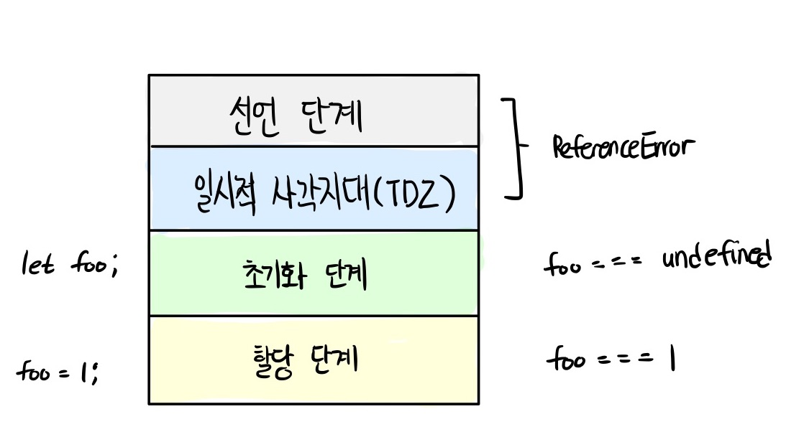
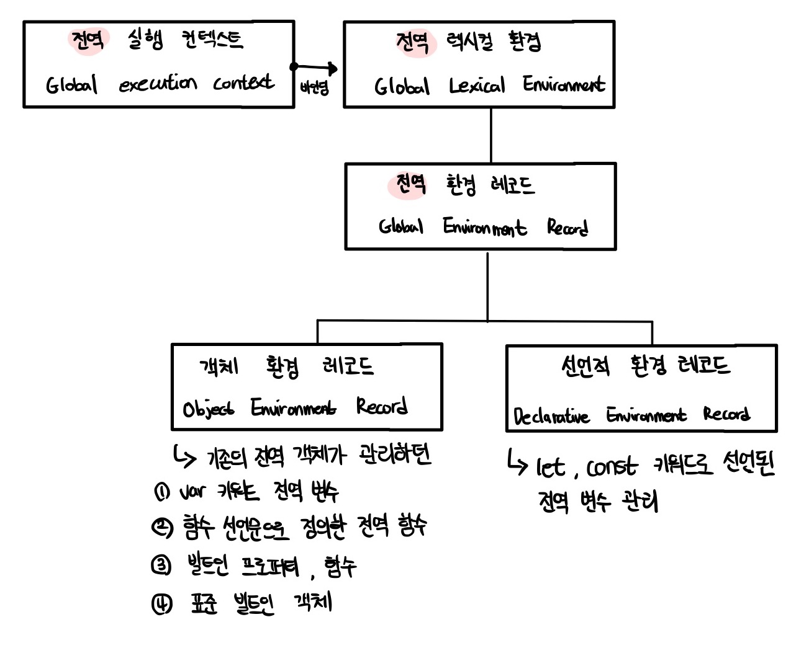
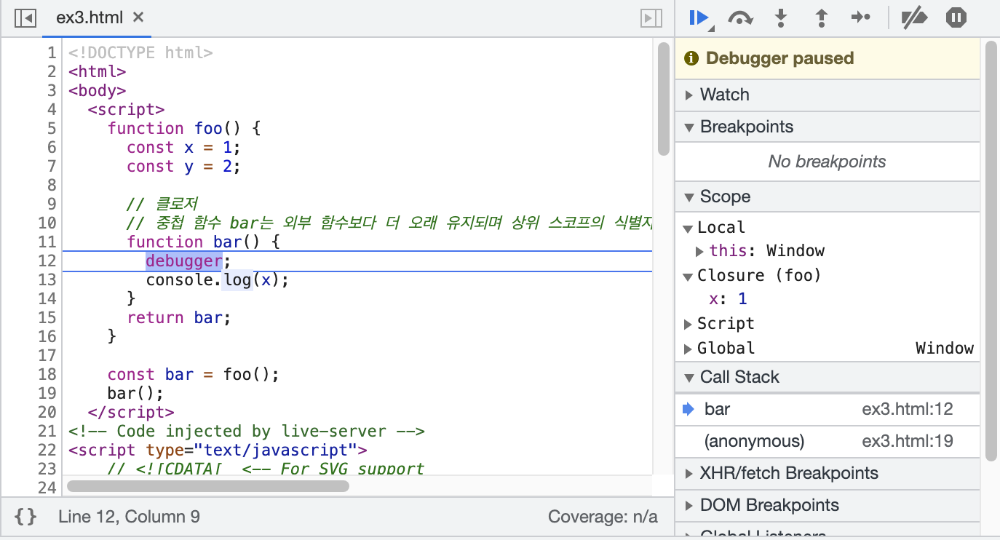
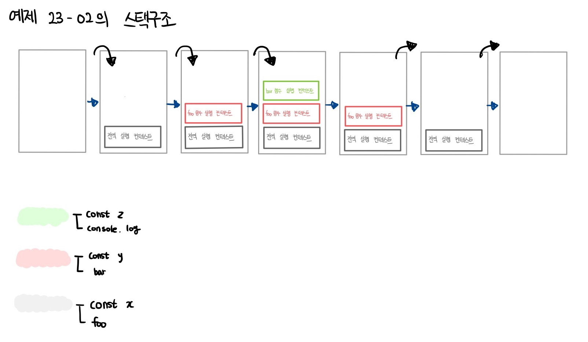
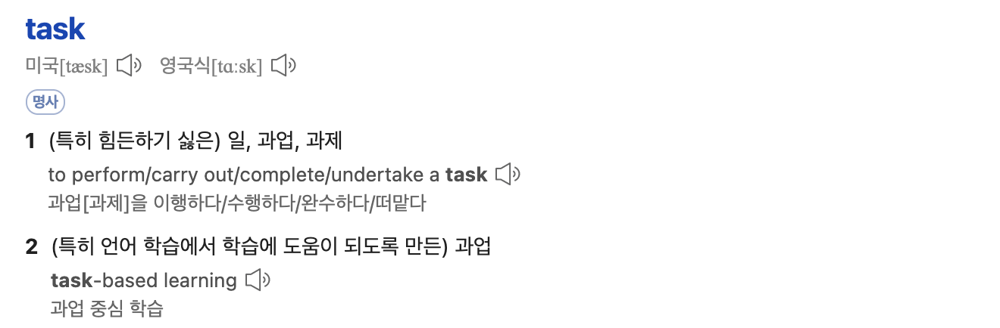
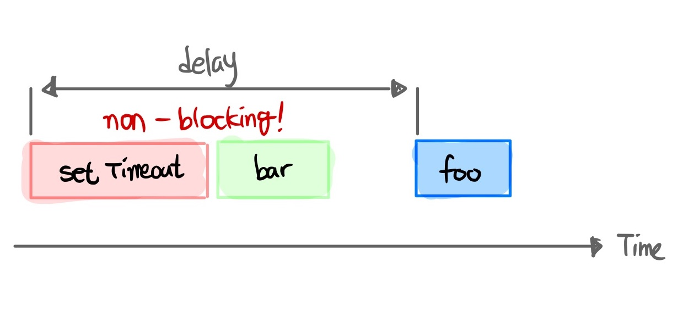
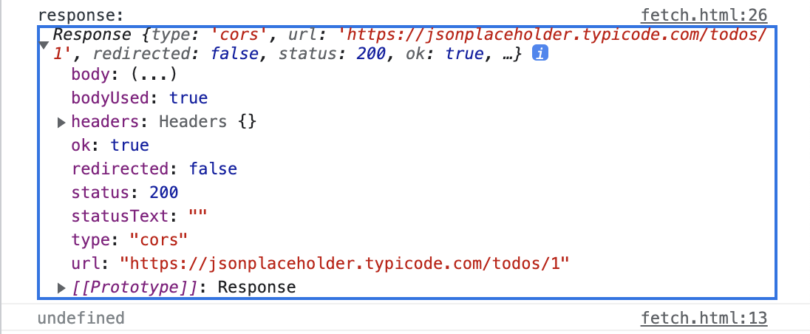
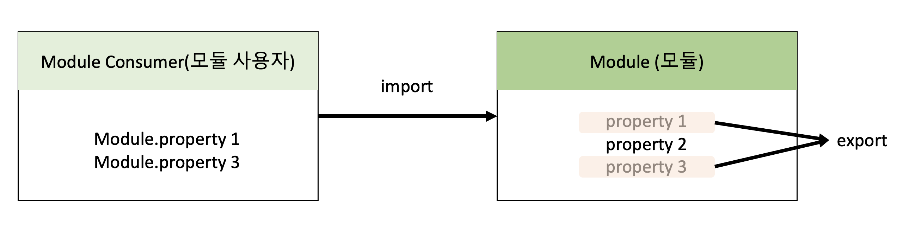

# prepare_frontend_interview

## JavaScript

<b>프론트엔드 기술 면접을 위한 핸드북 만들기</b>

면접의 인터뷰어 분들이 JS의 수 많은 개념들을 순서대로 질문을 하지는 않습니다.

하지만 자바스크립트의 연관되어 있는 개념들을 순서대로 나열하고 핸드북 형식으로 보다 보면,

모르는 개념을 파악하고 한눈에 보는 것에 있어서 도움이 되지 않을까 싶어 제작하게 되었습니다.

목차는 모던 자바스크립트 deep dive를 기준으로 제작하였고 자세한 정리 내용은

[링크](https://github.com/junh0328/upgrade_javascript) 클릭 시에 해당 레포지토리에서 볼 수 있습니다.

질문에 대한 3-5줄 정도의 짧은 길이로 핵심 키워드를 체크하고 헷갈리는 용어들을 반복적으로 보게 됨으로써, 핵심 키워드를 기억할 수 있도록 만드는 것이 목표입니다!

## 목차

- [프로그래밍 🔥](#프로그래밍)

  - 프로그래밍이란 뭐라고 생각하나요?
  - 컴파일러는 뭐고 인터프리터는 뭔가요? 🔥

- [자바스크립트란 🔥](#자바스크립트란)

  - 자바스크립트의 특징은 뭐가 있나요?

- [변수 🔥](#변수)

  - 변수란 무엇인가요?
  - 식별자란 무엇인가요? 🔥
  - 변수를 선언한다는 것은 어떤 것을 의미하나요?
  - var 키워드는 뭔가요?
  - 호이스팅이 뭔가요? 🔥🔥
  - var 키워드의 문제점은 무엇이 있나요? 🔥
  - let 키워드는 var 키워드와 어떤 점이 다른가요? 🔥🔥
  - TDZ 🔥🔥
  - const 키워드는 어떤 특징이 있나요? 🔥
  - 식별자 네이밍 규칙은 어떤 것들이 있나요?
  - 네이밍 컨벤션은 어떤 것들이 있나요?
  - 리터럴이 뭔가요?

- [데이터 타입 🔥](#데이터-타입)

  - 데이터 타입의 종류는 어떤 것들이 있나요? 🔥
  - 심벌 타입은 뭐죠?
  - 데이터 타입은 왜 필요할까요? 🔥
  - 정적 타이핑이 뭔가요?
  - 동적 타이핑이 뭔가요?

- [타입변환과 단축 평가 🔥](#타입변환과-단축-평가)

  - 명시적 타입 변환이 뭔가요?
  - 명시적 타입 변환 함수를 예를 들어볼 수 있나요?
  - 암묵적 타입 변환이 뭔가요?
  - truthy / falsy 한 값이 뭔가요?

- [배열 🔥](#배열)

  - 자바스크립트의 배열은 자료구조의 배열과 같나요?
  - 배열의 메서드는 어떤 종류가 있나요?
  - 고차 함수에 대해서 아나요?
  - forEach 메서드와 map메서드의 차이점에 대해 알고 있나요?

- [객체 리터럴 🔥](#객체-리터럴)

  - 자바스크립트에서 객체란 뭘까요?
  - 함수와 메서드의 차이점에 대해 알고 계신가요?
  - 자바스크립트에서 객체를 생성하는 방법은 어떤 것들이 있나요?

- [원시 값과 객체 비교 🔥](#원시-값과-객체-비교)

  - 동적 타이핑을 지원하는 자바스크립트에서 데이터의 타입을 크게 2개로 나누는 이유가 있을까요? 🔥
  - 값에 의한 전달이 뭔가요? 🔥
  - 참조에 의한 전달이 뭔가요? 🔥

- [함수 🔥](#함수)

  - 자바스크립트에서 함수를 정의하는 방법은 몇가지가 있나요?
  - 함수 선언문과 함수 표현식은 어떤 차이가 있나요?
  - 즉시 실행 함수(IIFE)에 대해 알고 있나요? 알고 있다면 아는 내용에 대해 말해보세요

- [스코프 🔥](#스코프)

  - 스코프가 뭔가요? 🔥🔥
  - 스코프에는 어떤 종류가 있죠? 🔥
  - 렉시컬 스코프를 아나요? 안다면 렉시컬 스코프는 무엇을 의미하나요? 🔥
  - 전역 변수로 변수를 선언하면 생기는 문제점은 무엇이 있을까요?

- [생성자 함수에 의한 객체 생성 🔥](#생성자-함수에-의한-객체-생성)

  - 생성자 함수가 뭔가요?
  - 객체 리터럴로 만들 때와는 무슨 차이가 있죠? 왜 생성자 함수를 사용하나요?
  - 생성자 함수가 객체(인스턴스)를 생성하는 과정에 대해 간략하게 설명해줄 수 있나요?

- [함수와 일급 객체 🔥](#함수와-일급-객체)

  - 일급 객체가 뭔가요?
  - 자바스크립트에서 함수가 일급 객체라면, 일급 객체로 뭘 할 수 있나요?
  - 꼬리 질문) 함수형 프로그래밍이 뭔가요? 🔥
  - 꼬리 질문) 순수 함수가 뭔가요? 일반 함수와는 어떤 차이가 있죠? 🔥

- [프로토타입 🔥](#프로토타입)

  - 객체지향 프로그래밍은 무엇을 의미하나요? 🔥
  - 객체지향 프로그래밍의 특징에 대해 말해볼 수 있나요? 🔥
  - 자바스크립트는 객체지향 프로그래밍 언어인가요?
  - 프로토타입이 뭔가요?

- [strict mode 🔥](#strict-mode)

  - strict mode가 뭔가요?
  - strict mode를 통해 무엇을 예방할 수 있죠?

- [빌트인 객체 🔥](#빌트인-객체)

  - 빌트인 객체가 뭔가요?
  - 빌트인 객체의 종류는 어떤게 있죠?
  - 래퍼 객체에 대해서 알고 있나요?

- [this 🔥](#this)

  - this가 뭔가요? 🔥
  - this 바인딩이란? 🔥
  - this는 동적으로 바인딩이 된다고 하는데 바인딩되는 객체가 어떻게 다르나요?

- [실행 컨텍스트 🔥](#실행-컨텍스트)

  - 실행 컨텍스트에 대해 말해보세요 🔥🔥

- [클로저 🔥](#클로저)

  - 클로저에 대해서 아나요? 🔥🔥
  - 클로저를 사용하면 뭐가 좋죠? 🔥
  - 클로저를 어떻게 생성하나요? 🔥

- [클래스 🔥](#클래스)

  - 자바스크립트에서 클래스가 생기기 전에는 어떤 방식으로 객체지향 패턴을 구현했나요?
  - 그럼 생성자 함수와 클래스는 어떤 차이가 있나요?
  - 클래스 정의
  - 클래스의 상속

- [스프레드 문법 🔥](#스프레드-문법)

  - spread 문법이 뭔가요?
  - 어떤 상황에서 사용할 수 있죠?

- [구조 분해 할당 🔥](#구조-분해-할당)

  - 구조 분해 할당이 뭔가요?
  - 구조 분해 할당은 크게 어떤 종류가 있나요?

- [브라우저 렌더링 과정 🔥](#브라우저-렌더링-과정)

  - 브라우저의 렌더링 과정에 대해 설명해보세요 🔥
  - 브라우저의 렌더링 과정에 자바스크립트는 어떻게 동작하나요? 🔥
  - `<script></script>` 태그를 `<body></body>` 태그 밑에 둬야하는 이유가 있을까요?

- [DOM 🔥](#DOM)

  - DOM이 뭔가요?
  - DOM을 구성하는 건 뭐가 있나요?

- [이벤트 🔥](#이벤트)

  - 마우스 이벤트 타입에는 뭐가 있나요? click 말고 클릭을 대체할 수 있는 이벤트가 있나요?
  - 그 외에 알고 있는 대표적인 이벤트가 있나요?
  - 이벤트 핸들러를 등록하는 방식에는 어떤 것들이 있나요?
  - 이벤트 전파(propagation)에 대해서 알고 있나요?
  - 이벤트 위임(delegation)에 대해서 알고있나요? 🔥
  - e.preventDefault 에 대해 알고 있나요?
  - e.stopPropagation

- [타이머 🔥](#타이머)

  - 호출 스케쥴링이 무엇인가요?
  - 타이머 함수에는 어떤 것들이 있나요?
  - 이벤트가 과도하게 호출되어 성능에 문제를 일으킬 경우에 할 수 있는 어떤 일을 통해 해결할 수 있나요?
  - 디바운스에 대해서 알고 있나요?
  - 쓰로틀에 대해서 알고 있나요?

- [비동기 프로그래밍 🔥](#비동기-프로그래밍)

  - 동기와 비동기의 차이점에 대해서 설명해줄 수 있나요? 🔥

    - 한줄 요약

  - 이벤트 루프와 태스크 큐에 대해서 알고 있나요? 🔥🔥
  - 마이크로태스크 큐에 대해서 알고 있나요? 🔥
  - 태스크 큐와 마이크로태스크 큐 중 어떤 것이 먼저 실행되나요? 🔥

- [Ajax 🔥](#Ajax)

  - Ajax가 뭔가요 어떤 것을 담당하고 있죠?
  - Ajax를 사용하면 기존 방식과 어떤 차이가 있을까요?
  - JSON 이 뭔가요?
  - JSON이 제공하는 정적 프로토타입 메서드에 대해 몇가지 말해볼 수 있나요?
  - Ajax로 HTTP 요청을 보내기 위해서는 어떤 방법을 사용할 수 있나요?
  - XMLHttpRequest와 fetch 메서드의 차이는 무엇이라고 생각하시나요? 🔥

- [REST API 🔥](#REST-API)

  - REST API가 뭔가요?
  - REST API의 구성은 어떤 것이 있나요?
  - REST API를 설계하는데 중요한 것이 있을까요?
  - HTTP 요청 메서드에 대해서 아는대로 얘기해보세요
  - HTTP 상태 코드를 아는대로 말해주세요 🔥

- [Promise 🔥](#Promise)

  - 콜백이란 뭐라고 생각하나요? 🔥
  - 프로미스가 뭔가요? 🔥
  - 프로미스 생성 방법
  - 프로미스의 상태를 나타내는 것은 어떤 것들이 있나요? 🔥
  - 프로미스 빌트인 객체가 제공하는 정적 메서드에 대해 알고 있나요? 🔥

- [제너레이터와 async await 🔥](#제너레이터와-async-await)

  - 제너레이터란 뭔가요? 일반 함수와는 어떤 차이가 있죠?
  - 제너레이터의 구조
  - async/await 가 뭔가요? 기존의 Promise와는 어떤 차이가 있죠? 🔥
  - Promise와 async/await의 차이점 한 줄 요약 🔥

- [에러 🔥](#에러)

  - 에러처리를 왜 해야 하나요?
  - 자바스크립트에서 에러를 처리하는 방법에는 뭐가 있을까요?

- [모듈 🔥](#모듈)

  - 모듈이 뭔가요?

## 프로그래밍

### 프로그래밍이란 뭐라고 생각하나요?

프로그래밍이란 컴퓨터에게 실행을 요구하는 일종의 커뮤니케이션이다.해결해야 할 문제(요구사항)를 명확히 이해한 후 적절한 문제 해결 방안을 정의할 필요가 있다.0과 1밖에 알지 못하는 기계가 실행할 수 있을 정도로 정확하고 상세하게 요구를 설명하는 작업이며, 그 결과물이 바로 코드다.

<br/>

### 컴파일러는 뭐고 인터프리터는 뭔가요?

우리가 코드를 통해 내린 명령을 수행할 주체는 컴퓨터이다. 따라서 사람이 이해할 수 있는 자연어가 아니라 컴퓨터가 이해할 수 있는 언어, 즉 기계어로 명령을 전달해야 한다.

기계어는 우리가 사용하는 언어와는 너무나도 체계가 다르기 때문에 사람이 기계어로 직접 명령을 전달하는 것은 매우 어렵다. 기계어로 직접 명령을 전달하는 것을 대신할 가장 유용한 대안은 사람이 애해할 수 있는 약속된 구문으로 구성된 프로그래밍 언어를 사용해 프로그램을 작성한 후, 그것을 컴퓨터가 이해할 수 있는 기계어로 변환하는 일종의 번역기를 이용하는 것이다.

이 일종의 번역기를 컴파일러(compiler) 혹은 인터프리터(interpreter)라고 한다.

```
compile:변환하다
interpret:해석하다
```

## 자바스크립트란

### 자바스크립트의 특징은 뭐가 있나요?

자바스크립트는 HTML, CSS와 함께 웹을 구성하는 요소 중 하나로 웹 브라우저에서 동작하는 유일한 프로그래밍 언어다.

자바스크립트는 개발자가 별도의 컴파일 작업을 수행하지 않는 **인터프리터 언어이다.** **인터프리터는 소스코드를 즉시 실행하고** **컴파일러는 빠르게 동작하는 머신 코드를 생성하고 최적화한다.** 이를 통해 컴파일 단계에서 추가적인 시간이 필요함에도 더욱 빠르게 코드를 실행할 수 있다.

자바스크립트는 **런타임에 컴파일되며 실행 파일이 생성되지 않고 인터프리터의 도움 없이 실행할 수 없기 때문에 컴파일러 언어라고 할 수는 없다.**

## 변수

### 변수란 무엇인가요?

변수는 하나의 값을 저장하기 위해 확보한 메모리 공간 자체 또는 그 메모리 공간을 식별하기 위해 붙인 이름을 말한다.

<br/>

### 식별자는 무엇인가요?

변수의 이름을 식별자(identifier)라고도 한다. 식별자는 어떤 값을 구별해서 식별할 수 있는 고유한 이름을 말한다. **식별자는 값이 아니라 메모리 주소를 기억하고 있다.**

또한 식별자라는 용어는 변수 이름에만 국한해서 사용하지 않는다. 예를 들어, 변수, 함수, 클래스 등의 이름은 모두 식별자다. 식별자인 변수 이름으로는 메모리 상에 존재하는 변수 값을 식별할 수 있고, 함수 이름으로는 메모리 상에 존재하는 함수를 식별할 수 있다. **즉, 메모리 상에 존재하는 어떤 값을 식별할 수 있는 이름은 모두 식별자라고 부른다.**

<br/>

### 변수를 선언한다는 것은 어떤 것을 의미하나요?

```js
var score;
```

변수 선언이란 **변수를 생성하는 것**을 말한다. 좀 더 자세히 말하면 **값을 저장하기 위한 메모리 공간을 확보하고 변수 이름과 확보된 메모리 공간의 주소를 연결해서 값을 저장할 수 있게 준비하는 것이다.** 변수를 사용하려면 반드시 선언이 필요하다. 변수를 선언할 때는 var, let, const 키워드를 사용한다.

<br/>

### var 키워드는 뭔가요?

var 키워드는 뒤에 오는 변수 이름을 새로운 변수를 선언할 것을 지시하는 키워드이다. 키워드는 자바스크립트 코드를 해석하고 실행하는 자바스크립트 엔진이 수행할 동작을 규정한 일종의 명령어이다. 자바스크립트 엔진은 키워드를 만나면 자신이 수행해야 할 약속된 동작을 수행한다. 예를 들어, var 키워드를 만나면 자바스크립트 엔진은 뒤에 오는 변수 이름으로 새로운 변수를 선언한다.

변수를 선언한 이후, 아직 변수에 값을 할당하지 않았다. 따라서 변수 선언에 의해 확보된 메모리 공간은 비어 있을 것으로 생각할 수 있으나 확보된 메모리 공간에는 자바스크립트 엔진에 의해 undefined라는 값이 암묵적으로 할당되어 초기화된다. 이것이 자바스크립트의 독특한 특징이다.

<br/>

### 호이스팅이 뭔가요?

```js
console.log(score); // undefined;

var score; // 변수 선언문
```

js 엔진은 변수 선언(을 포함한 모든 선언문)이 소스코드의 어디에 있든 상관없이 다른 코드보다 먼저 실행한다. 런타임 이전에 실행 컨텍스트에 의해 소스코드 평가 과정에서 스코프에 등록되고 이를 마치 코드의 제일 위에 있는 것처럼 변수가 어디에 위치하던지와 상관없이 어디서든지 변수를 참조할 수 있는 것처럼 만드는 특징을 변수 호이스팅이라고 합니다.

**사실 변수 선언뿐 아니라 var, let, const, function, function\*, class 키워드를 사용해서 선언하는 모든 식별자(변수, 함수, 클래스 등)는 호이스팅된다. 모든 선언문은 런타임 이전 단계에서 먼저 실행되기 때문이다.**

<br/>

### var 키워드의 문제점은 무엇이 있나요?

var 키워드로 선언된 변수는 다음과 같은 특징이 있다.

1. 변수 중복 선언 허용
2. 함수 레벨 스코프
3. 변수 호이스팅

<details>
<summary>① 변수 중복 선언 허용</summary>

var 키워드로 선언된 변수는 같은 스코프 내에서 중복 선언이 허용되는데, 이는 의도치 않게 변수값이 재할당되어 변경되는 부작용을 발생시킨다.

```js
function foo() {
  var x = 1;
  // var 키워드로 선언된 변수는 같은 스코프 내에서 중복 선언을 허용한다.
  // 아래 변수 선언문은 자바스크립트 엔진에 의해 var 키워드가 없는 것처럼 동작한다.
  var x = 2;
  console.log(x); // 2
}
foo();
```

</details>

<details>
<summary>② 함수 레벨 스코프</summary>

대부분의 프로그래밍 언어는 함수 몸체만이 아니라 모든 코드 블록(if, for, while, try/catch 등)이 지역 스코프를 만든다. 이러한 특성을 **블록 레벨 스코프**라 한다. 하지만 var 키워드로 선언된 변수는 오로지 함수의 코드 블록(함수 몸체)만을 지역 스코프로 인정한다. 이러한 특성을 **함수 레벨 스코프**라 한다.

```js
case 1 : var 키워드로 변수 선언

var x = 1;

if (true) {
  // var 키워드로 선언된 변수는 함수의 코드 블록(함수 몸체)만을 지역 스코프로 인정한다.
  // 함수 밖에서 var 키워드로 선언된 변수는 코드 블록 내에서 선언되었다 할지라도 모두 전역 변수다.
  // 따라서 x는 전역 변수다. 이미 선언된 전역 변수 x가 있으므로 x 변수는 중복 선언된다.
  // 이는 의도치 않게 변수 값이 변경되는 부작용을 발생시킨다.
  var x = 10;
}
console.log(x); // 10


case 2 : var 키워드로 for문 안의 변수 선언

var i = 10;

// for 문에서 선언한 i는 전역 변수다. 이미 선언된 전역 변수 i가 있으므로 중복 선언된다.
for (var i = 0; i < 5; i++) {
  console.log(i); // 0 1 2 3 4
}

// 의도치 않게 변수의 값이 변경되었다.
console.log(i); // 5
```

</details>

<details>
<summary>③ 변수 호이스팅</summary>

var 키워드로 선언된 변수는 선언과 동시에 undefined로 초기화되며, 런타임 즉 소스코드 평가 단계에서 스코프에 등록되기 때문에 실행 단계에서 실제 값이 할당되지 않더라도 undefined를 가지고있다. 이를 변수 호이스팅이라 한다.

```js
console.log(score); // undefined;

var score; // 변수 선언문
```

</details>

<br/>

### let 키워드는 var 키워드와 어떤 점이 다른가요?

let 키워드는 var 키워드의 단점을 보완하기 위해 ES6에서 도입된 새로운 키워드입니다.

```
1. 변수 중복 선언 금지
2. 블록 레벨 스코프
3. 변수 호이스팅
4. 전역 객체와 let
```

<b>1. 변수 중복 선언 금지</b>

var 키워드로 이름이 동일한 변수를 중복 선언하면 아무런 에러가 발생하지 않는다. 이때 변수를 중복 선언하면서 값까지 할당했다면 의도치 않게 먼저 선언된 변수 값이 재할당되어 변경되는 부작용이 발생한다. 하지만 let 키워드로 이름이 같은 변수를 중복 선언하면 문법 에러(SyntaxError)가 발생한다.

```js
let bar = 123;
// let이나 const 키워드로 선언된 변수는 같은 스코프 내에서 중복 선언을 허용하지 않는다.
let bar = 456; // SyntaxError: Identifier 'bar' has already been declared
```

<b>2. 블록 레벨 스코프</b>

let 키워드를 통해 선언된 변수는 블록 레벨 스코프를 따른다. 함수 뿐만 아니라 모든 코드 블록 내에 선언된 변수(지역 변수)는 해당 유효 범위(스코프)를 벗어나면 사용할 수 없다.

```js
let foo = 1; // 전역 변수

{
  let foo = 2; // 지역 변수
  let bar = 3; // 지역 변수
}

console.log(foo); // 1
console.log(bar); // ReferenceError: bar is not defined
```

<b>3. 변수 호이스팅</b>

var 키워드로 선언한 변수와 달리 let 키워드로 선언한 변수는 변수 호이스팅이 발생하지 않는 것처럼 동작한다.

```js
console.log(foo); // Cannot access 'foo' before initialization
let foo;
```

var 키워드였다면 변수 호이스팅에 의해 런타임 이전에 변수가 선언되어 undefined를 출력해야 한다. 하지만 let 키워드에서는 참조에러가 나타난다.

let 키워드로 선언한 변수는 '선언 단계'와 '초기화 단계'가 분리되어 진행된다. 즉, 런타임 이전에 자바스크립트 엔진에 의해 암묵적으로 선언 단계가 먼저 실행되지만 초기화 단계는 변수 선언문에 도달했을 때 실행된다. 만약 초기화 단계가 실행되기 이전에 변수에 접근하려고 하면 참조 에러가 발생한다.

let 키워드로 선언한 변수는 스코프의 시작 지점부터 초기화 단계 시작 지점(변수 선언문)까지 변수를 참조할 수 없다. 스코프의 시작 지점부터 초기화 시작 지점까지 변수를 참조할 수 없는 구간을 **일시적 사각지대(TDZ: Temporal Dead Zone)** 라 부른다.



```js
// 런타임 이전에 선언 단계가 실행된다. 아직 변수가 초기화되지 않았다.
// 초기화 이전의 일시적 사각 지대에서는 변수를 참조할 수 없다.
console.log(foo); // ReferenceError: foo is not defined

let foo; // 변수 선언문에서 초기화 단계가 실행된다.
console.log(foo); // undefined

foo = 1; // 할당문에서 할당 단계가 실행된다.
console.log(foo); // 1
```

<b>4. 전역 객체와 let</b>

let 키워드로 선언한 전역 변수는 전역 객체의 프로퍼티가 아니다. 즉, window.foo와 같이 접근할 수 없다.

```js
let x = 1;

// let, const 키워드로 선언한 전역 변수는 전역 객체 window의 프로퍼티가 아니다.
console.log(window.x); // undefined
console.log(x); // 1
```

<br/>

### const 키워드는 어떤 특징이 있나요?

const 키워드는 상수(constant)를 선언하기 위해 사용하지만, 반드시 상수만을 위해 사용하지는 않는다. const 키워드의 특징은 let과 대부분 동일하므로 let 키워드와 다른 점을 중심으로 살펴볼 필요가 있다.

```
1. 선언과 초기화
2. 재할당 금지
3. 상수
```

<b>1. 선언과 초기화</b>

const 키워드로 선언한 변수는 반드시 선언과 동시에 초기화해야 한다. 그렇지 않을 경우 문법 에러(SyntaxError)가 발생한다.

```js
const bar = 1;
console.log(bar); >>> 1

const foo;
console.log(foo); >>> // SyntaxError: Missing initializer in const declaration
```

<b>2. 재할당 금지</b>

var 또는 let 키워드로 선언한 변수는 재할당이 자유로우나 const 키워드로 선언한 변수는 재할당이 금지된다.

```js
const foo = 1;
foo = 2; // TypeError: Assignment to constant variable.
```

<b>3. 상수</b>

const 키워드로 선언한 변수에 원시 값을 할당한 경우 변수 값을 변경할 수 없다. 원시 값은 변경 불가능한 값이므로 재할당 없이 값을 변경할 수 있는 방법이 없기 때문이다. 이러한 특징을 이용해 const 키워드를 상수를 표현하는 데 사용하기도 한다.

```js
// 세율을 의미하는 0.1은 변경할 수 없는 상수로서 사용될 값이다.
// 변수 이름을 대문자로 선언해 상수임을 명확히 나타낸다.
const TAX_RATE = 0.1;

// 세전 가격
let preTaxPrice = 100;

// 세후 가격
let afterTaxPrice = preTaxPrice + preTaxPrice * TAX_RATE;

console.log(afterTaxPrice); // 110
```

<br/>

### 한 줄 요약

|           var 키워드           | let 키워드  |     const 키워드     |
| :----------------------------: | :---------: | :------------------: |
| 선언 및 초기화 단계(undefined) |  선언 단계  | 선언 + 초기화 + 할당 |
|           할당 단계            | 초기화 단계 |                      |
|               -                |  할당 단계  |                      |

### 식별자 네이밍 규칙은 어떤 것들이 있나요?

식별자는 특수문자를 제외한 문자, 숫자, 언더스코어(\_), 달러 기호($)를 포함할 수 있다.

단 식별자는 특수문자를 제외한 문자, 언더스코어(\_), 달러 기호로 시작해야 한다. 숫자로 시작하는 것은 허용하지 않는다.

<br/>

### 네이밍 컨벤션은 어떤 것들이 있나요?

```js
// 카멜 케이스 (camelCase)
var firstName;

// 스네이크 케이스 (snake_case)
var first_name;

// 파스칼 케이스 (PascalCase)
var FirstName;

// 헝가리언 케이스 (typeHungarianCase)
var strFirstName; // type + identifier
var $elem = document.getElementById("myId"); // DOM 노드
var observable$ = fromEvent(document, "click"); // RxJS 옵저버블
```

<br/>

### 리터럴이 뭔가요?

리터럴(literal)은 사람이 이해할 수 있는 문자 또는 약속된 기호를 사용해 값을 생성하는 표기법(=notation) 을 말합니다.

```
<!-- 숫자 리터럴 3 -->
3
```

위 예제의 3은 단순한 아라비아 숫자가 아니라 숫자 리터럴이다. 사람이 이해할 수 있는 아라비아 숫자를 사용해 숫자 리터럴 3을 코드에 기술하면 자바스크립트 엔진은 이를 평가해 숫자 값 3을 생성한다. 자바스크립트 엔진은 코드가 실행되는 시점인 런타임에 리터럴을 평가해 값을 생성한다.

## 데이터 타입

### 데이터 타입의 종류는 어떤 것들이 있나요?

|   구분    |     데이터 타입     |                        설명                         |
| :-------: | :-----------------: | :-------------------------------------------------: |
| 원시 타입 |  숫자(number)타입   | 숫자, 정수와 실수 구분 없이 하나의 숫자 타입만 존재 |
| 원시 타입 | 문자열(string)타입  |                       문자열                        |
| 원시 타입 | 불리언(boolean)타입 |            논리적 참(true)과 거짓(false)            |
| 원시 타입 |    undefined타입    |  var 키워드로 선언된 변수에 암묵적으로 할당되는 값  |
| 원시 타입 |      null 타입      |  값이 없다는 것을 의도적으로 명시할 때 사용하는 값  |
| 원시 타입 |  심벌(symbol) 타입  |              ES6에서 추가된 7번째 타입              |
| 원시 타입 |     BigInt 타입     | 길이의 제약 없이 정수를 다룰 수 있게 해주는 숫자형  |
| 객체 타입 |                     |                 객체, 함수, 배열 등                 |

<details>
<summary>BigInt 타입 레퍼런스</summary>

- [MDN: 원시 값](https://developer.mozilla.org/ko/docs/Glossary/Primitive)
- [MDN: BigInt](https://developer.mozilla.org/en-US/docs/Web/JavaScript/Reference/Global_Objects/BigInt)
- [javascript tutorial](https://www.javascripttutorial.net/javascript-data-types/)

</details>

<br/>

### 심벌 타입은 뭐죠?

심벌은 ES6에서 추가된 7번째 타입으로, 변경 불가능한 원시 타입의 값이다. 심벌 값은 다른 값과 중복되지 않는 유일무이한 값이다. 따라서 주로 이름이 충동할 위험이 없는 객체의 유일한 프로퍼티 키를 만들기 위해 사용한다.

```js
// 위, 아래, 왼쪽, 오른쪽을 나타내는 상수를 정의한다.
// 중복될 가능성이 없는 심벌 값으로 상수 값을 생성한다.
const Direction = {
  UP: Symbol("up"),
  DOWN: Symbol("down"),
  LEFT: Symbol("left"),
  RIGHT: Symbol("right"),
};

const myDirection = Direction.UP;

if (myDirection === Direction.UP) {
  console.log("You are going UP.");
}
```

<br/>

### 데이터 타입은 왜 필요할까요?

1. 값을 저장할 때 확보해야 하는 메모리 공간의 크기를 결정하기 위해
2. 값을 참조할 때 한 번에 읽어 들여야 할 메모리 공간의 크기를 결정하기 위해
3. 메모리에서 읽어 들인 2진수를 어떻게 해석할지 결정하기 위해

<br/>

### 정적 타이핑이 뭔가요?

C나 자바 같은 정적 타입언어는 변수를 선언할 때 변수에 할당할 수 있는 값의 종류, 즉 데이터 타입을 사전에 선언해야 한다. 이를 명시적 타입 선언이라 한다. 다음은 C에서 정수 타입의 변수를 선언하는 예이다.

```
// c 변수에는 1바이트 정수 타입의 값(-128 ~ 127)만을 할당할 수 있다.
char c;

// num 변수에는 4바이트 정수 타입의 값(-2,124,483,648 ~ 2,124,483,647)만을 할당할 수 있다.
int num;
```

정적 타입 언어는 변수의 타입을 변경할 수 없으며, 변수에 선언한 타입에 맞는 값만 할당할 수 있다. 정적 타입 언어는 컴파일 시점에서 타입 체크를 수행한다. 만약 타입 체크를 통과하지 못했다면 에러를 발생시키고 프로그램의 실행 자체를 막는다. 대표적인 정적 타입 언어로 C, C++, 자바, 코틀린, 고, 러스트 등이 있다.

<br/>

### 동적 타이핑이 뭔가요?

자바스크립트는 정적 타입 언어와 다르게 변수를 선언할 때 타입을 선언하지 않는다. 다만 var, let, const 키워들 사용해 변수를 선언할 뿐이다.

```js
var foo;
console.log(typeof foo); // undefined

foo = 3;
console.log(typeof foo); // number

foo = null;
console.log(typeof foo); // object

foo = Symbol(); // 심벌
console.log(typeof foo); // symbol

foo = {}; // 객체
console.log(typeof foo); // object

foo = []; // 배열
console.log(typeof foo); // object

foo = function () {}; // 함수
console.log(typeof foo); // function
```

자바스크립트의 변수는 선언이 아닌 할당에 의해 타입이 결정 **(타입 추론)** 된다. 그리고 **재할당에 의해 변수의 타입은 언제든지 동적으로 변할 수 있다.** 이러한 특징을 동적 타이핑이라고 하며, 자바스크립트를 정적 타입 언어와 구별하기 위해 동적 타입 언어라고 한다. 대표적인 동적 타입 언어로는 자바스크립트, 파이썬, PHP 등이 있다.

## 타입변환과 단축 평가

### 명시적 타입 변환이 뭔가요?

자바스크립트의 모든 값은 타입이 있다. 값의 타입은 개발자의 의도에 따라 다른 타입으로 변환할 수 있다. 개발자가 의도적으로 값의 타입을 변환하는 것을 **명시적 타입 변환 또는 타입 캐스팅**이라 한다.

```js
var x = 10;

// 숫자를 문자열로 타입 캐스팅한다.
var str = x.toString();
console.log(typeof str, str); // string 10

// x 변수의 값이 변경된 것은 아니다.
console.log(typeof x, x); // number 10
```

<br/>

### 명시적 타입 변환 함수를 예를 들어볼 수 있나요?

문자열이 아닌 값을 문자열 타입으로 변환하는 방법

1. String 생성자 함수를 new 연산자 없이 호출하는 방법
2. Object.prototype.toString 메서드를 사용하는 방법
3. 문자열 연결 연산자를 이용하는 방법

<details>

```js
// 1. String 생성자 함수를 new 연산자 없이 호출하는 방법
String(1); // -> "1"

// 2. Object.prototype.toString 메서드를 사용하는 방법
(1).toString(); // -> "1"

// 3. 문자열 연결 연산자를 이용하는 방법
1 + ""; // -> "1"
```

</details>

숫자 타입이 아닌 값을 숫자 타입으로 변환하는 방법

1. Number 생성자 함수를 new 연산자 없이 호출하는 방법
2. parseInt, parseFloat 함수를 사용하는 방법(문자열만 변환 가능)
3. `+` 단항 산술 연산자를 이용하는 방법
4. `*` 산술 연산자를 이용하는 방법

<details>

```js
// 1. Number 생성자 함수를 new 연산자 없이 호출하는 방법
Number("0"); // -> 0

// 2. parseInt, parseFloat 함수를 사용하는 방법(문자열만 변환 가능)
parseInt("0"); // -> 0

// 3. + 단항 산술 연산자를 이용하는 방법
+"0"; // -> 0

// 4. * 산술 연산자를 이용하는 방법
"0" * 1; // -> 0
```

</details>

불리언 타입이 아닌 값을 불리언 타입으로 변환하는 방법

1. Boolean 생성자 함수를 new 연산자 없이 호출하는 방법
2. ! 부정 논리 연산자를 두번 사용하는 방법

<details>

```js
// 1. Boolean 생성자 함수를 new 연산자 없이 호출하는 방법
// 문자열 타입 => 불리언 타입
Boolean("x"); // -> true
Boolean(""); // -> false
Boolean("false"); // -> true
// 숫자 타입 => 불리언 타입
Boolean(0); // -> false
Boolean(1); // -> true
Boolean(NaN); // -> false
Boolean(Infinity); // -> true
// null 타입 => 불리언 타입
Boolean(null); // -> false
// undefined 타입 => 불리언 타입
Boolean(undefined); // -> false
// 객체 타입 => 불리언 타입
Boolean({}); // -> true
Boolean([]); // -> true

// 2. ! 부정 논리 연산자를 두번 사용하는 방법
// 문자열 타입 => 불리언 타입
!!"x"; // -> true
!!""; // -> false
!!"false"; // -> true
// 숫자 타입 => 불리언 타입
!!0; // -> false
!!1; // -> true
!!NaN; // -> false
!!Infinity; // -> true
// null 타입 => 불리언 타입
!!null; // -> false
// undefined 타입 => 불리언 타입
!!undefined; // -> false
// 객체 타입 => 불리언 타입
!!{}; // -> true
!![]; // -> true
```

</details>

<br/>

### 암묵적 타입 변환이 뭔가요?

개발자의 의도와는 상관없이 표션식을 평가하는 도중에 자바스크립트 엔진에 의해 암묵적으로 타입이 자동 변환되기도 한다. 이를 **암묵적 타입 변환 또는 강제 타입 변환**이라 한다.

```js
var x = 10;

// 문자열 연결 연산자 ( + )는 숫자 타입 x의 값을 바탕으로 새로운 문자열을 생성한다.
var str = x + "";
console.log(typeof str, str); // string 10

// x 변수의 값이 변경된 것은 아니다.
console.log(typeof x, x); // number 10
```

<br/>

### truthy / falsy 한 값이 뭔가요?

자바스크립트 엔진은 불리언 타입이 아닌 값을 Truthy 값(참으로 평가되는 값) 또는 Falsy 값(거짓으로 평가되는 값)으로 구분한다. 즉, 제어문의 조건식과 같이 불리언 값으로 평가되어야 할 문맥에서 Truthy값은 true로, Falsy값은 false로 암묵적 타입 변환된다.

아래 값들은 false로 평가되는 Falsy 값이다.

```js
false
undefined
null
0, -0
NaN
' '(빈 문자열)
```

Falsy값에 ! 연산자를 붙이면, 모두 Truthy 값으로 평가되어 실행 가능해진다.

```js
// 아래의 조건문은 모두 코드 블록을 실행한다.
if (!false) console.log(false + " is falsy value");
if (!undefined) console.log(undefined + " is falsy value");
if (!null) console.log(null + " is falsy value");
if (!0) console.log(0 + " is falsy value");
if (!NaN) console.log(NaN + " is falsy value");
if (!"") console.log("" + " is falsy value");
```

## 배열

### 자바스크립트의 배열은 자료구조의 배열과 같나요?

자료구조에서 말하는 배열은 동일한 크기의 메모리 공간이 빈틈없이 연속적으로 나열된 자료구조를 말한다.

즉, 배열의 요소는 하나의 데이터 타입으로 통일되어 있으며 서로 연속적으로 인접해 있다. 이러한 배열은 밀집 배열(dense array)이라 한다.

자바스크립트의 배열은 지금까지 살펴본 자료구조에서 말하는 일반적인 의미의 배열과 다르다.

즉, 배열의 요소를 위한 각각의 메모리 공간은 동일한 크기를 갖지 않아도 되며, 연속적으로 이어져 있지 않을 수도 있다.

배열의 요소가 연속적으로 이어져 있지 않는 배열을 희소 배열(sparse array)이라 한다.

이처럼 자바스크립트의 배열(희소 배열)은 엄밀히 말해 일반적인 의미의 배열이 아니다. 자바스크립트의 배열은 일반적인 배열의 동작을 흉내 낸 특수한 객체다.

<br/>

### 배열의 메서드는 어떤 종류가 있나요?

배열은 크게 두 종류로 나눌 수 있다

- `① 원본 배열을 직접 변경하는 메서드 `

- `② 원본 배열을 직접 변경하지 않고 새로운 배열을 생성하여 반환하는 메서드`가 있다.

ES5부터 도입된 배열 메서드는 대부분 원본 배열을 직접 변경하지 않지만 초창기 배열 메서드는 원본 배열을 직접 변경하는 경우가 많다.

원본 배열을 직접 변경하는 메서드는 외부 상태를 직접 변경하는 부수효과가 있으므로 사용할 때 주의해야 한다.

가급적 원본 배열을 직접 변경하지 않는 메서드를 사용하는 편이 좋다.

```
Array.isArray 🌟
Array.prototype.indexOf 🌟
Array.prototype.push (원본 배열을 변경한다 - 부수효과 o)
Array.prototype.pop (원본 배열을 변경한다 - 부수효과 o)
Array.prototype.unshift (원본 배열을 변경한다 - 부수효과 o)
Array.prototype.shift (원본 배열을 변경한다 - 부수효과 o)
Array.prototype.concat 🌟
Array.prototype.splice 🌟 (원본 배열을 변경한다 - 부수효과 o)
Array.prototype.slice 🌟
Array.prototype.join 🌟 (원본 배열을 변경한다 - 부수효과 o)
Array.prototype.reverse 🌟 (원본 배열을 변경한다 - 부수효과 o)
Array.prototype.fill 🌟 (원본 배열을 변경한다 - 부수효과 o)
Array.prototype.includes 🌟

```

### 고차 함수에 대해서 아나요?

고차 함수(Higher-Order Function, HOF)는 함수를 인수로 전달받거나 함수를 반환하는 함수를 말한다.

자바스크립트의 함수는 일급 객체이므로 함수를 값처럼 인수로 전달할 수 있으며 반환할 수도 있다.

고차 함수는 외부 상태의 변경이나 가변(mutable) 데이터를 피하고 불변성(immutability)을 지향하는 함수형 프로그래밍에 기반을 두고 있다.

함수형 프로그래밍은 순수 함수와 보조 함수의 조합을 통해 로직 내에 존재하는 조건문과 반복문을 제거하여 복잡성을 해결하고 변수의 사용을 억제하여 상태 변경을 피하려는 프로그래밍 패러다임이다.

함수형 프로그래밍은 순수 함수를 통해 부수 효과를 최대한 억제하여 오류를 피하고 프로그램의 안정성을 높이려는 노력의 일환이라고 할 수 있다.

`대부분의 고차 함수들은 파라미터로 콜백 함수를 받아 사용되기 때문에 원본 배열을 바탕으로 하는 새로운 결과값을 창조하는데 사용된다`

```
Array.prototype.sort (원본 배열을 변경한다 - 부수효과 o)
Array.prototype.forEach
Array.prototype.map
Array.prototype.filter
Array.prototype.reduce
Array.prototype.some
Array.prototype.every
Array.prototype.find
```

### forEach 메서드와 map메서드의 차이점에 대해 알고 있나요?

#### forEach()

```js
// forEach 메서드는 콜백 함수를 호출하면서 3개(① 요소값 ② 인덱스 ③ this)의 인수를 전달한다.
[1, 2, 3].forEach((item, index, arr) => {
  console.log(`요소값: ${item}, 인덱스: ${index}, this: ${arr}`);
});

/*
요소값: 1, 인덱스: 0, this: [1,2,3]
요소값: 2, 인덱스: 1, this: [1,2,3]
요소값: 3, 인덱스: 2, this: [1,2,3]
*/
```

#### map()

```js
const numbers = [1, 4, 9];

// map 메서드는 numbers 배열의 모든 요소를 순회하면서 콜백 함수를 반복 호출한다.
// 그리고 콜백 함수의 반환값들로 구성된 새로운 배열을 반환한다.
const roots = numbers.map((item) => Math.sqrt(item));

// 위 코드는 다음과 같다.
// const roots = numbers.map(Math.sqrt);

// map 메서드는 새로운 배열을 반환한다
console.log(roots); // [ 1, 2, 3 ]
// map 메서드는 원본 배열을 변경하지 않는다
console.log(numbers); // [ 1, 4, 9 ]
```

`①forEach` 메서드와 `②map` 메서드의 공통점은 자신을 호출한 배열의 모든 요소를 순회하면서 인수로 전달받은 콜백 함수를 반복 호출한다는 것이다.

**하지만 `①forEach` 메서드는 언제나 undefined를 반환하고 `②map` 메서드는 콜백 함수의 반환값들로 구성된 새로운 배열을 반환한다는 것이다.**

즉 `forEach` 메서드는 **단순히 반복문을 대체하기 위한 고차 함수**이고 `Map` 메서드는 **요소값을 다른 값으로 매핑한 새로운 배열을 생성하기 위한 고차 함수**다.

map 메서드를 호출한 배열과 map 메서드가 생성하여 반환한 배열은 1:1 매핑한다.

forEach 메서드와 마찬가지로 map 메서드의 콜백 함수는 map 메서드를 호출한 배열의 요소값과 인덱스, map 메서드를 호출한 배열 자체, 즉 this를 순차적으로 받을 수 있다.

다시 말해, `① map` 메서드를 호출한 배열의 요소값 ② 인덱스 ③ 호출한 배열 자기 자신(this)를 순차적으로 전달한다.

## 객체 리터럴

### 자바스크립트에서 객체란 뭘까요?

자바스크립트는 객체 기반의 프로그래밍 언어이며, 자바스크립트를 구성하는 거의 '모든 것'이 객체다. 원시 값을 제외한 나머지 값(함수, 배열, 정규 표현식 등)은 모두 객체이다. 원시 타입은 단 하나의 값만 나타내지만 객체 타입은 다양한 타입의 값(원시 값 또는 다른 객체)을 하나의 단위로 구성한 복합적인 자료구조이다. 또한 원시 타입의 값, 즉 원시 값은 변경 불가능한 값이지만 객체 타입의 값, 즉 객체는 변경 가능한 값이다.

객체는 0개 이상의 프로퍼티로 구성된 집합이며, 프로퍼티는 키(key)와 값(value)으로 구성된다.

```js
var person = {
  name: "Lee",
  age: 20,
};
```

### 함수와 메서드의 차이점에 대해 알고 계신가요?

자바스크립트에서 사용할 수 있는 모든 값은 프로퍼티 값이 될 수 있다. **프로퍼티 값이 함수일 경우**, 일반 함수와 구분하기 위해 메서드(method)라 부른다. 객체 내부에서 객체의 프로퍼티(상태)를 참조하고 조작할 수 있는 동작을 메서드라 부른다.

즉, **메서드는 객체에 묶여 있는 함수를 의미한다.**

```js
var person = {
  name: "Lee",
  age: 20,
  hello: function () {
    console.log("hello :" + this.name);
  },
};

console.log(person);
>>>
{ name: 'Lee', age: 20, hello: [Function: hello] }
```

<br/>

### 자바스크립트에서 객체를 생성하는 방법은 어떤 것들이 있나요?

자바스크립트는 **'프로토타입 기반 객체지향 언어'** 로서 **'클래스 기반 객체지향 언어'** 와는 달리 다양한 객체 생성 방법을 지원한다.

```
1.객체 리터럴
2.Object 생성자 함수
3.생성자 함수
4.Object.create 메서드
5.클래스(ES6)
```

<br/>

### 전역 객체에 대해서 아나요?

- 전역 객체는 코드가 실행되기(런타임) 이전 단계에 자바스크립트 엔진에 의해 생성되는 특수한 객체다.
- 클라이언트 사이드 환경(브라우저)에서는 window, 서버 사이드 환경(Node.js)에서는 global 객체를 의미한다.
- 전역 객체는 표준 빌트인 객체(Object, String, Number, Function, Array...) 들과 환경에 따른 호스트 객체, 그리고 var 키워드로 선언한 전역 변수와 전역 함수를 프로퍼티로 갖늗다.

## 원시 값과 객체 비교

### 동적 타이핑을 지원하는 자바스크립트에서 데이터의 타입을 크게 2개로 나누는 이유가 있을까요?

1. 원시 타입의 값, 즉 원시 값은 변경 불가능한 값(immutable value)이다. 이에 비해 객체(참조)타입의 값, 즉 객체는 변경 가능한 값(mutable value)이다.

2. 원시 값을 변수에 할당하면 변수(확보된 메모리 공간)에는 실제 값(100, 실제로는 2진수)이 저장된다.
   이에 비해 객체를 변수에 할당하면 변수(확보된 메모리 공간)에는 참조 값(메모리 주소, 0x00000613)이 저장된다.

3. 원시 값을 갖는 변수를 다른 변수에 할당하면 원본의 원시 값이 복사되어 전달된다. 이를 값에 의한 전달이라 한다.
   이에 비해 객체를 가리키는 변수를 다른 변수에 할당하면 원본의 참조 값(메모리 주소, 0x00000613)이 복사되어 전달된다. 이를 참조에 의한 전달이라 한다.

<br/>

### 값에 의한 전달이 뭔가요?

변수에 원시 값을 갖는 변수를 할당하면 할당받는 변수(copy)에는 할당하는 변수(score)의 원시 값이 복사되어 전달된다. 이를 **'값에 의한 전달'** 이라 한다.

```js
var score = 80;

// copy 변수에는 score 변수의 값 80이 복사되어 할당된다.
var copy = score;

console.log(score, copy); // 80  80
console.log(score === copy); // true

// score 변수와 copy 변수의 값은 다른 메모리 공간에 저장된 별개의 값이다.
// 따라서 score 변수의 값을 변경해도 copy 변수의 값에는 어떠한 영향도 주지 않는다.
score = 100;

console.log(score, copy); // 100  80
console.log(score === copy); // false
```

score 변수와 copy 변수의 값 80은 다른 메모리 공간에 저장된 별개의 값이라는 것에 주의하기 바란다. 따라서 score 변수의 값을 변경해도 copy 변수의 값에는 어떠한 영향도 주지 않는다.


<br/>

### 참조에 의한 전달이 뭔가요?

객체는 프로퍼티의 개수가 정해져 있지 않으며, 동적으로 추가되고 삭제할 수 있다. 또한 프로퍼티의 값에도 제약이 없다. 따라서 객체는 원시 값(문자열 2바이트\*문자, 숫자 8바이트)과 같이 확보해야 할 메모리 공간의 크기를 사전에 정해 둘 수 없다. 이러한 객체의 가변성의 성질 때문에 객체를 할당한 변수가 기억하는 메모리 주소를 통해 메모리 공간에 접근하면 참조 값에 접근할 수 있다. 참조 값은 생성된 객체가 저장된 메모리 공간의 주소, 그 자체이다.

```js
var person = {
  name: "Lee",
};

// 참조값을 복사(얕은 복사)
var copy = person;
```

객체를 가리키는 변수(원본, person)를 다른 변수(사본, copy)에 할당하면 원본의 참조 값이 복사되어 전달된다. 이를 **'참조에 의한 전달'** 이라 한다.


<br/>

## 함수

### 자바스크립트에서 함수를 정의하는 방법은 몇가지가 있나요?

1. 함수 선언문
2. 함수 표현식
3. Function 생성자 함수
4. 화살표 함수 (ES6)

```js
case 1 :함수 선언문

function add(x,y){
  return x+y;
}

case 2: 함수 표현식
var add = function(x,y){
  return x + y;
}

case 3: Function 생성자 함수
var add = new Function('x','y', 'return x+y');

case 4: 화살표 함수(ES6)
var add = (x,y) => x+y;

```

### 함수 선언문과 함수 표현식은 어떤 차이가 있나요?

```js
// 함수 참조
console.dir(add); // ƒ add(x, y)
console.dir(sub); // undefined

// 함수 호출
console.log(add(2, 5));
// 7 why? 함수 선언문은 표현식이 아닌 문으로, 런타임 이전에 js 엔진에 의해 실행된다.

console.log(sub(2, 5));
// TypeError: sub is not a function, why? 함수 표현식(표현식인 문)은 런타임에 값을 할당하기 때문에 sub는 현재 undefined로만 초기화된 상태이다.

// ① 함수 선언문
function add(x, y) {
  return x + y;
}

// ② 함수 표현식
var sub = function (x, y) {
  return x - y;
};
```

코드가 한 줄씩 순차적으로 실행되기 시작하는 런타임에는 이미 함수 객체가 생성되어 있고 함수 이름과 동일한 식별자에 할당까지 완료된 상태이다. 따라서 함수 선언문의 소스코드가 평가되고 실행되기 이전에 함수를 참조할 수 있으며 호출할 수도 있다. 이처럼 **함수 선언문이 코드의 선두로 끌어 올려진 것처럼 동작하는 자바스크립트 고유의 특징을 함수 호이스팅**이라 한다.

변수 호이스팅에 의해 var 키워드로 선언된 함수 표현식은 undefined로 초기화되고, **함수 선언문을 통해 암묵적으로 생성된 식별자는 함수 객체로 초기화된다.** 따라서 var 키워드를 사용한 변수 선언문은 이전에 변수를 참조하면 변수 호이스팅에 의해 undefined로 평가되지만, **함수 선언문으로 정의한 함수를 함수 선언문 이전에 호출하면 함수 호이스팅에 의해 호출이 가능하다.**

<br/>

### 즉시 실행 함수(IIFE)에 대해 알고 있나요? 알고 있다면 아는 내용에 대해 말해보세요

1. **함수 정의와 동시에 즉시 호출되는 함수를 즉시 실행 함수 (IIFE, Immediately Invoked Function Expression)** 라고 한다. 즉시 실행 함수는 단 한 번만 호출되며 다시 호출할 수 없다.

```js
//익명 즉시 실행함수
(function () {
  var a = 3;
  var b = 5;
  return a * b;
})();
```

2. 즉시 실행 함수는 함수 이름이 없는 익명 함수를 사용하는 것이 일반적이다. 함수 이름이 있는 기명 즉시 실행 함수도 사용할 수 있다. 하지만 즉시 실행 함수를 다시 호출할 수는 없다.

```js
//기명 즉시 실행 함수
(function foo() {
  var a = 3;
  var b = 5;
  return a * b;
})();

foo(); //ReferenceError: foo is not defined
```

3. 즉시 실행 함수는 반드시 그룹 연산자 (...)로 감싸야 한다.

```js
function () {
 //SyntaxError: Function statements require a function name
...
}
```

함수 정의가 함수 선언문의 형식에 맞지 않기 때문이다. > 그룹 연산자로 함수를 묶은 이유는 먼저 함수 리터럴을 평가해서 함수 객체를 생성하기 위해서다

## 스코프

### 스코프가 뭔가요?

스코프는 유효 범위라는 뜻으로, 식별자(변수)가 유효한 범위를 말합니다.

자바스크립트 엔진은 스코프를 통해 어떤 변수를 참조해야 할 것인지 결정한다. 따라서 스코프란 자바스크립트 엔진이 식별자를 검색할 때 사용하는 규칙이라고도 할 수 있다.

<br/>

### 스코프에는 어떤 종류가 있죠?

스코프는 크게 전역 스코프와 지역 스코프로 구분됩니다.

이는 상대적인 개념이며 전역이란 코드의 가장 바깥 영역을 말합니다. 전역에 변수를 선언하면 전역 스코프를 갖는 전역 변수가 됩니다. 이 전역 변수는 어디서든 참조할 수 있습니다.

지역이란 함수 몸체 내부를 말합니다. 지역은 지역 스코프를 만드는데, 지역에 변수를 선언하면 지역 스코프를 갖는 지역 변수가 됩니다. 지역 변수는 자신의 스코프와 하위 지역 스코프에서 유효합니다.

<br/>

### 렉시컬 스코프를 아나요? 안다면 렉시컬 스코프는 무엇을 의미하나요?

함수를 어디서 '호출' 했는지가 아닌 어디서 '정의' 했는지에 따라 함수의 상위 스코프를 결정하는 것이 정적 스코프 즉, 렉시컬 스코프를 의미합니다.

```js
var x = 1;

function foo() {
  var x = 10;
  bar();
}

function bar() {
  console.log(x);
}

foo(); // ?
bar(); // ?
```

소스코드의 실행에 있어서 foo 함수 내부에서 bar 함수를 '호출' 하더라도, bar 함수는 foo 함수와 동일한 스코프인 전역 스코프에 '정의'되어 있기 때문에 foo 함수 내부의 x=10을 참조할 수 없습니다.

따라서 foo, bar의 호출한 결과는 모두 1로 반환됩니다. 이러한 자바스크립트의 정적인 스코프 특징을 '렉시컬 스코프', '정적 스코프' 라고 부릅니다.

<br/>

### 전역 변수로 변수를 선언하면 생기는 문제점은 무엇이 있을까요?

1. 암묵적 결합
2. 변수의 긴 생명주기
3. 스코프 체인 상에서 종점에 존재
4. 네임스페이스 오염

① 전역 변수를 선언한 의도는 전역, 즉 코드 어디서든 참조하고 할당할 수 있는 변수를 사용하겠다는 것이다. 이는 모든 코드가 전역 변수를 참조하고 변경할 수 있는 암묵적 결합을 허용하는 것이다. 변수의 유효 범위(스코프)가 클수록 코드의 가독성은 나빠지고 의도치 않게 상태가 변경될 수 있는 위험성도 높아진다.

② 전역 변수는 생명 주기가 길다. 따라서 메모리 리소스도 오랜 기간 소비한다. 또한 전역 변수의 상태를 변경할 수 있는 시간도 길고 기회도 많다. 변수 이름이 중복되기라도 한다면 의도치 않은 재할당이 이뤄지기도 한다.

③ 전역 변수는 스코프 체인 상에서 종점에 존재한다. 이는 변수를 검색할 때 전역 변수가 가장 마지막에 검색된다는 것을 말한다. 즉, 전역 변수의 검색 속도가 가장 느리다. 검색 속도의 차이는 그다지 크지 않지만 속도의 차이는 분명히 있다.

④ 자바스크립트의 가장 큰 문제점 중 하나는 파일이 분리되어 있다 해도 하나의 전역 스코프를 공유한다는 것이다. 따라서 다른 파일 내에서 동일한 이름으로 명명된 전역 변수나 전역 함수가 같은 스코프 내에 존재할 경우 예상치 못한 결과를 가져올 수 있다.

## 생성자 함수에 의한 객체 생성

### 생성자 함수가 뭔가요?

생성자 함수란 new 연산자와 함께 호출하여 객체를 생성하는 함수를 말한다. 생성자 함수에 의해 생성된 객체를 인스턴스라고 한다.

자바스크립트는 Object 생성자 함수 이외에도 String, Number, Boolean, Function, Array, Date, RegExp, Promise 등의 빌트인 생성자 함수를 제공한다.

생성자 함수는 객체를 생성하기 위해 사용되므로, 반드시 Object 생성자 함수를 사용해 객체를 생성해야 하는 것은 아니다. (객체 리터럴을 통해서도 만들 수 있기 때문)

> ctrl + F '자바스크립트에서 객체를 생성하는 방법은 어떤 것들이 있나요?'

<br/>

### 객체 리터럴로 만들 때와는 무슨 차이가 있죠? 왜 생성자 함수를 사용하나요?

객체 리터럴에 의한 객체 생성 방식은 단 하나의 객체만 생성하기 때문에 같은 프로퍼티를 갖는 객체를 여러 개 생성해야 하는 경우 비효율적이다.

생성자 함수를 통해 객체를 생성한다면 마치 객체를 생성하기 위한 템플릿처럼 생성자 함수를 사용하여 프로퍼티 구조가 동일한 객체 여러 개를 간편하게 생성할 수 있다.

```js
// 생성자 함수 (일반 함수와 동일한 방식으로 만들어지는 선언문이다)

function Circle(radius) {
  // 생성자 함수 내부의 this는 생성자 함수가 생성할 인스턴스를 가리킨다.
  this.radius = radius; // ex) circle1의 radius에 radius(5)를 할당해줘
  this.getDiameter = function () {
    return 2 * this.radius;
  };
}

// 인스턴스의 생성
const circle1 = new Circle(5); // 반지름이 5인 Circle 객체를 생성
const circle2 = new Circle(10); // 반지름이 10인 Circle 객체를 생성

console.log(circle1.getDiameter()); // 10
console.log(circle2.getDiameter()); // 20
```

<br/>

### 생성자 함수가 객체(인스턴스)를 생성하는 과정에 대해 간략하게 설명해줄 수 있나요?

1. 생성자 함수 선언
2. 인스턴스 생성
3. 인스턴스 초기화
4. 인스턴스 반환

```js
// 1. 생성자 함수 선언
function Circle(radius) {
  // 3. 인스턴스 초기화
  this.radius = radius;
  this.getDiameter = function () {
    return 2 * this.radius;
  };
  // 4. 인스턴스 생성시에 생성자 함수를 호출할 때 넣은 인수를 this 바인딩을 통해 프로퍼티에 할당한 뒤, 인스턴스를 반환한다
}
// 2. 인스턴스 생성
const circle1 = new Circle(5); // 반지름이 5인 Circle 객체를 생성
```

## 함수와 일급 객체

### 일급 객체가 뭔가요?

다음과 같은 조건을 만족하는 **객체** 를 **일급 객체** 라 한다.

1. 무명의 리터럴로 생성할 수 있다. (함수 이름 없이)
2. 변수나 자료구조(객체, 배열 등)에 저장할 수 있다.
3. 함수의 매개변수에 전달할 수 있다.
4. 함수의 반환 값으로 사용할 수 있다.

```js
// 1. 함수는 무명의 리터럴로 생성할 수 있다.
// 2. 함수는 변수에 저장할 수 있다.
const increase = function (num) {
  return ++num;
};

const decrease = function (num) {
  return --num;
};

// 2. 함수는 객체에 저장할 수 있다.
const predicates = { increase, decrease };

console.log(predicates); // predicates:  { increase: [Function: increase], decrease: [Function: decrease] }

// 3. 함수의 매개변수에게 전달할 수 있다.
// 4. 함수의 반환값으로 사용할 수 있다.
function makeCounter(predicate) {
  let num = 0;

  return function () {
    num = predicate(num);
    return num;
  };
}

// 3. 함수는 매개변수에게 함수를 전달할 수 있다.
const increaser = makeCounter(predicates.increase);
console.log(increaser()); // 1
console.log(increaser()); // 2

// 3. 함수는 매개변수에게 함수를 전달할 수 있다.
const decreaser = makeCounter(predicates.decrease);
console.log(decreaser()); // -1
console.log(decreaser()); // -2
```

<br/>

### 자바스크립트에서 함수가 일급 객체라면, 일급 객체로 뭘 할 수 있나요?

일급 객체로서 함수가 가지는 가장 큰 특징은 일반 객체와 같이 함수의 매개변수에 전달할 수 있으며, 함수의 반환값으로 사용할 수도 있다는 것이다. 이는 함수형 프로그래밍을 가능케 하는 자바스크립트의 장점 중 하나이다.

### 꼬리 질문) 함수형 프로그래밍이 뭔가요?

외부 상태를 변경하지 않고 외부 상태에 의존하지도 않는 함수를 **순수 함수** 라 한다. **순수 함수를 통해 부수효과를 최대한 억제하여 오류를 피하고 프로그램의 안전성을 높이려는 프로그래밍 패러다임** 을 **함수형 프로그래밍** 이라 한다.

<br/>

### 꼬리 질문) 순수 함수가 뭔가요? 일반 함수와는 어떤 차이가 있죠?

1. 순수 함수: 어떤 외부 상태에 의존하지도 않고 변경하지도 않는, 즉 부수 효과가 없는 함수를 순수 함수라 한다.
2. 비순수 함수: 외부 상태에 의존하거나 외부 상태를 변경하는, 즉 부수 효과가 있는 함수를 비순수 함수라고 한다.

## 프로토타입

### 객체지향 프로그래밍은 무엇을 의미하나요?

객체지향 프로그래밍은 프로그램을 명령어 또는 함수의 목록으로 보는 전통적인 명령형 프로그래밍의 절차지향적 관점에서 벗어나

여러 개의 독립적 단위, 즉 객체의 집합으로 프로그램을 표현하려는 프로그래밍 패러다임을 말한다.

<br/>

### 객체지향 프로그래밍의 특징에 대해 말해볼 수 있나요?

1. 추상화 (Abstraciton)
2. 캡슐화 (Encapsulation)
3. 상속 (Inheritance)
4. 다형성 (Polymorphism)

<details>

<b>① 추상화</b>

- 객체를 구성할 수 있는 다양한 속성(프로퍼티) 중에서 프로그램에 필요한 속성만 간추려 내어 표현하는 것을 추상화라 한다.

<b>② 캡슐화</b>

- 데이터 구조와 데이터를 다루는 방법들을 목적에 따라 결합 시켜 묶는 것. 다시 한번 말하자면 변수와 함수를 하나로 묶는것을 말한다.
- 또한 데이터를 절대로 외부에서 직접 접근을 하면 안되고 오로지 함수를 통해서만 접근해야하는데 이를 가능하게 해주는 것이 바로 캡슐화이다.

[출처](https://88240.tistory.com/228)

<b>③ 상속</b>

- 상위 개념의 특징을 하위 개념이 물려받는 것

<b>④ 다형성</b>

- 부모클레스에서 물려받은 가상 함수를 자식 클래스 내에서 오버라이딩 되어 사용되는 것

</details>

### 자바스크립트는 객체지향 프로그래밍 언어인가요?

자바스크립트는 객체지향 프로그래밍 뿐만 아니라 명령형, 함수형 프로그래밍을 지원하는 멀티 패러다임 프로그래밍 언어입니다.

**클래스** 기반 객체지향 프로그래밍 언어와 달리 **프로토타입** 기반의 객체지향 프로그래밍입니다.

<br/>

### 프로토타입이 뭔가요?

프로토타입은 상속을 구현하기 위해 사용됩니다. 쉬운 예시로 붕어빵을 만들기 위한 붕어빵 틀이라고 생각하면 좋습니다.

기본적인 틀(프로토타입)에 우리가 원하는 앙금(인스턴스를 만들 때 생성자 함수에 들어갈 인수)을 넣어 기존에 만들어 놓은 프로퍼티에 바인딩하여 인스턴스(붕어빵)을 반환합니다.

JavaScript에서 기본 데이터 타입을 제외한 모든 것은 객체입니다. 객체가 만들어지기 위해서는 자신을 만드는 데 사용된 원형인 프로토타입 객체를 이용하여 객체를 만듭니다.

이때 만들어진 객체 안에 `__proto__` 속성이 자신을 만들어낸 원형을 의미하는 프로토타입 객체를 참조하는 숨겨진 링크가 있습니다. 이 숨겨진 링크를 프로토타입이라고 합니다.

## strict mode

### strict mode가 뭔가요?

오타나 문법 지식의 미비로 인한 실수를 줄여 안정적인 코드를 생산하기 위해 ES5에 추가된 모드이다.

strict mode는 자바스크립트 언어의 문법을 좀 더 엄격히 적용하여 오류를 발생시킬 가능성이 높거나 자바스크립트 엔진의 최적화 작업에 문제를 일으킬 수 있는 코드에 대해 명시적인 에러를 발생시킨다.

### strict mode를 통해 무엇을 예방할 수 있죠?

1. 암묵적 전역
2. 변수, 함수, 매개변수의 삭제
3. 매개변수 이름의 중복

## 빌트인 객체

### 빌트인 객체가 뭔가요? 

개발자가 모든 기능을 구현하지 않고, 편하게 개발할 수 있도록 자바스크립트에서 기본적으로 제공하는 객체이다.
  
Object, String, Number, Boolean, Symbol, Date, Math, RegExp, Array, Map/Set, WeakMap/WeakSet, Function, Promise, Reflect, Proxy, JSON, Error 등 40여개 표준 빌트인 객체가 있다.
  
### 빌트인 객체의 종류는 어떤게 있죠?

빌트인 객체는 크게 **생성자 함수 객체**와 **그 외 객체**로 구분할 수 있다.

- Math, Reflect, JSON을 제외한 표준 빌트인 객체는 모두 생성자 함수 객체이다.
- 생성자 함수 객체는 **프로토타입 메서드**와 **정적 메서드**, 그 외 객체는 **정적 메서드**만 제공한다.

<br/>

**(\*) 자바스크립트 객체 분류**

자바스크립트에서 객체는 크게 3개의 객체로 분류할 수 있다.

1. 표준 빌트인 객체
2. 호스트 객체
3. 사용자 정의 객체

<details>

<b>① 표준 빌트인 객체</b>

- 앞서 설명한 자바스크립트에서 기본적으로 제공하는 객체 중 ECMAScript 사양에 정의된 표준 객체. 애플리케이션 전역의 공통 기능을 제공합니다
- 표준 빌트인 객체는 전역 객체의 프로퍼티로서 제공됩니다. 따라서 별도의 선언 없이 전역 변수처럼 언제나 참조할 수 있다
- new 연산자를 사용하여 표준 빌트인 객체와 결합하여 선언하면, 생성된 인스턴스로 하여금 해당 함수에 내장된(빌트인 된) 프로토타입 메서드들을 이용할 수 있다.

<b>② 호스트 객체</b>

- ECMAScript 사양에 정의되어 있지 않지만 자바스크립트 실행 환경(브라우저 또는 Node.js 환경)에서 추가로 제공하는 객체를 말한다
- 브라우저 환경에서는 DOM, BOM, CANVAS, XMLHttpRequest, fetch, Web Storage, Web Component와 같은 클라이언트 사이드 Web API를 호스트 객체로 제공합니다

<b>③ 사용자 정의 객체</b>

- 사용자 정의 객체는 표준 빌트인 객체와 호스트 객체처럼 기본 제공되는 객체가 아닌 사용자가 직접 정의한 객체를 말한다.

</details>

<br/>

### 래퍼 객체에 대해서 알고 있나요?

레퍼(wrapper)객체는 원시 타입을 마치 객체 타입처럼 사용하는 과정 속에서 생기는 임시 객체이다. 원시 타입인 String, Number, Boolean으로 특정된다.

이는 원시값인 문자열, 숫자, 불리언 값의 경우 이들 원시값에 대해 마치 객체처럼 마침표 표기법 (.) 으로 접근하면 자바스크립트 엔진이 일시적으로 원시값을 연관된 객체로 변환해 주기 때문이다.

즉, **원시값을 객체처럼 사용하면 자바스크립트 엔진은 암묵적으로 연관된 객체를 생성하여 생성된 객체로 프로퍼티에 접근하거나 메서드를 호출하고 다시 원시값으로 되돌린다.**

## this

### this가 뭔가요?

this는 자신이 속한 객체 또는 자신이 생성할 인스턴스를 가리키는 자기 참조 변수이다.

this를 통해 자신이 속한 객체 또는 자신이 생성할 인스턴스의 프로퍼티나 메서드를 참조할 수 있다.

this는 자바스크립트 엔진에 의해 암묵적으로 생성되며, 코드 어디서든 참조할 수 있다.

단 this가 가리키는 값, 즉 this 바인딩은 함수 호출 방식에 의해 동적으로 결정된다.

<br/>

### this 바인딩이란?

바인딩이란 식별자(변수)와 값(원시 값 또는 객체)을 연결하는 과정을 의미한다.

예를 들어, 변수 선언은 변수 이름(식별자)과 확보된 메모리 공간의 주소를 바인딩하는 것이다.

this 바인딩은 this(키워드로 분류되지만 식별자 역할을 한다)와 this가 가리킬 객체를 바인딩하는 것이다.

<br/>

### this는 동적으로 바인딩이 된다고 하는데 바인딩되는 객체가 어떻게 다르나요?

| 함수 호출 방식                                             | this 바인딩                                                            |
| :--------------------------------------------------------- | :--------------------------------------------------------------------- |
| 일반 함수 호출                                             | 전역 객체(window/ global)                                              |
| 콜백 함수 호출                                             | 전역 객체(window/ global)                                              |
| 내부 함수 호출                                             | 전역 객체(window/ global)                                              |
| 메서드 호출                                                | 메서드를 호출한 객체                                                   |
| 생성자 함수 호출                                           | 생성자 함수가 (미래에) 생성할 인스턴스                                 |
| Function.prototype.apply/call/bind 메서드에 의한 간접 호출 | Function.prototype.apply/call/bind 메서드에 첫 번째 인수로 전달한 객체 |

## 실행 컨텍스트

### 실행 컨텍스트에 대해 말해보세요

실행 컨텍스트는 **소스코드를 실행하는 데 필요한 환경을 제공하고 코드의 실행 결과를 실제로 관리하는 영역이다.**

식별자(변수, 함수, 클래스 등의 이름)를 등록하고 관리하는 스코프와 코드 실행 순서 관리를 구현한 내부 메커니즘으로, 모든 코드는 **실행 컨텍스트를 통해 실행되고 관리된다.**

**실행 컨텍스트는 ① 실행 컨텍스트 스택과 ② 렉시컬 환경으로 구성되어 있다.**

**① 실행 컨텍스트 스택은** 코드의 실행 순서를 관리하는 자료구조로, L.I.F.O(Last In First Out) 구조로 들어오는 코드를 관리한다.

**② 렉시컬 환경은** 모든 식별자와 바인딩된 값, 스코프를 기록 및 관리하는 자료구조이다.

**② 렉시컬 환경은** 키와 값을 갖는 객체 형태의 스코프(전역,함수,블록 스코프)를 생성하여 식별자를 키로 등록하고 식별자에 바인딩된 값을 관리한다.

즉, **②렉시컬 환경은** 스코프를 구분하여 식별자를 등록하고 관리하는 저장소 역할을 하는 렉시컬 스코프의 실체다.

<details>
<summary>실행 컨텍스트 구조 한눈에 보기</summary>


</details>

<details>
<summary>전역 실행 컨텍스트에 바인딩된 전역 렉시컬 환경</summary>



</details>

<details>
<summary>함수 실행 컨텍스트에 바인딩된 함수 렉시컬 환경</summary>


</details>

## 클로저

### 클로저에 대해서 아나요?

`클로저는 자신이 선언될 당시의 환경을 기억하는 함수`

클로저는 함수와 그 함수가 선언된 렉시컬 환경과의 조합이다.

해당 함수의 생명 주기가 종료되더라도 함수의 반환된 값이 변수에 의해 아직 참조되고 있다면 생명 주기가 종료되더라도 (실행 컨텍스트 스택에서 푸시되더라도) 렉시컬 환경에 남아 참조가 가능하다

<br/>

### 클로저를 사용하면 뭐가 좋죠?

클로저는 **상태(state)를 안전하게 변경하고 유지하기 위해 사용한다.**

다시 말해, 상태가 의도치 않게 변경되지 않도록 상태를 안전하게 **은닉(information hiding)하고 특정 함수에게만 상태변경을 허용하기 위해 사용한다.**

<br/>

### 클로저를 어떻게 생성하나요?

1. 내부(중첩) 함수가 익명 함수로 되어 외부 함수의 반환값으로 사용될 때
2. 내부(중첩) 함수가 외부 함수의 스코프에서 실행될 때
3. 내부 함수에서 사용되는 변수가 외부 함수의 변수 스코프에 포함되어 있을 때

```js
var name = `Global`;
function outer() {
  var name = `closure`;
  return function inner() {
    console.log(name);
  };
}

var callFunc = outer();
callFunc();
```

위 코드에서 `callFunc`를 클로저라고 한다. `callFunc` 호출에 의해 name이라는 값이 console 에 찍히는데, 찍히는 값은 `Global`이 아니라 `closure`라는 값이다. 즉, `outer` 함수의 `context` 에 속해있는 변수를 참조하는 것이다. 여기서 `outer` 함수의 지역변수로 존재하는 `name`변수를 `free variable(자유변수)` 라고 한다.

이처럼 외부 함수 호출이 종료되더라도 외부 함수의 지역 변수 및 변수 스코프 객체의 체인 관계를 유지할 수 있는 구조를 `클로저` 라고 한다.

<details>
<summary>여러 케이스 보기</summary>

<br/>

### case 1 상위 스코프의 식별자를 참조하지 않는 경우

```html
<!DOCTYPE html>
<html>
  <body>
    <script>
      function foo() {
        const x = 1;
        const y = 2;

        function bar() {
          const z = 3;
          debugger;
          // 상위 스코프의 함수(foo)의 어떠한 식별자도 참조하지 않았다.
          console.log(z);
        }

        return bar;
      }

      const bar = foo();
      bar();
    </script>
  </body>
</html>
```

#### 디버깅


위 예제의 중첩 함수 bar는 외부 함수 foo 보다 더 오래 유지되지만 상위 스코프의 어떤 식별자(x,y)도 참조하지 않는다.

이처럼 상위 스코프의 어떤 식별자도 참조하지 않는 경우 대부분의 모던 브라우저는 최적화를 통해 다음 그림과 같이 상위 스코프를 기억하지 않는다.

참조하지도 않는 식별자를 기억하는 것은 메모리 낭비이기 때문이다. `따라서 bar 함수는 클로저라고 할 수 없다.`

```
참조하는 식별자를 실행 컨텍스트가 종료되어도 렉시컬 환경을 통해 참조하고, 값을 변경할 수 있는 것이 클로저이다.
```

<br/>

### case 2 상위 스코프의 식별자를 참조하지만, 중첩 함수가 반환되지 않는 경우

```html
<!DOCTYPE html>
<html>
  <body>
    <script>
      function foo() {
        const x = 1;

        // 일반적으로 클로저라고 하지 않는다.
        // bar 함수는 클로저였지만 곧바로 소멸한다.
        function bar() {
          debugger;
          // 상위 스코프의 식별자를 참조한다.
          console.log(x);
        }
        bar();
      }

      foo();
    </script>
  </body>
</html>
```

#### 디버깅


위 예제의 중첩 함수 bar는 상위 스코프의 식별자(x)를 참조하고 있으므로 클로저다.

하지만 외부 함수 foo의 외부로 중첩 함수가 반환되지 않는다.

즉, 외부 함수 foo보다 중첩 함수 bar의 생명 주기가 짧다. 이런 경우 중첩 함수 bar는 클로저였지만 외부 함수보다 일찍 소멸되기 때문에 생명 주기가 종료된 외부 함수의 식별자를 참조할 수 있다든 클로저의 본질에 부합하지 않는다.

따라서 중첩 함수 bar는 일반적으로 클로저라고 하지 않는다.

<br/>

### case 3 상위 스코프의 식별자를 참조하고, 중첩 함수가 반환되는 경우 (올바르게 사용된 클로저)

```html
<!DOCTYPE html>
<html>
  <body>
    <script>
      function foo() {
        const x = 1;
        const y = 2;

        // 클로저
        // 중첩 함수 bar는 외부 함수보다 더 오래 유지되며 상위 스코프의 식별자를 참조한다.
        function bar() {
          debugger;
          console.log(x);
        }
        return bar;
      }

      const bar = foo();
      bar();
    </script>
  </body>
</html>
```

#### 디버깅



위 예제의 `중첩 함수 bar는 상위 스코프의 식별자를 참고하고 있으므로 클로저다.`

그리고 외부 함수의 외부로 반환되어 외부 함수보다 더 오래 살아 남는다.

이처럼 외부 함수보다 중첩 함수가 더 오래 유지되는 경우 중첩 함수는 이미 생명 주기가 종료한 외부 함수의 변수를 참조할 수 있다. 이러한 중첩 함수를 `클로저` 라고 부른다.

클로저는 중첩 함수가 상위 스코프의 식별자를 참조하고 있고 중첩 함수가 외부 함수보다 더 오래 유지되는 경우에 한정하는 것이 일반적이다.

</details>

<br/>

<details>
<summary>함수형 프로그래밍에서의 클로저 사용하기</summary>

<br/>

```js
function closure() {
  let num = 10;

  function plusNum() {
    num += 1;
  }

  function printNum() {
    console.log(num);
  }

  function setNum(val) {
    num = val;
  }

  // 함수를 객체 형식으로 리턴하는 이유는 새로 생성한 변수를 (.) 연산자를 통해 (객체와 같은 방식으로) 접근하기 위해서
  // 함수뿐만 아니라 지역 변수도 리턴이 가능하다 (하지만 추천하지 않음)
  // 지역 변수를 객체 형식으로 담아서 리턴될 경우에, closure의 의도와 다르게 내부에 정의된 함수 외에도 지역 변수의 값을 변경하는 경우가 생기기 때문에
  // (객체는 가변성의 성질을 가지므로)

  return { num, plusNum, printNum, setNum };
}

// console.log("num is:", num); // num is not defined, 상위 스코프에서 하위 스코프로 식별자 검색을 할 수 없음

const newNum = closure(); // closure 함수로 newNum 함수를 생성한다.

console.log(newNum); // 생성된 함수객체 newNum은 closure 함수가 리턴하는 객체 형식의 프로퍼티와 메서드가 들어있음

console.log((newNum.num = 20)); // newNum.num 에 값을 할당 (closure 함수의 메서드를 사용하지 않고 직접 변경)
console.log(newNum); // 객체형식으로 리턴되는 newNum의 특성상 newNum의 프로퍼티인 num의 값이 재할당됨

newNum.printNum(); // 하지만 printNum 메서드를 사용하면 기존의 10 출력

newNum.setNum(100); // 따라서 지역 변수 num을 변경하기 위해서는 새로운 메서드를 정의하여 값을 전달함으로서 부수효과를 줄어야함

newNum.printNum(); // 100 출력

// 하지만 지역 변수를 리턴하더라도 원시 타입의 값은 불변성의 성질을 가지기 때문에, 재할당하지 않는 이상 값을 변화시킬 수 없다.
// 따라서 함수를 통해 반환하여 사용하는 것이 올바르다.
```

#### 결과 보기

```js
>> console.log(newNum)
{
  num: 10,
  plusNum: [Function: plusNum],
  printNum: [Function: printNum],
  setNum: [Function: setNum]
}

>> console.log((newNum.num = 20));
20

>> console.log(newNum);
{
  num: 20,
  plusNum: [Function: plusNum],
  printNum: [Function: printNum],
  setNum: [Function: setNum]
}

>> newNum.printNum();
10

>> newNum.setNum(100);

>> newNum.printNum();
100

```

</details>

## 클래스

### 자바스크립트에서 클래스가 생기기 전에는 어떤 방식으로 객체지향 패턴을 구현했나요?

자바스크립트는 프로토타입 기반 객체지향 언어로서, 클래스가 필요 없는 객체지향 프로그래밍 언어이다.

생성자 함수와 프로토타입을 통해 객체지향 언어의 상속을 구현할 수 있었다.

```js
// ES5 생성자 함수
function Person(name) {
  this.name = name;
}

// 프로토타입 메서드
Person.prototype.sayHi = function () {
  console.log("Hi! My name is " + this.name);
};

// 인스턴스 생성
var me = new Person("Lee");
me.sayHi(); // Hi! My name is Lee
```

하지만 **클래스 기반 언어에 익숙한 프로그래머들은 프로토타입 기반의 프로그래밍 방식에 혼란을 느낄 수 있으며, 자바스크립트를 어렵게 느끼게 하는 하나의 장벽처럼 인식되었다.**

ES6에서 도입된 `클래스` 는 **①기존 프로토타입 기반 객체지향 프로그래밍보다 ②자바나 C#과 같은 클래스 기반 객체지향 프로그래밍에 익숙한 프로그래머가 더욱 빠르게 학습할 수 있도록 클래스 기반 객체지향 프로그래밍 언어와 매우 흡사한 새로운 객체 생성 메커니즘을 제시한다.**

```
자바스크립트에서는 프로토타입 기반의 객체지향 프로그래밍을 기반으로 설계되었지만,
이에 어려움을 느끼는 객체지향 프로그래밍에 익숙한 프로그래머들을 위해 ES6부터 클래스 개념을 도입하였다.
```

### 그럼 생성자 함수와 클래스는 어떤 차이가 있나요?

1. 클래스를 new 연산자 없이 호출하면 에러가 발생한다. 하지만, 생성자 함수는 일반 함수로 호출된다.

2. 클래스는 상속을 지원하는 extends와 super 키워드를 제공한다. 생성자 함수는 해당 키워드를 제공하지 않는다.

3. 클래스는 호이스팅이 발생하지 않는 것처럼 동작한다. 하지만 함수 선언문으로 작성된 클래스는 함수 호이스팅이,
   함수 표현식으로 정의한 생성자 함수는 변수 호이스팅이 발생한다.

4. 클래스 내의 모든 코드에는 암묵적으로 strict mode가 저장되어 실행되며 strict mode를 해제할 수 없다.
   <-> 생성자 함수는 암묵적으로 strict mode가 지정되지 않는다.

5. 클래스의 constructor, 프로토타입 메서드, 정적 메서드는 모두 프로퍼티 어트리뷰트 [[Enumerable]] 값이 false인
   열거가 되지 않는 값이다.

### 클래스 정의

```js
// 클래스 선언문
class Person {}

// 함수 선언문으로 작성시, 함수 호이스팅이
// 함수 표현식으로 작성시, 변수 호이스팅이 발생한다.
```

#### 익명 함수와 기명 함수로 클래스 정의

```js
// 익명 클래스 표현식
const Person = class {};

// 기명 클래스 표현식
const Person = class MyClass {};
```

#### 클래스 몸체에 정의할 수 있는 메서드

- ① constructor(생성자)
- ② 프로토타입 메서드
- ③ 정적 메서드

```js
class Person {
  // constructor: 생성자
  constructor(name) {
    // 인스턴스 생성 및 초기화
    this.name = name; // name 프로퍼티는 public하다.
  }

  // 프로토타입 메서드
  sayHi() {
    console.log(`Hi! My name is ${this.name}`);
  }

  // 정적 메서드 (static을 붙여 정의한다)
  static sayHello() {
    console.log("Hello!");
  }
}

// 인스턴스 생성
const me = new Person("Lee");

// ① 인스턴스의 프로퍼티 참조
console.log(me.name); // Lee
// ② 프로토타입 메서드 호출
me.sayHi(); // Hi! My name is Lee
// ③ 정적 메서드 호출 (호출 시에 인스턴스가 아닌 클래스의 메서드로 동작한다.)
Person.sayHello(); // Hello!
```

#### 정적 메서드와 프로토타입 메서드의 차이

1. 정적 메서드와 프로토타입 메서드는 자신이 속해 있는 프로토타입 체인이 다르다. 🌟
2. 정적 메서드는 클래스로 호출하고 프로토타입 메서드는 인스턴스로 호출한다. 🌟
3. 정적 메서드는 인스턴스를 프로퍼티로 참조할 수 없지만 프로토타입 메서드는 인스턴스를 프로퍼티로 참조할 수 있다.

### 클래스의 상속

① 상속에 의한 클래스 확장은 ②프로토타입 기반 상속과는 다른 개념이다.

②는 프로토타입 체인을 통해 다른 객체의 자산을 상속받는 개념이지만 ①은 기존 클래스를 상속받아 새로운 클래스를 확장(extends)하여 정의하는 것이다.

#### extends 키워드

```js
// 수퍼(베이스/부모)클래스
class Base {}

// 서브(파생/자식)클래스
class Derived extends Base {}
```

### 클래스 확장

```js
class Animal {
  constructor(age, weight) {
    this.age = age;
    this.weight = weight;
  }

  eat() {
    return "eat";
  }

  move() {
    return "move";
  }
}

// 상속을 통해 Animal 클래스를 확장한 Bird 클래스
class Bird extends Animal {
  fly() {
    return "fly";
  }
}

const bird = new Bird(1, 5);

console.log(bird); // Bird {age: 1, weight: 5}
console.log(bird instanceof Bird); // true
console.log(bird instanceof Animal); // true (프로토타입 체인으로 얽혀있기 때문에)
console.log(bird instanceof Object); // true (스코프의 최 상위에는 Object가 있다)

console.log(bird.eat()); // eat
console.log(bird.move()); // move
console.log(bird.fly()); // fly
```

#### super 키워드

super 키워드는 함수처럼 호출할 수도 있고 this와 같이 식별자처럼 참조할 수 있는 특수한 키워드다.

```
1. super를 호출하면 수퍼클래스의 constructor(super-constructor)를 호출한다.
2. super를 참조하면 수퍼클래스의 메서드를 호출할 수 있다.
```

#### super 호출

```js
// 수퍼클래스
class Base {
  constructor(a, b) {
    this.a = a;
    this.b = b;
  }
}

// 서브클래스
class Derived extends Base {
  constructor(a, b, c) {
    super(a, b); // 수퍼클래스에 정의한 프로퍼티(a,b)를 그대로 사용하겠다는 의미
    this.c = c;
  }
}

const derived = new Derived(1, 2, 3);
console.log(derived); // Derived {a: 1, b: 2, c: 3}
```

#### super 참조

```js
// 수퍼클래스
class Base {
  constructor(name) {
    this.name = name;
  }

  sayHi() {
    return `Hi! ${this.name}`;
  }
}

// 서브클래스
class Derived extends Base {
  sayHi() {
    // super.sayHi는 수퍼클래스의 프로토타입 메서드를 가리킨다.
    return `${super.sayHi()}. how are you doing?`;
  }
}

const derived = new Derived("Lee");
console.log(derived.sayHi()); // Hi! Lee. how are you doing?
```

#### 추상화

추상화는 다양한 속성 중에서 프로그램에 필요한 속성만 간추려 내어 표현하는 것이다

```js
// 수퍼클래스
class Rectangle {
  constructor(width, height) {
    // constructor
    this.width = width;
    this.height = height;
  }

  // 프로토타입 메서드
  getArea() {
    return this.width * this.height;
  }

  toString() {
    return `width = ${this.width}, height = ${this.height}`;
  }
}

// 서브클래스
class ColorRectangle extends Rectangle {
  // extends 키워드를 통해 수퍼클래스를 상속받음
  constructor(width, height, color) {
    super(width, height);
    this.color = color;
  }

  // 메서드 오버라이딩
  toString() {
    return super.toString() + `, color = ${this.color}`;
  }
}

const colorRectangle = new ColorRectangle(2, 4, "red");
console.log(colorRectangle); // ColorRectangle {width: 2, height: 4, color: "red"}

// 상속을 통해 getArea 메서드를 호출
console.log(colorRectangle.getArea()); // 8
// 오버라이딩된 toString 메서드를 호출
console.log(colorRectangle.toString()); // width = 2, height = 4, color = red
```

위 코드의 흐름은 다음과 같다

1. 서브클래스의 super 호출
2. 수퍼클래스의 인스턴스 생성과 this 바인딩
3. 수퍼클래스의 인스턴스 초기화
4. 서브클래스 constructor로의 복귀와 this 바인딩
5. 서브클래스의 인스턴스 초기화
6. 인스턴스 반환

#### 오버라이딩

```
상위(super) 클래스가 가지고 있는 메서드를 하위(sub) 클래스가 재정의하여 사용하는 방식
```

#### 오버로딩

```
함수의 이름은 동일하지만 매개변수의 타입 또는 개수가 다른 메서드를 구현하고 매개변수에 의해 메서드를 구별하여 호출하는 방식이다.
자바스크립트는 오버로딩을 지원하지 않지만 arguments 객체를 사용하여 구현할 수는 있다.
```

## 스프레드 문법

### spread 문법이 뭔가요?

ES6에서 도입된 스프레드 문법(=전개 문법) ...은 **하나로 뭉쳐 있는 여러 값들의 집합을 펼쳐서(전개, 분산하여, spread) 개별적인 값들의 목록으로 만든다. (배열 상태가 아닌 개별적인 값들의 목록 상태이다)**

<br/>

### 코드 요약

```js
let user = { name: "Mike" };
let info = { age: 30 };
let fe = ["js", "react"];
let lang = ["korean", "english"];

console.log("before user: ", user);

user = {
  ...user,
  ...info,
  skills: [...fe, ...lang],
};

console.log("after user: ", user);

/*
before user:  { name: 'Mike' }
after user:  {
  name: 'Mike',
  age: 30,
  skills: [ 'js', 'react', 'korean', 'english' ]
}
*/
```

<br/>

### 어떤 상황에서 사용할 수 있죠?

스프레드 문법을 사용할 수 있는 대상은 다음과 같이 한정된다.

1. Array
2. String
3. Map
4. Set
5. DOM 컬렉션
6. arguments와 같이 for of 문으로 순회할 수 있는 이터러블

```js
// ...[1, 2, 3]은 [1, 2, 3]을 개별 요소로 분리한다(→ 1, 2, 3)
console.log(...[1, 2, 3]); // 1 2 3

// 문자열은 이터러블이다.
console.log(..."Hello"); // H e l l o

/* 이터러블이 아닌 일반 객체는 스프레드 문법의 대상이 될 수 없다. */
console.log(...{ a: 1, b: 2 });
// TypeError: Found non-callable @@iterator
```

위와 같은 대상에 대해 3가지 상황에서 사용할 수 있다.

1. 함수 호출문의 인수 목록에서 사용하는 경우

2. 배열 리터럴 내부에서 사용하는 경우

3. 객체 리터럴 내부에서 사용하는 경우

<details>

<b>① 함수 호출문의 인수 목록에서 사용하는 경우</b>

- 요소들의 집합인 배열을 펼쳐서 개별적인 값들의 목록으로 만든 후, 이를 함수의 인수 목록으로 전달해야 하는 경우에 유용하다.

```js
const arr = [1, 2, 3];

// 배열 arr의 요소 중에서 최대값을 구하기 위해 Math.max를 사용한다.
const max = Math.max(arr); // -> NaN

const max = Math.max(...arr); // -> 3
```

<b>② 배열 리터럴 내부에서 사용하는 경우</b>

스프레드 문법을 배열 리터럴에 사용하면 ES5에서 사용하던 기존의 방식보다 더욱 간결하고 가독성 좋게 표현할 수 있다.

```js
// ES5
var arr = [1, 2].concat([3, 4]);
console.log(arr); // [1, 2, 3, 4]

// ES6
const arr = [...[1, 2], ...[3, 4]];
console.log(arr); // [1, 2, 3, 4]
```

<b>③ 객체 리터럴 내부에서 사용하는 경우</b>

Rest 프로퍼티와 함께 스프레드 프로퍼티를 사용하면 객체 리터럴의 프로퍼티 목록에서도 스프레드 문법을 사용할 수 있다.

```js
// 스프레드 프로퍼티
// 객체 복사(얕은 복사)
const obj = { x: 1, y: 2 };
const copy = { ...obj };
console.log(copy); // { x: 1, y: 2 }
console.log(obj === copy); // false

// 객체 병합
const merged = { x: 1, y: 2, ...{ a: 3, b: 4 } };
console.log(merged); // { x: 1, y: 2, a: 3, b: 4 }
```

</details>

## 구조 분해 할당

### 구조 분해 할당이 뭔가요?

구조화된 배열과 같은 이터러블 또는 객체를 비구조화, 구조 파괴하여 1개 이상의 변수에 개별적으로 할당하는 것을 말합니다.

배열과 같은 이터러블 또는 객체 리터럴에서 필요한 값만 추출하여 변수에 할당할 때 유용합니다.

<br/>

### 구조 분해 할당은 크게 어떤 종류가 있나요?

1. 배열 구조분해 할당
2. 객체 구조분해 할당

<details>

<b>① 배열 구조분해 할당</b>

ES6의 배열 구조 분해 할당은 배열의 각 요소를 배열로부터 추출하여 1개 이상의 변수에 할당합니다.

이때 배열 구조분해 할당의 대상은 이터러블(순회 가능한 상태)여야 하며, 할당 기준은 배열의 인덱스가 됩니다. 즉 순서대로 할당됩니다.

```js
const arr = [1, 2, 3];

const [one, two, three] = arr;
/*
다음과 같습니다

const one = arr[0]
const two = arr[1]
const three = arr[2]

const [one, two, three] = [1,2,3]
*/

console.log(one, two, three); // 1 2 3
```

배열 디스트럭처링 할당은 배열과 같은 이터러블에서 필요한 요소만 추출하여 변수에 할당하고 싶을 때 유용합니다.

```js
const str = "hello-world-2021";

console.log(str.split("-"));

const [one, two, three] = str.split("-");

console.log(one);
console.log(two);
console.log(three);
```

<b>② 객체 구조분해 할당</b>

1. ES6의 객체 디스트럭처링 할당은 객체의 각 프로퍼티를 객체로부터 추출하여 1개 이상의 변수에 할당한다.

이때 객체 디스트럭처링 할당의 대상은 객체이어야 하며, 할당 기준은 프로퍼티 키다. (배열처럼 인덱스가 아니다)

즉, 순서는 의미가 없으며 선언된 변수 이름과 프로퍼티가 일치하면 할당된다.

```js
var user = { age: 25, name: "junhee" };

var { age, name } = user;

/*
var { age: age, name: name} = user 와 같은 의미 (프로퍼티 축약 표현)
*/

console.log(age, name); // 25 junhee
```

2. 반드시 프로퍼티 키와 변수 이름이 같을 필요는 없다

```js
var user = { age: 25, name: "junhee" };

var { age: junheeAge, name: junheeName } = user;

/*
위 처럼 새롭게 이름을 지정한 경우 프로퍼티 키로 접근하면 에러가 발생한다
console.log(age, name); // ReferenceError: age is not defined
*/

console.log(junheeAge, junheeName); // 25 junhee
```

3. 객체 디스트럭처링 할당을 위한 변수에 기본값을 설정할 수 있다 (하지만 넘겨받는 값이 우선이다)

```js
var user = { age: 25 };

var { age, name = "default" } = user;

console.log(age, name); // 25 default
```

4. 객체 디스트럭처링 할당은 객체를 인수로 전달받는 함수의 매개변수에도 사용할 수 있다.

```js
case 1

function printTodo(todo) {
  console.log(
    `할일 ${todo.content}은 ${todo.completed ? "완료" : "비완료"} 상태입니다.`
  );
}

case 2

function printTodo({ content, completed }) {
  console.log(`할일 ${content}은 ${completed ? "완료" : "비완료"} 상태입니다.`);
}

printTodo({ id: 1, content: "HTML", completed: true });
```

5. 중첩 객체의 경우는 다음과 같이 사용한다.

```js
const user = {
  name: "junhee",
  age: 25,
  address: {
    zipCode: 14063,
    city: "Anyang",
  },
};

const {
  address: { city },
} = user;

// const city = user.address.city 를 구조 분해 할당하였음

console.log(city); // Anyang
```

</details>

## 브라우저 렌더링 과정

### 브라우저의 렌더링 과정에 대해 설명해보세요

1. <b>클라이언트에서 불러오고 싶은 파일을 서버에 요청한다</b>

- 주소창에 직접 입력하거나, 클릭을 통해 해당 웹 페이지에 접근한다
- 클라이언트에서 요청한 URI를 DNS를 통해 IP 주소로 변환하고, 해당 IP를 가진 서버에 GET 요청을 보내게 된다

2. <b>서버에서 응답으로 받은 HTML 데이터를 파싱한다 (바이트 > 문자 > 토큰 > 노드 > DOM)</b>

- 서버에 존재하던 HTML 파일이 브라우저의 요청에 의해 응답된다
- 이때 서버는 브라우저가 요청한 HTML 파일을 읽어 들여 메모리에 저장한 다음 메모리에 저장된 바이트(2진수)를 인터넷을 경유하여 응답한다
- 브라우저는 서버가 응답한 HTML 문서를 바이트(2진수) 형태로 응답받는다
- 따라서 응답된 바이트 형태의 HTML 문서를 meta 태그의 charset 어트리뷰트에 의해 지정된 인코딩 방식을 기준으로 문자열로 변환한다
- 문자열로 변환된 HTML 문서를 읽어 들여 문법적 의미를 갖는 코드의 최소 단위인 토큰(token)들로 분해한다.
- 각 토큰들을 객체로 변환하여 노드들을 생성한다 토큰의 내용에 따라 ⑴ 문서 노드 ⑵ 요소 노드 ⑶ 어트리뷰트 노드 ⑷ 텍스트 노드가 생성된다.

3. <b>HTML 마크업을 바탕으로 DOM 트리를 생성한다</b>

- HTML 문서는 HTML 요소들의 집합으로 이루어지며 HTML 요소는 중첩 관계를 갖는다
- 이떄 HTML 요소 간에는 중첩 관계에 의해 부자(부모자식)관계가 형성된다
- 이러한 HTML 요소 간의 부자 관계를 반영하여 모든 노드들을 트리 자료구조로 구성한다.
- 이 노드들로 구성된 트리 자료구조를 DOM이라 부른다.

4. <b>CSS 마크업을 바탕으로 CSSOM 트리를 생성한다 (바이트 > 문자 >토큰 > 노드 > CSSOM)</b>

- HTML 데이터와 마찬가지로 파싱하여 CSSOM 트리 구조로 나타낸다

5. <b>DOM트리와 CSSOM트리를 결합하여 렌더 트리를 형성한다</b>

- 렌더링 엔진에 의해 문서의 처음부터 끝까지 해석이 완료되어 DOM트리와 CSSOM 트리가 완성된다면, 이 둘을 바탕으로 렌더 트리를 생성한다

6. <b>렌더 트리에서 레이아웃을 실행한다</b>

- 렌더 트리를 기반으로 HTML 요소의 레이아웃(위치와 크기)를 계산합니다.

7. <b>개별 노드를 화면에 페인트한다</b>

- 이후 레이아웃을 바탕으로 브라우저 화면에 픽셀을 렌더링하는 페인팅(painting)처리에 입력되면 렌더링이 완료되게 됩니다

### 브라우저의 렌더링 과정에 자바스크립트는 어떻게 동작하나요?

1. HTML/CSS 파싱 과정과 마찬가지로 `렌더링 엔진`은 HTML을 한 줄씩 순차적으로 파싱하며 DOM을 생성해 나가다가 자바스크립트 파일을 로드하는 `<script>` 태그나 자바스크립트 코드를 콘텐츠로 담은 `<script>` 태그를 만나면 DOM 생성을 일시 중단한다.

2. 그리고 `<script>` 태그의 src 어트리뷰트에 정의된 자바스크립트 파일을 서버에 요청하여 로드한 자바스크립트 파일이나 `<script>` 태그 내의 자바스크립트 코드를 파싱하기 위해 `② 자바스크립트 엔진`에 제어권을 넘긴다. 이후 자바스크립트 파싱과 실행이 종료되면 `① 렌더링 엔진`으로 다시 제어권을 넘겨 HTML 파싱이 중단된 지점부터 다시 HTML 파싱을 시작하여 DOM 생성을 재개한다.

3. 자바스크립트 파싱과 실행은 `① 브라우저 렌더링 엔진`이 아닌 `② 자바스크립트 엔진`이 처리한다. `② 자바스크립트 엔진`은 자바스크립트 코드를 파싱하여 CPU가 이해할 수 있는 저수준 언어(low-level language)로 변환하고 실행하는 역할을 한다.

4. `② 자바스크립트 엔진`은 자바스크립트를 해석하여 `AST(Abstract Syntax Tree: 추상적 구문 트리)`를 생성한다. 그리고 AST를 기반으로 인터프리터가 실행할 수 있는 중간 코드(intermediate code)인 바이트코드를 생성하여 실행한다.

5. `리플로우와 리페인트`

- 만약 자바스크립트 코드에 DOM이나 CSSOM을 변경하는 DOM API가 사용된 경우 DOM이나 CSSOM이 변경된다.
- 이때 변경된 DOM과 CSSOM은 다시 렌더 트리로 결합되고 변경된 렌더 트리를 기반으로 레이아웃과 페인트 과정을 거쳐 브라우저의 화면에 다시 렌더링한다. 이를 리플로우(reflow), 리페인트(repaint)라 한다.

<details>
<summary>📚 단어 정리</summary>

<br/>

<b>① 파싱</b>

파싱(구문 분석)은 프로그래밍 언어의 문법에 맞게 작성된 텍스트 문서를 읽어 들여 실행하기 위해 텍스트 문서의 문자열을 토큰 단위로 분해하고, 토큰의 문법적 의미와 구조를 반영하여 트리 구조의 자료구조인 파스 트리를 생성하는 일련의 과정을 말한다.

<b>② 렌더링</b>

렌더링은 HTML, CSS, JS로 작성된 문서를 파싱하여 브라우저에 시각적으로 출력하는 것을 말한다.

<b>③ 리소스</b>

HTTP 요청 대상을 "리소스"라고 부르는데, 그에 대한 본질을 이 이상으로 정의할 수 없습니다.

그것은 문서, 사진 또는 다른 어떤 것이든 될 수 있습니다.

각 리소스는 리소스 식별을 위해 HTTP 전체에서 사용되는 Uniform Resource Identifier (URI)에 의해 식별됩니다.

<b>④ DNS</b>

DNS (Domain Name System)는 인터넷에 연결된 리소스를 위한 계층적이고 분산된 명명 시스템입니다. DNS는 도메인 이름 목록 과 연결된 리소스(예: IP 주소)를 유지 관리 합니다.

</details>

### `<script></script>` 태그를 `<body></body>` 태그 밑에 둬야하는 이유가 있을까요?

DOM 요소를 조작하는 `<script>` 태그가 `<body>` 태그 위에 존재한다고 생각해보자

<details>

```html
<!DOCTYPE html>
<html>
  <head>
    <meta charset="UTF-8" />
    <link rel="stylesheet" href="style.css" />
    <script>
      const $apple = document.getElementById("apple");
      $apple.style.color = "red";
    </script>
  </head>
  <body>
    <ul>
      <li id="apple">Apple</li>
      <li id="banana">Banana</li>
      <li id="orange">Orange</li>
    </ul>
  </body>
</html>
```

</details>

자바스크립트 엔진은 위에서부터 아래로 차례대로 (직렬적으로) 코드를 실행한다. `<script>` 태그가 body 태그보다 위에 생성되어 있는데, 해당 스크립트 내부의 코드를 보면 바디 태그에 포함된 요소인 apple을 동적으로 스타일링을 추가하는 코드이다. **위 코드는 에러가 발생할 것이다.**

(DOM API인 document.getElementById는 DOM에서 id가 'apple'인 HTML 요소를 취득한다. 아래 DOM API가 실행되는 시점에는 아직 id가 'apple'인 HTML 요소를 파싱하지 않았기 때문에 DOM에는 id가 'apple'인 HTML 요소가 포함되어 있지 않다. 따라서 아래 코드는 정상적으로 id가 'apple'인 HTML 요소를 취득하지 못한다.)

이렇게 동기적으로 코드를 실행하는 자바스크립트에서 이러한 근본적인 문제를 해결하기 위해 `<script>` 태그에 `① async ② defer` 어트리뷰트가 추가되었다.

`① async ② defer` 어트리뷰트는 다음과 같이 src 어트리뷰트를 통해 외부 자바스크립트 파일을 로드하는 경우에만 사용할 수 있다. 위 코드처럼 `<script>` 태그 내부에 코드를 작성하는 경우에는 사용할 수 없다.

<details>
<summary>async/ defer</summary>

`async 어트리뷰트`

HTML 파싱과 외부 자바스크립트 파일의 로드가 비동기적으로 동시에 진행된다. 단, 자바스크립트의 파싱과 실행은 자바스크립트의 파일의 로드가 완료된 직후 진행되며, 이때 HTML 파싱은 중단된다.


여러 개의 script 태그에 async 어트리뷰트를 지정하면 script 태그의 순서와는 상관없이 로드가 완료된 자바스크립트부터 먼저 실행되므로 순서가 보장되지 않는다.

`defer 어트리뷰트`

async 어트리뷰트와 마찬가지로 HTML 파싱과 외부 자바스크립트 파일의 로드가 비동기적으로 동시에 진행된다. 단, 자바스크립트의 파싱과 실행은 HTML 파싱이 완료된 직후, 즉 DOM 생성이 완료된 직후 진행된다. 따라서 DOM 생성이 완료된 이후 실행되어야 할 자바스크립트에 유용하다.


</details>

## DOM

### DOM이 뭔가요?

DOM은 HTML 문서의 계층적 구조와 정보를 표현하며 이를 제어할 수 있는 API, 즉 프로퍼티와 메서드를 제공하는 트리 자료구조다.

### DOM을 구성하는 건 뭐가 있나요?

① HTML 요소는 렌더링 엔진에 의해 파싱되어 ② DOM을 구성하는 요소 노드 객체로 변환된다.

이때 HTML 요소 어트리뷰트는 어트리뷰트 노드로, HTML 요소의 텍스트 콘텐츠는 텍스트 노드로 변환된다.

DOM은 노드 객체의 계층적인 구조로 구성된다. 노드 객체는 종류가 있고 상속 구조를 갖는다.

노드 객체는 총 12개의 종류(노드 타입)가 있다. 이 중에서 중요한 노드 타입은 다음과 같이 4가지다.

1. 문서 노드
2. 요소 노드
3. 어트리뷰트 노드
4. 텍스트 노드

<details>

<br/>

<b>① 문서 노드</b>

```
<!DOCTYPE>
```

문서 노드는 DOM 트리의 최상위에 존재하는 루트 노드로서 document 객체를 가리킨다.

document 객체는 브라우저가 렌더링한 HTML 문서 전체를 가리키는 객체로서 전역 객체 window의 document 프로퍼티에 바인딩되어 있다.

따라서 문서 노드는 window.documnet 또는 document로 참조할 수 있다.

브라우저 환경의 모든 자바스크립트 코드는 script 태그에 의해 분리되어 있어도 하나의 전역 객체 window를 공유한다.

따라서 window의 document 프로퍼티에 바인딩되어 있는 하나의 document 객체를 바라본다. 즉, HTML 문서당 document 객체는 유일하다.

<b>② 요소 노드</b>

```html
<html> <head> <meta> <link> <body> <ul> <li> <script>
```

요소 노드는 HTML 요소를 가리키는 객체다. 요소 노드는 HTML 요소 간의 중첩에 의해 부자 관계를 가지며, 이 부자 관계를 통해 정보를 구조화한다.

따라서 요소 노드는 문서의 구조를 표현한다고 할 수 있다.

<b>③ 어트리뷰트 노드</b>

```
charset="UTF"

rel="stylesheet"
...

id="apple"
```

어트리뷰트 노드는 HTML 요소의 어트리뷰트를 가리키는 객체다. 어트리뷰트 노드는 어트리뷰트가 지정된 HTML 요소의 요소 노드와 연결되어 있다.

<b>④ 텍스트 노드</b>

```
APPLE
BANANA
ORANGE
```

텍스트 노드는 HTML 요소와 텍스트를 가리키는 객체다. 요소 노드가 문서의 구조를 표현한다면 텍스트 노드는 문서의 정보를 표현한다고 할 수 있다.

</details>

## 이벤트

### 마우스 이벤트 타입에는 뭐가 있나요? click 말고 클릭을 대체할 수 있는 이벤트가 있나요?

> mouseup

| 이벤트 타입 | 이벤트 발생 시점                                      |
| :---------- | :---------------------------------------------------- |
| click       | 마우스 버튼을 클릭했을 때                             |
| dbclick     | 마우스 버튼을 더블 클릭했을 때                        |
| mousedown   | 마우스 버튼을 누르고 있을 때                          |
| mouseup     | 누르고 있던 마우스 버튼을 뗄 때                       |
| mousemove   | 마우스 커서를 움직일 때                               |
| mouseenter  | 마우스 커서를 HTML 요소 안으로 이동했을 때 (버블링 x) |
| mouseover   | 마우스 커서를 HTML 요소 안으로 이동했을 때 (버블링 o) |
| mouseleave  | 마우스 커서를 HTML 요소 밖으로 이동했을 때(버블링x)   |
| mouseout    | 마우스 커서를 HTML 요소 밖으로 이동했을 때(버블링o)   |

<br/>

### 그 외에 알고 있는 대표적인 이벤트가 있나요?

<details>

### 키보드 이벤트

| 이벤트 타입 | 이벤트 발생 시점                            |
| :---------- | :------------------------------------------ |
| keydown     | 키를 누르고 있을 때                         |
| keypress    | 키를 누르고 뗏을 때 (폐지되었으므로 사용 x) |
| keyup       | 누르고 있던 키를 뗄 때                      |

### 포커스 이벤트

| 이벤트 타입 | 이벤트 발생 시점                     |
| :---------- | :----------------------------------- |
| focus       | 요소가 포커스를 얻었을 때 (버블링 x) |
| blur        | 요소가 포커스를 잃었을 때 (버블링 x) |
| focusin     | 요소가 포커스를 얻었을 때 (버블링 o) |
| foucusout   | 요소가 포커스를 잃었을 때 (버블링 o) |

### 폼 이벤트

| 이벤트 타입 | 이벤트 발생 시점                            |
| :---------- | :------------------------------------------ |
| submit      | form을 submit할 때 (버튼 또는 키)           |
| reset       | reset 버튼을 클릭할 때 (최근에는 사용 안함) |

### 값 변경 이벤트

| 이벤트 타입 | 이벤트 발생 시점                                          |
| :---------- | :-------------------------------------------------------- |
| input       | input 또는 textarea 요소의 값이 변경되었을 때             |
| change      | select box, checkbox, radio button의 상태가 변경되었을 때 |

### DOM 뮤테이션 이벤트

| 이벤트 타입      | 이벤트 발생 시점                                            |
| :--------------- | :---------------------------------------------------------- |
| DOMContentLoaded | HTML 문서의 로드와 파싱이 완료되어 DOM 생성이 완료되었을 때 |

### 뷰 이벤트

| 이벤트 타입 | 이벤트 발생 시점                                                |
| :---------- | :-------------------------------------------------------------- |
| resize      | 브라우저 윈도우의 크기를 리사이즈할 때 연속적으로 발생          |
| scroll      | 웹피이지(document) 또는 HTML 요소를 스코롤할 때 연속적으로 발생 |

### 리소스 이벤트

| 이벤트 타입 | 이벤트 발생 시점                                           |
| :---------- | :--------------------------------------------------------- |
| load        | DOMContentLoaded 이후, 모든 리소스의 로딩이 완료되었을 때  |
| unload      | 리소스가 언로드 될 때 (주로 새로운 웹페이지를 요청한 경우) |
| abort       | 리소스 로딩이 중단되었을 때                                |
| error       | 리소스 로딩이 실패했을 때                                  |

</details>

### 이벤트 핸들러를 등록하는 방식에는 어떤 것들이 있나요?

1. 이벤트 핸들러 어트리뷰트 방식

```html
<!DOCTYPE html>
<html>
  <body>
    <button onclick="sayHi('Lee')">Click me!</button>
    <script>
      function sayHi(name) {
        console.log(`Hi! ${name}.`);
      }
    </script>
  </body>
</html>
```

2. 이벤트 핸들러 프로퍼티 방식

```html
<!DOCTYPE html>
<html>
  <body>
    <button>Click me!</button>
    <script>
      const $button = document.querySelector("button");

      // 이벤트 핸들러 프로퍼티에 이벤트 핸들러를 바인딩 (익명 함수로 가능)
      $button.onclick = function () {
        console.log("button click");
      };
    </script>
  </body>
</html>
```

3. addEventListener 메서드 방식

```html
<html>
  <body>
    <button>Click me!</button>
    <em></em>

    <script>
      const $button = document.querySelector("button");
      const $em = document.querySelector("em");

      $button.addEventListener("click", function () {
        $em.innerHTML = "Button Cliked 1";
      });
    </script>
  </body>
</html>
```

<br/>

### 이벤트 전파(propagation)에 대해서 알고 있나요?

DOM 트리상에 존재하는 모든 DOM 요소 노드에서 발생한 이벤트는 DOM 트리를 통해 전파됩니다. 이를 이벤트 전파라고 합니다.

사용자의 다양한 입력을 통해 동적으로 생성되는 이벤트 객체는 이벤트를 발생시킨 타깃(target)을 중심으로 DOM 트리를 통해 전파됩니다.

전파되는 방향에 따라 3단계로 구분할 수 있습니다.

- 캡처링 단계 : 이벤트가 상위 요소에서 하위 요소 방향으로 전파
- 타깃 단계 : 이벤트가 이벤트 타깃에 도달
- 버블링 단계: 이벤트가 하위 요소에서 상위 요소 방향으로 전파

<details>
<summary>3단계 이미지 보기</summary>


</details>

**브라우저는 기본적으로 이벤트 버블링 단계에서 이벤트를 캐치합니다.**

```html
<html lang="en">
  <head>
    <meta charset="UTF-8" />
    <title>Document</title>
  </head>
  <body>
    <div>Click me</div>
  </body>
  <script>
    const html = document.querySelector("html");
    const body = document.querySelector("body");
    const div = document.querySelector("div");

    html.addEventListener("click", () => console.log("HTML"));
    body.addEventListener("click", () => console.log("BODY"));
    div.addEventListener("click", () => console.log("DIV"));
  </script>
</html>
```

```js
>>>

DIV
BODY
HTML
```


이벤트 캡처링 단계라면 HTML > BODY > DIV 순으로 ① 상위 노드에서 ② 하위 노드로 내려오며 이벤트를 캐치할 것입니다.

하지만 브라우저는 기본적으로 이벤트 버블링 단계인 **우리가 클릭하고자 한 이벤트 객체의 타깃인 &lt;div&gt; 에 도달한 후 다시 해당 ② 하위 노드에서 ① 상위 노드로 돌아가는 과정** 에서 이벤트를 캐치하기 때문입니다.

물론 addEventListener 메서드의 세번째 인수(argument)로 옵션인 [, useCaputure] 자리에 boolean 값인 true를 넣어준다면, 캡처링 단계에서도 이벤트 객체를 캐치할 수 있습니다. (기본값으로는 false로, 버블링 단계에서 이벤트 객체를 캐치합니다)


```js
html.addEventListener("click", () => console.log("HTML"), true);
body.addEventListener("click", () => console.log("BODY"), true);
div.addEventListener("click", () => console.log("DIV"));

>>>

HTML
BODY
DIV
```

<br/>

### 이벤트 위임(delegation)에 대해서 알고있나요?

**연속되는 태그에 대해서 공통적으로 이벤트를 줘야할 때 우리가 이벤트 핸들러를 바인딩할 해당 요소의 부모 요소에게 이를 위임하여 이벤트를 진행하는 것** 을 이벤트 위임 (event delegation) 이라 합니다.

<details>

<summary>예제 코드 보기</summary>

<br/>

[예제 코드 실행하기 🔥](https://codepen.io/junh0328/pen/abwvZBN)

```html
<!DOCTYPE html>
<html>
  <head>
    <title>eventDelegation</title>
    <meta charset="UTF-8" />
    <style>
      body {
        font-family: sans-serif;
      }
      .btn-number {
        background-color: yellowgreen;
      }
    </style>
  </head>

  <body>
    <div class="container">
      <button class="btn-number">1</button>
      <button class="btn-number">2</button>
      <button class="btn-number">3</button>
      <button class="btn-number">4</button>
      <button class="btn-number">5</button>
    </div>
    <script>
      const div = document.querySelector("div");

      div.addEventListener("click", (e) => {
        console.log(e.target.innerHTML);
      });
    </script>
  </body>
</html>
```

```
1
```

만약 공통되는 button 태그에 대해서 이벤트를 준다면, 버튼별 이벤트 ① onclick 또는 ② addEventListener 메서드를 사용하여 각 버튼에 해당되는 로직을 바인딩해줘야 할 것입니다.

하지만 이벤트 위임(event delegation) 을 통해 부모 요소에 이 작업을 위임하여 현재 클릭하는 타깃 (e.target)에 대한 값을 출력할 수 있습니다.

</details>

### e.preventDefault 에 대해 알고 있나요?

e.preventDefault 메서드는 요소 태그의 기본 동작을 중단합니다.

<details>
<summary>예제 코드 보기</summary>

```html
<!DOCTYPE html>
<html>
  <body>
    <a href="https://www.google.com">go</a>
    <input type="checkbox" />
    <script>
      document.querySelector("a").onclick = (e) => {
        // a 요소의 기본 동작을 중단한다.
        e.preventDefault();
      };

      document.querySelector("input[type=checkbox]").onclick = (e) => {
        // checkbox 요소의 기본 동작을 중단한다.
        e.preventDefault();
      };
    </script>
  </body>
</html>
```

</details>

### e.stopPropagation

e.stopPropagation 메서드는 이벤트 전파를 중지시키는 메서드입니다.

이벤트 객체의 경우 상위 태그에도 같은 이벤트가 존재한다면 (예를 들면 click 어트리뷰트가 두 요소 모두 존재하는 경우) 상위 태그의 해당 콜백 함수를 호출하는 특징이 있습니다.

<details>
<summary> 예제 코드 보기 </summary>

<br/>

[예제코드보기 🔥](https://codepen.io/junh0328/pen/zYzvBzr)

```html
<!DOCTYPE html>
<html>
  <style>
    body {
      margin: 0;
      padding: 0;
    }
    div {
      width: 100%;
      height: 100vh;
      background-color: tomato;
      display: flex;
      justify-content: center;
      align-items: center;
    }

    button {
      width: 100px;
      height: 30px;
      display: flex;
      justify-content: center;
      align-items: center;
    }
  </style>
  <body>
    <div>
      <button>Button</button>
    </div>
    <script>
      const div = document.querySelector("div");
      const button = document.querySelector("button");

      div.addEventListener("click", () => {
        console.log("DIV");
      });

      button.addEventListener("click", (e) => {
        e.stopPropagation();
        console.log("BUTTON");
      });
    </script>
  </body>
</html>
```

</details>

## 타이머

### 호출 스케쥴링이 무엇인가요?

함수를 명시적으로 호출하면 함수가 즉시 실행됩니다.

```js
function add(a, b) {
  return a + b;
}

console.log(add(2, 5)); >>> 7;
```

만약 함수를 명시적으로 호출하지 않고 일정 시간이 경과된 이후에 호출되도록 함수 호출을 예약하려면, 타이머 함수를 사용해야 합니다.

이렇게 **타이머 함수를 사용하여 명시적으로 호출하지 않고 일정 시간이 경기된 이후에 호출되도록 함수 호출을 예약하는 것** 을 **호출 스케쥴링이라고 합니다.**

### 타이머 함수에는 어떤 것들이 있나요?

1. setTimeout/ clearTimeout

2. setInterval/ clearInterval

<b>① setTimeout/ clearTimeout</b>

setTimeout 함수로 생성한 타이머는 한 번 동작합니다.

<details>

<br/>

```js
const timeoutdId = setTimeout(func|code[, delay, param1, param2, ...]);
```

| 매개변수            | 설명                                                                                                                                                         |
| :------------------ | :----------------------------------------------------------------------------------------------------------------------------------------------------------- |
| func                | 타이머가 만료된 뒤 호출될 콜백 함수 <br/> 콜백 함수 대신 코드를 문자열로 전달할 수 있다. 이때 코드 문자열은 타이머가 만료된 뒤 해석되고 실행된다.            |
| delay               | 타이머 만료 시간(밀리초(ms) 단위), setTimeout 함수는 delay 시간으로 단 한 번 동작하는 타이머를 생성한다. <br/> 인수 전달을 생략한 경우 기본 값 0이 지정된다. |
| param1, param2, ... | 호출 스케줄링된 콜백 함수에 전달해야 할 인수가 존재하는 경우 세 번째 이후의 인수로 전달할 수 있다.                                                           |

</details>

setTimeout 함수는 생성된 타이머를 식별할 수 있는 고유한 타이머를 식별할 수 있는 고유한 id를 반환한다.

setTimeout 함수가 반환한 타이머 id는 ① 브라우저 환경일 경우 숫자이며 ② Node.js 환경인 경우 객체다

```js
// 1초(1000ms) 후 타이머가 만료되면 콜백 함수가 호출된다.
setTimeout(() => console.log("Hi!"), 1000);

// 세 번째 인수로 문자열 'Lee' 전달
setTimeout((name) => console.log(`Hi! ${name}.`), 1000, "Lee");

// 두 번째 인수(delay)를 생략하면 기본값 0이 지정된다.
setTimeout(() => console.log("Hello!"));
```

setTimeout 함수가 반환한 타이머 id를 clearTimeout 함수의 인수로 전달하여 타이머를 취소할 수 있다.

```js
const timerId = setTimeout(() => console.log("Hi!"), 1000);
console.log(timeId);

clearTimeout(timerId);
```

<b>② setInterval/ clearInterval</b>

setInterval 함수는 두 번째 인수로 전달받은 시간(ms, 1/1000초)으로 반복 동작하는 타이머를 생성한다.

<details>

<br/>

```js
const timeoutdId = setInterval(func|code[, delay, param1, param2, ...]);

```

</details>

setInterval의 첫 번째 인수인 콜백 함수는 두 번째 인수로 전달받은 시간이 경과할 때마다 반복 실행되도록 호출 스케줄링된다.

```js
let count = 1;

const timeoutId = setInterval(() => {
  console.log(count); // 1 2 3 4 5

  if (count++ === 5) clearInterval(timeoutId);
}, 1000);

console.log("timeoutId: ", timeoutId);
```

<br/>

### 이벤트가 과도하게 호출되어 성능에 문제를 일으킬 경우에 할 수 있는 어떤 일을 통해 해결할 수 있나요?

scroll, resize, mousemove 같은 이벤트는 짧은 시간 간격으로 연속해서 발생한다.

이러한 이벤트에 바인딩한 이벤트 핸들러는 과도하게 호출되어 성능에 문제를 일으킬 수 있다.

① 디바운스와 ② 쓰로틀은 짧은 시간 간격으로 연속해서 발생하는 이벤트를 그룹화해서 과도한 이벤트 핸들러의 호출을 방지하는 프로그래밍 기법이다.

이렇게 ① 디바운스와 ② 쓰로틀을 사용하여 이벤트가 과도하게 호출되는 것을 막거나, 조절할 수 있다.

### 디바운스에 대해서 알고 있나요?

디바운스(debounce)는 짧은 시간 간격으로 이벤트가 연속해서 발생하면 이벤트 핸들러를 호출(call)하지 않다가 **일정 시간이 경과된 이후에 이벤트 핸들러가 한 번만 호출되도록 한다.**

즉 디바운스는 **짧은 시간 간격으로 발생하는 이벤트를 그룹화해서 마지막에 한 번만 이벤트 핸들러가 호출되도록 한다.**

텍스트 입력 필드에서 input 이벤트가 짧은 시간 간격으로 연속해서 발생하는 경우, 디바운스를 통해 Ajax와 같은 요청의 빈도를 줄여 서버에 부하를 줄일 수 있다.

<details>

```html
<!DOCTYPE html>
<html>
  <body>
    <input type="text" />
    <div class="msg"></div>
    <script>
      const $input = document.querySelector("input");
      const $msg = document.querySelector(".msg");

      const debounce = (callback, delay) => {
        let timerId;
        // debounce 함수는 timerId를 기억하는 클로저를 반환한다.
        return (event) => {
          // delay가 경과하기 이전에 이벤트가 발생하면 이전 타이머를 취소하고
          // 새로운 타이머를 재설정한다.
          // 따라서 delay보다 짧은 간격으로 이벤트가 발생하면 callback은 호출되지 않는다.
          if (timerId) clearTimeout(timerId);
          timerId = setTimeout(callback, delay, event);
        };
      };

      // debounce 함수가 반환하는 클로저가 이벤트 핸들러로 등록된다.
      // 300ms보다 짧은 간격으로 input 이벤트가 발생하면 debounce 함수의 콜백 함수는
      // 호출되지 않다가 300ms 동안 input 이벤트가 더 이상 발생하면 한 번만 호출된다.
      $input.oninput = debounce((e) => {
        $msg.textContent = e.target.value;
      }, 300);
    </script>
  </body>
</html>
```

### result 💻


검색 창에서 매 클릭 이벤트 (e.target.value) 마다 ajax 요청을 보내는 것보다 디바운스를 통해 일정 기간을 바탕으로 마지막 이벤트에 대한 ajax 요청을 보내는 것이 서버의 부하를 줄이는 데 더욱 효율적일 것이다.

</details>

### 쓰로틀에 대해서 알고 있나요?

쓰로틀(throttle)은 짧은 시간 간격으로 이벤트가 연속해서 발생하더라도 일정 시간 간격으로 이벤트 핸들러가 최대 한 번만 호출되도록 한다.

쓰로틀은 짧은 시간 간격으로 연속해서 발생하는 이벤트를 그룹화해서 일정 시간 단위로 이벤트 핸들러가 호출되도록 호출 주기를 만든다.

scroll 이벤트는 사용자가 스크롤할 때 짧은 시간 간격으로 연속해서 발생한다

이처럼 짧은 시간 간격으로 연속해서 발생하는 이벤트의 과도한 이벤트 핸들러의 호출을 방지하기 위해 throttle 함수를 통해 호출 주기를 만든다

쓰로틀은 scroll 이벤트 처리나 무한 스크롤 UI 구현 등에 유용하게 사용된다

<details>

```html
<!DOCTYPE html>
<html>
  <head>
    <style>
      .container {
        width: 300px;
        height: 300px;
        background-color: rebeccapurple;
        overflow: scroll;
      }

      .content {
        width: 300px;
        height: 1000vh;
      }
    </style>
  </head>
  <body>
    <div class="container">
      <div class="content"></div>
    </div>
    <div>
      일반 이벤트 핸들러가 scroll 이벤트를 처리한 횟수:
      <span class="normal-count">0</span>
    </div>
    <div>
      쓰로틀 이벤트 핸들러가 scroll 이벤트를 처리한 횟수:
      <span class="throttle-count">0</span>
    </div>

    <script>
      const $container = document.querySelector(".container");
      const $normalCount = document.querySelector(".normal-count");
      const $throttleCount = document.querySelector(".throttle-count");

      const throttle = (callback, delay) => {
        let timerId;
        // throttle 함수는 timerId를 기억하는 클로저를 반환한다.
        return (event) => {
          // delay가 경과하기 이전에 이벤트가 발생하면 아무것도 하지 않다가
          // delay가 경과했을 때 이벤트가 발생하면 새로운 타이머를 재설정한다.
          // 따라서 delay 간격으로 callback이 호출된다.
          if (timerId) return;
          timerId = setTimeout(
            () => {
              callback(event);
              timerId = null;
            },
            delay,
            event
          );
        };
      };

      let normalCount = 0;
      $container.addEventListener("scroll", () => {
        $normalCount.textContent = ++normalCount;
      });

      let throttleCount = 0;
      // throttle 함수가 반환하는 클로저가 이벤트 핸들러로 등록된다.
      $container.addEventListener(
        "scroll",
        throttle(() => {
          $throttleCount.textContent = ++throttleCount;
        }, 1000)
      );
    </script>
  </body>
</html>
```

### result 💻


</details>

## 비동기 프로그래밍

### 동기와 비동기의 차이점에 대해서 설명해줄 수 있나요?

<details>

자바스크립트 엔진은 기본적으로 함수를 호출하면 함수 코드가 평가되어 함수 실행 컨텍스트가 생성된다.

이때 생성된 함수 실행 컨텍스트는 실행 컨텍스트 스택(콜 스택이라고도 부름)에 푸시되고 함수 코드가 실행된다.

함수 코드의 실행이 종료되면 함수 실행 컨텍스트는 실행 컨텍스트 스택에서 팝되어 제거된다

```js
const x = 1;

function foo() {
  const y = 2;

  function bar() {
    const z = 3;
    console.log(x + y + z);
  }
  bar();
}

foo(); // 6
```



함수가 실행되려면 ① 함수 코드 평가 과정에서 생성된 함수 실행 컨텍스트가 실행 컨텍스트 스택에 푸시되어야 한다.

다시 말해, **실행 컨텍스트 스택에 함수 실행 컨텍스트가 푸시되는 것은 바로 함수 실행의 시작을 의미한다.**

함수가 호출된 순서대로 순차적으로 실행되는 이유는 **함수가 호출된 순서대로 함수 실행 컨텍스트가 실행 컨텍스트 스택에 푸시되기 때문이다.**

이처럼 **함수의 실행 순서는 실행 컨텍스트 스택이 관리한다.**

#### 스택구조


자바스크립트 엔진은 단 하나의 실행 컨텍스트 스택 구조를 갖는다.

이는 함수를 실행할 수 있는 창구가 단 하나이며, 동시에 2개 이상의 함수를 실행할 수 없다는 것을 의미한다.

실행 컨텍스트의 최상위 요소인 '실행 중인 실행 컨텍스트'를 제외한 모든 실행 컨텍스트는 모두 실행 대기 중인 태스크들이다.

대기 중인 태스크들은 현재 실행 중인 실행 컨텍스트가 팝(pop)되어 실행 컨택스트 스택에서 제거되면, 비로소 실행되기 시작한다.

#### 태스크



**자바스크립트 엔진은 한 번에 하나의 태스크(작업, 일)만 실행할 수 있는 싱글 스레드 방식으로 동작한다.**

싱글 스레드 방식은 한 번에 하나의 태스크만 실행할 수 있기 때문에 처리에 시간이 걸리는 태스크를 실행하는 경우 블로킹(작업중단)이 발생한다.

#### 동기 코드 예시

```js
function sleep(func, delay) {
  const delayUntil = Date.now() + delay;

  // 현재 시간(Date.now())에 delay를 더한 delayUntil이 현재 시간보다 작으면 계속 반복한다.
  while (Date.now() < delayUntil);
  // 일정 시간(delay)이 경과한 이후에 콜백 함수(func)를 호출한다.
  func();
}

function foo() {
  console.log("foo");
}

function bar() {
  console.log("bar");
}

sleep(foo, 3000);
bar();
```


이처럼 **현재 실행 중인 태스크가 종료될 때까지 다음에 실행될 태스크가 대기하는 방식을 동기(synchronous) 처리 방식이라고 한다.**

동기 처리 방식은 태스크를 순서대로 하나씩 처리하므로 실행 순서가 보장된다는 장점이 있지만, 앞선 태스크가 종료할 때까지 이후 태스크들이 블로킹되는 단점이 있다.


#### 비동기 코드 예시

```js
function foo() {
  console.log("foo");
}

function bar() {
  console.log("bar");
}

// 타이머 함수 setTimeout은 일정 시간이 경과한 이후에 콜백 함수 foo를 호출한다.
// 타이머 함수 setTimeout은 bar 함수를 블로킹하지 않는다.
setTimeout(foo, 3 * 1000);
bar();
```


setTimeout 함수는 앞서 살펴본 sleep 함수와 유사하게 일정 시간이 경과한 이후에 콜백 함수를 호출하지만 setTimeout 함수 이후의 태스크(여기서는 bar)를 블로킹하지 않고 곧바로 실행한다.

이처럼 **현재 실행 중인 태스크가 종료되지 않은 상태라 해도 다음 태스크를 곧바로 실행하는 방식을 비동기(asynchronous) 처리라고 한다.**



비동기 처리 방식은 현재 실행 중인 태스크가 종료되지 않은 상태라 해도 다음 태스크를 곧바로 실행하므로 **블로킹이 발생하지 않는다는 장점이 있다.**

하지만 동시에 **태스크의 실행 순서가 보장되지 않는 단점이 있다.**

</details>

#### 한줄 요약

1. 현재 실행 중인 태스크가 **종료될 때까지 다음에 실행될 태스크가 대기하는 방식** 을 동기(synchronous) 처리 방식이라고 하며
2. 현재 실행 중인 태스크가 **종료되지 않은 상태라 해도 다음 태스크를 곧바로 실행하는 방식** 을 비동기(asynchronous) 처리라고 한다.
3. 대표적으로 타이머 함수인 **① setTimeout/ setInterval ② HTTP 요청 ③ 이벤트 핸들러** 는 비동기 처리 방식으로 동작한다.

<br/>

### 이벤트 루프와 태스크 큐에 대해서 알고 있나요?

자바스크립트는 싱글 스레드로 동작하기 때문에 한 번에 하나의 태스크만 처리할 수 있다 하지만 브라우저가 동작하는 것을 살펴보면 많은 태스크가 동시에 처리되는 것처럼 느껴진다

**예를 들어, HTML 요소가 애니메이션 효과를 통해 움직이면서 이벤트를 처리하기도 하고, HTTP 요청을 통해 서버로부터 데이터를 가지고 오면서 렌더링하기도 한다. 이처럼 자바스크립트의 동시성을 지원하는 것이 바로 이벤트 루프(event loop)다.**

이벤트 루프는 브라우저에 내장되어 있는 기능 중 하나다. 브라우저 환경을 그림으로 표현하면 다음과 같다.


<details>

구글의 v8 자바스크립트 엔진을 비롯한 대부분의 자바스크립트 엔진은 크게 2개의 영역으로 구분할 수 있다.

**① 콜 스택 (call stack)**

- 소스코드(전역 코드 및 함수 코드 등) 평가 과정에서 생성된 실행 컨텍스트가 추가되고 제거되는 스택 자료구조인 실행 컨텍스트 스택이 바로 콜 스택이다.

- 함수를 호출하면 함수 실행 컨텍스트가 순차적으로 콜 스택에 푸시되어 순차적으로 실행된다. 자바스크립트 엔진은 단 하나의 콜 스택을 사용하기 때문에 최상위 실행 컨텍스트(실행 중인 실행 컨텍스트)가 종료되어 콜 스택에서 제거되기 전까지는 다른 어떤 태스크도 실행되지 않는다.

**②힙 (heap)**

- 힙은 객체가 저장되는 메모리 공간이다. 콜 스택의 요소인 실행 컨텍스트는 힙에 저장된 객체를 참조한다.

- 메모리에 값을 저장하려면 먼저 값을 저장할 메모리 공간의 크기를 결정해야 한다. 객체는 원시 값과는 달리 크기가 정해져 있지 않으므로 할당해야 할 메모리 공간의 크기를 런타임에 결정(동적 할당)해야 한다. 따라서 객체가 저장되는 메모리 공간인 힙은 구조화되어 있지 않다는 특징이 있다.

이처럼 콜 스택과 힙으로 구성되어 있는 자바스크립트 엔진은 단순히 태스크가 요청되면 콜 스택을 통해 요청된 작업을 순차적으로 실행할 뿐이다. 비동기 처리에서 ① 소스코드의 평가와 ② 실행을 제외한 모든 처리는 자바스크립트 엔진을 구동하는 환경인 브라우저 또는 Node.js가 담당한다.

예를 들어,

① 비동기 방식으로 동작하는 setTimeout의 콜백 함수의 평가와 실행은 자바스크립트 엔진이 담당하지만

② 호출 스케줄링을 위한 타이머 설정과 콜백 함수의 등록은 브라우저 또는 Node.js가 담당한다

이를 위해 브라우저 환경은 태스크 큐와 이벤트 루프를 제공한다

**③ 태스크 큐 (task queue/event queue/callback queue)**

- setTimeout이나 setInterval과 같은 비동기 함수의 콜백 함수 또는 이벤트 핸들러가 일시적으로 보관되는 영역이다
- 태스크 큐와는 별도로 프로미스 후속 처리 메서드의 콜백 함수가 일시적으로 보관되는 마이크로태스크 큐도 존재한다

#### 큐 (queue)

- 스택 자료구조와 달리 선입선출(먼저 들어온 것이 먼저 나가는) 형식을 띈다
- F.I.F.O(First In First Out) 라고도 부른다


**④ 이벤트 루프 (event loop)**

- 이벤트 루프는 콜 스택에 현재 실행 중인 실행 컨텍스트가 있는지, 그리고 태스크 큐에 대기 중인 함수(콜백 함수, 이벤트 핸들러 등)가 있는지 반복해서 확인한다
- 만약 콜 스택이 비어 있고 태스크 큐에 대기 중인 함수가 있다면 이벤트 루프는 순차적(FIFO)으로 태스크 큐에 대기 중인 함수를 콜 스택으로 이동시킨다
- 이때 콜 스택으로 이동한 함수는 실행된다. 즉, 태스크 큐에 일시 보관된 함수들을 비동기 처리 방식으로 동작한다

</details>

### 다음과 같은 코드에서 이벤트 루프와 태스크 큐가 어떻게 동작하는지 설명해볼 수 있나요?

```js
function foo() {
  console.log("foo");
}

function bar() {
  console.log("bar");
}

setTimeout(foo, 0); // 0초(실제는 4ms) 후에 foo 함수가 호출된다.
bar();
```

1. 실행 컨텍스트에 의해 전역 스코프에 존재하는 함수 (foo, bar)가 평가되어 전역 실행 컨텍스트를 생성합니다

2. 전역 코드 실행 단계에서 위에 상대적으로 위에 존재하는 setTimeout 함수를 호출합니다

- 이때 setTimeout 함수의 실행 컨텍스트가 생성되고 콜스택에 푸시되어 실행 중인 실행 컨텍스트가 됩니다

3. setTimeout 함수가 실행되면서 콜백 함수를 호출 스케줄링 (주어진 시간 0ms)하고 종료되어 콜 스택에서 팝됩니다

- 이때 타이머의 설정과 타이머가 만료되면 콜백 함수(foo)를 태스크 큐에 푸시하는 것은 브라우저의 역할입니다

4. 브라우저가 수행하는 **4.1** 과 자바스크립트 엔진이 수행하는 **4.2** 는 병렬 처리됩니다

   4.1 브라우저는 타이머를 설정하고 타이머의 만료를 기다린다. 이후 타이머가 만료되면 콜백 함수 foo가 태스크 큐에 푸시됩니다

   4.2 bar 함수가 호출되어 bar 함수의 함수 실행 컨텍스트가 생성되고 콜 스택에 푸시되어 현재 실행 중인 컨텍스트가 된다. 이후 bar 함수가 종료되어 콜 스택에서 팝된다.

5. 비동기로 진행되는 함수 **① setTimeout/ setInterval ② HTTP 요청 ③ 이벤트 핸들러** 은 브라우저에 의해 태스크 큐로 이동하게 되는데, 동기적으로 실행되는 함수가 모두 실행되고 콜 스택에서 팝된 이후에 태스크 큐에 먼저 들어온 함수부터 차례대로 콜스택에 푸시한다

```js
>>>
bar

foo
```

<br/>

### 마이크로태스크 큐에 대해서 알고 있나요?

**마이크로태스크 큐** 는 **태스크큐** 와 별도의 큐로 후속 처리 메서드의 콜백 함수가 일시 저장된다.

그 외의 비동기 함수 **① setTimeout/ setInterval ② HTTP 요청 ③ 이벤트 핸들러** 의 콜백 함수나 이벤트 핸들러는 태스크 큐에 일시 저장된다.

콜백 함수나 이벤트 핸들러를 일시 저장한다는 점에서 태스크 큐와 동일하지만 마이크로태스크 큐는 태스크 큐보다 우선순위가 높다.

```js
setTimeout(() => console.log(1), 0);

Promise.resolve()
  .then(() => console.log(2))
  .then(() => console.log(3));
```

프로미스의 후속 처리 메서드(then, catch, finally)도 비동기적으로 동작하므로 1 > 2 > 3 의 순으로 출력될 것처럼 보이지만 2 > 3 > 1 순으로 출력된다.

프로미스의 후속 처리 메서드의 콜백 함수는 **태스크 큐** 가 아니라 **마이크로태스크 큐** 에 저장되기 때문이다.

<details>
<summary>gif로 이벤트 흐름 파악하기</summary>

<br/>

[출처: JavaScript Visualized: Promises](https://dev.to/lydiahallie/javascript-visualized-promises-async-await-5gke)


</details>

### 태스크 큐와 마이크로태스크 큐 중 어떤 것이 먼저 실행되나요?

마이크로태스크 큐는 태스크 큐보다 우선순위가 높다.

따라서 이벤트 루프에서 마이크로태스크 큐에 쌓인 태스크를 먼저 콜 스택에 올려준 뒤, 태스크 큐에 잔여 태스크를 콜 스택에 올린다

## Ajax

### Ajax가 뭔가요 어떤 것을 담당하고 있죠?

Ajax(Asynchronous JavaScript and XML)란 **자바스크립트를 사용하여 ① 브라우저가 ② 서버에게 비동기 방식으로 데이터를 요청하고, 서버가 응답한 데이터를 수신하여 웹페이지를 동적으로 갱신하는 프로그래밍 방식** 을 말한다.

Ajax는 브라우저에서 제공하는 **호스트 객체 Web API인 XMLHttpRequest 객체를 기반으로 동작한다.**

XMLHttpRequest는 HTTP 비동기 통신을 위한 메서드와 프로퍼티를 제공한다.

이전의 웹 페이지는 html 태그로 시작해서 html 태그로 끝나는 **완전한 HTML을 서버로부터 전송받아 웹 페이지 전체를 처음부터 다시 렌더링하는 방식으로 동작했다.**

Ajax의 등장으로 서버로부터 **웹페이지의 변경에 필요한 데이터만 비동기 방식으로 전송받아 웹페이지를 변경할 필요가 없는 부분까지 다시 렌더링하지 않고, 변경할 필요가 있는 부분만 한정적으로 렌더링하는 방식이 가능해졌다.**

<br/>

### Ajax를 사용하면 기존 방식과 어떤 차이가 있을까요?

1. 변경할 부분을 갱신하는데 필요한 데이터만 서버로부터 전송받기 때문에 불필요한 데이터 통신이 발생하지 않는다.

2. 변경할 필요가 없는 부분은 다시 렌더링하지 않는다. 따라서 화면이 순간적으로 깜박이는 현상이 발생하지 않는다.

3. 클라이언트와 서버와의 통신이 비동기 방식으로 동작하기 때문에 서버에게 요청을 보낸 이후 블로킹이 발생하지 않는다.

<br/>

### JSON 이 뭔가요?

JSON은 JavaScript Object Notation의 약자입니다.

JSON은 클라이언트와 서버 간의 HTTP 통신을 위한 텍스트 데이터 포맷입니다.

자바스크립트에 종속되지 않는 언어 독립형 데이터 포맷으로, 대부분의 프로그래밍 언어에서 사용할 수 있습니다.

객체 리터럴과 유사하게 키와 값으로 구성된 순수한 텍스트입니다

```
{
  "name": "Lee",
  "age": 20,
  "alive": true,
  "hobby": ["traveling", "tennis"]
}
```

### JSON이 제공하는 정적 프로토타입 메서드에 대해 몇가지 말해볼 수 있나요?

1. JSON.stringify()

- JSON.stringify 메서드는 ① 객체를 ② JSON 포맷의 문자열로 변환한다
- 클라이언트가 서버로 객체를 전송하려면 객체를 문자열화해야 하는데 이를 직렬화(serializing)라 한다

2. JSON.parse()

- JSON.parse 메서드는 ① JSON 포맷의 문자열을 ② 객체로 변환한다
- 서버로부터 클라이언트에게 전송된 JSON 데이터는 문자열이다
- 이 문자열을 객체로 사용하려면 JSON 포맷의 문자열을 객체화해야 하는데 이를 역직렬화(deserializing)라 한다

### Ajax로 HTTP 요청을 보내기 위해서는 어떤 방법을 사용할 수 있나요?

1. [XMLHttpRequest](https://github.com/junh0328/upgrade_javascript/blob/master/DEEPDIVE/readme7.md#433-xmlhttprequest)

<details>

<br/>

브라우저는 주소창이나 HTML의 form 태그 또는 a 태그를 통해 HTTP 요청 전송 기능을 기본 제공합니다

자바스크립트를 사용하여 HTTP 요청을 전송하려면 **XMLHttpRequest** 객체를 사용합니다

Web API인 XMLHttpRequest 객체는 ① HTTP 요청 전송과 ② HTTP 응답 수신을 위한 다양한 메서드와 프로퍼티를 제공합니다

#### HTTP GET 요청 전송

```js
// XMLHttpRequest 객체 생성
const xhr = new XMLHttpRequest();

// HTTP 요청 초기화
xhr.open("GET", "/users");

// HTTP 요청 헤더 설정
// 클라이언트가 서버로 전송할 데이터의 MIME 타입 지정: json
xhr.setRequestHeader("content-type", "application/json");

// HTTP 요청 전송
xhr.send();
```

#### HTTP POST 요청 전송

```js
// XMLHttpRequest 객체 생성
const xhr = new XMLHttpRequest();

// HTTP 요청 초기화
xhr.open("POST", "/users");

// HTTP 요청 헤더 설정
// 클라이언트가 서버로 전송할 데이터의 MIME 타입 지정: json
xhr.setRequestHeader("content-type", "application/json");

// HTTP 요청 전송
xhr.send(JSON.stringify({ id: 1, content: "HTML", completed: false }));
```

#### HTTP 응답 처리

```js
// XMLHttpRequest 객체 생성
const xhr = new XMLHttpRequest();

// HTTP 요청 초기화
// https://jsonplaceholder.typicode.com은 Fake REST API를 제공하는 서비스다.
xhr.open("GET", "https://jsonplaceholder.typicode.com/todos/1");

// HTTP 요청 전송
xhr.send();

// load 이벤트는 HTTP 요청이 성공적으로 완료된 경우 발생한다.
xhr.onload = () => {
  if (xhr.status === 200) {
    console.log(JSON.parse(xhr.response));
    // {userId: 1, id: 1, title: "delectus aut autem", completed: false}
  } else {
    console.error("Error", xhr.status, xhr.statusText);
  }
};
```

</details>

2. [Fetch](https://github.com/junh0328/upgrade_javascript/blob/master/DEEPDIVE/readme7.md#458-fetch)

<details>

<br/>

fetch 함수는 **XMLHttpRequest 객체와 마찬가지로 HTTP 요청 전송 기능을 제공하는 클라이언트 사이드 Web API다.**

fetch 함수는 **XMLHttpRequest 객체보다 사용법이 간단하고 프로미스를 지원하기 때문에 비동기 처리를 위한 콜백 패턴의 단점에서 자유롭다.**

fetch 함수는 비교적 최근에 추가된 Web API로서 인터넷 익스플로러를 제외한 대부분의 모던 브라우저에서 제공한다.

fetch 함수에는 HTTP 요청을 전송할 URL과 HTTP 요청 메서드, HTTP 요청 헤더, 페이로드 등을 설정한 객체를 전달한다.

```js
const promise = fetch(url [, options])
```

fetch 함수는 HTTP 응답을 나타내는 Response 객체를 래핑한 Promise 객체를 반환한다.

```js
fetch("https://jsonplaceholder.typicode.com/todos/1").then((response) =>
  console.log(response)
);
```

#### Response 객체



Response.prototype에는 Response 객체에 포함되어 있는 HTTP 응답 몸체(response.body)를 위한 다양한 메서드를 제공한다.

예를 들어, fetch 함수가 반환한 프로미스가 래핑하고 있는 MIME 타입이 application/json인 HTTP 응답 몸체를 취득하려면 Response.prototype.json 메서드를 사용한다.

Response.prototype.json 메서드는 Response 객체에서 HTTP 응답 몸체를 역직렬화(deserialize)한다.

```js
fetch("https://jsonplaceholder.typicode.com/todos/1")
  // response는 HTTP 응답을 나타내는 Response 객체이다.
  // json 메서드를 사용하여 Response 객체에서 HTTP 응답 몸체를 취득하여 역직렬화한다.
  .then((response) => response.json())
  // json은 역직렬화된 HTTP 응답 몸체이다.
  .then((json) => console.log(json));
// {userId: 1, id: 1, title: "delectus aut autem", completed: false}
```

#### fetch로 CRUD 구현하기

```html
<!DOCTYPE html>
<html lang="en">
  <head>
    <meta charset="UTF-8" />
    <title>Document</title>
  </head>
  <body>
    <pre></pre>
    <script>
      const render = (res) => {
        console.log(res);
        const result = JSON.stringify(res);
        document.querySelector("pre").innerHTML = `<b>${result}</b>`;
      };

      const request = {
        // get 메서드
        get(url) {
          return fetch(url);
        },
        // post 메서드
        post(url, payload) {
          return fetch(url, {
            method: "POST",
            headers: { "content-Type": "application/json" },
            body: JSON.stringify(payload),
          });
        },
        // patch 메서드
        patch(url, payload) {
          return fetch(url, {
            method: "PATCH",
            headers: { "content-Type": "application/json" },
            body: JSON.stringify(payload),
          });
        },
        // delete 메서드
        delete(url) {
          return fetch(url, { method: "DELETE" });
        },
      };

      // get
      request
        .get("https://jsonplaceholder.typicode.com/todos/1")
        .then((response) => response.json())
        .then((todos) => render(todos))
        .catch((err) => console.log(err));

      // post
      request
        .post("https://jsonplaceholder.typicode.com/todos", {
          userId: 1,
          title: "JavaScript",
          completed: false,
        })
        .then((response) => response.json())
        .then((todos) => console.log(todos))
        .catch((err) => console.log(err));

      // patch
      request
        .patch("https://jsonplaceholder.typicode.com/todos/1", {
          completed: true,
        })
        .then((response) => response.json())
        .then((todos) => console.log(todos))
        .catch((err) => console.log(err));

      // delete
      request
        .delete("https://jsonplaceholder.typicode.com/todos/1")
        .then((response) => response.json())
        .then((todos) => console.log(todos))
        .catch((err) => console.log(err));
    </script>
  </body>
</html>
```

</details>

### XMLHttpRequest와 fetch 메서드의 차이는 무엇이라고 생각하시나요?

`fetch` 메서드 또한 `XMLHttpRequest` 처럼 Ajax 통신을 위해 사용됩니다.

하지만 `fetch` 메서드는 **Promise**를 기반으로 구성되어 있어서 더 간편하게 사용할 수 있다는 차이점이 있습니다.

Promise의 후속 처리 메서드 `.then() .catch() . finally()` 등을 사용하여 코드를 작성할 수 있습니다.

## REST API

### REST API가 뭔가요?

REST는 HTTP의 장점을 최대한 활용할 수 있는 아키텍처로서, HTTP 프로토콜을 의도에 맞게 디자인하도록 유도하고 있다.

즉, REST는 **HTTP를 기반으로 클라이언트가 서버의 리소스에 접근하는 방식을 규정한 아키텍처고,** REST API는 **REST를 기반으로 서비스 API를 구현한 것을 의미한다.**

**REST의 기본 원칙을 성실히 지킨 서비스 디자인을 'RESTful'이라고 표현한다.**

<br/>

### REST API의 구성은 어떤 것이 있나요?

REST API는 **① 자원(resource), ② 행위 (verb), ③ 표현 (representations)** 의 3가지 요소로 구성된다.

| 구성 요소             | 내용                           | 표현 방법        |
| :-------------------- | :----------------------------- | :--------------- |
| 자원(resource)        | 자원                           | URI(엔드 포인트) |
| 행위(verb)            | 자원에 대한 행위               | HTTP 요청 메서드 |
| 표현(representations) | 자원에 대한 행위의 구체적 내용 | 페이로드         |

<br/>

### REST API를 설계하는데 중요한 것이 있을까요?

REST에서 가장 중요한 기본적인 원칙은 두 가지다.

**① URI는 리소스를 표현하는데 집중해야 한다**

**② 행위에 대한 정의는 HTTP 요청 메서드를 통해 해야 한다**

위 두 규칙이 RESTful API를 설계하는 중심 규칙이다.

URI는 리소스를 표현해야 한다
URI는 리소스를 표현하는 데 중점을 두어야 한다. 리소스를 식별할 수 있는 이름은 ① 동사보다는 ② 명사를 사용한다.

따라서 리소스 이름에 get 같은 행위에 대한 표현이 들어가서는 안 된다.

```
# bad
GET /getTodos/1
GET /todos/show/1

# good
GET /todos/1
```

<br/>

### HTTP 요청 메서드에 대해서 아는대로 얘기해보세요

| HTTP 요청 메서드 | 종류           | 목적                  | 페이로드 |
| :--------------- | :------------- | :-------------------- | :------- |
| GET              | index/retrieve | 모든/특정 리소스 취득 | x        |
| POST             | create         | 리소스 생성           | o        |
| PUT              | replace        | 리소스의 전체 교체    | o        |
| PATCH            | modify         | 리소스 일부 수정      | o        |
| DELETE           | delete         | 모든/특정 리소스 삭제 | x        |

<details>
<summary>CRUD 예제 코드 보기</summary>

#### GET 요청 (전체)

```html
<!DOCTYPE html>
<html>
  <body>
    <pre></pre>
    <script>
      const xhr = new XMLHttpRequest();

      xhr.open("GET", "/todos");

      xhr.send();

      xhr.onload = () => {
        if (xhr.status === 200) {
          document.querySelector("pre").innerHTML = xhr.response;
        } else {
          console.error("Error", xhr.status, xhr.statusText);
        }
      };
    </script>
  </body>
</html>
```

#### GET 요청 (일부)

```html
<!DOCTYPE html>
<html lang="en">
  <head>
    <meta charset="UTF-8" />
    <title>Document</title>
  </head>
  <body>
    <pre></pre>
    <script>
      const xhr = new XMLHttpRequest();

      xhr.open("GET", "/todos/1");

      xhr.send();

      xhr.onload = () => {
        if (xhr.status === 200) {
          const result = (document.querySelector(
            "pre"
          ).innerHTML = `<h1>${xhr.response}</h1>`);
        } else {
          console.error("Error", xhr.status, xhr.statusText);
        }
      };
    </script>
  </body>
</html>
```

#### POST 요청

```html
<!DOCTYPE html>
<html lang="en">
  <head>
    <meta charset="UTF-8" />
    <title>Document</title>
  </head>
  <body>
    <pre></pre>
    <script>
      const xhr = new XMLHttpRequest();
      xhr.open("POST", "/todos");
      xhr.setRequestHeader("content-type", "application/json");

      // 해당 액션이 db.json에 생성된 후에 다시 한번 해당 url로 접근한다면
      // Error: Insert failed, duplicate id (유효하지 않은 id 값) 이라는 에러가 뜬다
      xhr.send(JSON.stringify({ id: 4, content: "Angular", completed: false }));

      xhr.onload = () => {
        if (xhr.status === 200 || xhr.status === 201) {
          document.querySelector("pre").innerHTML = xhr.response;
        } else {
          console.error("Error", xhr.status, xhr.statusText);
        }
      };
    </script>
  </body>
</html>
```

#### PATCH 요청

```html
<!DOCTYPE html>
<html lang="en">
  <head>
    <meta charset="UTF-8" />
    <title>Document</title>
  </head>
  <body>
    <pre></pre>
    <script>
      const xhr = new XMLHttpRequest();

      xhr.open("PATCH", "/todos/4");
      xhr.setRequestHeader("content-type", "application/json");

      xhr.send(JSON.stringify({ completed: false }));

      xhr.onload = () => {
        if (xhr.status === 200) {
          document.querySelector("pre").innerHTML = xhr.response;
        } else {
          console.error("Error", xhr.status, xhr.statusText);
        }
      };
    </script>
  </body>
</html>
```

#### DELETE 요청

```html
<!DOCTYPE html>
<html lang="en">
  <head>
    <meta charset="UTF-8" />
    <title>Document</title>
  </head>
  <body>
    <pre></pre>
    <script>
      const xhr = new XMLHttpRequest();

      xhr.open("DELETE", "/todos/4");

      xhr.send();

      xhr.onload = () => {
        if (xhr.status === 200) {
          document.querySelector("pre").innerHTML = xhr.response;
        } else {
          console.error("Error", xhr.status, xhr.statusText);
        }
      };
    </script>
  </body>
</html>
```

</details>

<br/>

### HTTP 상태 코드를 아는대로 말해주세요

[Link MDN HTTP Status 🔥](https://developer.mozilla.org/ko/docs/Web/HTTP/Status)

`2XX`

| 상태 코드 | 코드 명 | 의미                                                    |
| :-------: | :-----: | :------------------------------------------------------ |
|    200    |   OK    | 요청이 성공적으로 보내졌음을 의미                       |
|    201    | Created | 요청이 성공적이였으며 새로운 리소스가 생성되었음을 의미 |

`4XX`

| 상태 코드 |   코드 명   | 의미                                                       |
| :-------: | :---------: | :--------------------------------------------------------- |
|    400    | Bad Request | 잘못된 문법으로 인하여 서버가 요청을 이해할 수 없음을 의미 |
|    401    | Unathorized | 비인증(Unathorize)된 요청임을 의미                         |
|    403    |  Forbidden  | 콘텐츠에 접근할 권리를 가지고 있지 않음을 의미             |
|    404    |  Not Found  | 요청받은 리소스를 찾을 수 없음을 의미                      |

`5XX`

| 상태 코드 |        코드 명        | 의미                                  |
| :-------: | :-------------------: | :------------------------------------ |
|    500    | Internal Server Error | 서버가 처리 방법을 모르는 상황을 의미 |

## Promise

### 콜백이란 뭐라고 생각하나요?

자바스크립트에서 콜백 함수는 다른 함수의 매개변수로 함수를 전달하고, 어떠한 이벤트가 발생한 후 매개변수로 전달한 함수가 다시 호출되는 것을 의미합니다.

어떤 일을 다른 객체에게 시키고, 그일이 끝나는 것을 기다리지 않고 끝나고 부를 때까지 다른 일을 하는 것을 말합니다.

이 때문에 `동기`가 아닌 `비동기`적으로 처리되는 비동기 방식의 함수라고 할 수 있습니다.

### 프로미스가 뭔가요?

자바스크립트에서는 비동기 처리를 위한 패턴중 하나로 콜백 함수를 사용합니다.

전통적인 콜백 패턴은 일명 '콜백 헬'로 인해 가독성이 나쁘고 비동기 처리 중 발생한 에러의 처리가 곤란하며 여러 개의 비동기 처리를 한 번에 처리하는데 한계를 느꼈다.

프로미스는 ES6에서 도입된, 콜백 함수의 문제점인 비동기 처리를 해결하기 위한 또 하나의 패턴입니다.

```js
// case 1 : 콜백 HELL 🔥

get("/step1", (a) => {
  get(`/step2/${a}`, (b) => {
    get(`/step3/${b}`, (c) => {
      get(`/step4/${c}`, (d) => {
        console.log(d);
      });
    });
  });
});
```

<br/>

### 프로미스 생성 방법

Promise 생성자 함수를 new 연산자와 함께 호출하면 프로미스(Promise 객체)를 생성한다.

ES6에서 도입된 Promise는 호스트 객체가 아닌 ECMAScript 사양에 정의된 표준 빌트인 객체다.

Promise 생성자 함수는 비동기 처리를 수행할 콜백 함수를 인수로 전달받는데 이 콜백 함수는 resolve와 reject 함수를 인수로 전달받는다.

```js
const promise = new Promise((resolve, reject) => {
  if (/* 비동기 처리 성공 */) {
    resolve('result');
  } else { /* 비동기 처리 실패 */
    reject('failure reason');
  }
});
```

Promise 생성자 함수가 인수로 전달받은 콜백 함수 내부에서 비동기 처리를 수행한다. 이때 비동기 처리가 성공하면 resolve를, 실패하면 reject를 호출한다.

<br/>

### 프로미스의 상태를 나타내는 것은 어떤 것들이 있나요?

프로미스는 다음과 같이 현재 비동기 처리가 어떻게 진행되고 있는지를 나타내는 상태(state) 정보를 갖는다.

| 프로미스의 상태 정보 | 의미                                  | 상태 변경 조건                   |
| :------------------- | :------------------------------------ | :------------------------------- |
| pending              | 비동기 처리가 아직 수행되지 않은 상태 | 프로미스가 생성된 직후 기본 상태 |
| fulfilled            | 비동기 처리가 수행된 상태(성공)       | resolve 함수 호출                |
| reject               | 비동기 처리가 수행된 상태(실패)       | reject 함수 호출                 |

생성된 직후의 프로미스는 기본적으로 pending 상태다. 이후 비동기 처리가 수행되면 비동기 처리 결과에 따라 다음과 같이 프로미스의 상태가 변경된다


① fulfilled 또는 ② rejected인 상태를 **settled 상태라고 한다.** **settled 상태는 fulfilled 또는 rejected 상태와 상관없이 pending이 아닌 상태로 비동기 처리가 수행된 상태를 말한다.**

프로미스는 🔥 **pending** 상태에서 fulfilled 또는 rejected 상태, 즉 🔥 **settled** 상태로 변화할 수 있다.

하지만 일단 settled 상태가 되면 더는 다른 상태로 변화할 수 없다.

<br/>

### 프로미스 빌트인 객체가 제공하는 정적 메서드에 대해 알고 있나요?

- Promise.resolve/ Promise.reject
- Promise.all
- Promise.race
- Promise.allSettled

<details>

**① Promise.resolve/ Promise.reject**

Promise.resolve와 Promise.reject 정적 메서드는 이미 존재하는 값을 래핑하여 프로미스를 생성하기 위해 사용한다.

```js
// 정적 메서드 사용
const resolvedPromise = Promise.resolve([1, 2, 3]);
resolvedPromise.then(console.log); // [1, 2, 3]
```

위 예제는 다음 예제와 동일하게 동작한다

```js
// 생성자 함수를 통해 프로토타입 메서드 사용
const resolvedPromise = new Promise((resolve) => resolve([1, 2, 3]));
resolvedPromise.then(console.log); // [1, 2, 3]
```

**② Promise.all**

Promise.all 메서드는 여러 개의 비동기 처리를 모두 병령처리할 때 사용한다.

```js
const requestData1 = () =>
  new Promise((resolve) => setTimeout(() => resolve(1), 3000));
const requestData2 = () =>
  new Promise((resolve) => setTimeout(() => resolve(2), 2000));
const requestData3 = () =>
  new Promise((resolve) => setTimeout(() => resolve(3), 1000));

// 세 개의 비동기 처리를 순차적으로 처리
const res = [];
requestData1()
  .then((data) => {
    res.push(data);
    return requestData2();
  })
  .then((data) => {
    res.push(data);
    return requestData3();
  })
  .then((data) => {
    res.push(data);
    console.log(res); // [1, 2, 3] ⇒ 약 6초 소요
  })
  .catch(console.error);
```

위 예제는 세 개의 비동기 처리를 순차적으로 처리한다.(then 메서드를 통해)

즉, 앞선 비동기 처리가 완료되면 다음 비동기 처리를 수행한다. 따라서 위 예제는 3 , 2 , 1 초를 다 더한 6초 이상이 소요된다.

따라서 이런 상황에서 Promise.all 메서드를 사용한다면 병렬적으로 처리할 수 있다.

```js
const requestData1 = () =>
  new Promise((resolve) => setTimeout(() => resolve(1), 3000));
const requestData2 = () =>
  new Promise((resolve) => setTimeout(() => resolve(2), 2000));
const requestData3 = () =>
  new Promise((resolve) => setTimeout(() => resolve(3), 1000));

Promise.all([requestData1(), requestData2(), requestData3()])
  .then(console.log) // [ 1, 2, 3 ] ⇒ 약 3초 소요
  .catch(console.error);
```

Promise.all 메서드는 인수로 전달받은 배열의 모든 프로미스가 fulfilled 상태가 되면 종료한다. 따라서 Promise.all 메서드가 종료하는 데 걸리는 시간은 가장 늦게 fulfilled 상태가 되는 프로미스의 처리 시간보다 조금 더 길다. (3초보다 조금 더 소요된다.)

프로미스의 처리 시간에 의해 총 처리 시간이 결정되지만, 순서는 코드의 처리 순서를 보장한다.

첫 번째 프로미스가 가장 나중에 fulfilled 상태가 되어도 Promise.all 메서드는 첫 번째 프로미스가 resolve한 처리 결과부터 차례대로 배열에 저장해 그 배열을 resolve하는 새로운 프로미스를 반환한다.

Promise.all 메서드는 모든 프로미스가 fulfilled 상태가 되면 모든 처리 결과를 배열에 저장해 새로운 프로미스를 반환하므로, 해당 처리중에 rejected가 발생될 경우 에러가 발생한다.

fulfilled 상태가 되는 것을 기다리지 않고 즉시 종료한다

**③ Promise.race**

Promise.race 메서드는 Promise.all 메서드와 동일하게 프로미스를 요소로 갖는 배열 등의 이터러블을 인수로 전달받는다.

하지만 Promise.race 메서드는 모든 프로미스가 fulfilled 상태가 되는 것을 기다리는 것이 아니라 가장 먼저 fulfilled 상태가 된 프로미스의 처리 결과를 resolve하는 새로운 프로미스를 반환한다.

```js
Promise.race([
  new Promise((resolve) => setTimeout(() => resolve(1), 3000)), // 1
  new Promise((resolve) => setTimeout(() => resolve(2), 2000)), // 2
  new Promise((resolve) => setTimeout(() => resolve(3), 1000)), // 3
])
  .then(console.log) // 3
  .catch(console.log);
```

**④ Promise.allSettled**

Promise.allSettled 메서드는 프로미스를 요소로 갖는 배열 등의 이터러블을 인수로 전달받는다.

그리고 이름과 알 수 있듯이 전달받은 프로미스가 모두 settled 상태(비동기 처리가 수행된 상태, fulfilled / rejected 상태)가 되면 처리 결과를 배열로 반환한다.

```js
Promise.allSettled([
  new Promise((resolve) => setTimeout(() => resolve(1), 2000)),
  new Promise((_, reject) =>
    setTimeout(() => reject(new Error("Error!")), 1000)
  ),
]).then(console.log);
/*
[
  {status: "fulfilled", value: 1},
  {status: "rejected", reason: Error: Error! at <anonymous>:3:54}
]
*/
```

</details>

## 제너레이터와 async await

### `제너레이터란 뭔가요? 일반 함수와는 어떤 차이가 있죠?`

ES6에서 도입된 제너레이터(generator)는 코드 블록의 실행을 일시 중지 (블로킹) 했다가 필요한 시점에 재개할 수 있는 특수한 함수다.

제너레이터와 일반 함수의 차이는 다음과 같다.

**① 제너레이터 함수는 함수 호출자에게 함수 실행의 제어권을 양도할 수 있다.**

- 제너레이터는 함수 호출자가 함수 실행을 일시 중지시키거나 재개시킬 수 있다.
- 이는 함수의 제어권을 함수가 독점하는 것이 아니라 함수 호출자에게 양도(yield)할 수 있다는 것을 의미한다.

**② 제너레이터 함수는 함수 호출자와 함수의 상태를 주고받을 수 있다.**

- 제너레이터 함수는 함수 호출자에게 상태를 전달할 수 있고 함수 호출자로부터 상태를 전달받을 수도 있다.

**③ 제너레이터 함수를 호출하면 제너레이터 객체를 반환한다.**

- 제너레이터 함수를 호출하면 함수 코드를 실행하는 것이 아니라 이터러블이면서 동시에 이터레이터인 제너레이터 객체를 반환한다.

<br/>

### `제너레이터의 구조`

제너레이터는 ① yield 키워드와 ② next 메서드를 통해 실행을 일시 중지했다가 필요한 시점에 다시 재개할 수 있다.

일반 함수는 호출 이후 제어권을 해당 함수가 독점하지만, 제너레이터는 함수 호출자에게 제어권을 양도(yield)하여 필요한 시점에 함수 실행을 재개할 수 있다.

next 메서드를 통해 제너레이터를 실행할 경우, 코드 블록 내에 yield 키워드 뒤에 오는 표현식의 평가 결과를 제너레이터 함수 호출자에게 리절트 객체형식으로 반환한다.

```
{ value : , done : }
```

<details>
<summary>코드 보기 📌</summary>

<br/>

```js
// 제너레이터 함수
function* genFunc() {
  yield 1;
  yield 2;
  yield 3;
}

// 제너레이터 함수를 호출하면 제너레이터 객체를 반환한다.
// 이터러블이면서 동시에 이터레이터인 제너레이터 객체는 next 메서드를 갖는다.
const generator = genFunc();

console.log(generator.next()); // {value: 1, done: false}

console.log(generator.next()); // {value: 2, done: false}

console.log(generator.next()); // {value: 3, done: false}

console.log(generator.next()); // {value: undefined, done: true}
```

</details>

<br/>

### `async/await 가 뭔가요? 기존의 Promise와는 어떤 차이가 있죠?`

[Link MDN: async function🔥](https://developer.mozilla.org/ko/docs/Web/JavaScript/Reference/Statements/async_function)

ES8에서는 제너레이터보다 간단하고 가독성 좋게 `비동기 처리를 동기 처리처럼 동작하도록 구현할 수 있는` async/await가 도입되었다.

async/await는 `프로미스를 기반으로 동작`하기 때문에 **프로미스의 then/catch/finally 등의 후속 처리 메서드에 콜백 함수를 전달해서 비동기 처리 결과를 후속 처리할 필요 없이 마치 동기 처리처럼 프로미스를 사용할 수 있다.**

🔥 **다시 말해, 프로미스의 후속 처리 메서드 없이 마치 동기 처리처럼 프로미스가 처리 결과를 반환하도록 구현할 수 있다.**

<details>
<summary>코드 보기 📌</summary>

#### `async 함수`

async 함수는 async 키워드를 사용해 정의하며 언제나 프로미스를 반환한다.

async 함수가 명시적으로 프로미스를 반환하지 않더라도 async 함수는 암묵적으로 반환 값을 resolve하는 프로미스를 반환한다.

#### `await 키워드`

await 키워드는 프로미스가 **settled 상태(비동기 처리가 수행된 상태)** 가 될 때까지 대기하다가 settled 상태가 되면 프로미스가 resolve한 처리 결과를 반환한다.

await 키워드는 반드시 프로미스 앞에서 사용해야 한다.

```html
<body>
  <pre></pre>
  <script>
    // async 사용!
    async function fetchTodo() {
      const url = "https://jsonplaceholder.typicode.com/todos/1";

      const response = await fetch(url);
      const todo = await response.json();
      console.log(todo);
      const result = JSON.stringify(todo, null, 2);
      document.querySelector("pre").innerHTML = result;
      // {userId: 1, id: 1, title: 'delectus aut autem', completed: false}
    }

    fetchTodo();
  </script>
</body>
```

</details>

async await로 구현할 경우 제너레이터의 성질을 갖기 때문에 항상 프로미스가 settled(이행된) 상태가 될 때까지 대기한다.

따라서 모든 코드에 async await를 남발하는 것은 도움이 되지 않는다

#### `async await 키워드를 사용하는 경우`

```js
async function foo() {
  const a = await new Promise((resolve) => setTimeout(() => resolve(1), 3000));
  const b = await new Promise((resolve) => setTimeout(() => resolve(2), 2000));
  const c = await new Promise((resolve) => setTimeout(() => resolve(3), 1000));

  console.log([a, b, c]); // [1, 2, 3]
}

foo(); // 약 6초 소요된다.
```

#### `프로미스의 정적 메서드 Promise.all을 사용하는 경우`

3개의 비동기 처리는 서로 연관이 없이 개별적으로 수행되는 비동기처리 이므로 앞선 비동기 처리가 완료될 때까지 대기해서 순차적으로 처리할 필요가 없다.

```js
async function foo() {
  const res = await Promise.all([
    new Promise((resolve) => setTimeout(() => resolve(1), 3000)),
    new Promise((resolve) => setTimeout(() => resolve(2), 2000)),
    new Promise((resolve) => setTimeout(() => resolve(3), 1000)),
  ]);

  console.log(res); // [1, 2, 3]
}

foo(); // 약 3초 소요된다.
```

<br/>

### `Promise와 async/await의 차이점 한 줄 요약`

**① 에러 핸들링**

- Promise 를 활용할 시에는 .catch() 문을 통해 에러 핸들링을 해야 하지만,
- async/await 은 try / catch를 통해 에러를 처리할 수 있다

**② 코드 가독성**

- Promise의 후속 처리 메서드인 .then() 의 hell의 가능성
- async/await 은 프로미스의 후속 처리 메서드 없이 마치 동기 처리처럼 프로미스가 처리 결과를 반환하도록 구현할 수 있기 때문에 코드 흐름을 이해 하기 쉽다.

## 에러

### `에러처리를 왜 해야 하나요?`

에러가 발생하지 않는 코드를 작성하는 것은 불가능하다고 볼 수 있다.

발생한 에러에 대해 대처하지 않고 방치한다면 프로그램을 강제 종료될 것이다.

따라서 try catch 문 등을 사용해 발생한 에러를 적절하게 대응하면 프로그래밍이 강제 종료되지 않고 계속해서 코드를 실행시킬 수 있다.

<details>
<summary>에러 캐치</summary>

#### 에러를 처리를 하지 않을 경우

```js
console.log("[Start]");

foo(); // ReferenceError: foo is not defined

console.log("[End]");
```

```
// 터미널 💻

[Start]
/Users/leejunhee/junheeDB/CaptainP/upgrade_javascript/DEEPDIVE/error.js:3
foo(); // ReferenceError: foo is not defined
^

ReferenceError: foo is not defined

[End] 는 빛을 보지 못하고 종료되었다...
```

#### 에러 처리를 할 경우

```js
console.log("[Start]");

try {
  foo();
} catch (error) {
  console.error("[에러 발생]", error);
  // [에러 발생] ReferenceError: foo is not defined
}

// 발생한 에러에 적절한 대응을 하면 프로그램이 강제 종료되지 않는다.
console.log("[End]");
```

```
[Start]
[에러 발생] ReferenceError: foo is not defined
    at Object.<anonymous> (/...파일이 실행된 상대 경로)
    at Module._compile (internal/modules/cjs/loader.js:1063:30)
    at Object.Module._extensions..js (internal/modules/cjs/loader.js:1092:10)
    at Module.load (internal/modules/cjs/loader.js:928:32)
    at Function.Module._load (internal/modules/cjs/loader.js:769:14)
    at Function.executeUserEntryPoint [as runMain] (internal/modules/run_main.js:72:12)
    at internal/main/run_main_module.js:17:47
[End]
```

</details>

### `자바스크립트에서 에러를 처리하는 방법에는 뭐가 있을까요?`

1. try catch finally
2. Error 객체
3. throw 문

<details>
<summary>Error 객체</summary>

<br/>

Error 생성자 함수는 에러 객체를 생성한다.

Error 생성자 함수에는 에러를 상세히 설명하는 에러 메시지를 인수로 전달할 수 있다.

```js
const error = new Error("invalid");
```

자바스크립트는 Error 생성자 함수를 포함해 7가지의 에러 객체를 생성할 수 있는 Error 생성자 함수를 제공한다.

해당 함수가 생성한 에러 객체의 프로토타입은 모두 Error.prototype을 상속받는다.

| 생성자 함수    | 인스턴스                                                                       |
| :------------- | :----------------------------------------------------------------------------- |
| Error          | 일반적 에러 객체                                                               |
| SyntaxError    | 자바스크립트 문법에 맞지 않는 문을 해석할 때 발생하는 에러 객체                |
| ReferenceError | 참조할 수 없는 식별자를 참조했을 때 발생하는 에러 객체                         |
| TypeError      | 피연산자 또는 인수의 데이터 타입이 유효하지 않을 때 발생하는 에러 객체         |
| RangeError     | 숫자값의 허용 범위를 벗어낫을 때 발생하는 에러 객체                            |
| URIError       | encodeURI 또는 decodeURI 함수에 부적절한 인수를 전달했을 때 발생하는 에러 객체 |
| EvalError      | eval 함수에서 발생하는 에러 객체                                               |

</details>

<details>
<summary>throw 문</summary>

<br/>

Error 생성자 함수로 에러 객체를 생성한다고 에러가 발생하는 것은 아니다.

즉, 에러 객체 생성과 에러 발생은 의미가 다르다.

```js
try {
  // 에러 객체를 생성한다고 에러가 발생하는 것은 아니다.
  new Error("something wrong");
} catch (error) {
  console.log(error);
}
```

**에러를 발생시키려면 try 코드 블록에서 throw 문으로 에러 객체를 던져야 한다**

```
throw 표현식;
```

```js
try {
  // 에러 객체를 던지면 catch 코드 블록이 실행되기 시작한다.
  throw new Error("something wrong");
} catch (error) {
  console.log(error);
}
```

</details>

## 모듈

### `모듈이 뭔가요?`

모듈(module)이란 애플리케이션을 구성하는 개별적 요소로서 재사용 가능한 코드 조각을 말한다.

일반적으로 모듈은 기능을 기준으로 파일 단위로 분리한다. 이때 모듈이 성립하려면 모듈은 자신만의 파일 스코프(모듈 스코프)를 가질 수 있어야 한다.

자신만의 파일 스코프를 갖는 모듈의 자산(모듈에 포함되어 있는 변수, 함수, 객체 등)은 기본적으로 비공개 상태다. 즉, 모듈은 개별적 존재로서 애플리케이션과 분리되어 존재한다.

하지만 애플리캐이션과 완전히 분리되어 개별적으로 존재하는 모듈은 재사용이 불가능하므로 존재의 의미가 없다.

따라서 **모듈은 공개가 필요한 자산에 한정하여 명시적으로 선택적 공개가 가능하다.** 이를 **export** 라 한다.

공개(export)의 자산은 다른 모듈에서 재사용할 수 있다. (의존성을 갖게 된다)

이때 공개된 모듈의 자산을 사용하는 모듈을 **모듈 사용자(module consumer)** 라 한다. 모듈 사용자는 모듈이 **공개(export)한 자산 중 일부 또는 전체를 선택해 자신의 스코프 내로 불러들여 재사용할 수 있다.** 이를 **import** 라 한다.



자바스크립트는 기본적으로 모듈이 성립하기 위해 필요한 파일 스코프와 import, export를 지원하지 않는다.

따라서 자바스크립트를 클라이언트 사이드, 즉 브라우저 환경에 국한하지 않고 범용적으로 사용하려는 움직임이 생기면서 이러한 상황에 제안된 것이 **CommonJS** 와 **AMD(asynchronous module definition)** 다.
