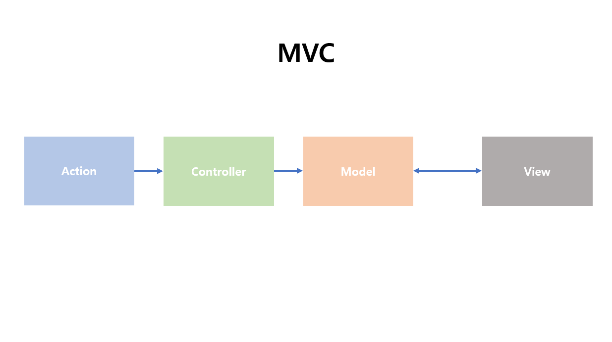
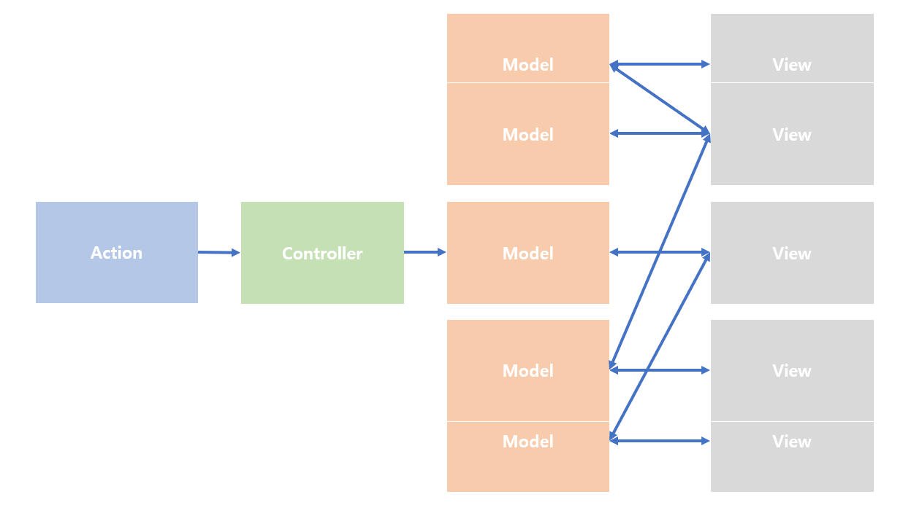

# prepare_frontend_interview

## React

- [React 시작](#React-시작)
- [리액트는 라이브러리인가요 프레임워크인가요](#리액트는-라이브러리인가요-프레임워크인가요)
- [리액트를 사용하는 이유](#리액트를-사용하는-이유)
- [virtual DOM에 대해서 아나요](#virtual-DOM에-대해서-아나요)
- [React에서 함수 컴포넌트와 클래스 컴포넌트의 차이 🔥](#React에서-함수-컴포넌트와-클래스-컴포넌트의-차이)
- [리액트에서 함수형 컴포넌트라고 부르지 않고 함수 컴포넌트라고 부르는 이유가 무엇인가요🔥](#리액트에서-함수형-컴포넌트라고-부르지-않고-함수-컴포넌트라고-부르는-이유가-무엇인가요)
- [props와 state의 차이🔥](#props와-state의-차이)
- [Props가 컴포넌트간에 전달받는 것이라고 했는데 자식에서 부모로도 전달할 수 있는가 🔥](#props가-컴포넌트간에-전달받는-것이라고-했는데-자식에서-부모로도-전달할-수-있는가)
- [FLUX에 대해서 아나요? 🔥🔥](#FLUX에-대해서-아나요)
- [리덕스에 대해서 아나요? 🔥](#리덕스에-대해서-아나요)
- [리덕스의 기본 원칙은? 🔥](#리덕스의-기본-원칙은)
- [React에서 state의 불변성을 유지하라는 말이 있는데 이에 대해 설명해달라 🔥](#React에서-state의-불변성을-유지하라는-말이-있는데-이에-대해-설명해달라)
- [리듀서 내부에서 불변성을 지키는 이유는? 전개 연산자의 단점을 해결할 수 있는 방법은 무엇인가 🔥](#리듀서-내부에서-불변성을-지키는-이유는?-전개-연산자의-단점을-해결할-수-있는-방법은-무엇인가)
- [리액트 사용시에 부수효과로 인해 생기는 문제점이 있다면 🔥](#리액트-사용시에-부수효과로-인해-생기는-문제점이-있다면)

  - 부수 효과를 일으키는 함수 (불순 함수)
  - 부수 효과를 일으키지 않는 함수 (순수 함수)
  - 요약

- [컴포넌트의 라이프 사이클 메서드 🔥](#컴포넌트의-라이프-사이클-메서드)

  - 이해
  - 메서드 종류

- [Hooks의 종류 🔥](#Hooks의-종류)

  - useState
  - useEffect
  - useReducer
  - useMemo
  - useCallback
  - useRef
  - 커스텀 Hooks

- [useMemo와 useCallback의 차이를 아나요 🔥](#useMemo와-useCallback의-차이를-아나요)

- [리액트에서 setState는 비동기 동작인가요 동기 동작인가요?](#리액트에서-setState는-비동기-동작인가요-동기-동작인가요)
- [setState가 비동기 동작을 취했을 때 얻을 수 있는 이점은 무엇인가요?](#setState가-비동기-동작을-취했을-때-얻을-수-있는-이점은-무엇인가요)
- [useLayoutEffect는 무엇인가요?](#useLayoutEffect를-사용해보신-적-있나요)
- [리액트의 성능개선 방법에 대해서 설명해주세요](#리액트의-성능개선-방법에-대해서-설명해주세요)

- [컴포넌트에서 이벤트를 실행시키기 위해서는 어떻게 핸들링해야 하나요](#컴포넌트에서-이벤트를-실행시키기-위해서는-어떻게-핸들링해야-하나요)
- [SPA가 뭔가요](#SPA가-뭔가요)

  - SPA의 단점

- [SSR이 뭔가요](#SSR이-뭔가요)
- [SEO가 뭔가요](#SEO가-뭔가요)

  - TTV, TTI

- [하이드레이션에 대해 알고 있나요](#하이드레이션에-대해-알고-있나요)
- [Next의 렌더링 수행 방식](#Next의-렌더링-수행-방식)
- [Next를 쓴 이유가 있나요](#Next를-쓴-이유가-있나요)
- [Next를 구성하는 기본 설정 파일에 대해서 알고 있나요?](#Next를-구성하는-기본-설정-파일에-대해서-알고-있나요)
- [사전 렌더링을 위해 사용해 본 함수가 있나요](#사전-렌더링을-위해-사용해-본-함수가-있나요)

- [Suspense](#suspense)

- `suspense가 뭔가요?`
- `suspense로 가능한 것은 어떤 것들이 있나요?`

<hr>

## React 시작

### 리액트는 라이브러리인가요 프레임워크인가요

> 해당 문단은 권윤학님의 <a href="https://web-front-end.tistory.com/63">프레임워크와 라이브러리의 차이</a>를 바탕으로 만들어졌습니다.

<p>리액트는 자바스크립트의 라이브러리라고 봐야 할까요 아니면, 프레임 워크라고 봐야 할까요? 우선 라이브러리와 프레임 워크의 개념에 대해서 간단하게 설명해 보겠습니다.</p>

> 1.프레임워크

<p>
프레임워크는 Application 개발시 코드의 품질, 필수적인 코드, 알고리즘, 암호화, 데이터베이스 연동 같은 기능들을 어느정도 구성이 되어있는 뼈대(구조)를 제공하도록 만들어진걸 프레임워크라고합니다.

조금 어렵게 설명드렸는데, 개발 구조나 설계 시 제공되는 인터페이스의 집합입니다. 완성된 어플리케이션은 아니지만 어느정도 프로그래머가 제공된 프레임워크의 구조에서 어플리케이션을 개발해야합니다.</p>

> 2.라이브러리

<p>
라이브러리는 특정 기능에 대한 API(도구 / 함수)를 모은 집합을 라이브러리라고 합니다.

그 기능을 사용하기위해 불러와서 호출하는 방식을 생각하시면 쉬울듯 합니다.</p>

> 3.프레임워크와 라이브러리의 차이

<p>위의 내용으로만 봤을때는 단순히 라이브러리가 모이면 프레임워크처럼 보일 수 있습니다.

저도 그렇게 생각하고 있었고요 그리고 크게 틀린 생각도 아닌거 같습니다만

자료를 찾아보니 <b>토비의 스프링</b>에 아래와 같은 내용이 있습니다.</p>

```
프레임워크는 단지 미리 만들어 둔 반제품이나, 확장해서 사용할 수 있도록 준비된 추상 라이브러리의 집합이 아니다.
프레임워크가 어떤 것인지 이해하려면 라이브러리와 프레임워크가 어떻게 다른지 알아야 한다.

라이브러리를 사용하는 애플리케이션 코드는 애플리케이션 흐름을 직접 제어한다.
단지 동작하는 중에 필요한 기능이 있을 때 능동적으로 라이브러리를 사용할 뿐이다.

반면에 프레임워크는 거꾸로 애플리케이션 코드가 프레임워크에 의해 사용된다.
프레임워크에는 분명한 제어의 역전 개념이 적용되어 있어야 합니다.

애플리케이션 코드는 프레임워크가 짜놓은 틀에서 수동적으로 동작해야 합니다.
```

<p>어플리케이션의 flow를 누가 제어하는냐가 프레임워크인지 라이브러리인지 구분할 수 있었습니다.</p>

### 리액트를 사용하는 이유

`1. 컴포넌트 기반의 화면구성`

리액트는 화면의 한 부분을 `컴포넌트` 라는 단위로 나눌 수 있으며 독립적으로 관리할 수 있다. 대규모 웹 애플리케이션에서 컴포넌트는 역할과 기능에 따라 따로 관리하기 용이하며, 반복되는 부분을 대체할 수 있게 해주어서 코드 재사용성을 높여준다. 또 컴포넌트 기반의 화면을 구성한다면 블록 쌓기처럼 컴포넌트를 쌓아서 빠르고 효율적으로 화면을 구성할 수 있다.

 <br/>

`2. Virtual DOM으로 인한 충분히 빠른 속도`

- Virtual DOM은 UI의 이상적인 또는 “가상”적인 표현을 메모리에 저장하고 ReactDOM과 같은 라이브러리에 의해 “실제” DOM과 동기화하는 프로그래밍 개념입니다. 이 과정을 재조정이라고 합니다.
  이 접근방식이 React의 선언적 API를 가능하게 합니다. React에게 원하는 UI의 상태를 알려주면 DOM이 그 상태와 일치하도록 합니다. 이러한 방식은 앱 구축에 사용해야 하는 어트리뷰트 조작, 이벤트 처리, 수동 DOM 업데이트를 추상화합니다.

<br/>

`3. SPA(싱글 페이지 애플리케이션)`

- 장점 : 서버의 자원을 아낄 수 있다. & 더 좋은 사용자 경험을 누릴 수 있다.
- 단점 : 사용자와 인터렉션이 많은 경우에는 서버의 자원이 많이 사용되고 불필요한 트레픽이 낭비 될 수 있다.

**리액트 사용하는 이유는 이러한 장점때문이다**

- component를 사용해서 유지보수가 용이 (필요한 부분의 component만 렌더링 된다. 최적화된 렌더링이 가능)
- 생태계가 넓고, 다양한 라이브러리 사용 가능
- virtual DOM을 활용하여 빠른 렌더링이 가능
- 리액트 네이티브를 활용하여 앱 개발 가능

<br/>

### virtual DOM에 대해서 아나요

DOM(Document Object Model)은 XML이나 HTML 문서에 접근하기 위한 일종의 인터페이스다. DOM은 문서의 구조화된 표현(structured representation)을 제공하며 프로그래밍 언어가 DOM 구조에 접근할 수 있는 방법을 제공하여 그들이 문서 구조, 스타일, 내용 등을 변경할 수 있게 돕는다.

```
HTTP response > DOM tree > CSSOM tree > render tree > painting
```

DOM은 새로운 요청이 있으면 위와 같은 형태를 거쳐 리렌더링을 하게 된다. DOM의 속도는 느리지 않다. 하지만 매번 새롭게 구성하기 때문에, 양이 엄청 많으면 분명 퍼포먼스가 떨어질 것이다. 여기서 이제 Virtual DOM의 장점이 나오게 된다.

리액트는 Virtual DOM을 사용하여 실제 DOM에 접근하여 조작하는 대신, 이를 추상화한 자바스크립트 객체를 구성하여 사용합니다. 마치 실제 DOM의 가벼운 사본과 비슷합니다. 리액트에서 데이터가 변하여 웹 브라우저에 실제 DOM을 업데이트할 때는 다음 세 가지 절차를 밟습니다.

1. 전체 UI를 Virtual DOM에 리렌더링
2. 이전 내용과 현재 내용을 비교
3. 바뀐 부분만 실제 DOM에 적용


Virtual DOM을 사용한다고 해서 사용하지 않을 때와 비교하여 무조건 빠른 것은 아닙니다. 리액트 매뉴얼에는 다음 문장이 있습니다.

```
우리는 다음 문제를 해결하려고 리액트를 만들었습니다.
지속적으로 데이터가 변화하는 대규모 애플리케이션 구축하기
```

그렇습니다. 결국에는 적절한 곳에 사용해야 리액트기 지닌 진가를 비로소 발휘할 수 있습니다. 리액트를 사용하지 않아도 코드 최적화를 열심히 하면 DOM 작업이 느려지는 문제를 개선할 수 있고, 또 작업이 매우 간단할 때는 오히려 리액트를 사용하지 않는 편이 더 나은 성능을 보이기도 합니다.

리액트와 Virtual DOM이 언제나 제공할 수 있는 것은 바로 업데이트 처리 간결성입니다. UI를 업데이트하는 과정에서 생기는 복잡함을 모두 해소하고, 더욱 쉽게 업데이트에 접근할 수 있습니다.

### React에서 함수 컴포넌트와 클래스 컴포넌트의 차이

**클래스 컴포넌트**의 경우

- 객체지향 프로그래밍의 구조를 띄고 있으며, state를 초기화하기 위해서는 constructor (생성자) 함수를 필요로 합니다
- 생성자 함수를 통해 state를 초기화해야 하기 때문에 함수 컴포넌트에 비해서 코드가 길어지고, 사이즈가 커질 수 있습니다.
- state 기능 및 라이프 사이클 기능을 사용할 수 있으며 임의 메서드를 정의할 수 있다
- render 함수가 꼭 있어야 하고, 그 안에서 보여 주어야 할 JSX를 반환해야 한다.

**함수 컴포넌트**는 클래스형 컴포넌트보다

- Hooks 를 사용하여 생성자 함수를 통해 state를 초기화하지 않더라도 사용이 가능하다 (`useState()` 등)
- 선언하기가 좀 더 편하고 메모리 자원을 덜 사용한다는 장점이 있다
- 제공되는 hook 함수뿐만 아니라 커스텀 훅을 생성하여 동작시킬 수 있다
- 프로젝트를 완성하여 빌드한 후 배포할 때도 함수 컴포넌트를 사용하는 것이 결과물의 파일 크기가 더 작습니다

**함수 컴포넌트**는 state와 라이프사이클 API의 사용이 불가능하다는 점인데, 이를 해결 하기 위해 v16.8 업데이트 이후에 적용된 Hooks를 통해 해결되었습니다.

<br/>

### 리액트에서 함수형 컴포넌트라고 부르지 않고 함수 컴포넌트라고 부르는 이유가 무엇인가요

(답변 출처 - 테오의 프론트엔드 인성님)

원래 리액트 측에서는 **함수형 컴포넌트** 라는 단어를 사용했습니다. 하지만 이러한 네이밍이 **함수형 프로그래밍** 과 비슷했고, 충분히 혼란을 야기할 수 있었습니다. 처음 리액트의 함수형 컴포넌트를 배우는 입장에서는 `'함수형 컴포넌트를 사용하면 함수형 프로그래밍이 가능해진다'`와 같은 혼란을 느낄 수 있었기 때문입니다.

그러나 우리가 리액트에서 사용하는 **함수 컴포넌트** 는 훅(hook)이 들어가고, 이 훅으로 **사이드 이펙트** 를 빈번히 일으키기 때문에 함수형 프로그래밍이라고 볼 수 없습니다. 함수형 프로그래밍은 순수 함수를 지향하는데, 사이드 이펙트를 빈번히 일으키는 리액트의 **함수 컴포넌트**가 **함수형 컴포넌트**로 보기는 어렵다는 것입니다.

2018년 이후 리액트 측에서도 **함수형 컴포넌트** 가 아닌 **함수 컴포넌트** 로 이름을 다시 정했습니다.

[Rename "functional component" to "function component"](https://github.com/reactjs/reactjs.org/pull/863)

<br/>

### props와 state의 차이

- props : 컴포넌트 속성을 설정할 때 사용하는 요소이다. props값은 해당 컴포넌트를 불러와 사용하는 부모 컴포넌트에서 설정할 수 있습니다.

- state : 컴포넌트 내부에서 바뀔수 있는 값을 의미한다. props는 컴포넌트가 사용되는 과정에서 부모 컴포넌트가 설정하는 값이며, 컴포넌트 자신은 해당 props를 읽기 전용으로만 사용할 수 있습니다. props를 바꾸려면 부모 컴포넌트에서 바꾸어 주어야 합니다.


<br/>

### props가 컴포넌트간에 전달받는 것이라고 했는데 자식에서 부모로도 전달할 수 있는가

1. 부모 컴포넌트에서 설정할 수 있으며, 부모에서 자식으로만 데이터를 줄 수 있다.
   (자식이 props를 통해 부모에게 데이터를 줄 수 없다는 뜻이다.)

2. 자식에서 부모로 데이터를 전송하는 방법 = **함수를 이용**한다.

- 자식은 props를 사용해서 부모에게 데이터를 건네줄 수 없다.
  따라서 부모가 함수를 넣어 props로 자식에게 넘겨주면, 자식이 데이터를 파라미터로 넣어 호출하는 방식으로 동작한다. 즉, 부모가 props로 함수를 넣어주면 자식이 그 함수를 이용해 값을 건네주는 방식이다.

<br/>

### FLUX에 대해서 아나요

[링크 벨로퍼트님 유튜브](https://www.youtube.com/watch?v=LRUQfJLuPA8)

[링크 FLUX 카툰 안내서](https://bestalign.github.io/translation/cartoon-guide-to-flux/)

`리덕스는 페이스북에서 리액트가 함께 소개한 FLUX 아키텍쳐로 구현한 라이브러리입니다.`

그렇다면 FLUX는 뭘까요? FLUX는 라이브러리나 프레임워크가 아닌 추상적인 개념입니다.

`MVC` 패턴에서 쌍뱡향적인 데이터 흐름을 강조했던 것과 달리 `FLUX` 패턴에서는 단방향 데이터 흐름을 강조합니다.

`MVC` 패턴의 경우 사용자의 어떠한 행위(액션)가 있을 때, 이를 바탕으로 설계된 `컨트롤러`를 통해 `모델`을 변화하고 이를 `뷰`에 반영합니다.



보여져야 할 `뷰`가 적거나, 변경될 `모델`이 많지 않다면 매우 효율적인 구조일 것입니다.

하지만, `모델`과 `뷰`가 복잡하게 얽혀 있다면 어떤 모델이 변화되어 뷰가 변경되었는지 제대로 확인할 수 없는 경우가 생깁니다.



실제로 `페이스북`에서는 `MVC` 패턴으로 설계한 구조 때문에, 아직 읽지 않은 메세지를 표시하지만, 실제로 들어가 보면 새로운 메세지가 없는 경우가 있었습니다.

이를 해결하기 위해 나온 단방향 데이터 흐름을 제어하는 패턴이 `FLUX` 입니다.


사용자의 행위 `액션`은 `디스패쳐`에 의해 통제됩니다. `디스패처`가 `스토어`를 업데이트하고 변경된 `스토어`에 대한 `뷰`를 리렌더링합니다.

`뷰`에서는 `스토어`에 직접 접근하지 않으며, `디스패처`로 다시 액션을 보내고 `스토어`를 업데이트한 뒤, 다시 `뷰`를 리렌더링하는 단방향적 구조를 가집니다.

`FLUX` 패턴은 이러한 단방향적인 데이터 흐름 구조를 통해 어떤 액션이 디스패처에 의해 어떤 결과를 낳고 변화되는지 명확히 파악하고 알아볼 수 있습니다.

### 리덕스에 대해서 아나요

리덕스는 상태관리 라이브러리 중 하나로 여러 가지 상태관리 라이브러리 중 가장 많이 사용되고 있습니다.

리덕스는 Store(스토어)라는 변수를 이용하여 전역 상태관리를 하게 됩니다.

전역으로 상태를 관리하기 때문에 props <-> state를 통해 부모 컴포넌트에서 자식 컴포넌트로, 자식의 자식 컴포넌트로 내려주지 않아도 사용할 수 있습니다.

### 리덕스의 기본 원칙은

1. 응용 프로그램의 전역상태는 단일 저장소 내의 트리에 저장됩니다
2. 상태(state)는 읽기 전용입니다.
3. 순수 함수에 의해서 변경되어야 합니다.

```
ctrl + F '부수 효과를 일으키지 않는 함수 (순수 함수)'

ctrl + F '부수효과가 있는 배열의 프로토타입 메서드'
```

<br/>

### React에서 state의 불변성을 유지하라는 말이 있는데 이에 대해 설명해달라

객체는 실제 데이터 값이 아닌 참조 값을 가집니다. 그렇기 때문에 복사하여 동일한 참조 값을 가지는 객체 중 하나라도 변경된다면, 모든 객체의 내부 값이 변경될 것입니다.

`...연산자`를 통해 복사할 경우 A와 B는 같은 값을 가지더라도 새로운 객체를 할당 받은 상태가 됩니다. 따라서 A와 B 내부의 값은 같더라도(같아 보이더라도) 참조하는 객체가 다르기 때문에 무결성을 유지할 수 있습니다.

**이미 복사를 한 프린트 물은 A 인쇄물에 낙서를 하더라도 B 인쇄물에 영향을 미치지 않는 것과 같습니다**

리액트에서는 데이터를 저장할 때 객체 형식 또는 배열 형식의 데이터를 많이 다루게 되는데, 원본 배열이 변경되는 경우 의도한 동작과 다르게 동작할 수 있으며, 어떤 함수에 의해 부수효과(side effect)가 발생했는지 찾기 어려울 수 있습니다.

```js
let A = {
  name: "junhee",
  age: 25,
  job: "student",
};

B = { ...A };

console.log("A", A);
console.log("B", B);
/*
A { name: 'junhee', age: 25, job: 'student' }
B { name: 'junhee', age: 25, job: 'student' }
*/

B = { ...A, job: "frontend developer" };

console.log("A", A);
console.log("B", B);

/*
A { name: 'junhee', age: 25, job: 'student' }
B { name: 'junhee', age: 25, job: 'frontend developer' }
*/
```

### 리듀서 내부에서 불변성을 지키는 이유는? 전개 연산자의 단점을 해결할 수 있는 방법은 무엇인가

**컴포넌트는 다음과 같은 총 네 가지 경우에 업데이트합니다.**

- props가 바뀔 때
- state가 바뀔 때
- 부모 컴포넌트가 리렌더링될 때
- this.forceUpdate로 강제로 렌더링을 트리거할 때

리듀서의 initial state에는 서버에서 넘겨받는 정보를 저장하고 전역으로 해당 객체를 사용할 수 있는 저장소 역할을 합니다.

불변성을 지킴으로써 각각의 고유한 참조값을 가지는 객체를 복사해서 사용함으로써 어떤 함수가 호출됐을 때 같은 객체를 참조한다면 생길 수 있는 불필요한 리렌더링과 부수효과를 줄일 수 있습니다.

하지만 `...spread` 연산자를 사용하여 객체를 복사해 사용할 경우 객체의 깊이에 따라, 로직 구성이 매우 어려울 수 있습니다.

```jsx
const nextState = {
  ...state,
  posts: state.posts.map((post) =>
    post.id === 1
      ? {
          ...post,
          comments: post.comments.concat({
            id: 3,
            text: "새로운 댓글",
          }),
        }
      : post
  ),
};
```

이를 해결하기 위해 등장한 라이브러리가 `immer` 라이브러리입니다.

`produce`, `draft`라는 키워드를 사용해서 기존의 `... spread` 연산자를 사용하지 않고도 불변성을 유지해주며 불필요한 부수효과(side effect)를 막아줍니다.

```jsx
const nextState = produce(state, (draft) => {
  const post = draft.posts.find((post) => post.id === 1);
  post.comments.push({
    id: 3,
    text: "와 정말 쉽다!",
  });
});
```

<br/>

### 리액트 사용시에 부수효과로 인해 생기는 문제점이 있다면

[부수효과 없는 "순수함수" 맛보기](https://maxkim-j.github.io/posts/js-pure-function)

**부수효과란 함수가 만들어진 목적과는 다른 효과 또는 부작용입니다.**

더 쉽게 말하면 **함수에 예상할 수 없는 일이 생길 가능성이 존재한다면 이 함수는 부수 효과를 가질 수 있는 함수**가 됩니다.

#### 부수 효과를 일으키는 함수 (불순 함수)

```js
/* 코드 참조 (https://maxkim-j.github.io/posts/js-pure-function) */

// http 요청을 보내는 함수 : 순수함수 될 수 없음
const getData = () => {
  axios.get('http://data.url')
  .then(...)
  .catch(...)
}

// 입력 내포한 함수 : 순수함수 될 수 없음
const typeInput = () => {
  const input = prompt("Message");
  return input;
}

// 파라미터를 직접 변경하는 함수 : 순수함수 될 수 없음
const changeParams = (arr, elem) => {
  arr.push(elem);
  return arr;
}

```

함수의 안팎에서 뭔가 예기치 않은 일이 생길 가능성이 있는 함수는 순수함수가 될 수 없습니다. 비동기 요청을 보내는 함수는 요청이 실패할 가능성이 있습니다. 입력을 포함하는 함수도 입력에 따라 출력이 달라질 가능성이 있기 때문에 순수함수가 될 수 없죠.

매개변수로 들어온 값을 직접 변경하는 함수 역시 순수함수가 될 수 없습니다. 배열과 같은 참조 자료형 객체를 어떤 함수 안에서 직접 변경한다면, 나중에 이 객체를 인자로 받는 다른 함수의 작업에 영향을 미칠 수 있기 때문입니다. 뒤에서 좀 더 자세히 설명하겠습니다.

불순 함수라는 말이 부정적인 뉘앙스를 내포하는 것도 같지만, 막 나쁜건 아닙니다. 비동기 http 요청처럼 부수효과가 필요한 경우도 있습니다.

#### 부수 효과를 일으키지 않는 함수 (순수 함수)

함수의 매개변수로 들어온 값을 직접 변경하는 것을 피하기만 해도, 순수함수를 만들 수 있습니다. 매개변수에 대한 직접 조작을 피하는 이유는 이 매개변수가 또 어디에 쓰일지 모르기 때문입니다.

```js
/* 코드 참조 (https://maxkim-j.github.io/posts/js-pure-function) */

const num_arr = [1, 2, 3, 4, 5];

// 매개변수의 값을 직접 변경하는 불순함수
const addSixImpure = (arr) => {
  // 매개변수에 직접 6 추가
  arr.push(6);
  return arr;
};

// 매개변수를 복사한 값을 변경하는 순수함수
const addSixPure = (arr) => {
  // 펼침 연산자로 새로운 배열에 6 추가
  newArr = [...arr, 6];
  return newArr;
};

// 매개변수 arr에 6이 있는지 확인하는 함수
const hasSix = (arr) => {
  if (arr.includes(6)) {
    return true;
  } else {
    return false;
  }
};

const new_arr = addSixImpure(num_arr);
console.log(hasSix(num_arr)); // true
```

`addSixPure()`과 `addSixInpure()`는 언뜻 보면 별 차이가 없어 보이지만, `addSixInpure()`는 매개변수의 값을 직접 변경하는 불순함수이고, `addSixPure()`는 매개변수 값을 복사해서 변경하는 순수함수입니다.

`addSixInpure()`는 num_arr을 직접 바꿨기 때문에 함수가 실행되면 num_arr의 값이 `[1,2,3,4,5,6]`으로 영구히 바뀝니다. 그래서 `hasSix()`함수의 결과로는 `true`를 반환하게 되죠.

하지만 개발자의 의도가 변수 `new_arr`에 `addSix` 함수를 호출한 새로운 배열을 할당하고 난 후, 값이 `[1,2,3,4,5]`인 `num_arr`에 대해서 6이 있는지 판단하고 싶었던 거였다면 코드는 의도대로 실행되지 않았습니다. 의도대로라면 false가 나와야 하는데, `num_arr`이 이미 변경되었기 때문입니다. 따라서 이런 경우에는 `addSix`함수가 `num_arr`을 직접 변경해서는 안됩니다. 대신에 이런 코드가 필요하죠

```js
const new_arr = addSixPure(num_arr);
console.log(hasSix(num_arr)); // false
```

`addSixPure()`는 num_arr을 직접 조작하지 않기 때문에 `num_arr`에 처음 할당되었던 값은 바뀌지 않습니다. 따라서 `hasSix(num_arr)`의 결과는 false입니다.

이 예시는 순수함수가 많아질수록 코드를 더 쉽게 예측할 수 있음을 알 수 있게 해줍니다. `addSixInpure()`가 6을 num_arr에 추가해버린 부수효과 때문에 `hasSix()`의 결과가 부정확해졌습니다. 선언된 변수들을 직접 조작하지 않을수록 함수들은 부수효과 없이 개발자의 의도대로 움직일 가능성이 큽니다.

#### 요약

React state는 직접 조작을 피하는 방식으로 부수효과를 방지합니다.(state, props가 변경될 때 리렌더링이 되기 때문에 의도치 않게 부수효과를 가진 함수들로 인해 불필요한 리렌더링이 잦아질 수 있다) Redux의 reducer는 순수함수여야만 하는데, store값을 변경하는 함수가 부수효과를 동반하지 않아야 store 내부의 값들이 안전하게 보호될 수 있기 때문입니다.

게다가 순수함수는 같은 입력에 대해 항상 같은 출력을 보장하니, 테스트 하기도 쉬워지죠. 함수 프로그래밍에도 핵심적인 개념으로 쓰인다고 하는데… 포스팅을 해보며 느낀건데 정말 아직 너무 맛보기만 해본 것 같네요. 활용을 해보면서 순수함수가 실질적으로 어떤 이점을 가져오는지 포스팅 해볼 수 있으면 좋겠습니다.

<details>
<summary>부수효과가 있는 배열의 프로토타입 메서드</summary>

[참고자료](https://github.com/junh0328/upgrade_javascript/blob/master/DEEPDIVE/readme4.md#278-%EB%B0%B0%EC%97%B4-%EB%A9%94%EC%84%9C%EB%93%9C)

```js
const arr = [1];

// push 메서드는 원본 배열(arr)을 직접 변경한다.
arr.push(2);
console.log(arr); // [1, 2]

// concat 메서드는 원본 배열(arr)을 직접 변경하지 않고 새로운 배열을 생성하여 반환한다.
const result = arr.concat(3);
console.log(arr); // [1, 2]
console.log(result); // [1, 2, 3]

/* 

부수효과가 있는 배열의 프로토타입 메서드

Array.isArray 
Array.prototype.indexOf 
Array.prototype.push (원본 배열을 변경한다 - 부수효과 o)
Array.prototype.pop (원본 배열을 변경한다 - 부수효과 o)
Array.prototype.unshift (원본 배열을 변경한다 - 부수효과 o)
Array.prototype.shift (원본 배열을 변경한다 - 부수효과 o)
Array.prototype.concat 
Array.prototype.splice 🌟 (원본 배열을 변경한다 - 부수효과 o)
Array.prototype.slice 
Array.prototype.join 🌟 (원본 배열을 변경한다 - 부수효과 o)
Array.prototype.reverse 🌟 (원본 배열을 변경한다 - 부수효과 o)
Array.prototype.fill 🌟 (원본 배열을 변경한다 - 부수효과 o)
Array.prototype.includes 
*/
```

</details>

### 컴포넌트의 라이프 사이클 메서드

라이프사이클 메서드의 종류는 총 아홉 가지입니다.

- will 접두사가 붙은 메서드는 어떤 작업을 작동하기 전에 실행되는 메서드입니다.
- Did 접두사가 붙은 메서드는 어떤 작업을 작동한 후에 실행되는 메서드입니다.

이 메서드들은 우리가 컴포넌트 클래스에서 덮어 써 선언함으로써 사용할 수 있습니다. 라이프사이클은 총 세 가지, 즉 마운트, 업데이트, 언마운트 카테고리로 나눕니다.


1. 마운트

- DOM이 생성되고 웹 브라우저상에 나타나는 것을 마운트라고 한다.

- componentDidMount : 컴포넌트가 웹 브라우저상에 나타난 후 호출하는 메서드이다.

<br/>

2. 업데이트

**컴포넌트는 다음과 같은 총 네 가지 경우에 업데이트합니다.**

- Props가 바뀔 때
- state가 바뀔 때
- 부모 컴포넌트가 리렌더링될 때
- this.forceUpdate로 강제로 렌더링을 트리거할 때

- componentDidUpdate : 컴포넌트의 업데이트(리렌더링) 작업이 끝난 후 호출하는 메서드입니다.

<br/>

3. 언마운트

- 마운트의 반대 과정, 즉 컴포넌트를 DOM에서 제거하는 것을 말한다.

- componentWillUnmount : 컴포넌트가 웹 브라우저사에서 사라지기 전에 호출하는 메서드이다.


<br/>

### Hooks의 종류

**Hooks는 리액트 버전 16.8에 새로 도입된 기능으로 함수 컴포넌트에서도 상태 관리를 할 수 있는 useState 렌더링 직후 작업을 설정하는 useEffect 등의 기능을 제공하여 기존의 함수 컴포넌트에서 할 수 없었던 다양한 작업을 할 수 있게 해준다**

1. useState

- 가장 기본적인 Hook이다. 첫 번째 원소는 상태 값, 두 번째 원소는 상태를 설정하는 함수이다.
- 이 함수에 파라미터를 넣어서 호출하면 전달받은 파라미터로 값이 바뀌고 컴포넌트가 정상적으로 리렌더링 됩니다

```jsx
import { useState } from "react";

const [value, setValue] = useState(0);
```

<br/>

2. useEffect

- 리액트 컴포넌트가 렌더링될 때마다 특정 작업을 수행하도록 설정할 수 있는 Hook 입니다. 클래스형 컴포넌트의 componontDidMount와 componentDidUpdate를 합친 형태로 보아도 무방합니다

`마운트만 실행시키고 싶을 경우` : 두 번째 파라미터로 비어있는 배열을 넣어주면 된다

```jsx
useEffect(() => {
  console.log("마운트될 때만 실행됩니다.");
}, []);
```

`특정 값이 업데이트될 때만 실행하고 싶을 경우` : 두 번째 파라미터로 전달되는 배열 안에 검사하고 싶은 값을 넣어주면 된다

```jsx
useEffect(() => {
  console.log(name);
}, [name]);
```

`뒷 정리 하기`:

- 정리 : useEffect는 기본적으로 렌더링되고 난 직후마다 실행되며 두 번째 파라미터 배열에 무엇을 넣는지에 따라 실행되는 조건이 달라집니다

useEffect는 기본적으로 렌더링되고 난 직후마다 실행되며, 두 번째 파라미터 배열에 무엇을 넣는지에 따라 실행되는 조건이 달라집니다.

컴포넌트가 언마운트되기 전이나 업데이트되기 직전에 어떠한 작업을 수행하고 싶다면 useEffect에서 뒷정리(cleanup) 함수를 반환해 주어야 합니다.

언마운트 시에 작업할 코드를 넣어준다고 생각하면 됩니다.

```jsx
useEffect(() => {
    console.log("렌더링이 완료되었습니다!");
    console.log("none clean up: ", { name, nickname });
    return () => {
      console.log("clean up!");
      console.log("clean up name: ", { name });
    };
  }
```


<br/>

3. useReducer

- useReducer는 useState보다 더 다양한 컴포넌트 상황에 따라 다양한 상태를 다른 값으로 업데이트해 주고 싶을 때 사용하는 Hook입니다. 리듀서는 현재 상태, 그리고 업데이트를 위해 필요한 정보를 담은 액션 값을 전달받아 새로운 상태에 반환하는 함수입니다. 리듀서 함수에서 새로운 상태를 만들 때는 반드시 불변성을 지켜주어야 합니다.

<br/>

4. useMemo

useMemo를 사용하면 함수 컴포넌트 내부에서 발생하는 연산을 최적화할 수 있습니다. 먼저 리스트에 숫자를 추가하면 추가된 숫자들의 평균을 보여 주는 함수 컴포넌트를 작성해 봅시다.

그런데 숫자를 등록할 때뿐만 아니라 인풋 내용이 수정될 때도 우리가 만든 getAverage 함수가 호출되는 것을 확인할 수 있습니다. 인풋 내용이 바뀔 때는 평균값을 다시 계산할 필요가 없는데, 이렇게 렌더링할 때마다 계산하는 것은 낭비겠지요?

useMemo Hook을 사용하면 이러한 작업을 최적화할 수 있습니다. 렌더링하는 과정에서 특정 값이 바뀌었을 때만 연산을 실행하고, 원하는 값이 바뀌지 않았다면 이전에 연산했던 결과를 다시 사용하는 방식입니다.


<details>
<summary>코드 보기</summary>

```jsx
import React, { useCallback, useMemo, useRef, useState } from "react";

const getAverage = (numbers) => {
  console.log("평균값 계산 중..");
  if (numbers.length === 0) return 0;
  const sum = numbers.reduce((a, b) => a + b);
  return sum / numbers.length;
};

const Average = () => {
  const [list, setList] = useState([]);
  const [number, setNumber] = useState("");
  const inputEl = useRef();

  const onChange = useCallback((e) => {
    setNumber(e.target.value);
  }, []); // 컴포넌트가 처음 렌더링될 때만 함수 생성

  const onInsert = useCallback(
    (e) => {
      const nextList = list.concat(parseInt(number));
      setList(nextList);
      setNumber("");
      inputEl.current.focus();
    },
    [number, list] // number 혹은 list가 바뀌었을 때만 함수 생성
  );

  const avg = useMemo(() => getAverage(list), [list]);

  return (
    <div>
      <input value={number} onChange={onChange} ref={inputEl} />
      <button onClick={onInsert}>등록</button>
      <ul>
        {list.map((value, index) => (
          <li key={index}>{value}</li>
        ))}
      </ul>
      <div>
        <b>평균값:</b> {avg}
      </div>
    </div>
  );
};

export default Average;
```

</details>

<br/>

5. useCallback

- useMemo와 상당히 비슷한 함수이다. 주로 렌더링 성능을 최적화 해야하는 상황에서 사용한다. 이 Hook을 사용하면 **만들어놨던 함수를 재사용할 수 있다.** useCallback의 첫 번째 파라미터에는 생성하고 싶은 함수를 넣고, 두 번째 파라미터에는 배열을 넣으면 된다. 이 배열에는 어떤 값이 바뀌었을 때 함수를 새로 생성해야 하는지 명시해야 한다.

<details>

```jsx
const onChange = useCallback((e) => {
  setNumber(e.target.value);
}, []); // 컴포넌트가 처음 렌더링될 때만 함수 생성


const onInsert = useCallback(
  (e) => {
    const nextList = list.concat(parseInt(number));
    setList(nextList);
    setNumber("");
  },
  [number, list] // number 혹은 list가 바뀌었을 때만 함수 생성
);


useMemo(() => {
  const fn = () => {
    console.log(‘hello world!‘);
  };
  return fn;
}, [])
```

onChange처럼 비어 있는 배열을 넣게 되면 컴포넌트가 렌더링될 때 단 한 번만 함수가 생성되며, onInsert처럼 배열 안에 number와 list를 넣게 되면 인풋 내용이 바뀌거나 새로운 항목이 추가될 때마다 함수가 생성됩니다.

함수 내부에서 상태 값에 의존해야 할 때는 그 값을 반드시 두 번째 파라미터 안에 포함시켜 주어야 합니다. 예를 들어 onChange의 경우 기존의 값을 조회하지 않고 바로 설정만 하기 때문에 배열이 비어 있어도 상관없지만, onInsert는 기존의 number와 list를 조회해서 nextList를 생성하기 때문에 배열 안에 number와 list를 꼭 넣어 주어야 합니다.

참고로 다음 두 코드는 완전히 똑같은 코드입니다.

```jsx
useCallback(() => {
  console.log("hello world!");
}, []);

useMemo(() => {
  const fn = () => {
    console.log("hello world!");
  };
  return fn;
}, []);
```

</details>

6. useRef

- 바닐라 자바스크립트에서 DOM 요소를 조작하기 위해 querySelector나 getElementById 등을 사용했다면, 리액트에서는 useRef 훅 함수를 사용합니다.
- useRef는 `.current` 프로퍼티에 변경가능한 값을 담고있는 객체입니다
- `.current`프로퍼티를 변경하더라도 리렌더링을 유발하지 않습니다. ref 객체 안의 값은 리액트 생명주기에 독립적이기 때문입니다

```jsx
import React, { useRef, Component } from "react";

class RefSample extends Component {
  input = useRef();

  handleFocus = () => {
    this.input.current.focus();
  };

  render() {
    return (
      <div>
        <input ref={input} />
      </div>
    );
  }
}

export default RefSample;
```

<br/>

### useMemo와 useCallback의 차이를 아나요

- useMemo 함수는 메모이제이션된 `값`을 반환한다
- useCallback 함수는 메모이제이션 된 `함수`를 반환한다

```
Memoization(메모이제이션)

프로그램 실행 시 이전에 계산한 값을 저장한다
원하는 값이 바뀌지 않았다면 이전에 연산했던 결과를 다시 사용하는 방식입니다.
```

리액트에서 사용하는 컴포넌트는 다음과 같은 경우에 리렌더링됩니다

- props가 바뀔 때
- state가 바뀔 때
- 부모 컴포넌트가 리렌더링될 때

컴포넌트는 state와 부모로부터 전달받은 props 등 다양한 조건에 의해 쉽게 리렌더링이 될 수 있습니다.

불필요한 리렌더링을 내가 만든 서비스의 성능 저하에 가장 큰 원인이 되기도 합니다.

이렇게 특정 상황 (값, 또는 함수가 변경될 때)에 맞게 리렌더링이 될 수 있도록 useMemo와 useCallback 함수를 사용합니다.

의존성 배열로 어떤 값에 의해 바뀌는 지 확인하기 위해서는 해당 함수의 두 번째 콜백인 `[]` 배열 내부의 값을 보면 됩니다.

```jsx
// useMemo
const avg = useMemo(() => getAverage(list), [list]); // list 라는 값이 변결될 때'만' getAverage 함수를 재 호출하는 용도입니다

// useCallback
const onInsert = useCallback(
  (e) => {
    const nextList = list.concat(parseInt(number));
    setList(nextList);
    setNumber("");
  },
  [number, list] // number 혹은 list가 바뀌었을 때만 onInsert 함수 생성
);
```

```jsx
// useMemo

<div>
  <b>평균값:</b> {avg}
</div>
```

```jsx
// useCallback

<button onClick={onInsert}>등록</button>
```

<br/>

### 리액트에서 setState는 비동기 동작인가요 동기 동작인가요

[참고자료](https://velog.io/@jinsunee/setState%EA%B0%80-%EB%B9%84%EB%8F%99%EA%B8%B0%ED%95%A8%EC%88%98%EC%9D%B8-%EC%9D%B4%EC%9C%A0)

```jsx
function Example() {
  const [count, setCount] = React.useState(0);

  useEffect(()=>{
    console.log('in useEffect:', count)
  },[count])

  const onClickButton = () => {
    console.log("before", count);

    setCount(count + 1);
    // setCount(prev => prev+1);

    console.log("after", count);
  };

  return <button onClick={onClickButton}>{count}</button>;
}

>>>
/*
  before 0
  after 0
  in useEffect 1
*/
```

state 값을 갱신하는 함수인 `setState` 는 비동기로 동작하는 훅 함수입니다

React는 앞서 언급했듯 state, props 값에 따라 re-rendering이 일어나죠.

그런데 만약에 한 컴포넌트 안에서 여러 state 값을 연속으로 바꿔주는 일이 생긴다면 여러번 비교하고 다시 그리는 알고리즘이 실행됩니다.

너무 비효율적이고 성능이 당연히 안좋을 것 입니다. 또 이중에 바뀌지 않아도 되는 불필요한 리렌더링 다수 발생할 것으로도 예상이 됩니다

이에 대비하여 리액트 라이브러리는 state를 다시 설정하는 함수인 setState를 비동기 함수로 처리해서 컴포넌트 내의 비동기 함수를 처리하는 콜백큐가 다 비워지면 리렌더링하도록 설계했습니다.

그 말인 즉, 해당 함수 내에서 동기적으로 실행되는 함수가 모두 실행된 뒤에 마지막에 setState를 처리한다는 이야기겠죠?

```jsx
const onClickButton = () => {
  console.log("before", count); // ----> 동기함수

  setCount(count + 1); // ---->  비동기함수

  console.log("after", count); // ---->  동기함수
};
```

<br/>

### setState가 비동기 동작을 취했을 때 얻을 수 있는 이점은 무엇인가요

앞서 말했지만, setState가 비동기 동작을 취함으로써 자바스크립트 내의 실행컨텍스트 스택이 돌아갈 때 동기적으로 실행되는 함수들을 모두 동작한 뒤에 큐에 존재하는 비동기적인 함수들을 이벤트 루프에 의해 꺼내와서 실행시킵니다.

setState가 동기적으로 실행된다면, 한 컴포넌트 내부에 존재하는 함수에 의해 state 값이 연속적으로 변경될 경우 리액트의 컴포넌트 리렌더링 조건에 의해 지속적으로 리렌더링이 될 것입니다.

<br/>

### useLayoutEffect를 사용해보신 적 있나요

[참고자료](https://merrily-code.tistory.com/46)

**리액트 훅 함수를 바탕으로 한 생명주기는 다음과 같습니다**


브라우저가 렌더링될 때 `.js` 파일은 브라우저에서 자바스크립트 엔진으로 권한을 넘겨 `.js` 해당 파일을 파싱되고 그리게 됩니다.

위 그림의 훅 라이프 사이클을 보시다시피 브라우저가 스크린에 페인팅 작업이 완료된 이후에 우리는 `useEffect` 를 실행하는 구조를 가졌었습니다.

따라서 다음과 같이 렌더링할 때 `useState(0)`과 같은 초기 useState의 값이 빈 값이라면, 0을 출력했다가 useEffect를 통해 값이 채워지는 구조를 가졌었습니다.

```jsx
// 코드 참고: https://merrily-code.tistory.com/46

import { useEffect, useState } from "react";

function App() {
  const [age, setAge] = useState(0);
  const [name, setName] = useState("");

  useEffect(() => {
    setAge(25);
    setName("찬민");
  }, []);

  return (
    <>
      <div className="App">{`그의 이름은 ${name} 이며, 나이는 ${age}살 입니다.`}</div>
    </>
  );
}

export default App;
```


**useLayoutEffect 훅은 바로 이런 문제를 해결하기 위해 등장한 훅입니다.**

`useLayoutEffect`는 브라우저가 화면에 DOM을 그리기 전에 이펙트를 수행합니다 .

따라서 위 코드의 실행 순서도 달라지게 됩니다.

1. 레이아웃 이펙트 내부의 setNumber, setName 호출

2. `<div>그의 이름은 찬민이며, 나이는 25살 입니다.</div>` 를 페인트

```jsx
// 코드 참고: https://merrily-code.tistory.com/46

import { useLayoutEffect, useState } from "react";

function App() {
  const [age, setAge] = useState(0);
  const [name, setName] = useState("");

  useLayoutEffect(() => {
    setAge(25);
    setName("찬민");
  }, []);

  return (
    <>
      <div className="App">{`그의 이름은 ${name} 이며, 나이는 ${age}살 입니다.`}</div>
    </>
  );
}

export default App;
```


<br/>

### 리액트의 성능개선 방법에 대해서 설명해주세요

제가 사용해 본 성능 개선 방법은 다음과 같습니다.

- hook 함수 사용 (useMemo, useCallback)
- 코드 스플리팅 (react.lazy(), Next.js 프레임워크 사용 등)

<br/>

### 컴포넌트에서 이벤트를 실행시키기 위해서는 어떻게 핸들링해야 하나요

**이벤트로 설정할 함수를 호출하는 것이 아닌 직접 넣어 줄 때는 화살표 함수 문법을 사용하여 넣어 주어야 합니다**

```jsx
case 1: 작동하지 않는 문법
<button onClick={this.setState({ number: number + 1})}>  (x)

case 2: 작동하는 문법
<button onClick={()=> this.setState({ number: number + 1}; )}>  (o)

or
case 3: 아예 함수로 빼주고 해당 함수를 불러 사용한다.

const plusNum = (number) => {
  setState(number : number + 1);
}
...

<button onClick={plusNum}>+ 1 </button>
```

<br/>

### SPA가 뭔가요

<p>SPA는 Single Page Application(싱글 페이지 애플리케이션)의 약어입니다. 말 그대로 한 개의 페이지로 이루어진 애플리케이션이라는 의미입니다. 전통적인 웹 페이지는 다음과 같이 여러 페이지로 구성되어 있습니다.</p>


<p>기존에는 사용자가 다른 페이지로 이동할 때마다 새로운 html을 받아 오고, 페이지를 로딩할 때마다 서버에서 리소스를 전달받아 해석한 뒤 화면에 보여 주었습니다. 이렇게 사용자에게 보이는 화면은 서버 측에서 준비했습니다. 사전에 html 파일을 만들어서 제공하거나, 데이터에 따라 유동적인 html을 생성해주는 템플릿 엔진을 사용하기도 했죠.</p>

<p>요즘에는 웹에서 제공되는 정보가 정말 많기 때문에 새로운 화면을 보여 주어야 할 때마다 서버 측에서 모든 뷰를 준비한다면 성능상의 문제가 발생할 수 있습니다. 예를 들어 트래픽이 너무 많이 나올 수도 있고, 사용자가 몰려 서버에 높은 부하가 쉽게 걸릴 수도 있습니다. 그래서 리액트 같은 라이브러리 혹은 프레임워크를 사용하여 뷰(View) 렌더링을 사용자의 브라우저가 담당하도록 하고, 우선 애플리케이션을 브라우저에 불러와서 실행시킨 후에 사용자와의 인터랙션이 발생하면 <b>필요한 부분만 자바스크립트를 사용하여 업데이트해 줍니다.</b> 만약 새로운 데이터가 필요하다면 서버 API를 호출하여 필요한 데이터만 새로 불러와 애플리케이션에서 사용할 수도 있습니다.</p>


> 사용자와의 인터렉션이 발생하면 필요한 부분만 자바스크립트를 사용하여 업데이트 (JSON 형식으로 요청함)


[출처 : https://babytiger.netlify.app/posts/SPA/]

<p>싱글 페이지라고 해서 화면이 한 종류인 것은 아닙니다. SPA의 경우 서버에서 사용자에게 제공하는 페이지는 한 종류이지만, 해당 페이지에서 로딩된 자바스크립트와 현재 사용자 브라우저의 주소 상태에 따라 다양한 화면을 보여 줄 수 있습니다.</p>

<p>다른 주소에 다른 화면을 보여 주는 것을 라우팅이라고 합니다. 리액트 라이브러리 자체에 이 기능이 내장되어 있지 않기 때문에, 브라우저의 API를 직접 사용하여 이를 관리하거나, 라이브러리를 사용하여 이 작업을 더욱 쉽게 구현할 수 있습니다.</p>

<p>리액트 라우팅 라이브러리는 리액트 라우터(react-router), 리치 라우터(reach-router), Next.js 등 여러 가지가 있습니다. 이러한 리액트 라우팅 라이브러리는 클라이언트 사이드에서 이루어지는 라우팅을 아주 간단하게 구현할 수 있도록 해 줍니다. 더 나아가 나중에 서버 사이드 렌더링을 할 때도 라우팅을 도와주는 컴포넌트들을 제공해 줍니다.</p>

<br/>

#### SPA의 단점

<p>SPA의 단점은 앱의 규모가 커지면 자바스크립트 파일이 너무 커진다는 것입니다. 페이지 로딩 시 사용자가 실제로 방문하지 않을 수도 있는 페이지의 스크립트도 불러오기 때문이죠. 하지만 후에 배울 코드 스플리팅(code splitting)을 사용하면 라우트별로 파일들을 나누어서 트래픽과 로딩 속도를 개선할 수 있습니다.</p>

<p>리액트 라우터처럼 브라우저에서 자바스크립트를 사용하여 라우팅을 관리하는 것은 자바스크립트를 실행하지 않는 일반 크롤러에서는 페이지의 정보를 제대로 수집해 가지 못한다는 잠재적인 단점이 따릅니다. 그렇기 때문에 구글, 네이버, 다음과 같은 검색 엔진의 검색 결과에 페이지가 잘 나타나지 않을 수도 있습니다. 또한, 자바스크립트가 실행될 때까지 페이지가 비어 있기 때문에 자바스크립트 파일이 로딩되어 실행되는 짧은 시간 동안 흰 페이지가 나타날 수 있다는 단점도 있습니다. 하지만 이런 문제점들은 다행히 나중에 배우게 될 서버 사이드 렌더링(server-side-rendering)을 통해 모두 해결할 수 있습니다.</p>

<br/>

### SSR이 뭔가요

<p>리액트는 대표적인 CSR(client side rendering)입니다. 이러한 리액트의 CSR적인 부분에서 SSR 적으로 바꿔 주기 위해서 next.js와 같은 라이브러리를 사용합니다.</p>

<p>SSR을 사용하는 가장 큰 이유는 효율적인 SEO를 위해서 입니다. 아래 문단에서 다루겠지만, SEO는 google, naver와 같은 검색 엔진들이 우리의 웹사이트에서 html 태그안의 내용을(title, meta-data 등등,,,) 분석하여 사용자가 입력한 정보를 바탕으로 알맞은(사용자가 원하는) 정보를 찾을 수 있게 하는 기능입니다. 리액트는 CSR으로 작동되는데, 사용자가 우리의 해당 도메인에 접속하면, 클라이언트 서버(사용자의 컴퓨터)가 html과 js 등의 파일을 다운받아 보여주는 형식입니다. CSR 상태에서는 사전에 html을 가지고 있지 않기 때문에 검색 엔진에 노출되는 빈도가 현저히 적거나, 브라우저에 따라 검색 엔진에 해당 정보가 노출되지 않아 검색을 해도 나오지 않을 수 있습니다.(도메인을 통해 접속하는 것은 가능해지는 정도, 해당 사이트에 관련된 정보를 검색 엔진이 크롤링하지 못할 수 있음)그래서 SSR을 통해 서버가 사전에 html과 일부 js 파일을 넘겨주게 되면, 검색 엔진에서 이를 캐치하여 사용자가 원하는 정보가 담긴 우리 사이트를 보여줄 수 있을 것입니다.</p>

<br/>

### SEO가 뭔가요

<p>SEO란, Search Engine Optimization의 약자로, SEO는 구글, 네이버와 같은 검색 엔진들이 서버에 등록된 웹사이트를 하나하나씩 돌아 다니면서 웹사이트의 HTML 문서를 분석해줍니다. 이때 HTML에 사용된 태그를 바탕으로 사용자가 검색할 때, 웹사이트를 빠르게 검색할 수 있게 도와줍니다. 하지만, CSR에서 사용되고있는 HTML의 body는 텅텅 비어 있다가(div id="root"의 리액트 특성), 사용자가 해당 도메인을 가진 페이지에 접근하면, 클라이언트 서버에서 js 밑 html 태그를 불러오는 형식이기 때문에 사전에 html 정보를 가지고 있지 않습니다. 그래서 검색 엔진이 해당 도메인에 접근할 때 어려움이 있습니다. (우리 사이트를 검색 엔진을 통해 다양한 키워드를 통해 유입되는 것이 힘들다 why? 검색 엔진이 우리 html 파일을 분석할 수 없기 때문에 why? CSR 형식은 사용자가 접근해야 html, js 등의 파일을 불러오기 때문에) 따라서, 검색 엔진을 통해 사용자가 입력하여 얻고자하는 정보를 입력했을때, 검색 엔진이 우리의 웹 사이트에서 해당 내용을 캐치하는데 어려움이 있습니다.</p>

<p>따라서 우리는 SEO 즉, 검색 엔진 최적화를 해주기 위해, SSR을 사용하여 사전에 html 문서를 검색 엔진이 찾을 수 있도록 제공하여 SEO를 향상시킬 수 있게 됩니다. SSR은 서버에서 필요한 데이터를 가져와 사전에 html 파일을 만들게 되고 이렇게 만들어진 HTML 파일을 일부 초기 세팅에 필요한 js와 함께 클라이언트 서버에 보내주게 됩니다. 그러면 클라이언트 측에서는 서버에서 만들어준 문서를 받아 와서 바로 사용자에게 보여줄 수 있게 되는 거죠. 이렇게 SSR을 사용하게 되면 사전에 HTML 문서를 클라이언트 측으로 전달했기 때문에, 페이지 로딩이 빨라지고, 검색 엔진이 사용자의 요청에 따라 검색어를 찾을 때(데이터를 크롤링할 때), 우리의 웹사이트에 해당 검색어가 포함되어 있다면 우리 페이지를 보여주는 효율적인 SEO가 될 수 있습니다.</p>

<p>하지만 SSR이 CSR의 모든 문제점에 해결책이 되지는 않습니다. 서버에서 데이터를 사전에 받아오는 것이기 때문에 첫 번째로 blinking issue가 여전히 존재하고(페이지가 넘어갈 때마다 깜빡임 why? html 및 js 파일을 새로 받아오기 때문에), 두 번째로 사용자가 증가함에 따라 서버는 사용자의 요청에 의해 더 많은 데이터를 가지고 와서 HTML을 만들어야 하므로 과부화가 올 수 있습니다. 마지막으로 가장 큰 문제는 사용자가 빠르게 웹사이트를 확인할 수는 있지만, SSR시 모든 js파일을 다운 받은 상태가 아니기 때문에, js파일이 완전히 다운로드 되지 않은 상태에서 페이지의 여러 부분을 클릭하면, 작동이 되지 않는 부분이 존재할 수 있습니다.</p>

#### TTV TTI

> TTV는 보여지는 시점 (Time To View), TTI는 인터렉션 사용자와의 통신이 가능해지는 시점 (Time To Interact)입니다

<p>CSR은 사용자에게 보여짐과 동시에 모든 html과 js를 불러온 상태이기 때문에, TTV과 됨과 동시에 TTI 모든 동적인 행동을 할 수 있게 됩니다.</p>

<p>하지만, SSR은 html과 일부 js파일은 서버로부터 사전에 받아 놓았기 때문에 TTV 상태에서도 TTI가 전부 활성화되어 있지는 않습니다</p>

<p>최종적으로 CSR을 많이 사용한다면, 우리가 최종적으로 번들링하여 사용자게에 보내주는 js 파일을 어떻게 하면 효율적으로 많이 분할하여 첫 번째로 사용자가 보기 위해서 필요한 정말 필수적인 html 요소만 보낼 수 있을지 고민해봐야 하고, SSR의 경우 사용자가 보고, 인터렉션(TTI)하는 이 시간의 단차를 줄이기 위해서 어떤 노력을 할 수 있을지 고민해봐야 합니다. 예를 들면 어떻게 하면 조금 더 매끄러운 UI와 UX를 제공할 수 있을지에 대한 고민들이 포함됩니다.</p>

<p>요즘에는 SSR, CSR 뿐만 아니라 SSG(Static Site Generation)또한 렌더링 방법으로 등장하였습니다. SSG는 리액트를 예로 들면 'Gatsby' 또는 'Next'와 같은 라이브러리를 추가적으로 사용하여 렌더링을 하는 것인데, 웹페이지를 정적으로 미리 생성해두고, 서버에 배포해놓는 것입니다. SSG에서도 자바스크립트 파일을 html 파일과 함께 가지고 있을 수 있기 때문에, 동적인 요소도 충분히 추가할 수 있습니다. Next에서는 SSR뿐만 아니라, static generation, no pre-rendering, pre-rendering상태를 모두 지원하기 때문에 리액트로 작업을 계속한다면 next.js를 배워보는 것도 매우 효과적일 겁니다.</p>

<p>어떤 것이 최고다, 제일 낫다라는 판단 보다는 우리가 만들어야 하는 웹사이트 특성에 맞게 다양한 방식의 렌더링을 활용하여 페이지를 구성한다면 최선의 선택이 될 것입니다.</p>

### 하이드레이션에 대해 알고 있나요

[참고 자료 1 🔥](https://simsimjae.tistory.com/389)
[참고 자료 2 🔥](https://fourwingsy.medium.com/next-js-hydration-%EC%8A%A4%ED%83%80%EC%9D%BC-%EC%9D%B4%EC%8A%88-%ED%94%BC%ED%95%B4%EA%B0%80%EA%B8%B0-988ce0d939e7)

```
hydration = 수화 = 우리 몸에 수분을 보충하는 행위
```

하이드레이션이란, **리액트에서 서버사이드 렌더링 혹은 SSG(스태틱 사이트 제네레이션)을 실행한 HTML 결과물을 받아온 뒤, 브라우저에서 이것을 다시 리액트 트리에 맞게 파싱하는 행위이다**.


출처 (https://simsimjae.tistory.com/389)

서버가 완성된 HTML을 내려준다. 이때 Dehydrate는 수분을 없앤다는 뜻이다. 다시 말해서 동적인것을 정적으로 만드는 행위를 Dehydrate라고 표현했다. 그리고 나서 JS가 실행되면서 리액트가 정적인 HTML과 store를 동적인 리액트 컴포넌트 트리와 store로 변환하는 과정이 일어나는데, 이걸 (Re)hydrate라고 한다. 마치 수분기 없는 정적인 상태에서 수분 넘치는 동적인 상태로 변화한것이다. 문제는 이렇게 rehydrate가 일어나면서 쓸데없이 화면이 한번더 그려지는 현상이 발생한다는것이다. 왜냐면 리액트는 서버에서 완성된 HTML이 내려와서 이미 화면에 제대로 렌더링이 됬는지 안됬는지 모르고 자신이 할일을 그냥 했을 뿐이다. 그래서 SSR을 하는 경우에는 ReactDom의 render메소드가 아니라 hydrate 메소드를 사용해야 한다고 말했었다.

이 hydrate 단계에서,

- 렌더링한 결과물이 어떤 컴포넌트인지 확인한다
- 각 컴포넌트에 걸린 이벤트 들을 실제 DOM에 걸어주는 동작을 하게 된다

하이드레이션이 잘못되었을 때, 우리가 마주하는 문제들은 거의 1번 과정이 잘못되어서 일어난다.

Next.JS에서 내부적으로 사용하는 ReactDOM.hydrate 함수는 다음과 같은 일을 한다.

- 서버에서 받아온 DOM tree와 자체적으로 렌더링한 tree를 비교한다
- 두 tree 사이의 차이(diff, diffrence)를 얻어낸 뒤, 자체적으로(클라이언트사이드) 렌더링 한 tree에 맞춰 patch를 적용한다

`hydration이 되어야 진짜 리액트 컴포넌트`

서버에서 내려준 HTML로 렌더링 된 화면은 그냥 단순히 그림일 뿐이다. 리액트가 관리하지 않는 화면이다. SSR을 하더라도 컴포넌트를 리액트가 관리하게 하기 위해서는 hydration은 꼭 필요한 작업이다.

`결론`

리액트에서 hydration이라고 하는 용어를 사용하는 이유는 "서버사이드 렌더링으로 만들어진 수분이 없는 정적인 HTML과 State로부터 수분을 보충하는 과정(동적인 상태로 변화)인 hydrate가 일어나기 때문" 이라고 추측해본다.

<br/>

### Next의 렌더링 수행 방식

[참고 자료: Velog, Next.js 100% 활용하기](https://velog.io/@devstone/Next.js-100-%ED%99%9C%EC%9A%A9%ED%95%98%EA%B8%B0-feat.-initialProps-webpack-storybook)

1. SSR을 기반으로 서버에 사전에 저장된 렌더트리(render tree)의 HTML을 로드
2. ① 방식의 `사전 렌더링(pre-render)` 이후에는 CSR 사용
3. 페이지가 그려진 이후에 페이지 내부에서 동적인 데이터를 패치`(axios, fetch, XMLHttpRequest)`하는 과정은 `CSR` 방식을 따른다.
4. 만약 페이지가 로드될 때 함게 데이터가 패칭되어야 하는 상황이라면(pre-render)
5. next.js의 데이터 패칭 방식 (① getInitialProps/ ② getStaticProps / ③ getStaticPath / ④ getServerSideProps) 을 이용해 첫 렌더링 시에 HTML 파일 뿐만 아니라 데이터가 패칭될 수 있도록 처리해야 합니다.

<br/>

### Next를 쓴 이유가 있나요

[출처: 클론 코딩으로 시작하는 Next.js](https://bjpublic.tistory.com/391)

`1. 사전 렌더링 및 서버 사이드 렌더링`

- 서버 사이드 렌더링 기능을 제공하여 클라이언트 사이드 렌더링 환경보다 빠른 렌더링을 불러올 수 있습니다.

`2. Hot Code Reloading을 지원`

- Next 개발 환경에서는 코드 변경 사항이 저장되면 응용 프로그램을 자동으로 다시 로드합니다.

`3. 자동 코드 분할`

- 자동 코드 분할 기능 덕분에 코드의 모든 가져오기각 번들로 묶여 각 페이지와 함께 제공됩니다. 결과적으로, 불필요한 코드가 페이지에 로드되지 않게 됩니다.

`4. 설정이 필요없음`

- 넥스트는 기본적으로 웹팩과 바벨을 사용하고 있습니다. 이미 서버 사이드 렌더링 및 개발에 필요한 설정이 되어 있으므로 빠르게 개발을 시작할 수 있습니다.

- 사용하고 싶은 플러그인이 있다면 손쉽게 추가하여 사용할 수 있도록 지원을 하고 있습니다.

`5. 타입스크립트가 내장됨`

`6. 파일기반 내비게이션 기능`

- 리액트에서는 라우트를 위해서 'react-router'라는 라이브러리를 사용하여 라우팅 설정을 해주어야 합니다.

- 그로 인해 페이지의 경로에 대하여 직접 설정을 해주어야 하였습니다.

- 하지만 넥스트는 파일 시스템 기반 라우팅을 사용합니다.

- 폴더의 경로에 따라 페이지의 경로가 설정되어 구축이 빠르고 관리가 편리하다는 장점이 있습니다.

<br/>

### Next를 구성하는 기본 설정 파일에 대해서 알고 있나요

📁 pages 폴더 안에는 넥스트에서 중요한 역할을 하는 특별한 파일들이 있습니다.

- 📙_app.jsx (tsx)
- 📙_document.jsx (tsx)
- 📙_error.jsx (tsx)
- 📙404.jsx (tsx)

`📙_app.jsx`

App 컴포넌트는 모든 페이지의 공통 페이지 역할을 합니다.

App 컴포넌트를 이용하여 모든 페이지들을 초기화하여 다음과 같은 역할을 할 수 있습니다.

- 페이지들의 공통된 레이아웃
- 페이지를 탐색할 때 상태 유지
- 추가 데이터를 페이지에 주입
- 글로벌 CSS 추가

<details>

```jsx
📁 pages/_app.jsx

import Header from '../components/Header';

const MyApp = ({ Component, pageProps }) => {
  return (
    <>
      <Header />
      <Component {...pageProps} />
      <style jsx global>
        {`
          body {
            margin: 0;
          }
        `}
      </style>
    </>
  );
};

export default MyApp;

```

</details>

`📙_document.jsx`

사용자 정의 Document는 일반적으로 응용 프로그램 `<HTML>` 및 `<body>` 태그를 보강하는데 사용됩니다.

도큐먼트를 이용하여 `<title>`, `<description>`, `<meta>` 등 프로젝트의 정보를 제공하는 HTML 코드를 작성할 수 있고,

폰트나 외부 api, cdn 등을 불러오도록 할 수 있습니다.

또한 CSS-in-JS의 서버 사이드 렌더링을 위한 설정을 할 때 사용합니다.

Head 태그에 meta 태그를 추가하여 해당 프로젝트에 대한 정보를 추가할 수 있고, 구글 폰트 등에서 제공하는 폰트를 link 로 불러와 전역으로 적용시킬 수 있습니다.

<details>

```jsx
📁 pages/_document.jsx

import Document, { Html, Head, Main, NextScript } from 'next/document';

class MyDocument extends Document {
  render() {
    return (
      <Html lang="ko">
        <Head>
          <meta name="title" content="깃허브 레포지토리" />
          <meta name="description" content="깃허브 레퍼지토리 리스트입니다" />
          <link
            href="https://fonts.googleapis.com/css?family=Noto+Sans:400,700&display=swap"
            rel="stylesheet"
          />
          <link
            href="https://fonts.googleapis.com/css?family=Noto+Sans+KR:400,700&display=swap&subset=korean"
            rel="stylesheet"
          />
        </Head>
        <body>
          <Main />
          <NextScript />
        </body>
      </Html>
    );
  }
}

export default MyDocument;

```

</details>

`📙_error.jsx`

넥스트에서는 빌드 된 프로덕션 환경에서 에러가 발생한다면 에러 페이지로 넘어가게 됩니다.

따로 라우팅 경로를 설정하지 않더라도, 빌드 된 프로덕트 환경에서 에러가 발생한다면 에러 페이지로 자동적으로 넘어갑니다.

추가적으로 에러 상황에 따라서 500, 404 등도 추가할 수 있습니다

<details>

```jsx
📁 pages/_error.jsx

const Error = () => {
  return (
    <div>
      <p>에러가 발생했습니다</p>
    </div>
  );
};

export default Error;

```

</details>

<br/>

### 사전 렌더링을 위해 사용해 본 함수가 있나요

[참고자료](https://velog.io/@devstone/Next.js-100-%ED%99%9C%EC%9A%A9%ED%95%98%EA%B8%B0-feat.-initialProps-webpack-storybook)

- getInitialProps
- getStaticProps
- getStaticPath
- getServerSideProps

`getInitialProps`

Next 9.3 버전 이전엔 getInitialProps만으로 사전 렌더링 관련 문제를 전부 해결했지만, 9.3버전부터는 getInitialProps가 3가지로 분리되었습니다

- getStaticProps
- getStaticPath
- getServerSideProps

`getStaticProps`

- 빌드시 고정되는 값으로 빌드 이후에는 수정이 불가능합니다
- data를 빌드 시에 미리 땡겨와 정적으로(static 하게) 제공합니다
- 매 유저의 요청마다 fetch할 필요가 없는 데이터를 가진 페이지를 렌더링할 때 유리합니다
- 유저에 구애받지 않고 퍼블릭하게 캐시할 수 있는 데이터
- SEO 등의 이슈로 인해 빠르게 미리 렌더링해야만 하는 페이지

`getStaticPath`

- 동적 라우팅 + getStaticProps를 원할 때 사용
- 정의하지 않은 하위 경로는 접근해도 화면이 뜨지 않는다 (error 페이지로 라우팅)
- 동적 라우팅 시, 라우팅되는 경우의 수를 하나하나 넣어야 합니다

`getServerSideProps`

- 빌드와 상관없이, 매 페이지 요청마다 데이터를 서버로부터 가져옵니다

## Suspense

[참고, 리액트 코리아 - suspense](https://ko.reactjs.org/docs/concurrent-mode-suspense.html#what-is-suspense-exactly)

- `suspense가 뭔가요?`

suspense는 데이터 불러오기를 위한 라이브러리가 아닙니다.

suspense는 '**컴포넌트가 읽어들이고 있는 데이터가 아직 준비되지 않았다**'고 React에 알려줄 수 있는, **데이터 불러오기 라이브러리에서 사용할 수 있는 메커니즘** 입니다.

이후에 React는 데이터가 준비되기를 기다렸다가 UI를 갱신할 수 있습니다.

장기적인 관점으로는, **Suspense가 데이터 출처와 상관없이 컴포넌트로부터 비동기 데이터를 읽는 데에 사용되는 주된 방식으로 거듭나길** 바라고 있습니다.

<details>
<summary>예시 코드 보기</summary>

```jsx
const resource = fetchProfileData();

function ProfilePage() {
  return (
    <Suspense fallback={<h1>Loading profile...</h1>}>
      <ProfileDetails />
      <Suspense fallback={<h1>Loading posts...</h1>}>
        <ProfileTimeline />
      </Suspense>
    </Suspense>
  );
}

function ProfileDetails() {
  // 아직 로딩이 완료되지 않았더라도, 사용자 정보 읽기를 시도합니다
  const user = resource.user.read();
  return <h1>{user.name}</h1>;
}

function ProfileTimeline() {
  // 아직 로딩이 완료되지 않았더라도, 게시글 읽기를 시도합니다
  const posts = resource.posts.read();
  return (
    <ul>
      {posts.map((post) => (
        <li key={post.id}>{post.text}</li>
      ))}
    </ul>
  );
}
```

</details>

- `suspense로 가능한 것은 어떤 것들이 있나요?`

1. 데이터 불러오기 라이브러리들(axios, SWR, react-query)이 React와 깊게 결합할 수 있도록 해줍니다

2. 의도적으로 설계된 로딩 상태를 조정할 수 있도록 해줍니다. suspense는 데이터가 어떻게 불러져야 하는지를 정하지 않고, 앱의 시각적인 로딩 단계를 밀접하게 통제할 수 있도록 해줍니다

3. 경쟁 상태(Race Condition)를 피할 수 있도록 돕습니다. await를 사용하더라도 비동기 코드는 종종 오류가 발생하기 쉽습니다. suspense를 사용하면 데이터를 동기적으로 읽어오는 것처럼 느껴지게 해줍니다.
